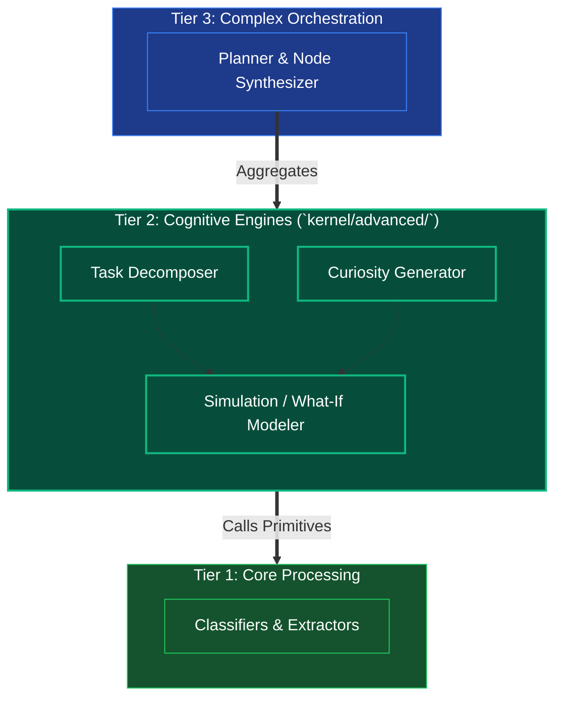

# Tier 2: Cognitive Engines (Intermediate Logic)

## Overview
Tier 2 serves as the strategic processing layer that combines basic primitives (from Tier 1) to derive more complex logical states. It manages the "what if" scenarios, exploratory analysis, and task-decomposition required by an autonomous agent.

**CRITICAL RULE**: Tier 2 depends heavily on Tiers 1 and 0, but remains oblivious to the existence of higher-level planners (Tier 3) or the OODA loop (Tier 4). It is purely a deterministic set of powerful functions that perform cognitive lifting.

## Scope & Responsibilities
- **Task Decomposition**: Takes a complex problem and breaks it down into sensible, actionable sub-tasks utilizing both syntactic parsing and semantic embedding constraints.
- **Curiosity Engine**: Evaluates unknown variables and creates investigative strategies to fill information gaps via the Knowledge base or MCP tools.
- **What-If Simulations**: Runs small-scale logic trees or counter-factual scenarios offline before handing a finalized recommendation up to Tier 3.

## Architecture

