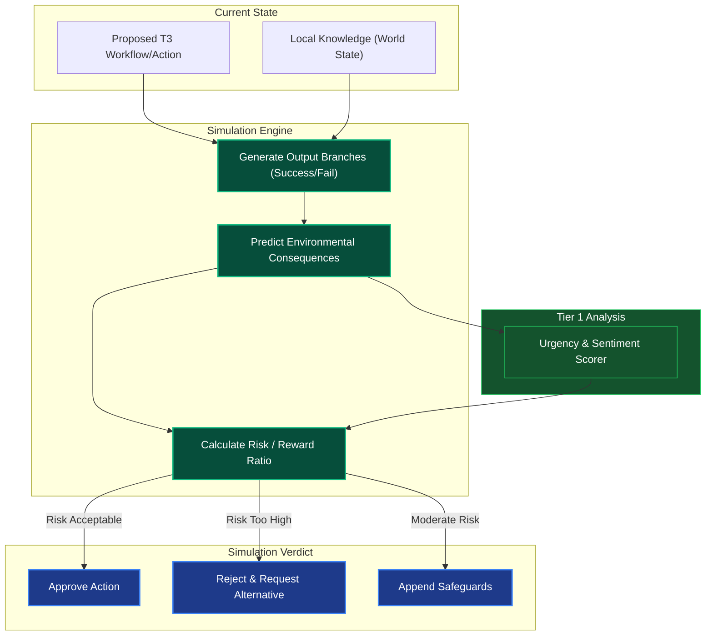

# What-If / Simulation Engine

## Overview
The What-If Engine is a Tier 2 Cognitive Module. It runs fast, offline counter-factual tree searches or local evaluations before a risky action is ever committed to the live environment by Tier 4. It attempts to predict outcomes based on current knowledge logic.

## Architecture & Flow

