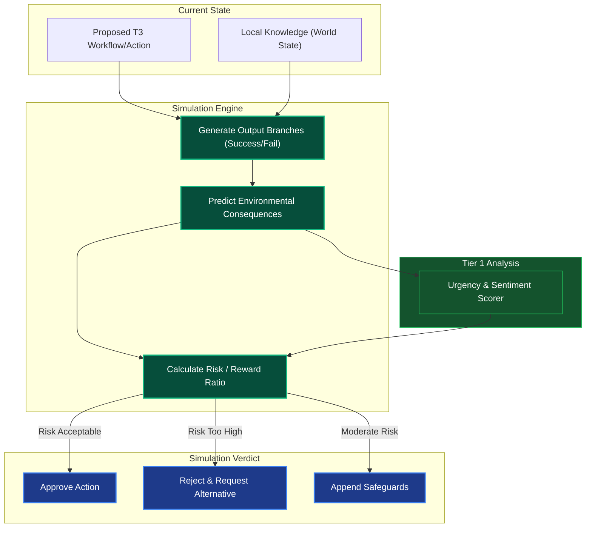

# What-If / Simulation Engine

## Overview
The What-If Engine is a Tier 2 Cognitive Module. It runs fast, offline counter-factual tree searches or local evaluations before a risky action is ever committed to the live environment by Tier 4. It attempts to predict outcomes based on current knowledge logic.

## Architecture & Flow

## Function Decomposition

### `simulate_outcomes`
- **Signature**: `async simulate_outcomes(proposed_action: CompiledDAG, knowledge: WorldState) -> SimulationVerdict`
- **Description**: Top-level orchestrator. Runs a fast, offline counter-factual analysis of a proposed action or DAG before it is committed to live execution. Generates outcome branches, predicts consequences, calculates risk/reward, and returns a `SimulationVerdict` (Approve, Reject, or Append Safeguards) that Tier 3 uses to decide whether to finalize the graph.
- **Calls**: `generate_outcome_branches()`, `predict_consequences()`, `calculate_risk_reward()`.

### `generate_outcome_branches`
- **Signature**: `generate_outcome_branches(action: CompiledDAG, knowledge: WorldState) -> list[OutcomeBranch]`
- **Description**: Step 1. Generates a tree of possible outcomes by simulating the proposed action against current knowledge. Produces at minimum a success branch and a failure branch. For complex multi-node DAGs, generates branches at each decision point. Each `OutcomeBranch` includes the terminal state, likelihood estimate, and the path taken.
- **Calls**: None (tree generation logic using knowledge state).

### `predict_consequences`
- **Signature**: `async predict_consequences(branches: list[OutcomeBranch]) -> list[ConsequencePrediction]`
- **Description**: Step 2. For each outcome branch, predicts the environmental side effects: resource consumption, state mutations, external service impacts, and reversibility. Uses Tier 1 `score_urgency()` to weight the severity of negative consequences.
- **Calls**: Tier 1 `intent_sentiment_urgency.score_urgency()`.

### `calculate_risk_reward`
- **Signature**: `calculate_risk_reward(predictions: list[ConsequencePrediction]) -> SimulationVerdict`
- **Description**: Step 3. Aggregates consequence predictions into a single risk/reward ratio. Compares against configurable thresholds (from `shared/config.py`) to produce the final verdict: `APPROVE` (risk acceptable), `REJECT` (risk too high, request alternative), or `MODIFY` (moderate risk, append safeguard nodes to the DAG before execution).
- **Calls**: Config-driven risk threshold lookup.
