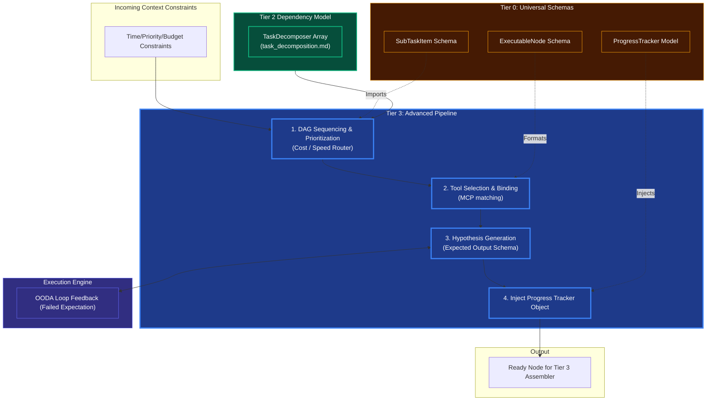

# Advanced Planning & Tool Binding

## Overview
As part of **Tier 3 (Complex Orchestration)**, managing the precise sequence, expected output, and tool allocation of a DAG map ensures flawless execution in Tier 4. 

- **Hypothesis & Expectation Generation**: For each node assembled, Tier 3 calculates the *expected outcome* (e.g., "File should exist at path X"). If the expectation is not met by Tier 4, it instantly triggers the `Reflection` engine.
- **DAG Sequencing & Prioritization**: Algorithmically orders nodes not just by logical dependency, but by prioritization (fastest vs cheapest vs highest-fidelity paths).
- **Progress Tracker**: A persistent state object that travels with the DAG through loops to map exactly how close the agent is to completing the overarching Task Goal.
- **Tool Selection & Binding**: Matches specific MCP external models (e.g., Python Interpreter, specific vector search query tools) directly into the Node Assembler schema.

## Architecture & Flow

