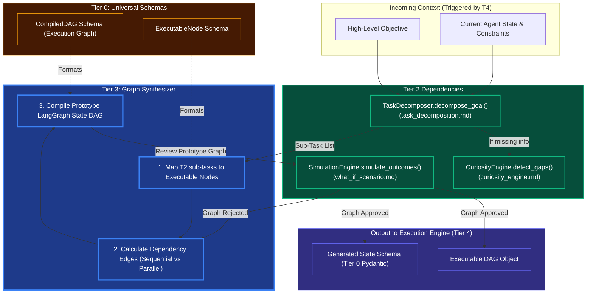

# Tier 3 Orchestrator (JIT Graph Builder)

## Overview
The Tier 3 Orchestrator translates the conceptual, unstructured requirements generated by Tier 2 into a strict, executable computational graph (Directed Acyclic Graph or DAG). It uses the `Task Decomposition` output to physically assemble nodes that LangGraph or a similar state-machine engine can execute. 

By offloading the "thinking" to Tier 2 and the "executing" to Tier 4, the Orchestrator's sole responsibility is **assembly and dependency routing**.

## Architecture & Flow

## Key Abstraction Logic
1. **The Black Box of Tier 2**: Notice how Tier 3 does not know *how* `Task Decomposition` works. It simply hands the Goal to Tier 2 and expects an array of logical steps back.
2. **Parallelization**: Tier 3's routing algorithms (`Calculate Dependency Edges`) determine if Step A and Step B rely on each other. If not, it wires the DAG to execute them in parallel, vastly speeding up the agent's real-time OODA loop.
3. **The `What-If` Loop**: Before finalizing a highly complex DAG, Tier 3 passes the compiled prototype back down to Tier 2's `What-If Engine` for a fast offline dry-run to ensure the agent won't trap itself in an infinite loop.
