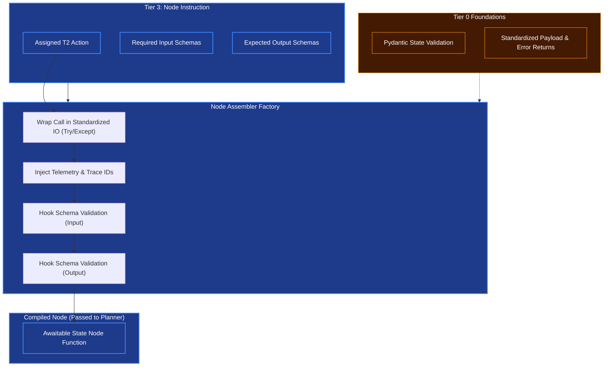

# Node Assembler

## Overview
Where the **Graph Synthesizer** creates the broad highway the agent travels on (the DAG map), the **Node Assembler** creates the specific cars that drive on it. 

Every node in the DAG needs to be an executable Python function (a `LangGraph Node`) wrapped consistently so the OODA loop can process it without crashing.

## Architecture & Flow

## Key Abstraction Logic
1. **The Telemetry Injection (Tier 0 Rule)**: Because of the Corporate Kernel rule that "Distrusted components will fail," every single generated node is automatically injected with Telemetry (tracing and logs bounds) by the node assembler. This guarantees Tier 4 execution never loses track of a nested function.
2. **Schema Wrapper (Tier 0 Pydantic)**: A node never begins processing without automatically doing a Tier 0 Pydantic validation on its inputs, acting as an immediate armor against invalid states in the Graph.
