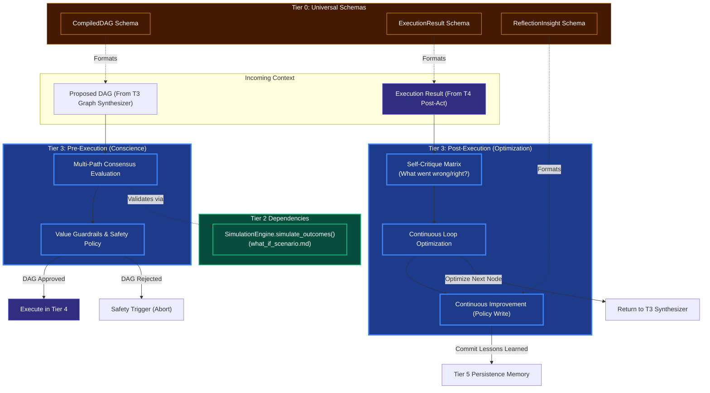

# Guardrails, Conscience, & Reflection

## Overview
These modules are the **Tier 3 (Advanced Cognition)** equivalents of safety and self-improvement loops. Before the OODA loop executes a DAG, and immediately after a DAG concludes, Tier 3 analyzes the results using advanced multi-agent methodologies.

- **Alignment & Value Guardrails (The Conscience)**: A strict, final check before execution that matches the generated DAG against Kea's non-negotiable ethical, security, and corporate rules.
- **Consensus Building**: For highly critical tasks, Tier 3 can spawn multiple localized DAG hypotheses and take a "vote" weighted by Plausibility scores to find the most likely success path.
- **Reflection & Self Critique (Continuous Optimization)**: A post-execution evaluation matrix that takes the result state of Tier 4, critiques the logic that led there, and saves the insight back to the Tier 5 long-term memory to ensure Continuous Improvement across epochs.

## Architecture & Flow

