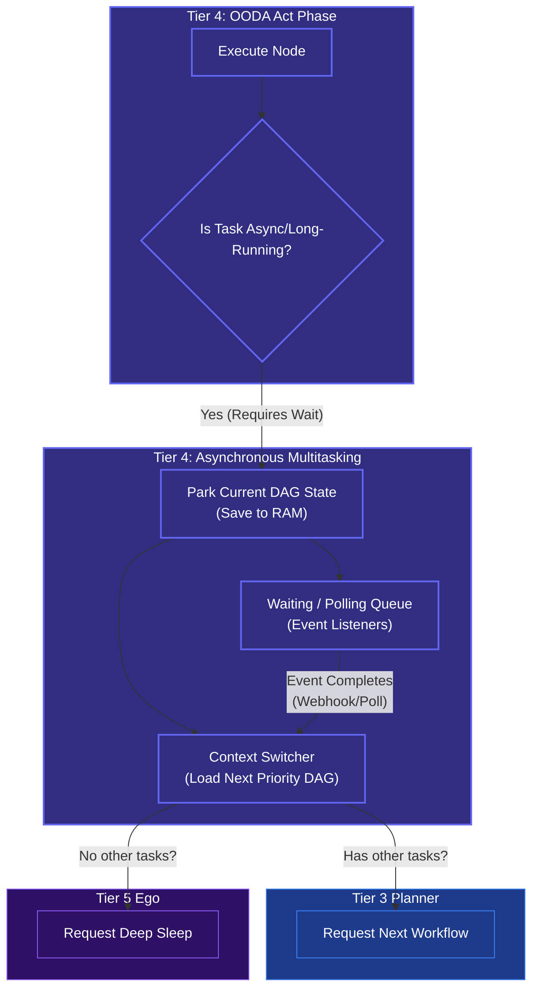

# Asynchronous Multitasking (Waiting State)

## Overview
While Tier 5 handles the *concept* of going to sleep, **Tier 4 (The Execution Engine)** handles the complex reality of **Asynchronous Multitasking**. 

When the OODA loop fires an action (like "Train this ML model" or "Wait for a human to reply to this email"), it cannot just freeze and block the processing thread. The Execution Engine must be able to "park" the current DAG and pick up another active task, ensuring maximum efficiency.

## Architecture & Flow

## Key Mechanisms
1. **DAG Parking**: If an MCP Tool returns a `Job ID` instead of a finished result, Tier 4 takes the entire current state of that DAG and "parks" it in the Short-Term Memory's `Waiting Queue`.
2. **Context Switching**: Tier 4 immediately asks Tier 3, "Do we have any other sub-tasks that can be executed in parallel right now?" If yes, it seamlessly swaps the context and begins executing the new DAG.
3. **Delegating to Tier 5**: If the `Waiting Queue` is full of parked tasks, but there is absolutely nothing else the agent can do *right now*, Tier 4 signals Tier 5. Tier 5 then safely puts the agent into a zero-compute `Deep Sleep` to preserve the Budget until an external webhook wakes it back up.

## Function Decomposition

### `manage_async_tasks`
- **Signature**: `async manage_async_tasks(node_result: ActionResult, dag_queue: DAGQueue) -> NextAction`
- **Description**: Top-level orchestrator. Called by the OODA Act phase when a node produces a long-running result. Checks if the task requires async waiting, parks the current DAG if so, and either switches to the next available DAG or requests deep sleep from Tier 5. Returns a `NextAction` indicating what the OODA loop should do next (continue, switch context, or sleep).
- **Calls**: `check_async_requirement()`, `park_dag_state()`, `register_wait_listener()`, `switch_context()`, `request_deep_sleep()`.

### `check_async_requirement`
- **Signature**: `check_async_requirement(node_result: ActionResult) -> bool`
- **Description**: Inspects the action result to determine if the task is long-running and requires async waiting. Returns `True` if the result contains a `Job ID`, a polling URL, or a webhook registration handle (indicating the MCP tool returned a deferred result). Returns `False` for immediate results.
- **Calls**: None (result inspection).

### `park_dag_state`
- **Signature**: `async park_dag_state(dag: CompiledDAG, short_term_memory: ShortTermMemory) -> ParkingTicket`
- **Description**: Saves the entire current DAG execution state (completed nodes, pending nodes, intermediate state values) to the Short-Term Memory's waiting queue. Returns a `ParkingTicket` containing the DAG ID and the event type needed to resume it. The parked DAG can be restored exactly where it left off.
- **Calls**: `short_term_memory.update_dag_state()`.

### `register_wait_listener`
- **Signature**: `async register_wait_listener(parking_ticket: ParkingTicket, event_type: str) -> WaitHandle`
- **Description**: Registers an event listener (webhook receiver or polling job) for the parked DAG's completion event. When the external service completes the async operation, the listener fires, the DAG is unparked, and the OODA loop resumes execution. Supports both push (webhook) and pull (periodic polling) modes.
- **Calls**: Event bus registration, webhook/polling setup.

### `switch_context`
- **Signature**: `async switch_context(dag_queue: DAGQueue) -> CompiledDAG | None`
- **Description**: Loads the next highest-priority DAG from the queue for execution. If other active DAGs are available, returns the next one for the OODA loop to process. If the queue is empty (all DAGs are parked/waiting), returns `None`, signaling that the agent should enter deep sleep.
- **Calls**: Priority queue pop operation.

### `request_deep_sleep`
- **Signature**: `async request_deep_sleep(tier5_controller: LifecycleClient) -> SleepToken`
- **Description**: Signals Tier 5 that there is no actionable work available. Tier 5 puts the agent into zero-compute deep sleep to conserve budget, setting up a wake trigger (cron job or webhook) for when a parked DAG's wait completes. Returns a `SleepToken` confirming the sleep state.
- **Calls**: Tier 5 Lifecycle Controller API.
