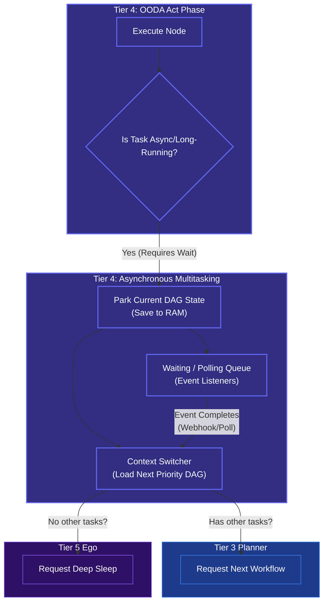

# Asynchronous Multitasking (Waiting State)

## Overview
While Tier 5 handles the *concept* of going to sleep, **Tier 4 (The Execution Engine)** handles the complex reality of **Asynchronous Multitasking**. 

When the OODA loop fires an action (like "Train this ML model" or "Wait for a human to reply to this email"), it cannot just freeze and block the processing thread. The Execution Engine must be able to "park" the current DAG and pick up another active task, ensuring maximum efficiency.

## Architecture & Flow

## Key Mechanisms
1. **DAG Parking**: If an MCP Tool returns a `Job ID` instead of a finished result, Tier 4 takes the entire current state of that DAG and "parks" it in the Short-Term Memory's `Waiting Queue`.
2. **Context Switching**: Tier 4 immediately asks Tier 3, "Do we have any other sub-tasks that can be executed in parallel right now?" If yes, it seamlessly swaps the context and begins executing the new DAG.
3. **Delegating to Tier 5**: If the `Waiting Queue` is full of parked tasks, but there is absolutely nothing else the agent can do *right now*, Tier 4 signals Tier 5. Tier 5 then safely puts the agent into a zero-compute `Deep Sleep` to preserve the Budget until an external webhook wakes it back up.
