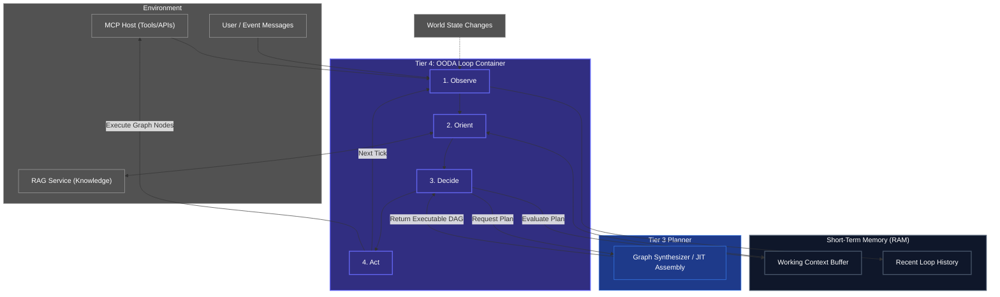

# The OODA Loop (Execution Engine)

## Overview
The OODA Loop (Tier 4) is the real-time beating heart of the Human Kernel. It is responsible for bridging the gap between Kea's internal cognition and the external world. Instead of calculating *how* to solve a problem (Tier 2/3), it simply dictates *when* things happen, *what* state we are currently in, and reacts immediately to environmental changes.

**CRITICAL RULE**: The OODA Loop must never block synchronously on slow LLM calls. The loop must iterate rapidly, dispatching asynchronous tasks and relying on Short-Term Memory to track the state of those operations.

## Architecture & Flow

## Phase Breakdown

1. **Observe (Sense)**: The Engine rapidly polls or listens to its event stream. Did the user send a new message? Did the RAG database update? Did an MCP tool crash? It drops these events immediately into the `Recent Loop History`.
2. **Orient (Contextualize)**: Looks at the new observations against its `Working Context Buffer` and pulls external knowledge from the `RAG Service`. If the agent was trying to download a file and the observation says "Network Disconnected", the orientation phase updates the state to *Blocked*.
3. **Decide (Plan)**: Compares the Oriented State against its current goals. If the state is *Blocked*, it tosses out the old plan, reaches down to **Tier 3 (The Graph Synthesizer)**, and asks for a new dynamic DAG to handle the disconnect.
4. **Act (Execute)**: Triggers the execution of the active DAG's current nodes. It does not calculate *how* the node works (Tier 2/3 built the node); it simply runs it, pushing the output back into the environment (MCP).
