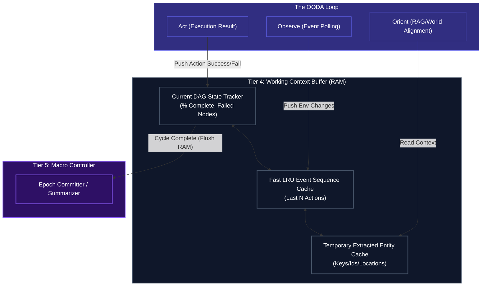

# Short-Term RAM & Loop Context

## Overview
Located firmly in **Tier 4 (The Execution Engine)**, the `Short-Term Memory` module is the active "RAM" of the Human Kernel's rapid OODA Loop. It acts as the context buffer holding immediate successes, failures, and observations from the environment so the agent does not repeat mistakes instantly.

**CRITICAL RULE**: Short-Term Memory is highly ephemeral. Once a major Task or Goal is completed, the contents of this RAM are summarized by the Tier 5 `Lifecycle Controller` and pushed into permanent storage in the Vault Data Center. The RAM is then wiped clean to prevent context window bloat on the next major cycle.

## Architecture & Flow

## Key Mechanisms
1. **LRU Event Sequence**: The `HistoryQueue` operates on a Least-Recently-Used policy (or sliding window) to ensure the LLM's context window is never overwhelmed. Old events are dropped from Tier 4 RAM automatically, though they might be logged as background telemetry in Tier 0.
2. **Entity Caching**: The `Working Entities` block holds specific API IDs, paths, names, or values retrieved by `Observe` so they can be injected efficiently into subsequent actions without requiring the agent to constantly query the Vector DB for variables it *just* learned.
