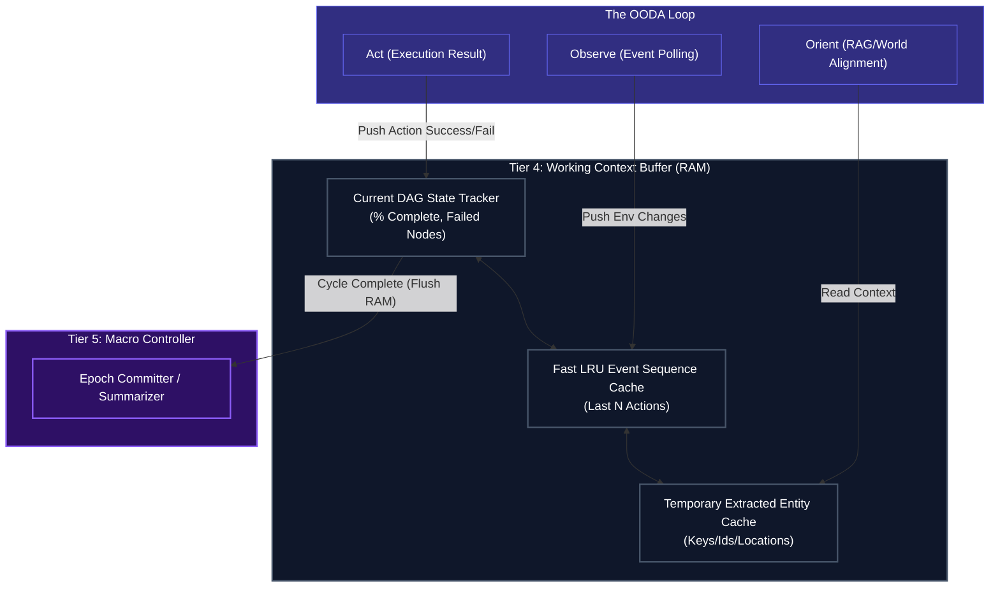

# Short-Term RAM & Loop Context

## Overview
Located firmly in **Tier 4 (The Execution Engine)**, the `Short-Term Memory` module is the active "RAM" of the Human Kernel's rapid OODA Loop. It acts as the context buffer holding immediate successes, failures, and observations from the environment so the agent does not repeat mistakes instantly.

**CRITICAL RULE**: Short-Term Memory is highly ephemeral. Once a major Task or Goal is completed, the contents of this RAM are summarized by the Tier 5 `Lifecycle Controller` and pushed into permanent storage in the Vault Data Center. The RAM is then wiped clean to prevent context window bloat on the next major cycle.

## Architecture & Flow

## Key Mechanisms
1. **LRU Event Sequence**: The `HistoryQueue` operates on a Least-Recently-Used policy (or sliding window) to ensure the LLM's context window is never overwhelmed. Old events are dropped from Tier 4 RAM automatically, though they might be logged as background telemetry in Tier 0.
2. **Entity Caching**: The `Working Entities` block holds specific API IDs, paths, names, or values retrieved by `Observe` so they can be injected efficiently into subsequent actions without requiring the agent to constantly query the Vector DB for variables it *just* learned.

## Function Decomposition

### `update_dag_state`
- **Signature**: `update_dag_state(dag_id: str, node_id: str, status: NodeStatus) -> DagStateSnapshot`
- **Description**: Updates the DAG state tracker with the result of a node execution. Tracks which nodes are completed, failed, or pending, and recalculates the overall completion percentage. Returns a `DagStateSnapshot` containing the current progress, failed node list, and estimated remaining steps. This snapshot is read by the OODA Observe phase and Tier 5 progress reporting.
- **Calls**: None (in-memory state mutation).

### `push_event`
- **Signature**: `push_event(event: ObservationEvent) -> None`
- **Description**: Adds a new observation event to the LRU event sequence cache (the `HistoryQueue`). Operates on a sliding window policy: when the cache exceeds `max_events` (config-driven), the oldest event is evicted. Evicted events may be logged to Tier 0 telemetry as background trace data before being dropped from RAM.
- **Calls**: Tier 0 logging for eviction trace (optional).

### `cache_entity`
- **Signature**: `cache_entity(key: str, value: Any, ttl: int | None = None) -> None`
- **Description**: Stores an extracted entity (API ID, file path, user name, numeric value) in the temporary entity cache. Accepts an optional TTL (time-to-live) in seconds, after which the entry is eligible for eviction. Prevents the agent from re-querying the Vector DB for variables it just extracted in the current OODA cycle.
- **Calls**: None (in-memory key-value store).

### `read_context`
- **Signature**: `read_context(query: str | None = None) -> ContextSlice`
- **Description**: Reads from the working memory to build a context slice for the OODA Orient phase. If a `query` is provided, returns the most relevant cached entities and recent events matching the query. If no query, returns the full current context buffer (DAG state + recent events + cached entities). Limits output size to prevent context window bloat.
- **Calls**: None (in-memory reads with optional relevance filtering).

### `flush_to_summarizer`
- **Signature**: `flush_to_summarizer() -> EpochSummary`
- **Description**: Triggered by Tier 5 at epoch completion. Collects the full contents of the Short-Term Memory (DAG history, event sequence, entity cache), produces a compressed `EpochSummary`, and clears the RAM. The summary is passed to Tier 5's `commit_epoch_memory()` for permanent storage in the Vault. Prevents context accumulation across epochs.
- **Calls**: None (aggregation and clear).

### `evict_stale_entries`
- **Signature**: `evict_stale_entries(max_age_seconds: int) -> int`
- **Description**: Garbage collection pass. Removes entities from the cache whose TTL has expired and events from the history queue older than `max_age_seconds`. Returns the count of evicted entries. Called periodically by the OODA loop to maintain memory hygiene without waiting for a full epoch flush.
- **Calls**: None (in-memory cleanup).
