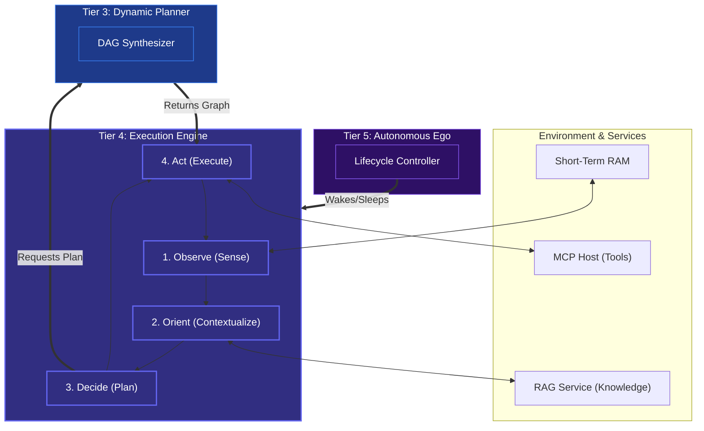

# Tier 4: Execution Engine (The OODA Loop)

## Overview
Tier 4 is the relentless engine that interfaces Kea with its simulated "world." It strictly relies on the Observe, Orient, Decide, and Act (OODA) loop. This component drives the flow of time for an agent, rapidly processing events, adjusting plans upon failure, and interacting with its environment.

**CRITICAL RULE**: The OODA loop controls the pacing, but it assumes the *content* of actions is determined by the Plan (Tier 3) and that the raw interpretation of events is handled by Primitives (Tier 1).

## Scope & Responsibilities
- **The Cognitive Cycle**: Runs continuous loops:
    1. Observe (Listen to environment, MCP tools, artifacts).
    2. Orient (Re-evaluate context, context engineering via RAG).
    3. Decide (Request a new plan or modify existing via Tier 3 DAGBuilder).
    4. Act (Execute a node from the DAG).
- **Short-Term Memory**: Holds an ephemeral memory space specifically to track the history of the current loop, enabling fast learning from immediate successes or failures.
- **Fault-Tolerance**: Implements safe fallback sleep cycles if tools or data sources abruptly go offline.

## Architecture

