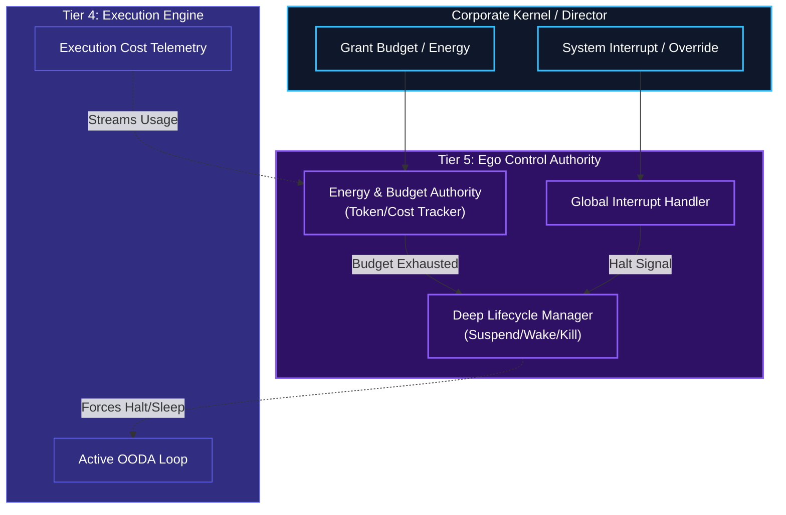

# Energy, Budget, & Interrupt Authority

## Overview
These macro-level control mechanisms reside at the very top of the Human Kernel in **Tier 5 (The Autonomous Ego)**. 

Because Tier 5 governs the *existence* and long-term viability of the agent, it must manage the agent's absolute constraints. It acts as the final judge on whether the agent has the resources to continue, and it handles absolute commands from the Corporate Kernel.

- **Energy / Budget Authority**: Tracks the total computational cost (API tokens, execution time, database writes) against the agent's assigned budget. If the budget runs out, Tier 5 forces the agent into an idle/suspended state until the Corporate Kernel grants more.
- **Interrupt Handling (Top-Down)**: The Corporate Kernel or an assigned Human Overseer can send a "Priority Override" or "Kill" signal. Tier 5 intercepts this, immediately halts Tier 4's OODA loop, and forces a context switch.
- **Lifecycle Management (Wake/Sleep)**: Expands on the basic waker/sleeper. If the agent hits a `Waiting State` in Tier 4 and has no other parallel tasks, Tier 5 puts the agent to sleep to conserve its Budget, setting a cron-job or webhook to wake it back up when the wait is over.

## Architecture & Flow

