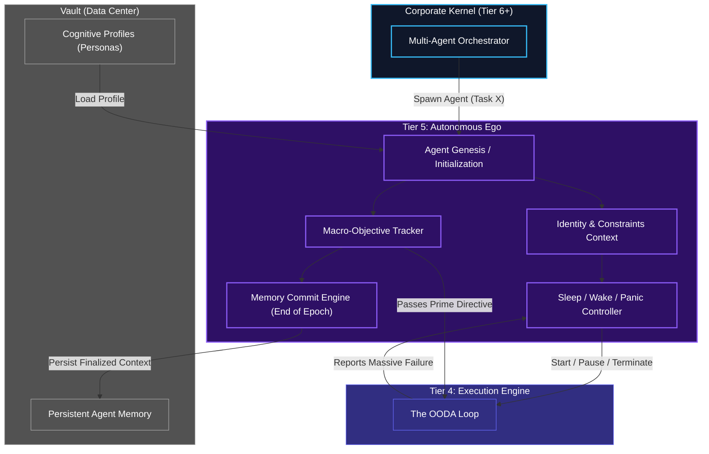

# Lifecycle Controller (Autonomous Ego)

## Overview
The Lifecycle Controller represents Tier 5, the literal "Ego" or peak of the individual Human Kernel pyramid. Where the OODA loop (Tier 4) thinks in milliseconds and seconds, the Lifecycle Controller thinks in hours, days, and complete epochs. 

Its job is to define the agent's identity, hold its macro-objectives (the grand goal spanning across hundreds of OODA loops), and ensure the long-term memory of its existence is safely stored in the persistent Vault Data Center.

## Architecture & Flow

## Key Mechanisms
1. **Sleep / Wake / Panic Control**: If Tier 4's OODA loop determines that the MCP Host is completely unreachable, it bubbles an alert up to Tier 5. Tier 5 issues a `Panic` state and puts the OODA loop into a `Deep Sleep`, checking the network only every 10 minutes to save computational resources. If the Corporate Kernel messages the agent to shut down, Tier 5 terminates the loops gracefully.
2. **Epoch Committing**: Instead of saving every single thought to the Vault DB (which would overwhelm the database), Tier 5 waits until a major objective is completed (an Epoch). It then takes the Short-Term memory from Tier 4, summarizes it, and commits it *once* to long-term storage in the Vault, keeping the history optimized.
3. **Identity Rigidity**: Once the `Agent Genesis` loads a cognitive profile from the Vault (e.g., "You are a Senior Security Auditor"), Tier 5 enforces those boundaries downwards. Tier 4 is completely bound by the strict constraints the Ego dictates.

## Function Decomposition

### `run_lifecycle`
- **Signature**: `async run_lifecycle(spawn_request: SpawnRequest) -> AgentLifecycle`
- **Description**: Top-level lifecycle runner. Initializes the agent (genesis), loads its cognitive profile, sets identity constraints, starts the OODA loop with the macro-objective, monitors for sleep/wake/panic signals, and commits epoch memory on completion. Returns the final `AgentLifecycle` report to the Corporate Kernel.
- **Calls**: `initialize_agent()`, `load_cognitive_profile()`, `set_identity_constraints()`, `track_macro_objective()`, `control_sleep_wake()`, `commit_epoch_memory()`.

### `initialize_agent`
- **Signature**: `async initialize_agent(spawn_request: SpawnRequest, vault_client: VaultClient) -> AgentIdentity`
- **Description**: Agent Genesis. Creates a new agent instance by generating a unique agent ID (via Tier 0 `generate_id()`), registering it in the Vault, and initializing its internal state structures (empty Short-Term Memory, fresh OODA state). The `spawn_request` from Tier 6 contains the assigned role, objective, and resource budget.
- **Calls**: Tier 0 `id_and_hash.generate_id()`, Vault Service HTTP API.

### `load_cognitive_profile`
- **Signature**: `async load_cognitive_profile(profile_id: str, vault_client: VaultClient) -> CognitiveProfile`
- **Description**: Retrieves the agent's cognitive profile (persona, skills, rules, constraints) from the Vault database. The profile defines the agent's role-specific behavior: what tools it can use, what knowledge domains it has access to, what ethical constraints it must follow, and what quality bar it must meet.
- **Calls**: Vault Service HTTP API.

### `set_identity_constraints`
- **Signature**: `set_identity_constraints(profile: CognitiveProfile) -> IdentityContext`
- **Description**: Enforces identity rigidity. Converts the loaded cognitive profile into an immutable `IdentityContext` that is passed down to all lower tiers. Once set, the identity cannot be modified by the OODA loop or any lower-tier component. This prevents the agent from "hallucinating" outside its assigned role boundaries.
- **Calls**: None (immutable context construction).

### `track_macro_objective`
- **Signature**: `track_macro_objective(objective: MacroObjective) -> ObjectiveState`
- **Description**: Manages the grand goal that spans across hundreds of OODA loops. Tracks high-level completion status, sub-objective progress (via Tier 4 progress tracker), and determines when an epoch is complete. Signals Tier 4 to continue, pivot, or finalize based on macro-level assessment.
- **Calls**: Reads from Tier 4 `short_term_memory.read_context()`.

### `control_sleep_wake`
- **Signature**: `async control_sleep_wake(signal: LifecycleSignal) -> LifecycleState`
- **Description**: Controls the agent's power state. Processes `START` (initialize OODA loop), `PAUSE` (suspend loop, preserve state), `PANIC` (network failure, enter deep sleep with periodic retry), and `TERMINATE` (graceful shutdown with epoch commit). Monitors network health and MCP availability to trigger automatic panic mode.
- **Calls**: Tier 4 OODA loop control, network health checks.

### `commit_epoch_memory`
- **Signature**: `async commit_epoch_memory(short_term_summary: EpochSummary, vault_client: VaultClient) -> None`
- **Description**: End-of-epoch persistence. Takes the summarized Short-Term Memory from Tier 4 (`flush_to_summarizer()` output), compresses it into a long-term memory record, and commits it to the Vault. This is the only point where the agent's working memory becomes permanent. After commit, the Short-Term Memory is wiped clean for the next epoch.
- **Calls**: Tier 4 `short_term_memory.flush_to_summarizer()`, Vault Service HTTP API.
