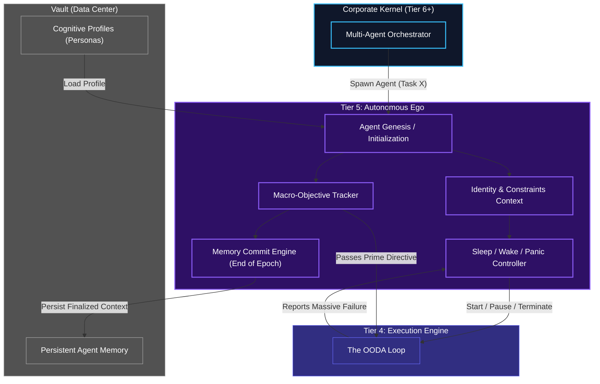

# Lifecycle Controller (Autonomous Ego)

## Overview
The Lifecycle Controller represents Tier 5, the literal "Ego" or peak of the individual Human Kernel pyramid. Where the OODA loop (Tier 4) thinks in milliseconds and seconds, the Lifecycle Controller thinks in hours, days, and complete epochs. 

Its job is to define the agent's identity, hold its macro-objectives (the grand goal spanning across hundreds of OODA loops), and ensure the long-term memory of its existence is safely stored in the persistent Vault Data Center.

## Architecture & Flow

## Key Mechanisms
1. **Sleep / Wake / Panic Control**: If Tier 4's OODA loop determines that the MCP Host is completely unreachable, it bubbles an alert up to Tier 5. Tier 5 issues a `Panic` state and puts the OODA loop into a `Deep Sleep`, checking the network only every 10 minutes to save computational resources. If the Corporate Kernel messages the agent to shut down, Tier 5 terminates the loops gracefully.
2. **Epoch Committing**: Instead of saving every single thought to the Vault DB (which would overwhelm the database), Tier 5 waits until a major objective is completed (an Epoch). It then takes the Short-Term memory from Tier 4, summarizes it, and commits it *once* to long-term storage in the Vault, keeping the history optimized.
3. **Identity Rigidity**: Once the `Agent Genesis` loads a cognitive profile from the Vault (e.g., "You are a Senior Security Auditor"), Tier 5 enforces those boundaries downwards. Tier 4 is completely bound by the strict constraints the Ego dictates.
