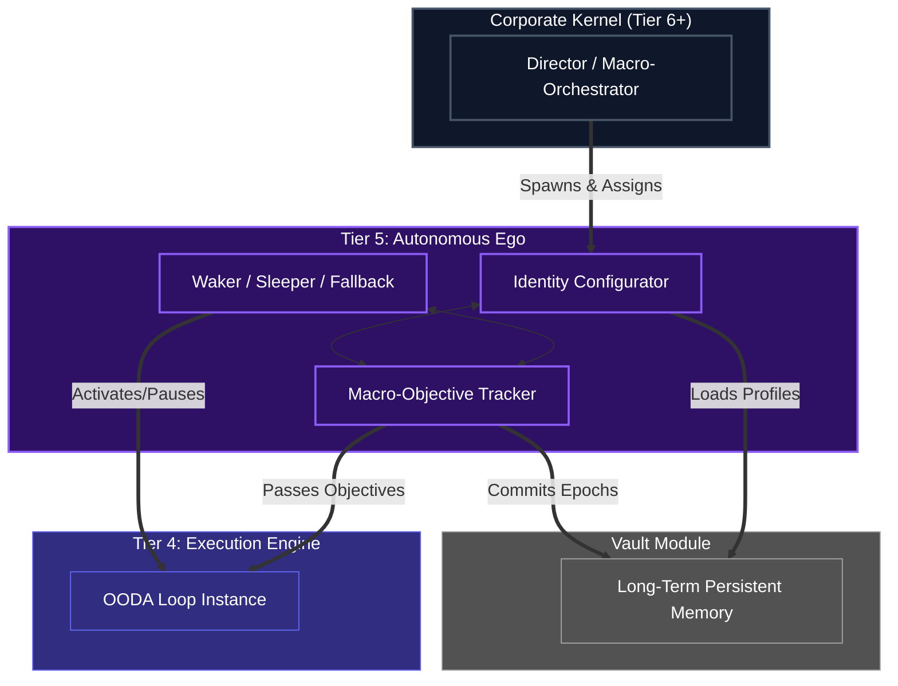

# Tier 5: The Autonomous Ego (Lifecycle Controller)

## Overview
Tier 5 is the peak of the individual Human Kernel pyramid. It holds the "Self" concept for the agent, governing long-term existence, overarching priorities, identity configuration, and major state transitions (like waking, sleeping, or migrating). 

**CRITICAL RULE**: Tier 5 dictates the *macro* state to Tier 4 (e.g., "Start working on objective X", "Go to sleep, network is down"), but does not micromanage the OODA iterations. It acts as the ultimate authority for a singular agent.

## Scope & Responsibilities
- **Identity & Persistence**: Manages the agent's core identity constraints, long-term goals, and final memory summarization for persistence in the Vault Data Center.
- **Lifecycle Management**: Wakes the agent up, handles interrupts, puts the agent into deep sleep or fallback mode when necessary.
- **Status Reporting**: Represents the state of the singular human kernel to external controllers (like the Corporate Kernel).

## Architecture

## Function Registry

| Module | Function | Signature | Purpose |
|--------|----------|-----------|---------|
| `lifecycle_controller` | `run_lifecycle` | `async (spawn_request: SpawnRequest) -> AgentLifecycle` | Top-level agent lifecycle runner |
| `lifecycle_controller` | `initialize_agent` | `async (spawn_request, vault_client) -> AgentIdentity` | Agent genesis and registration |
| `lifecycle_controller` | `load_cognitive_profile` | `async (profile_id: str, vault_client) -> CognitiveProfile` | Load persona/skills from Vault |
| `lifecycle_controller` | `set_identity_constraints` | `(profile: CognitiveProfile) -> IdentityContext` | Enforce immutable role boundaries |
| `lifecycle_controller` | `track_macro_objective` | `(objective: MacroObjective) -> ObjectiveState` | Track grand goal across OODA epochs |
| `lifecycle_controller` | `control_sleep_wake` | `async (signal: LifecycleSignal) -> LifecycleState` | Start/Pause/Panic/Terminate control |
| `lifecycle_controller` | `commit_epoch_memory` | `async (short_term_summary, vault_client) -> None` | Persist epoch to Vault |
| `energy_and_interrupts` | `enforce_energy_authority` | `async (cost_telemetry, interrupt_queue) -> ControlDecision` | Top-level resource + interrupt monitor |
| `energy_and_interrupts` | `track_budget` | `(cost_event, budget_state) -> BudgetState` | Accumulate API/compute costs |
| `energy_and_interrupts` | `check_budget_exhaustion` | `(budget_state: BudgetState) -> bool` | Budget threshold check |
| `energy_and_interrupts` | `handle_interrupt` | `async (interrupt_signal) -> InterruptAction` | Process corporate override/kill signals |
| `energy_and_interrupts` | `manage_lifecycle_state` | `async (trigger: ControlTrigger) -> LifecycleTransition` | Execute state transitions |
