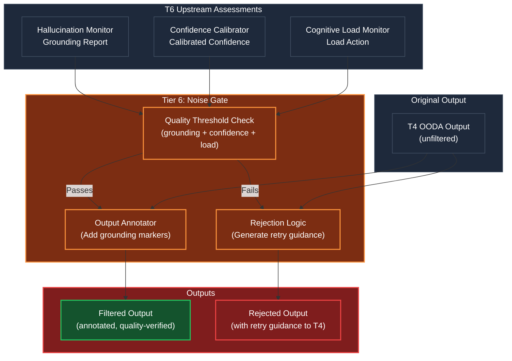

# Noise Gate (Output Quality Filter)

## Overview
The Noise Gate is the agent's **final quality checkpoint** — the last module an output passes through before it reaches the user or downstream systems. Operating at **Tier 6 (The Conscious Observer)** as the terminal post-execution step, it aggregates the assessments from the Hallucination Monitor and Confidence Calibrator to make a binary decision: **pass or reject**.

The name comes from audio engineering: a noise gate blocks signals below a certain amplitude threshold. Similarly, this module blocks outputs below a certain quality threshold, preventing low-confidence, poorly-grounded, or unreliable responses from escaping the kernel.

## Architecture & Flow

## Key Mechanisms

1. **Multi-Dimensional Quality Check**: The gate doesn't use a single score. It evaluates three dimensions:
   - **Grounding Score** (from Hallucination Monitor): Are the claims evidence-backed?
   - **Calibrated Confidence** (from Confidence Calibrator): Is the stated confidence reliable?
   - **Load Status** (from Cognitive Load Monitor): Was the processing healthy or compromised?

   An output passes only if ALL three dimensions meet their respective thresholds (configurable in `shared/config.py`).

2. **Output Annotation**: Outputs that pass the gate are annotated with quality metadata:
   - Per-claim grounding grades (GROUNDED / INFERRED / FABRICATED)
   - Overall grounding score
   - Calibrated confidence (and whether overconfidence was detected)
   - Source references for grounded claims

   These annotations give the user (or downstream agent) full transparency into the output's reliability.

3. **Rejection with Guidance**: When an output fails the gate, it's not simply discarded. The Noise Gate generates a `RetryGuidance` object explaining:
   - Why the output was rejected (which dimension failed)
   - Specific claims that were fabricated
   - Suggestions for improvement (e.g., "search for evidence on claim X before restating")

   This guidance is fed back into T4's OODA loop as a re-orientation signal, enabling the agent to self-correct.

4. **Retry Budget**: To prevent infinite retry loops, the gate tracks retry count per output. After N retries (configurable, default 3), the gate either passes the output with explicit low-confidence warnings or escalates to T5/T7 for human intervention. The retry budget is managed by the Cognitive Load Monitor.

5. **Threshold Adaptation**: Quality thresholds can be adjusted per-task by T5's identity constraints. A research agent might have stricter grounding requirements (threshold 0.8) while a brainstorming agent might accept lower grounding (threshold 0.4) since creative outputs are inherently speculative.

## Function Decomposition

### `filter_output`
- **Signature**: `async filter_output(output: ToolOutput, grounding: GroundingReport, confidence: CalibratedConfidence) -> FilteredOutput | RejectedOutput`
- **Description**: Top-level filter. Applies the quality threshold check across all three dimensions. If the output passes, annotates it with quality metadata and returns a `FilteredOutput`. If it fails, generates retry guidance and returns a `RejectedOutput`. Tracks retry count to prevent infinite loops. This is the final function called before any output leaves the Human Kernel.
- **Calls**: `apply_quality_threshold()`, `annotate_output()` or `generate_rejection_feedback()`.

### `apply_quality_threshold`
- **Signature**: `(grounding_score: float, confidence: float) -> bool`
- **Description**: The core pass/fail decision. Checks: (1) grounding score >= grounding threshold (config, default 0.6), (2) calibrated confidence >= confidence threshold (config, default 0.5), (3) no ABORT load action from Cognitive Load Monitor. Returns `True` if all pass, `False` if any fail. Thresholds can be overridden per-task by T5 identity constraints (e.g., strict mode for compliance tasks).
- **Calls**: Config lookup for quality thresholds, T5 identity constraint overrides.

### `annotate_output`
- **Signature**: `(output: ToolOutput, grounding: GroundingReport, confidence: CalibratedConfidence) -> FilteredOutput`
- **Description**: Enriches a passing output with quality metadata. Adds: per-claim grounding grades, overall grounding score, calibrated confidence value, overconfidence warning flag, and source references for all grounded claims. The `FilteredOutput` schema extends `ToolOutput` with a `quality_metadata` field. This enables downstream consumers (users, agents, T7) to make informed trust decisions.
- **Calls**: None (data assembly).

### `generate_rejection_feedback`
- **Signature**: `(rejection_reason: str, output: ToolOutput) -> RetryGuidance`
- **Description**: Generates actionable feedback for T4 when an output fails the quality gate. Identifies: (1) which quality dimension failed, (2) specific fabricated claims (from grounding report), (3) suggested actions (e.g., "retrieve evidence for X", "reduce confidence on Y", "simplify scope"). Returns a `RetryGuidance` object that T4's Orient phase uses to adjust the next OODA cycle. Includes retry count tracking — after max retries, suggests escalation instead of retry.
- **Calls**: None (logic synthesis from grounding report and confidence data).

### `check_retry_budget`
- **Signature**: `(output_id: str) -> RetryBudgetStatus`
- **Description**: Checks how many retry attempts have been made for this specific output. Returns a `RetryBudgetStatus` containing: `retries_used`, `retries_remaining`, and `should_escalate` (True if budget exhausted). The max retry count is configurable (default 3). When budget is exhausted, the gate either passes with explicit low-confidence warnings or escalates to T5 for human intervention, depending on the configured escalation policy.
- **Calls**: Internal retry counter state, config for max retries.
