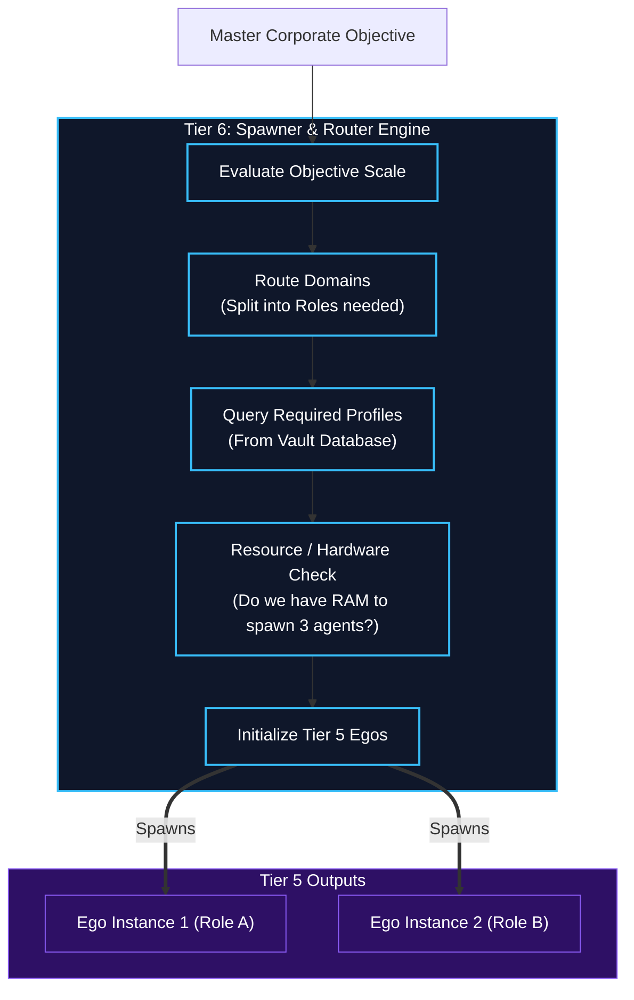

# Agent Spawner & Task Router

## Overview
The gateway into Tier 6 for any massive enterprise objective.

- **Task Router**: When a user submits an objective too large for a single agent (like "Build a web app and deploy it"), the Router breaks the master objective down into domain-specific chunks.
- **Agent Spawner**: Evaluates the chunks and dynamically spawns Human Kernels (Tier 5 instances) to handle them. It loads the appropriate "Cognitive Profiles" from the Vault (e.g., spawning one Frontend Developer, one Backend Developer, and one DevOps Engineer).

## Architecture & Flow

