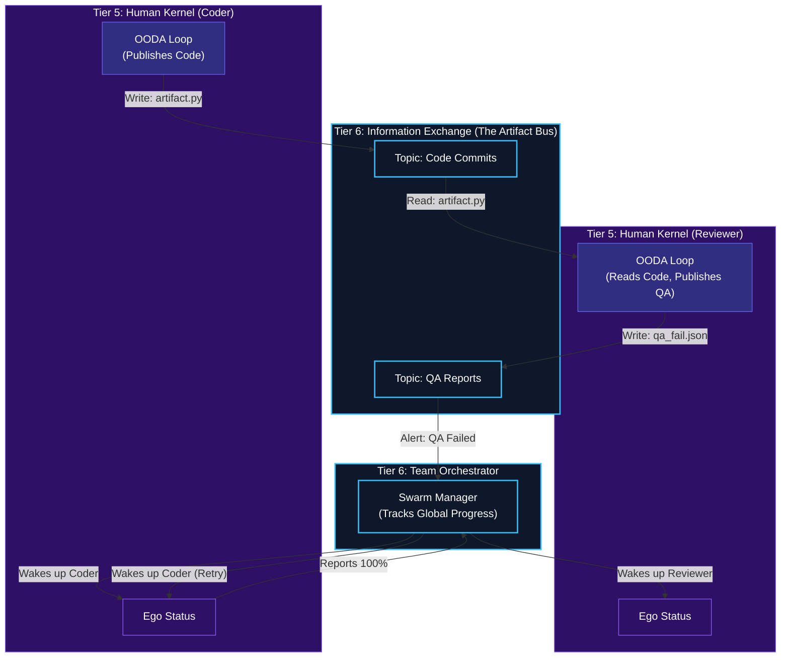

# Team Orchestration & Information Exchange

## Overview
Once multiple Tier 5 agents are spawned by Tier 6, they need to talk to each other to accomplish the Master Objective. Since they run completely isolated from each other (Zero-Trust boundaries), they cannot share their internal Short-Term Memories directly. 

- **Information Exchange (Artifact Bus)**: The physical "watercooler" of the corporation. When an agent creates a file, insight, or artifact, it publishes it to the Artifact Bus. Other agents subscribed to that artifact type can instantly pull it into their own OODA Loops (via Tier 4 `Observe`).
- **Team Orchestration**: Acts as the Manager/Director of the spawned swarm. It listens to the status reported by every Tier 5 Ego. If the Coder Agent finishes its DAG, the Team Orchestrator signals the Reviewer Agent to wake up and start evaluating the Coder's Artifact.

## Architecture & Flow

