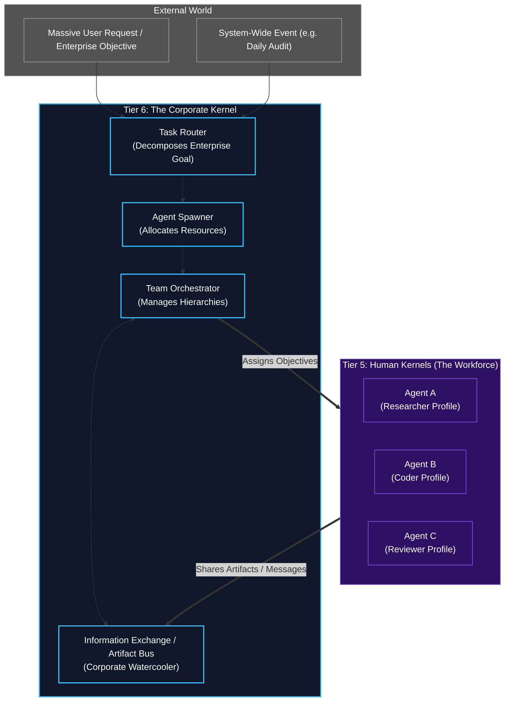

# Tier 6: The Corporate Kernel (Macro-Orchestrator)

## Overview
Sitting entirely above the individual Human Kernel (Tiers 0-5) is **Tier 6: The Corporate Kernel**. 

While Tier 5 represents the "Ego" of a single employee, Tier 6 represents the "Corporation" itself. It does not perform tasks directly. Instead, it manages the workforce. It is responsible for dynamically scaling the system, assembling teams of Human Kernels, routing tasks to the right specialists, and enforcing corporate-wide governance.

## Architecture & Flow

