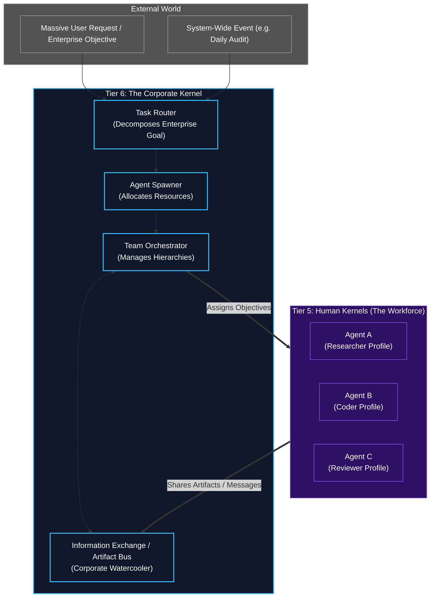

# Tier 6: The Corporate Kernel (Macro-Orchestrator)

## Overview
Sitting entirely above the individual Human Kernel (Tiers 0-5) is **Tier 6: The Corporate Kernel**. 

While Tier 5 represents the "Ego" of a single employee, Tier 6 represents the "Corporation" itself. It does not perform tasks directly. Instead, it manages the workforce. It is responsible for dynamically scaling the system, assembling teams of Human Kernels, routing tasks to the right specialists, and enforcing corporate-wide governance.

## Architecture & Flow

## Function Registry

| Module | Function | Signature | Purpose |
|--------|----------|-----------|---------|
| `spawner_and_router` | `route_and_spawn` | `async (master_goal: MasterObjective) -> list[AgentHandle]` | Top-level task routing + agent spawning |
| `spawner_and_router` | `evaluate_objective_scale` | `(master_goal) -> ScaleAssessment` | Assess complexity and domain breadth |
| `spawner_and_router` | `route_domains` | `(assessment: ScaleAssessment) -> list[DomainChunk]` | Split objective by role domain |
| `spawner_and_router` | `query_profiles` | `async (domain_chunks, vault_client) -> list[CognitiveProfile]` | Retrieve matching profiles from Vault |
| `spawner_and_router` | `check_hardware_resources` | `async (required_agents: int) -> ResourceAvailability` | RAM/CPU/GPU capacity check |
| `spawner_and_router` | `spawn_agents` | `async (profiles, objectives) -> list[AgentHandle]` | Initialize Tier 5 Ego instances |
| `team_orchestration` | `orchestrate_team` | `async (agent_handles, master_goal) -> TeamResult` | Top-level multi-agent coordination |
| `team_orchestration` | `publish_artifact` | `async (agent_id, topic, artifact) -> None` | Push artifact to bus topic |
| `team_orchestration` | `subscribe_to_topic` | `async (agent_id, topic) -> Subscription` | Register for artifact topic |
| `team_orchestration` | `consume_artifacts` | `async (subscription) -> list[Artifact]` | Pull pending artifacts from bus |
| `team_orchestration` | `track_team_progress` | `async (agent_handles) -> TeamProgressReport` | Aggregate global progress |
| `team_orchestration` | `signal_agent_wake` | `async (agent_handle, reason) -> None` | Wake a sleeping/suspended agent |
| `team_orchestration` | `sequence_workflow` | `async (completion_event, workflow_rules) -> None` | Chain agent handoffs (Coder -> Reviewer) |
