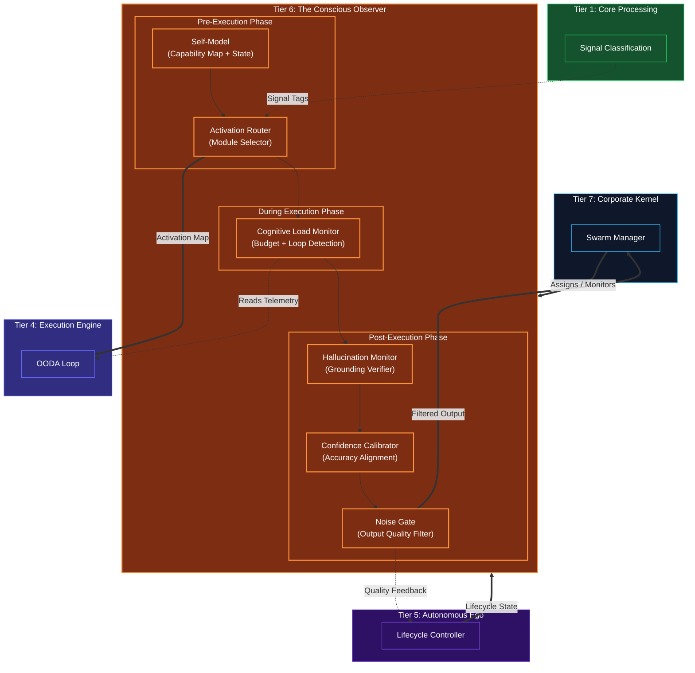
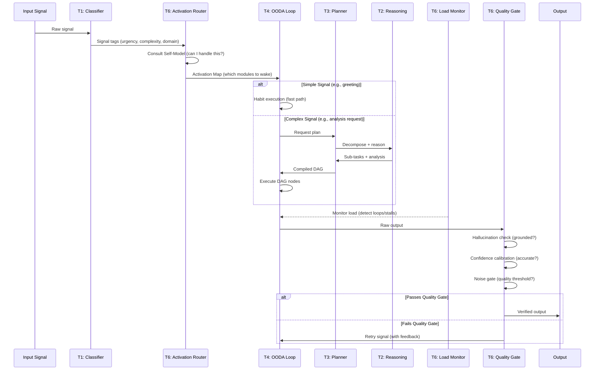

# Tier 6: The Conscious Observer (Metacognitive Oversight)

## Overview
Tier 6 is the **highest layer of the individual Human Kernel** — the layer that makes the agent self-aware rather than merely self-managing. While Tier 5 (Autonomous Ego) controls the agent's lifecycle and identity, Tier 6 **observes, evaluates, and regulates** the quality of the agent's own cognition.

Think of it as the difference between doing a task (T4) and knowing whether you're doing it well (T6). A worker can follow instructions all day (T4/T5). A *conscious* worker asks: "Am I stuck? Am I making this up? Do I even need to think hard about this?"

**CRITICAL RULE**: Tier 6 has **read access** to signals flowing through all lower tiers (via the Cognitive Bus / observability), but **write access** only to Tier 5 (lifecycle commands) and Tier 4 (activation signals). It cannot directly modify T1-T3 logic — it can only gate whether they activate and filter what they output.

## The Three Temporal Roles

Tier 6 is unique because it operates at three distinct points in every cognitive cycle:

| Temporal Phase | Role | Modules Involved |
|---|---|---|
| **Pre-Execution** | Decides which modules to activate for the incoming signal | Activation Router, Self-Model |
| **During Execution** | Monitors processing cost and detects loops/stalls | Cognitive Load Monitor |
| **Post-Execution** | Verifies output quality before it leaves the kernel | Hallucination Monitor, Confidence Calibrator, Noise Gate |

## Scope & Responsibilities
- **Self-Awareness**: Maintains a live model of what the agent IS, CAN do, and CANNOT do.
- **Hallucination Control**: Grades every output claim as grounded (evidence-backed), inferred (logically derived), or fabricated (no backing).
- **Selective Activation**: Determines the minimal set of modules required per signal, keeping dormant modules asleep.
- **Confidence Calibration**: Ensures stated confidence matches actual evidence quality — prevents overconfident hallucinations.
- **Cognitive Load Management**: Tracks processing budget and detects when the agent is overloaded, stuck, or oscillating.
- **Output Filtering**: Blocks low-quality or ungrounded outputs from reaching the user or downstream agents.

## Architecture



## Signal Flow Through T6

The Conscious Observer wraps every cognitive cycle. Here is the complete signal path:



## Selective Activation Examples

The Activation Router determines the **minimal pipeline** per signal type:

| Input Signal | T1 | T2 | T3 | T4 | T5 | Rationale |
|---|---|---|---|---|---|---|
| "Hello" | classify | - | - | habit exec | - | Greeting: fast-path only |
| "What's 2+2?" | classify | - | - | direct answer | - | Trivial: no reasoning needed |
| "Summarize this PDF" | classify, modality | attention | tool binding | full OODA | - | Tool use: needs planning |
| "Design a product strategy" | full classify | decompose, what-if, curiosity | full DAG | full OODA | goal tracking | Complex: full pipeline |
| "URGENT: API is down" | urgency scorer | - | - | immediate act | panic handler | Emergency: skip reasoning |

## Dependency Graph

```
T6 imports from:
  ├── T0 (schemas, config, logging, hardware pressure)
  ├── T1 (reads classification output — signal tags)
  └── T5 (reads lifecycle state, sends quality feedback)

T6 sends signals to:
  ├── T4 (activation map — which modules to wake)
  ├── T5 (quality feedback — affects lifecycle decisions)
  └── T7 (filtered output — only quality-verified results)
```

**CRITICAL**: T6 does NOT import from T2, T3, or T4 directly. It reads their telemetry via the observability layer (Tier 0 structured logging / Cognitive Bus). This maintains clean separation — T6 observes but does not entangle with execution logic.

## Function Registry

| Module | Function | Signature | Purpose |
|--------|----------|-----------|---------|
| `self_model` | `assess_capability` | `async (signal_tags: SignalTags, identity: IdentityContext) -> CapabilityAssessment` | Can I handle this signal? |
| `self_model` | `get_current_state` | `() -> AgentCognitiveState` | Introspection: what am I doing right now? |
| `self_model` | `update_accuracy_history` | `(prediction: float, actual: float) -> None` | Track calibration over time |
| `self_model` | `detect_capability_gap` | `(signal_tags: SignalTags) -> CapabilityGap \| None` | Identify missing tools/knowledge |
| `activation_router` | `compute_activation_map` | `async (signal_tags: SignalTags, capability: CapabilityAssessment, pressure: float) -> ActivationMap` | Which modules to activate? |
| `activation_router` | `classify_signal_complexity` | `(signal_tags: SignalTags) -> ComplexityLevel` | Trivial / Simple / Moderate / Complex / Critical |
| `activation_router` | `select_pipeline` | `(complexity: ComplexityLevel, pressure: float) -> PipelineConfig` | Map complexity to module set |
| `hallucination_monitor` | `verify_grounding` | `async (output: ToolOutput, evidence: list[Origin]) -> GroundingReport` | Check claims against evidence |
| `hallucination_monitor` | `classify_claims` | `(output_text: str) -> list[Claim]` | Extract individual claims from output |
| `hallucination_monitor` | `grade_claim` | `async (claim: Claim, evidence: list[Origin]) -> ClaimGrade` | Grade: GROUNDED / INFERRED / FABRICATED |
| `hallucination_monitor` | `calculate_grounding_score` | `(grades: list[ClaimGrade]) -> float` | Overall grounding confidence 0.0-1.0 |
| `confidence_calibrator` | `calibrate_confidence` | `(stated_confidence: float, grounding_score: float, history: CalibrationHistory) -> CalibratedConfidence` | Align confidence with evidence |
| `confidence_calibrator` | `detect_overconfidence` | `(stated: float, calibrated: float) -> bool` | Flag if agent is too confident |
| `confidence_calibrator` | `update_calibration_curve` | `(predicted: float, actual_accuracy: float) -> None` | Learn from prediction outcomes |
| `cognitive_load_monitor` | `measure_load` | `(active_modules: ActivationMap, telemetry: CycleTelemetry) -> CognitiveLoad` | Current processing cost |
| `cognitive_load_monitor` | `detect_loop` | `(recent_decisions: list[Decision]) -> LoopDetection` | Stuck in repetitive cycle? |
| `cognitive_load_monitor` | `detect_stall` | `(cycle_duration: float, expected_duration: float) -> bool` | Taking too long? |
| `cognitive_load_monitor` | `recommend_action` | `(load: CognitiveLoad, loops: LoopDetection) -> LoadAction` | CONTINUE / SIMPLIFY / ESCALATE / ABORT |
| `noise_gate` | `filter_output` | `async (output: ToolOutput, grounding: GroundingReport, confidence: CalibratedConfidence) -> FilteredOutput \| RejectedOutput` | Pass or block output |
| `noise_gate` | `apply_quality_threshold` | `(grounding_score: float, confidence: float) -> bool` | Meets minimum quality bar? |
| `noise_gate` | `generate_rejection_feedback` | `(rejection_reason: str, output: ToolOutput) -> RetryGuidance` | Tell T4 what to fix |
