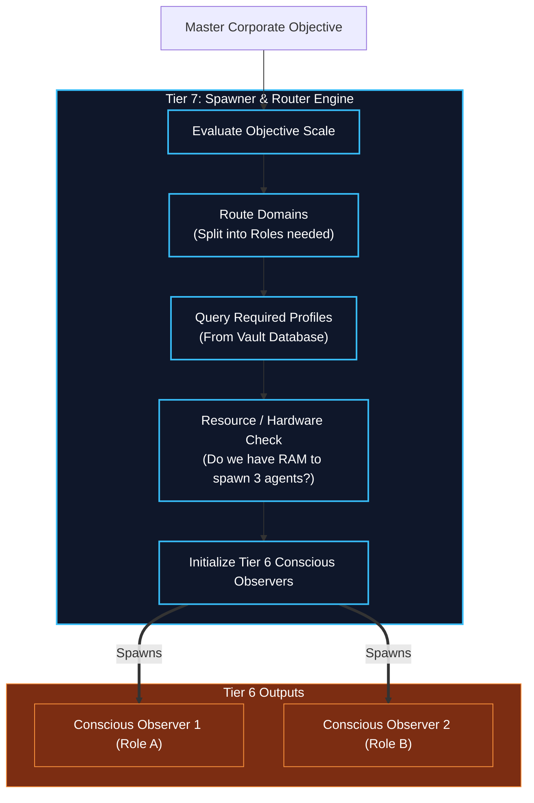

# Agent Spawner & Task Router

## Overview
The gateway into Tier 7 for any massive enterprise objective.

- **Task Router**: When a user submits an objective too large for a single agent (like "Build a web app and deploy it"), the Router breaks the master objective down into domain-specific chunks.
- **Agent Spawner**: Evaluates the chunks and dynamically spawns Human Kernels (Tier 6 Conscious Observer instances, each wrapping a complete T1-T5 stack) to handle them. It loads the appropriate "Cognitive Profiles" from the Vault (e.g., spawning one Frontend Developer, one Backend Developer, and one DevOps Engineer).

## Architecture & Flow

## Function Decomposition

### `route_and_spawn`
- **Signature**: `async route_and_spawn(master_goal: MasterObjective) -> list[AgentHandle]`
- **Description**: Top-level orchestrator. Evaluates the scale of the enterprise objective, routes it into domain-specific chunks, queries the required cognitive profiles from the Vault, checks hardware resource availability, and spawns Tier 6 Conscious Observer instances. Returns a list of `AgentHandle` objects that the Team Orchestrator uses to manage the spawned workforce.
- **Calls**: `evaluate_objective_scale()`, `route_domains()`, `query_profiles()`, `check_hardware_resources()`, `spawn_agents()`.

### `evaluate_objective_scale`
- **Signature**: `evaluate_objective_scale(master_goal: MasterObjective) -> ScaleAssessment`
- **Description**: Step 1. Parses the enterprise objective to determine its complexity, domain breadth, and resource requirements. Categorizes the goal as single-agent (simple), multi-agent (compound), or swarm (enterprise-scale). The assessment drives how many agents and which role profiles are needed.
- **Calls**: Tier 1 `classification.classify()` for domain detection, Tier 2 `task_decomposition.analyze_goal_complexity()`.

### `route_domains`
- **Signature**: `route_domains(assessment: ScaleAssessment) -> list[DomainChunk]`
- **Description**: Step 2. Splits the assessed objective into domain-specific chunks, each representing a coherent body of work for a single role (e.g., frontend development, backend development, QA review). Each `DomainChunk` specifies the sub-objective, required skill domain, and estimated resource budget.
- **Calls**: None (domain routing logic based on assessment).

### `query_profiles`
- **Signature**: `async query_profiles(domain_chunks: list[DomainChunk], vault_client: VaultClient) -> list[CognitiveProfile]`
- **Description**: Step 3. Retrieves the appropriate cognitive profiles from the Vault database for each domain chunk. Matches domain requirements (e.g., "needs Python expertise") to available profiles (e.g., "Senior Python Developer"). Returns the ordered list of profiles to be loaded into spawned agents.
- **Calls**: Vault Service HTTP API.

### `check_hardware_resources`
- **Signature**: `async check_hardware_resources(required_agents: int) -> ResourceAvailability`
- **Description**: Step 4. Queries the hardware abstraction layer (Tier 0) to determine if the system has sufficient RAM, CPU cores, and GPU capacity to spawn the requested number of agents. Returns a `ResourceAvailability` report. If resources are insufficient, the spawner scales down the agent count or queues agents for sequential spawning.
- **Calls**: Tier 0 `shared.hardware` detection, config-driven resource limits.

### `spawn_agents`
- **Signature**: `async spawn_agents(profiles: list[CognitiveProfile], objectives: list[DomainChunk]) -> list[AgentHandle]`
- **Description**: Step 5. Initializes Tier 6 Conscious Observer instances, each wrapping a complete Human Kernel stack (T1-T5). Each agent is assigned its cognitive profile, sub-objective, and resource budget. Returns `AgentHandle` objects containing the agent ID, communication endpoint, and lifecycle status for the Team Orchestrator to manage.
- **Calls**: Tier 6 `conscious_observer.initialize()` which delegates to Tier 5 `lifecycle_controller.run_lifecycle()`.
