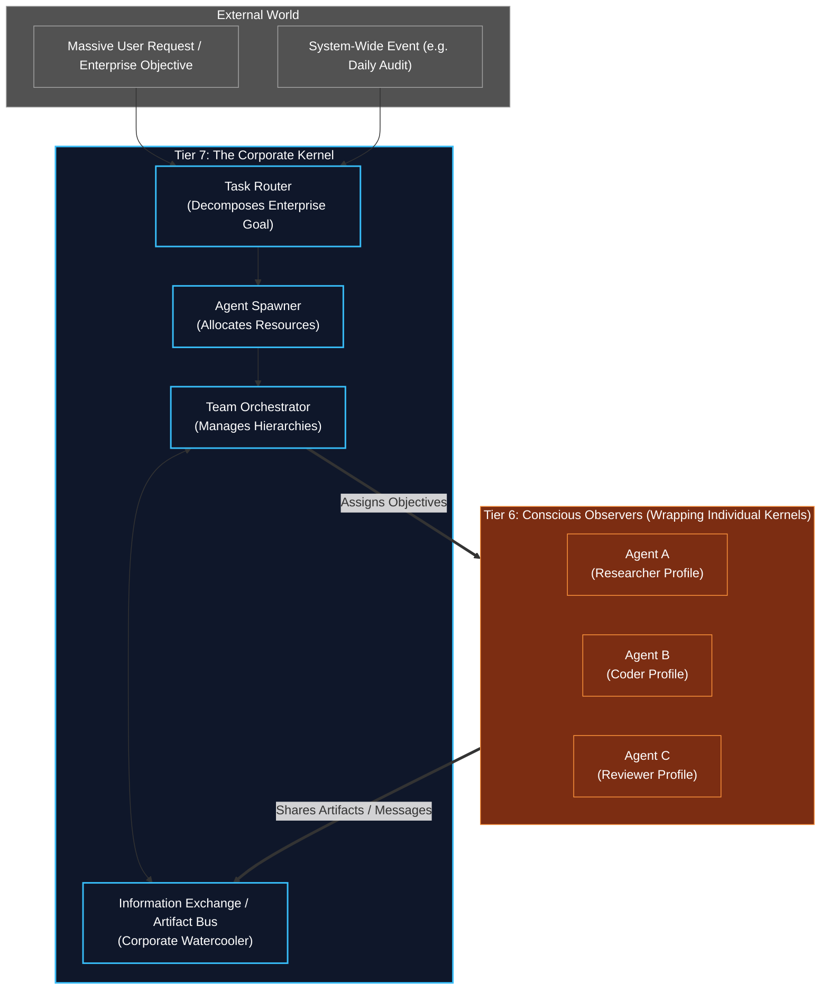

# Tier 7: The Corporate Kernel (Macro-Orchestrator)

## Overview
Sitting entirely above the individual Human Kernel (Tiers 0-6) is **Tier 7: The Corporate Kernel**.

While Tier 6 represents the "Conscious Observer" and Tier 5 represents the "Ego" of a single employee, Tier 7 represents the "Corporation" itself. It does not perform tasks directly. Instead, it manages the workforce. It is responsible for dynamically scaling the system, assembling teams of Human Kernels, routing tasks to the right specialists, and enforcing corporate-wide governance.

**CRITICAL RULE**: Tier 7 manages multiple Tier 6 (Conscious Observer) instances, each wrapping a complete Human Kernel stack (T1-T6). It does NOT reach into the internals of any individual kernel. Communication is strictly through the Tier 6 status reporting interface and the Artifact Bus.

## Architecture & Flow

## Dependency Graph

| Tier | Imports From | Role |
|------|-------------|------|
| **T7** | T0 (schemas, config), T6 (status API) | Manages workforce of T6 instances |
| **T6** | T0, T1, T5 | Conscious Observer — metacognitive oversight |
| **T5** | T0, T4 | Autonomous Ego — lifecycle, identity |
| **T4** | T0, T1, T3 | Execution Engine — OODA loop |
| **T3** | T0, T1, T2 | Complex Orchestration — DAG synthesis |
| **T2** | T0, T1 | Cognitive Engines — reasoning, curiosity |
| **T1** | T0 | Core Processing — classification, intent |
| **T0** | None | Foundation — schemas, config, hardware |

## Function Registry

| Module | Function | Signature | Purpose |
|--------|----------|-----------|---------|
| `spawner_and_router` | `route_and_spawn` | `async (master_goal: MasterObjective) -> list[AgentHandle]` | Top-level task routing + agent spawning |
| `spawner_and_router` | `evaluate_objective_scale` | `(master_goal) -> ScaleAssessment` | Assess complexity and domain breadth |
| `spawner_and_router` | `route_domains` | `(assessment: ScaleAssessment) -> list[DomainChunk]` | Split objective by role domain |
| `spawner_and_router` | `query_profiles` | `async (domain_chunks, vault_client) -> list[CognitiveProfile]` | Retrieve matching profiles from Vault |
| `spawner_and_router` | `check_hardware_resources` | `async (required_agents: int) -> ResourceAvailability` | RAM/CPU/GPU capacity check |
| `spawner_and_router` | `spawn_agents` | `async (profiles, objectives) -> list[AgentHandle]` | Initialize Tier 6 Conscious Observer instances |
| `team_orchestration` | `orchestrate_team` | `async (agent_handles, master_goal) -> TeamResult` | Top-level multi-agent coordination |
| `team_orchestration` | `publish_artifact` | `async (agent_id, topic, artifact) -> None` | Push artifact to bus topic |
| `team_orchestration` | `subscribe_to_topic` | `async (agent_id, topic) -> Subscription` | Register for artifact topic |
| `team_orchestration` | `consume_artifacts` | `async (subscription) -> list[Artifact]` | Pull pending artifacts from bus |
| `team_orchestration` | `track_team_progress` | `async (agent_handles) -> TeamProgressReport` | Aggregate global progress |
| `team_orchestration` | `signal_agent_wake` | `async (agent_handle, reason) -> None` | Wake a sleeping/suspended agent |
| `team_orchestration` | `sequence_workflow` | `async (completion_event, workflow_rules) -> None` | Chain agent handoffs (Coder -> Reviewer) |
