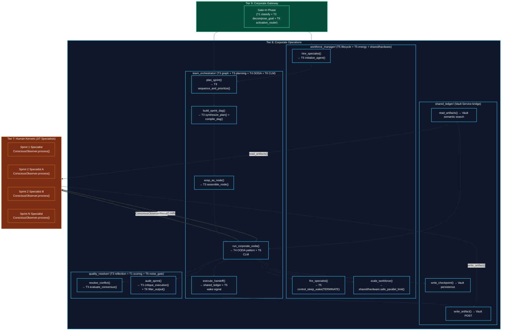
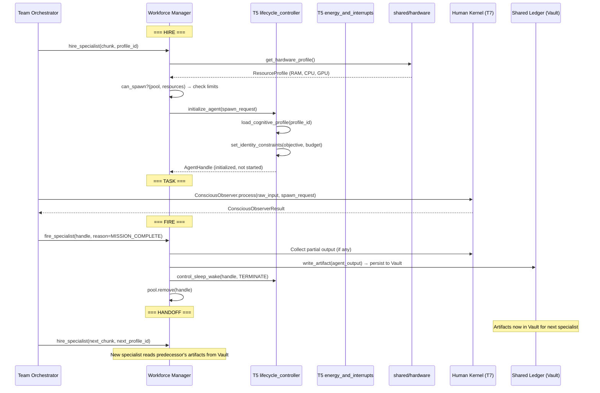
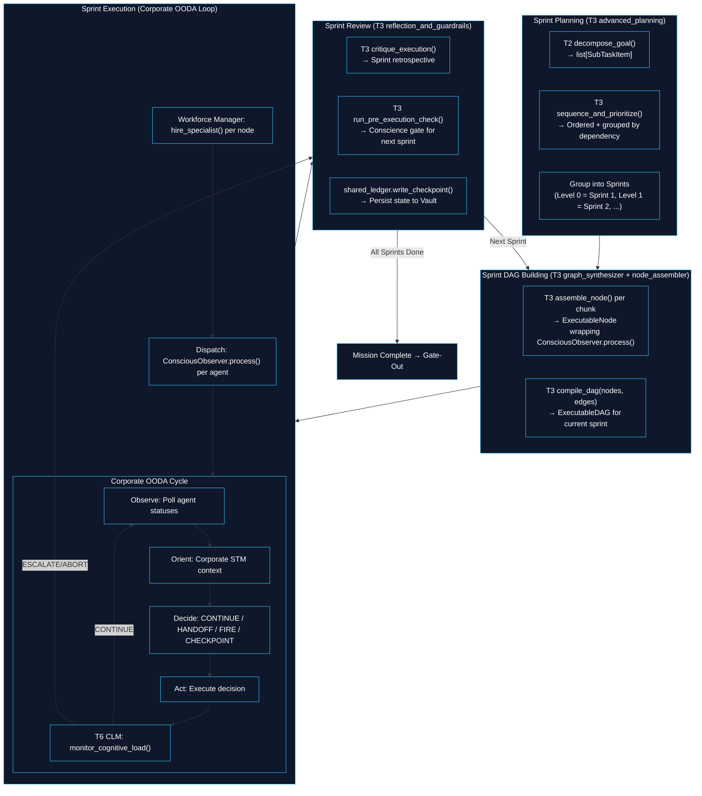
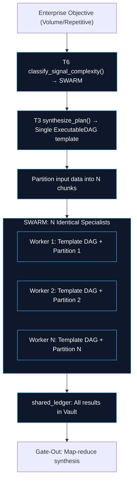
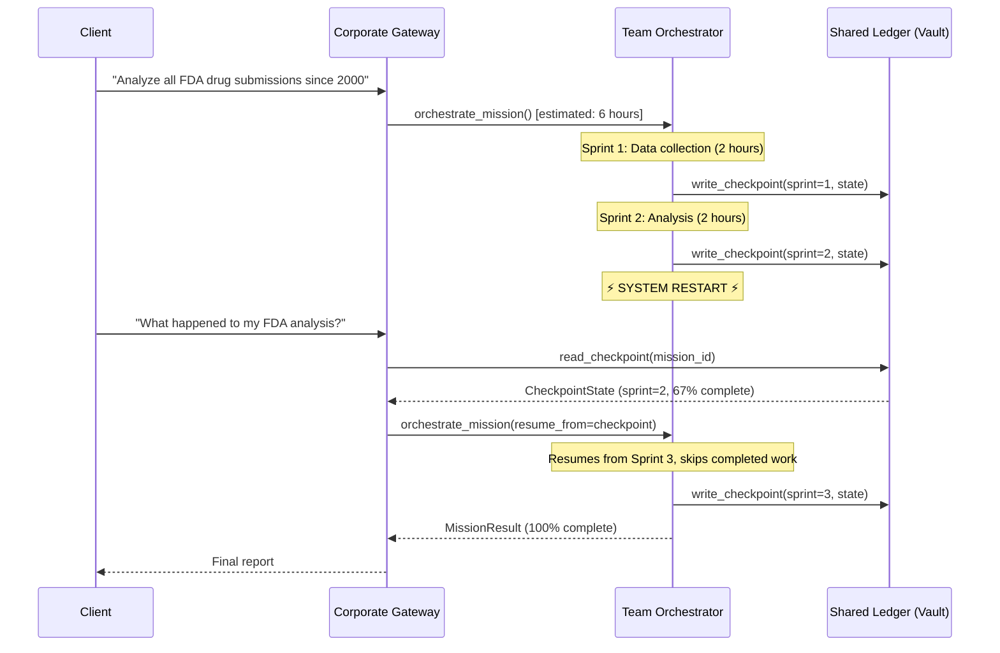

# Tier 8: Corporate Operations — v2 (Composition-First Architecture)

## Overview

**Tier 8** is the operational backbone of the Corporation Kernel. It manages the workforce of Human Kernels (Tier 7) through **composition of existing lower-tier modules**, not reimplementation.

**Design Principle**: _"Reuse existing functions in the lower tier and make them more complex without creating new ones."_ Every Tier 8 module is a **thin orchestration layer** that composes functions from Tiers 1-6 at corporate scale. No kernel logic is duplicated.

**CRITICAL RULE**: Tier 8 never reaches into the internals of any Human Kernel. It communicates with Tier 7 exclusively through `ConsciousObserver.process()` and `ConsciousObserverResult`. Each Human Kernel is a black box with a standardized Gate-In / Gate-Out interface.

**Location**: `kernel/` — four modules, each following the standard `engine.py` / `types.py` / `__init__.py` pattern.

---

## Modules (v1 → v2 Consolidation)

The v1 architecture had **6 modules** (Mission Decomposer, Workforce Manager, Mission Router, Team Orchestrator, Artifact Exchange, Conflict Resolver). The v2 consolidates to **4 modules** by absorbing redundant modules into compositions of existing lower-tier functions.

| v2 Module | What It Absorbed | Lower-Tier Composition |
|-----------|-----------------|----------------------|
| **workforce_manager** | + Mission Router (skill matching) | T5 lifecycle_controller, T5 energy_and_interrupts, T6 self_model, T1 scoring, shared/hardware |
| **team_orchestrator** | + Sprint Manager (project methodology) | T3 graph_synthesizer, T3 advanced_planning, T3 node_assembler, T4 OODA pattern, T4 ShortTermMemory, T6 cognitive_load_monitor |
| **shared_ledger** | Replaces Artifact Exchange + Memory Cortex | Vault Service API (thin bridge) |
| **quality_resolver** | + Conflict Resolver | T3 reflection_and_guardrails, T1 scoring, T2 attention_and_plausibility, T6 noise_gate, T6 hallucination_monitor |

**What was removed entirely**:
- ~~Mission Decomposer~~ → T2 `decompose_goal()` called directly by Corporate Gateway
- ~~Mission Router~~ → T6 `activation_router` + T1 `scoring` folded into Workforce Manager
- ~~Artifact Exchange~~ → Replaced by Vault Service (shared_ledger is a thin bridge)
- ~~Conflict Resolver~~ → T3 `evaluate_consensus()` + T1 `scoring` folded into Quality Resolver

---

## Complete Lower-Tier Reuse Map

This table shows **every existing function** reused by Tier 8, proving that corporate operations are compositions, not reimplementations.

| Existing Function | Source | Corporate Reuse | Replaces (v1) |
|-------------------|--------|-----------------|---------------|
| `classify()` | T1 classification | Domain detection for mission chunks | Mission Decomposer domain analysis |
| `score()` | T1 scoring | Skill matching, conflict evaluation, proposal ranking | Mission Router + Conflict Resolver scoring |
| `validate()` | T1 validation | Corporate input validation | (new) |
| `run_cognitive_filters()` | T2 attention_and_plausibility | Contradiction detection between agent outputs | Conflict Resolver detection |
| `decompose_goal()` | T2 task_decomposition | Mission decomposition into chunks | **Entire Mission Decomposer module** |
| `analyze_goal_complexity()` | T2 task_decomposition | Scope assessment (SOLO/TEAM/SWARM sizing) | Mission Decomposer scope logic |
| `synthesize_plan()` | T3 graph_synthesizer | Sprint workflow DAG building | Team Orchestrator DAG construction |
| `compile_dag()` | T3 graph_synthesizer | Compile sprint nodes into executable DAG | Team Orchestrator DAG compilation |
| `sequence_and_prioritize()` | T3 advanced_planning | Sprint planning, parallel/sequential ordering | **Sprint Manager (new concept)** |
| `inject_progress_tracker()` | T3 advanced_planning | Milestone tracking per sprint | Corporate Monitor progress |
| `bind_tools()` | T3 advanced_planning | Bind MCP tools to sprint nodes | Team Orchestrator tool binding |
| `assemble_node()` | T3 node_assembler | Wrap each agent mission as a composable DAG node | **Node-based design (new concept)** |
| `wrap_in_standard_io()` | T3 node_assembler | Ensure corporate nodes use Signal → Result protocol | Node-based design |
| `evaluate_consensus()` | T3 reflection_and_guardrails | Resolve conflicts between agent outputs | **Entire Conflict Resolver module** |
| `run_pre_execution_check()` | T3 reflection_and_guardrails | Conscience gate before sprint dispatch | Team Orchestrator pre-dispatch |
| `critique_execution()` | T3 reflection_and_guardrails | Post-sprint retrospective, quality evaluation | Quality Resolver sprint review |
| `run_ooda_cycle()` pattern | T4 ooda_loop | Corporate monitoring loop (observe agents → orient → decide → act) | Team Orchestrator monitoring |
| `ShortTermMemory` | T4 short_term_memory | Corporate working memory (sprint state, events, entity cache) | Team Orchestrator state tracking |
| `initialize_agent()` | T5 lifecycle_controller | JIT agent genesis | Workforce Manager spawn |
| `load_cognitive_profile()` | T5 lifecycle_controller | Specialist profile loading from Vault | Workforce Manager hire |
| `set_identity_constraints()` | T5 lifecycle_controller | Agent identity + budget constraints | Workforce Manager identity |
| `control_sleep_wake()` | T5 lifecycle_controller | Agent lifecycle signals (TERMINATE=fire, SLEEP=idle, WAKE=resume) | Workforce Manager fire/wake |
| `track_budget()` | T5 energy_and_interrupts | Corporate budget tracking across all agents | Corporate Monitor budget |
| `check_budget_exhaustion()` | T5 energy_and_interrupts | Detect when mission/agent exceeds budget | Workforce Manager fire decision |
| `handle_interrupt()` | T5 energy_and_interrupts | Client interrupt handling during execution | Corporate Gateway interrupt |
| `classify_signal_complexity()` | T6 activation_router | Scaling mode selection (TRIVIAL→SOLO, COMPLEX→TEAM, etc.) | **Entire Strategic Planner module** |
| `compute_activation_map()` | T6 activation_router | Which corporate modules to activate for this mission | Strategic Planner approach |
| `assess_capability()` | T6 self_model | Corporate capacity self-assessment (can we handle this?) | Strategic Planner capability |
| `monitor_cognitive_load()` | T6 cognitive_load_monitor | Stall/loop/drift detection at corporate level | **Entire Corporate Monitor module** |
| `detect_stall()` | T6 cognitive_load_monitor | Detect stalled agents or sprints | Corporate Monitor stall detection |
| `detect_goal_drift()` | T6 cognitive_load_monitor | Detect when agents drift from objective | Corporate Monitor quality |
| `filter_output()` | T6 noise_gate | Corporate quality gate on agent outputs | Quality Resolver filtering |
| `verify_grounding()` | T6 hallucination_monitor | Verify agent output grounding | Quality Resolver grounding |
| `ConsciousObserver.process()` | T7 conscious_observer | Human Kernel interface (THE black box API) | Workforce Manager + Team Orchestrator |

**Count: 33 existing functions reused** — zero core logic reimplemented.

---

## Architecture & Flow



---

## Dependency Graph

| Tier | Imports From | Never Imports |
|------|-------------|---------------|
| **T9** | T0, T1, T2, T6, **T8** | T3, T4, T5, T7 (accessed via T8) |
| **T8** | T0, T1, T2, T3, T4, T5, T6, T7 | T9 (never reverse) |
| **T7** | T0, T1-T6 | T8, T9 (never upward) |

---

## Configuration Requirements

All settings in `shared/config.py` under `CorporateSettings`:

```python
class CorporateSettings(BaseModel):
    """Tier 8-9 Corporation Kernel settings."""

    # --- Workforce Manager ---
    max_concurrent_agents: int = 100
    agent_spawn_timeout_ms: float = 5000.0
    agent_idle_timeout_ms: float = 30000.0
    agent_fire_quality_threshold: float = 0.3
    spawn_batch_size: int = 10

    # --- Team Orchestrator ---
    sprint_max_parallel_tasks: int = 10
    sprint_review_enabled: bool = True
    corporate_ooda_poll_interval_ms: float = 1000.0
    handoff_timeout_ms: float = 60000.0
    max_sprints_per_mission: int = 20
    checkpoint_interval_sprints: int = 1

    # --- Shared Ledger ---
    artifact_max_size_bytes: int = 10_485_760
    artifact_ttl_seconds: int = 86400
    checkpoint_ttl_seconds: int = 604800       # 7 days
    session_ttl_seconds: int = 86400           # 24 hours

    # --- Quality Resolver ---
    conflict_similarity_threshold: float = 0.7
    consensus_quorum_pct: float = 0.5
    arbitration_timeout_ms: float = 30000.0
    quality_gate_threshold: float = 0.6

    # --- Hardware-Aware Scaling ---
    high_pressure_threshold: float = 0.8
    swarm_min_agents: int = 10
    swarm_max_agents_per_core: int = 2
```

---

## Module 1: Workforce Manager

**Location**: `kernel/workforce_manager/`

### Overview

The Workforce Manager handles the full lifecycle of Human Kernels through **JIT specialist hiring**. Unlike traditional agent pools with general-purpose agents, the Workforce Manager hires domain specialists on-demand, gets the job done, fires them, and hires the next specialist.

**Composition**: T5 `lifecycle_controller` (genesis/termination), T5 `energy_and_interrupts` (budget), T6 `self_model` (capability), T1 `scoring` (skill matching), `shared/hardware` (resource limits).

### JIT Specialist Lifecycle



### Function Decomposition

#### `hire_specialist`
- **Signature**: `async hire_specialist(chunk: MissionChunk, profile_id: str, pool: WorkforcePool, kit: InferenceKit | None = None) -> AgentHandle`
- **Description**: JIT hiring of a domain specialist. Checks hardware resources via `shared/hardware.get_hardware_profile()`, then delegates to T5 `initialize_agent()` + `load_cognitive_profile()` + `set_identity_constraints()`. The agent is created with a specific mission, budget, and identity — NOT a general-purpose agent.
- **Composes**: T5 `initialize_agent()`, T5 `load_cognitive_profile()`, T5 `set_identity_constraints()`, `shared/hardware`

#### `fire_specialist`
- **Signature**: `async fire_specialist(handle: AgentHandle, reason: TerminationReason, pool: WorkforcePool) -> TerminationReport`
- **Description**: Graceful termination. Collects any partial output, persists work artifacts to Vault via Shared Ledger, sends TERMINATE signal via T5 `control_sleep_wake()`, removes from pool. Freed resources are immediately available for next specialist.
- **Composes**: T5 `control_sleep_wake(TERMINATE)`, `shared_ledger.write_artifact()`

#### `hire_batch`
- **Signature**: `async hire_batch(chunks: list[MissionChunk], profile_ids: list[str], pool: WorkforcePool, kit: InferenceKit | None = None) -> list[AgentHandle]`
- **Description**: SWARM mode batch hiring. Spawns N identical specialists in batches of `config.spawn_batch_size`, checking hardware pressure between batches via `shared/hardware.memory_pressure()`. If pressure exceeds threshold, queues remaining for sequential spawning.
- **Composes**: `hire_specialist()` in parallel batches, `shared/hardware.memory_pressure()`

#### `scale_workforce`
- **Signature**: `async scale_workforce(pool: WorkforcePool, pending_chunks: list[MissionChunk], performance: list[PerformanceSnapshot]) -> list[ScaleDecision]`
- **Description**: Dynamic scaling decisions. Checks: pending work queue, agent utilization, hardware resources, budget remaining. Returns decisions: HIRE_MORE (queue growing), FIRE_IDLE (agent idle > threshold), REASSIGN (priority shift), HOLD (stable). Uses T5 `check_budget_exhaustion()` for budget awareness.
- **Composes**: `shared/hardware.safe_parallel_limit()`, T5 `check_budget_exhaustion()`, config thresholds

#### `match_specialist`
- **Signature**: `match_specialist(chunk: MissionChunk, available_profiles: list[CognitiveProfile]) -> ProfileMatch`
- **Description**: Finds the best specialist profile for a mission chunk. Uses T1 `scoring.score()` to evaluate skill overlap between chunk requirements and profile capabilities. Returns the highest-scoring match. If no match exceeds threshold, returns `requires_new_profile = True`.
- **Composes**: T1 `scoring.score()` for skill evaluation

#### `evaluate_performance`
- **Signature**: `evaluate_performance(handle: AgentHandle, result: ConsciousObserverResult) -> PerformanceSnapshot`
- **Description**: Extracts performance metrics from a Human Kernel's Gate-Out result. Quality score (from noise gate), confidence (from calibrator), grounding rate (from hallucination monitor), latency, cost. Pure extraction — no new computation logic.
- **Composes**: Direct field access on `ConsciousObserverResult`

### Types

```python
class MissionChunk(BaseModel):
    """A discrete, agent-assignable unit of work."""
    chunk_id: str
    parent_objective_id: str
    domain: str                         # Skill domain (e.g., "backend_development")
    sub_objective: str                  # What this specialist should accomplish
    required_skills: list[str]          # Maps to CognitiveProfile.skills
    required_tools: list[str]           # MCP tool categories needed
    depends_on: list[str]              # chunk_ids that must complete first
    sprint_number: int                  # Which sprint this chunk belongs to
    priority: int                       # 0 = highest
    token_budget: int
    cost_budget: float
    time_budget_ms: float
    is_parallelizable: bool
    pipeline_template_id: str | None   # For SWARM: shared pipeline reference
    input_data: dict[str, Any] | None  # For SWARM: partition-specific data
    predecessor_artifact_ids: list[str] # Vault artifact IDs from prior sprints

class AgentHandle(BaseModel):
    """Reference to a hired specialist."""
    agent_id: str
    profile_id: str
    role_name: str                      # e.g., "Backend Developer"
    chunk_id: str
    status: AgentStatus
    hired_utc: str
    quality_score: float
    total_cost: float

class AgentStatus(StrEnum):
    INITIALIZING = "initializing"
    ACTIVE = "active"
    COMPLETED = "completed"
    FAILED = "failed"
    TERMINATED = "terminated"

class WorkforcePool(BaseModel):
    """Registry of all active and terminated specialists."""
    pool_id: str
    mission_id: str
    agents: dict[str, AgentHandle]     # agent_id → handle
    total_hired: int
    total_fired: int
    total_cost: float
    budget_remaining: float

class TerminationReason(StrEnum):
    MISSION_COMPLETE = "mission_complete"    # Normal: task done
    IDLE_TIMEOUT = "idle_timeout"            # Idle too long
    LOW_QUALITY = "low_quality"              # Below threshold
    BUDGET_EXCEEDED = "budget_exceeded"      # Over budget
    STALLED = "stalled"                      # CLM detected stall
    REPLACED = "replaced"                    # Better specialist available
    MISSION_ABORTED = "mission_aborted"      # Client cancelled

class ScaleDecision(BaseModel):
    action: ScaleAction
    target_agent_id: str | None
    target_chunk_id: str | None
    reason: str

class ScaleAction(StrEnum):
    HIRE_MORE = "hire_more"
    FIRE_IDLE = "fire_idle"
    REASSIGN = "reassign"
    HOLD = "hold"

class ProfileMatch(BaseModel):
    agent_profile_id: str
    chunk_id: str
    skill_score: float                  # From T1 scoring
    composite_score: float
    requires_new_profile: bool

class PerformanceSnapshot(BaseModel):
    agent_id: str
    quality_score: float               # From noise gate
    confidence: float                  # From calibrator
    grounding_rate: float              # From hallucination monitor
    latency_ms: float
    cost: float
```

---

## Module 2: Team Orchestrator

**Location**: `kernel/team_orchestrator/`

### Overview

The Team Orchestrator is the **project manager** of the corporation. It uses **sprint-based execution** — a project management methodology inspired by Scrum — where work is organized into sprints, each sprint containing a set of parallelizable tasks.

**Key Innovation — Corporate OODA Loop**: The Team Orchestrator runs a monitoring loop modeled after T4's OODA Loop, but at corporate scale:
- **Observe**: Poll agent statuses via heartbeats
- **Orient**: Contextualize via corporate ShortTermMemory (sprint state, events)
- **Decide**: CONTINUE / HANDOFF / FIRE_AND_REPLACE / CHECKPOINT / ABORT
- **Act**: Execute the decision (fire agent, spawn replacement, advance sprint)

After every cycle, T6 `cognitive_load_monitor.monitor_cognitive_load()` checks for stalls, loops, and goal drift at the corporate level.

**Composition**: T3 `graph_synthesizer` (DAG), T3 `advanced_planning` (sprints), T3 `node_assembler` (nodes), T4 OODA pattern (loop), T4 `ShortTermMemory` (state), T6 `cognitive_load_monitor` (health).

### Sprint-Based Execution Flow



### Function Decomposition

#### `orchestrate_mission`
- **Signature**: `async orchestrate_mission(chunks: list[MissionChunk], pool: WorkforcePool, ledger: SharedLedgerClient, kit: InferenceKit | None = None) -> MissionResult`
- **Description**: Top-level orchestration. Groups chunks into sprints via T3 `sequence_and_prioritize()`, then executes each sprint sequentially. Within each sprint, tasks run in parallel. After each sprint, runs review and checkpoint. Returns aggregated results from all sprints.
- **Composes**: `plan_sprints()`, `execute_sprint()`, `review_sprint()`, `shared_ledger.write_checkpoint()`

#### `plan_sprints`
- **Signature**: `async plan_sprints(chunks: list[MissionChunk], kit: InferenceKit | None = None) -> list[Sprint]`
- **Description**: Groups mission chunks into sprints by dependency level. Uses T3 `sequence_and_prioritize()` for topological ordering. Sprint 1 = chunks with no dependencies (parallel). Sprint 2 = chunks depending on Sprint 1 outputs (parallel). Etc.
- **Composes**: T3 `advanced_planning.sequence_and_prioritize()`, T2 `decompose_goal()` (if further decomposition needed)

#### `build_sprint_dag`
- **Signature**: `build_sprint_dag(sprint: Sprint) -> ExecutableDAG`
- **Description**: Builds a DAG for a single sprint. Each chunk becomes an `ExecutableNode` via T3 `assemble_node()`, wrapping `ConsciousObserver.process()` as the action callable. Nodes within the sprint run in parallel (parallel group). Dependencies to prior sprints are handled via Vault artifacts (not DAG edges).
- **Composes**: T3 `node_assembler.assemble_node()`, T3 `graph_synthesizer.compile_dag()`

#### `execute_sprint`
- **Signature**: `async execute_sprint(sprint: Sprint, dag: ExecutableDAG, pool: WorkforcePool, ledger: SharedLedgerClient, kit: InferenceKit | None = None) -> SprintResult`
- **Description**: Hires specialists, dispatches them, then runs the Corporate OODA Loop until all nodes complete or abort. The OODA loop polls agent statuses, handles events (completion, failure, stall), sequences handoffs, and checks corporate cognitive load via T6 CLM.
- **Composes**: `workforce_manager.hire_specialist()`, T7 `ConsciousObserver.process()`, `run_corporate_ooda()`, T5 `energy_and_interrupts.track_budget()`

#### `run_corporate_ooda`
- **Signature**: `async run_corporate_ooda(dag: ExecutableDAG, pool: WorkforcePool, stm: ShortTermMemory, ledger: SharedLedgerClient, kit: InferenceKit | None = None) -> CorporateOODAResult`
- **Description**: The corporate monitoring loop, modeled after T4's OODA pattern:
  - **Observe**: Poll agent heartbeats, collect completion/failure events, push to corporate STM
  - **Orient**: Contextualize events using STM (which agents completed, which blocked, progress %)
  - **Decide**: Based on oriented state: CONTINUE (keep waiting), HANDOFF (advance workflow), FIRE_AND_REPLACE (agent failed/stalled), CHECKPOINT (periodic save), ABORT (mission failed)
  - **Act**: Execute the decision
  - **CLM Check**: T6 `monitor_cognitive_load()` after every cycle for stall/loop/drift detection
- **Composes**: T4 `ShortTermMemory`, T6 `cognitive_load_monitor.monitor_cognitive_load()`, T6 `detect_stall()`, T6 `detect_goal_drift()`

#### `execute_handoff`
- **Signature**: `async execute_handoff(completed_chunk_id: str, sprint: Sprint, pool: WorkforcePool, ledger: SharedLedgerClient) -> list[str]`
- **Description**: When a specialist completes a task: (1) persist artifacts to Vault via Shared Ledger, (2) fire the specialist, (3) check if downstream chunks in the SAME sprint are unblocked. Returns list of newly-dispatchable chunk_ids.
- **Composes**: `shared_ledger.write_artifact()`, `workforce_manager.fire_specialist()`

#### `review_sprint`
- **Signature**: `async review_sprint(sprint: Sprint, result: SprintResult, kit: InferenceKit | None = None) -> SprintReview`
- **Description**: Post-sprint retrospective. Uses T3 `reflection_and_guardrails.critique_execution()` to evaluate: was the sprint objective met? What quality issues arose? Are there new tasks to add to the backlog? Before the next sprint, uses T3 `run_pre_execution_check()` as a conscience gate.
- **Composes**: T3 `critique_execution()`, T3 `run_pre_execution_check()`, `quality_resolver.audit_sprint()`

### Node-Based Design

Every specialist's task is wrapped as a composable node using T3 `node_assembler`:

```python
# Each MissionChunk becomes an ExecutableNode
for chunk in sprint.chunks:
    node = assemble_node(
        instruction=ActionInstruction(
            task_id=chunk.chunk_id,
            description=chunk.sub_objective,
            action_type="conscious_observer_process",
            parameters={
                "profile_id": chunk.matched_profile_id,
                "token_budget": chunk.token_budget,
                "predecessor_artifacts": chunk.predecessor_artifact_ids,
            },
        ),
        config=NodeConfig(
            timeout_ms=chunk.time_budget_ms,
            retry_count=settings.corporate.max_retry_on_failure,
        ),
        kit=kit,
    )
    nodes.append(node)

# Compose into sprint DAG
dag = compile_dag(
    nodes=nodes,
    edges=edges,  # Intra-sprint dependencies (usually none — parallel)
    objective=sprint.sprint_objective,
)
```

### Types

```python
class Sprint(BaseModel):
    """A group of parallel tasks with a shared dependency level."""
    sprint_id: str
    sprint_number: int
    mission_id: str
    objective: str
    chunks: list[MissionChunk]         # All parallelizable within this sprint
    depends_on_sprint_ids: list[str]   # Prior sprints that must complete
    estimated_duration_ms: float

class SprintResult(BaseModel):
    """Outcome of a single sprint."""
    sprint_id: str
    completed_chunks: list[str]        # chunk_ids
    failed_chunks: list[str]
    agent_results: dict[str, ConsciousObserverResult]  # agent_id → result
    artifacts_produced: list[str]      # Vault artifact IDs
    total_cost: float
    duration_ms: float
    was_checkpointed: bool

class SprintReview(BaseModel):
    """Post-sprint retrospective."""
    sprint_id: str
    quality_assessment: str            # From T3 critique_execution()
    issues_found: list[str]
    new_backlog_items: list[str]       # Discovered work
    next_sprint_approved: bool         # From T3 run_pre_execution_check()

class MissionResult(BaseModel):
    """Aggregated outcome from all sprints."""
    mission_id: str
    total_sprints: int
    completed_sprints: int
    all_artifacts: list[str]           # All Vault artifact IDs
    all_agent_results: dict[str, ConsciousObserverResult]
    total_cost: float
    total_duration_ms: float
    completion_pct: float
    final_review: SprintReview | None

class CorporateOODAResult(BaseModel):
    """Result of the corporate monitoring loop."""
    total_cycles: int
    termination_reason: str            # "all_complete" / "escalated" / "aborted" / "budget_exhausted"
    events_processed: int
    handoffs_executed: int
    agents_fired: int
    agents_hired: int
    checkpoints_saved: int
```

---

## Module 3: Shared Ledger

**Location**: `kernel/shared_ledger/`

### Overview

The Shared Ledger is a **thin bridge** to the Vault Service. It replaces both the v1 Artifact Exchange (inter-agent pub/sub) and Memory Cortex (session persistence) with direct Vault usage. Agents share data, artifacts, and memory through Vault's persistent storage with `team_id`/`mission_id` metadata and semantic search via pgvector.

**Why Vault instead of custom pub/sub**:
- **Persistence**: Artifacts survive agent restarts and system failures
- **Searchability**: pgvector enables semantic search across all artifacts
- **Audit trail**: Vault's SHA-256 hash chain provides tamper-proof history
- **Simplicity**: No new infrastructure — reuses existing microservice
- **Long-running support**: Checkpoints persist for days/weeks

### Function Decomposition

#### `write_artifact`
- **Signature**: `async write_artifact(agent_id: str, team_id: str, content: str, metadata: ArtifactMetadata) -> str`
- **Returns**: Artifact ID
- **Description**: Persist an agent's work output to Vault. Metadata includes `team_id`, `mission_id`, `sprint_id`, `chunk_id`, `content_type`, `topic`. Indexed for semantic search. Returns artifact ID for reference by downstream specialists.
- **Composes**: Vault Service HTTP API (`POST /vault/persistence/sessions`)

#### `read_artifacts`
- **Signature**: `async read_artifacts(team_id: str, query: str | None = None, topic: str | None = None, limit: int | None = None) -> list[VaultArtifact]`
- **Description**: Retrieve artifacts for a team. Supports two modes: (1) topic-based filtering (all artifacts with matching topic), (2) semantic search (query text matched via pgvector). Used by agents to read predecessor's work before starting their task.
- **Composes**: Vault Service HTTP API (`GET /vault/persistence/query`)

#### `write_checkpoint`
- **Signature**: `async write_checkpoint(mission_id: str, state: CheckpointState) -> str`
- **Returns**: Checkpoint ID
- **Description**: Persist mission state for long-running task resumability. Stores: current sprint number, DAG state, pool state, artifacts produced, budget consumed. Called after each sprint or at configured intervals.
- **Composes**: Vault Service HTTP API

#### `read_checkpoint`
- **Signature**: `async read_checkpoint(mission_id: str) -> CheckpointState | None`
- **Description**: Load the last checkpoint for a mission. Returns `None` if no checkpoint exists (fresh start). Used by Corporate Gateway to resume interrupted long-running missions.
- **Composes**: Vault Service HTTP API

#### `write_session`
- **Signature**: `async write_session(session_id: str, state: SessionState) -> None`
- **Description**: Persist client conversation session to Vault. Called at the end of every interaction for conversation continuity.
- **Composes**: Vault Service HTTP API

#### `read_session`
- **Signature**: `async read_session(session_id: str) -> SessionState | None`
- **Description**: Load client session. Returns `None` if session doesn't exist or expired.
- **Composes**: Vault Service HTTP API

#### `recall_memory`
- **Signature**: `async recall_memory(client_id: str, query: str, limit: int | None = None) -> list[VaultArtifact]`
- **Description**: Semantic search across a client's history. Uses pgvector to find relevant past interactions, mission results, and artifacts. NOT full context reload — precision retrieval.
- **Composes**: Vault Service HTTP API (semantic search)

### Types

```python
class ArtifactMetadata(BaseModel):
    """Metadata for a Vault-stored artifact."""
    team_id: str
    mission_id: str
    sprint_id: str | None
    chunk_id: str | None
    agent_id: str
    content_type: str                   # "code" / "analysis" / "report" / "data" / "review"
    topic: str                          # Semantic category
    summary: str                        # Brief description for search indexing

class VaultArtifact(BaseModel):
    """An artifact retrieved from Vault."""
    artifact_id: str
    content: str
    metadata: ArtifactMetadata
    created_utc: str

class CheckpointState(BaseModel):
    """Serializable mission state for persistence."""
    mission_id: str
    current_sprint: int
    total_sprints: int
    completed_chunk_ids: list[str]
    failed_chunk_ids: list[str]
    pool_snapshot: dict[str, Any]       # Serialized WorkforcePool
    artifact_ids: list[str]
    total_cost: float
    elapsed_ms: float
    checkpointed_utc: str

class SessionState(BaseModel):
    """Client conversation session."""
    session_id: str
    client_id: str
    conversation_history: list[ConversationTurn]
    active_mission_id: str | None
    compressed_summary: str | None      # Summary of old turns
    last_interaction_utc: str
    turn_count: int

class ConversationTurn(BaseModel):
    """A single interaction in a conversation."""
    turn_id: str
    role: str                           # "client" / "corporation"
    content: str
    intent: str | None
    timestamp_utc: str
```

---

## Module 4: Quality Resolver

**Location**: `kernel/quality_resolver/`

### Overview

The Quality Resolver handles conflict resolution and quality assurance across the corporation. It detects contradictions between agent outputs, applies resolution strategies, and audits sprint quality.

**Composition**: T3 `reflection_and_guardrails.evaluate_consensus()` (consensus), T1 `scoring.score()` (evaluation), T2 `attention_and_plausibility.run_cognitive_filters()` (contradiction detection), T6 `noise_gate.filter_output()` (quality gate), T6 `hallucination_monitor.verify_grounding()` (grounding).

### Conflict Resolution Strategy Cascade

```
1. T2 attention_and_plausibility.run_cognitive_filters()
   → Detect contradictions between agent outputs

2. T3 reflection_and_guardrails.evaluate_consensus()
   → Attempt consensus (all agree)

3. T1 scoring.score() with confidence weighting
   → Weighted vote (high-confidence agents win)

4. Spawn Judge specialist (via Workforce Manager)
   → Arbitration by a reviewer-profile agent

5. Swarm Manager HTTP API
   → Escalate to Human-in-the-Loop
```

Each level is attempted only if the previous level fails. No new resolution logic is written — it's a cascade of existing functions.

### Function Decomposition

#### `detect_conflicts`
- **Signature**: `async detect_conflicts(artifacts: list[VaultArtifact], kit: InferenceKit | None = None) -> list[Conflict]`
- **Description**: Scans agent outputs for contradictions. Uses T2 `attention_and_plausibility.run_cognitive_filters()` to detect semantic contradictions. Returns list of detected conflicts with severity.
- **Composes**: T2 `run_cognitive_filters()`

#### `resolve_conflict`
- **Signature**: `async resolve_conflict(conflict: Conflict, pool: WorkforcePool, kit: InferenceKit | None = None) -> Resolution`
- **Description**: Applies the cascade: consensus → weighted vote → arbitration → escalation. Each level delegates to an existing lower-tier function.
- **Composes**: T3 `evaluate_consensus()`, T1 `scoring.score()`, `workforce_manager.hire_specialist()` (for judge)

#### `audit_sprint`
- **Signature**: `async audit_sprint(sprint_result: SprintResult, kit: InferenceKit | None = None) -> QualityAudit`
- **Description**: Corporate quality assessment of a sprint's output. Applies T6 `noise_gate.filter_output()` to each agent result and T6 `hallucination_monitor.verify_grounding()` for fact-checking. Aggregates into a corporate quality score.
- **Composes**: T6 `noise_gate.filter_output()`, T6 `hallucination_monitor.verify_grounding()`, T6 `confidence_calibrator.run_confidence_calibration()`

#### `audit_final`
- **Signature**: `async audit_final(mission_result: MissionResult, kit: InferenceKit | None = None) -> FinalQualityReport`
- **Description**: End-of-mission quality audit. Runs `detect_conflicts()` across ALL artifacts, resolves remaining conflicts, and produces a final quality report with completeness assessment, confidence map, and gap analysis.
- **Composes**: `detect_conflicts()`, `resolve_conflict()`, T3 `critique_execution()`

### Types

```python
class Conflict(BaseModel):
    artifact_a_id: str
    artifact_b_id: str
    description: str
    severity: str                       # "low" / "medium" / "high" / "critical"

class Resolution(BaseModel):
    conflict_id: str
    strategy_used: str                  # "consensus" / "weighted_vote" / "arbitration" / "escalation"
    winning_artifact_id: str
    justification: str
    confidence: float

class QualityAudit(BaseModel):
    sprint_id: str
    avg_quality: float                  # From noise gate
    avg_confidence: float               # From calibrator
    avg_grounding: float                # From hallucination monitor
    issues: list[str]
    overall: str                        # "pass" / "warning" / "fail"

class FinalQualityReport(BaseModel):
    mission_id: str
    conflicts_found: int
    conflicts_resolved: int
    completeness_pct: float
    confidence_map: dict[str, float]   # chunk_id → confidence
    gaps: list[str]
    overall_quality: float
```

---

## SWARM Mode: Template Pipeline Replication

For stress test queries like "Putusan MA Builder" (50K+ documents), "Geopolitical Risk Index" (100K iterations), or "Academic Grant Network" (100K grants):



**Hardware-Aware SWARM Sizing**:
```python
profile = get_hardware_profile()
max_parallel = profile.safe_parallel_limit()
total_partitions = len(data_chunks)

# Spawn in waves, not all at once
wave_size = min(max_parallel, settings.corporate.spawn_batch_size)
for wave in range(0, total_partitions, wave_size):
    batch = data_chunks[wave:wave + wave_size]
    agents = await workforce_manager.hire_batch(batch, profile_ids, pool)
    # Execute wave, fire completed, spawn next wave
```

---

## Long-Running Task Persistence



---

## Stress Test Query Capability Matrix

| Query | Scale | Mode | Agents | Key Challenge | Corporate Solution |
|-------|-------|------|--------|---------------|-------------------|
| #1 Indonesian Alpha Hunt | 5K iterations | TEAM | 3-5 | Multi-domain (financial + scraping) | Sprint 1: Scrape, Sprint 2: Analyze, Sprint 3: Model |
| #2 Bryan Johnson Blueprint | 10K iterations | TEAM | 4-6 | Knowledge graph building | Vault-backed graph nodes, specialists per data source |
| #5 Putusan MA Builder | 50K iterations | SWARM | 50-100 | Volume document processing | Template pipeline, N workers, Vault database |
| #9 Dark Money Trace | 15K iterations | TEAM | 5-8 | Investigation + cross-referencing | JIT specialists (legal, financial, crypto), Vault shared evidence |
| #15 Geopolitical Risk Index | 100K iterations | SWARM | 100+ | Massive aggregation | SWARM with hardware-aware wave spawning, checkpointing |
| #16 Academic Grant Network | 100K iterations | SWARM | 100+ | Database building from scraped data | Template pipeline, map-reduce collection |
| #17 Startup Due Diligence | 10K iterations | TEAM | 5 | Per-company deep analysis | 1 specialist per company, Vault shared matrix |
| #19 Competitive Intelligence | 20K iterations | TEAM | 10 | Per-company analysis + cross-comparison | Sprint 1: Per-company (parallel), Sprint 2: Cross-comparison |
| #20 Research Synthesis Swarm | 5K iterations | TEAM | 6 | Multi-agent synthesis + editor | 5 research specialists + 1 editor/reviewer, Vault artifact sharing |

---

## Directory Structure

```
kernel/
├── (existing Tiers 1-7 modules — unchanged)
│
├── workforce_manager/                # Tier 8 — composes T5, shared/hardware
│   ├── __init__.py
│   ├── engine.py
│   └── types.py
│
├── team_orchestrator/                # Tier 8 — composes T3, T4, T6
│   ├── __init__.py
│   ├── engine.py
│   └── types.py
│
├── shared_ledger/                    # Tier 8 — thin Vault bridge
│   ├── __init__.py
│   ├── engine.py
│   └── types.py
│
├── quality_resolver/                 # Tier 8 — composes T1, T2, T3, T6
│   ├── __init__.py
│   ├── engine.py
│   └── types.py
│
└── corporate_gateway/                # Tier 9 — THE entry point (see tier_9_architecture.md)
    ├── __init__.py
    ├── engine.py
    └── types.py
```

---

## Implementation Sequence

1. **Types first**: Define all types in each module's `types.py`
2. **Shared Ledger**: Thin Vault bridge (no dependencies on other T8 modules)
3. **Workforce Manager**: Agent lifecycle (depends on Shared Ledger for artifact persistence)
4. **Quality Resolver**: Quality + conflicts (depends on Shared Ledger for artifact reading)
5. **Team Orchestrator**: Sprint management (depends on all above)
6. **Config**: Add `CorporateSettings` to `shared/config.py`
7. **Kernel exports**: Update `kernel/__init__.py` with Tier 8 exports
