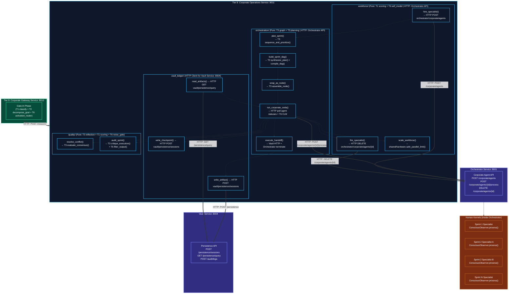
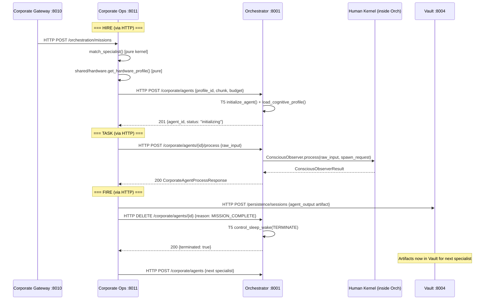
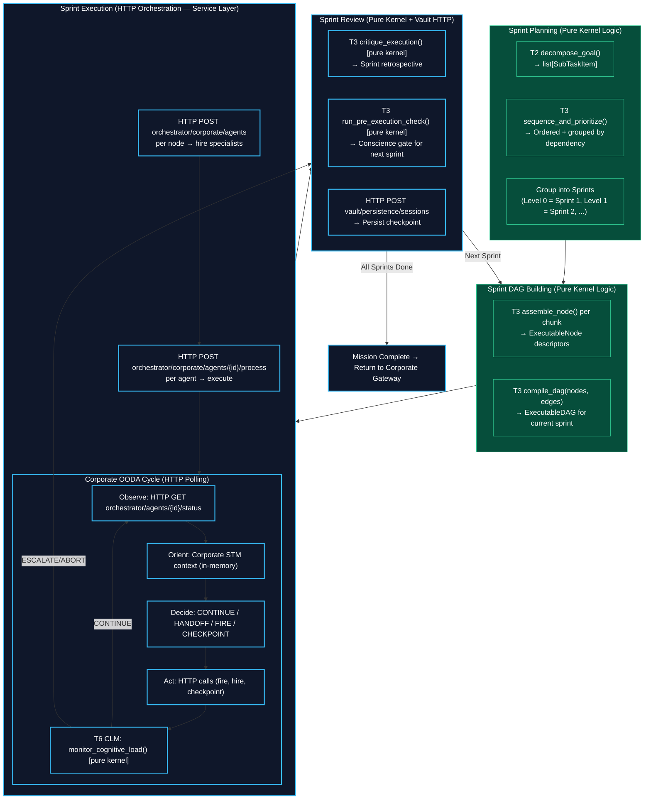
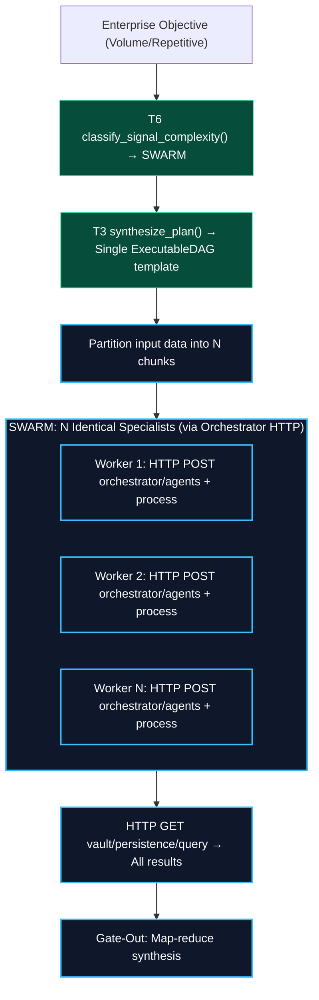
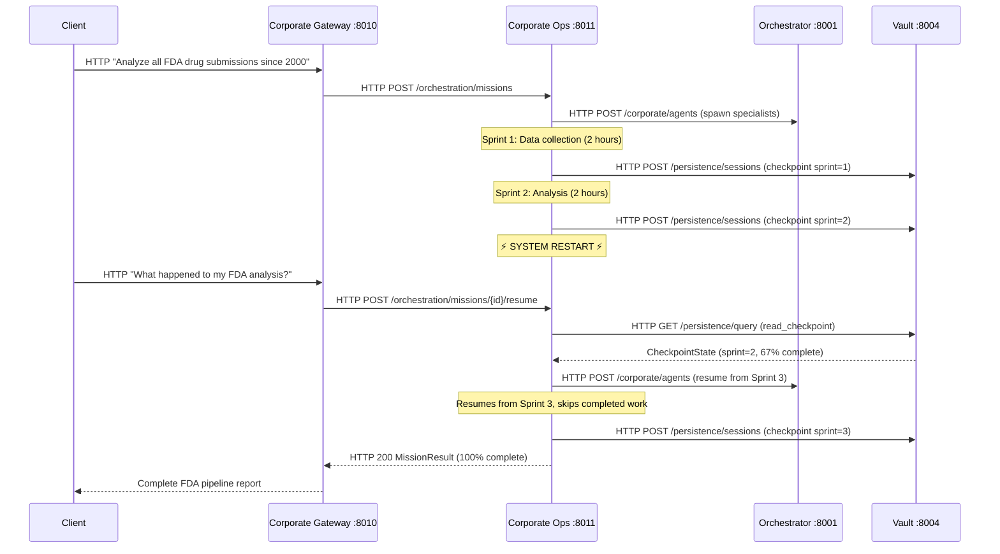

# Tier 8: Corporate Operations — v3 (Microservices Architecture)
 
## Overview
 
**Tier 8** is the operational backbone of the Corporation Kernel. It manages the workforce of Human Kernels (Tier 7) through **composition of existing lower-tier modules**, not reimplementation.
 
**Design Principle**: _"Reuse existing functions in the lower tier and make them more complex without creating new ones."_ Every Tier 8 capability is a **thin orchestration layer** that composes functions from Tiers 1-6 at corporate scale. No kernel logic is duplicated.
 
**CRITICAL RULE**: Tier 8 never reaches into the internals of any Human Kernel. It communicates with Tier 7 exclusively through the **Orchestrator Service HTTP API**, which internally runs `ConsciousObserver.process()`. Each Human Kernel is a black box with a standardized Gate-In / Gate-Out interface, accessed only via HTTP.
 
---
 
## v2 → v3 Architecture Change: Monolithic → Microservices
 
The v2 architecture placed all Tier 8 modules directly in `kernel/` as in-process Python modules. This created a **monolithic coupling**:
- Direct `import` of `ConsciousObserver.process()` for agent execution
- Direct `import` of T5 `lifecycle_controller` for agent spawning
- No independent deployment — all logic baked into a single process
 
The v3 architecture enforces **strict microservices boundaries**:
 
| Aspect | v2 (Monolithic) | v3 (Microservices) |
|--------|-----------------|-------------------|
| **Location** | `kernel/` (in-process) | `kernel/` (pure logic) + `services/corporate_ops/` (HTTP service) |
| **Agent Spawning** | Direct: `T5.initialize_agent()` | HTTP: `POST orchestrator:8001/corporate/agents` |
| **Agent Execution** | Direct: `ConsciousObserver.process()` | HTTP: `POST orchestrator:8001/corporate/agents/{id}/process` |
| **Vault Access** | Direct: `shared_ledger` module | HTTP: `POST vault:8004/persistence/sessions` |
| **Deployment** | Embedded in Orchestrator | Independent container: `corporate-ops:8011` |
| **Scaling** | Scales with Orchestrator | Scales independently |
| **Service Registry** | N/A | `ServiceName.CORPORATE_OPS` → `http://localhost:8011` |
 
**Separation Principle**: `kernel/` contains **pure logic** (functions that take inputs and return outputs, no HTTP, no I/O). `services/corporate_ops/` contains the **HTTP service wrapper** that imports kernel logic and communicates with other services via HTTP.
 
---
 
## Modules (v1 → v2 → v3 Consolidation)
 
The v1 architecture had **6 modules**. The v2 consolidated to **4 modules**. The v3 preserves the 4 logical domains but splits each into **pure kernel logic** (in `kernel/`) and **service orchestration** (in `services/corporate_ops/`).
 
| v3 Domain | Pure Logic (kernel/) | Service Layer (services/corporate_ops/) |
|-----------|---------------------|----------------------------------------|
| **Workforce** | `kernel/workforce_manager/` — skill matching, performance evaluation, scaling decisions | `routers/workforce.py` — HTTP endpoints + Orchestrator API calls for agent lifecycle |
| **Orchestration** | `kernel/team_orchestrator/` — sprint planning, DAG building, sprint review | `routers/orchestration.py` — HTTP endpoints + agent dispatch via Orchestrator API |
| **Quality** | `kernel/quality_resolver/` — conflict detection, consensus evaluation, audit scoring | `routers/quality.py` — HTTP endpoints for quality operations |
| **Ledger** | _(none — moved to shared/)_ | `clients/vault_ledger.py` — HTTP client for Vault Service |
 
**Key change: Shared Ledger is NOT a kernel module.** It performs HTTP I/O (calls to Vault Service), which violates kernel purity. It moves to `shared/corporate_ledger/` as a reusable HTTP client library, or lives directly in the service's `clients/` directory.
 
---
 
## Complete Lower-Tier Reuse Map
 
This table shows **every existing function** reused by Tier 8, proving that corporate operations are compositions, not reimplementations.
 
| Existing Function | Source | Corporate Reuse | Lives In |
|-------------------|--------|-----------------|----------|
| `classify()` | T1 classification | Domain detection for mission chunks | kernel/ (pure) |
| `score()` | T1 scoring | Skill matching, conflict evaluation, proposal ranking | kernel/ (pure) |
| `validate()` | T1 validation | Corporate input validation | kernel/ (pure) |
| `run_cognitive_filters()` | T2 attention_and_plausibility | Contradiction detection between agent outputs | kernel/ (pure) |
| `decompose_goal()` | T2 task_decomposition | Mission decomposition into chunks | kernel/ (pure) |
| `analyze_goal_complexity()` | T2 task_decomposition | Scope assessment (SOLO/TEAM/SWARM sizing) | kernel/ (pure) |
| `synthesize_plan()` | T3 graph_synthesizer | Sprint workflow DAG building | kernel/ (pure) |
| `compile_dag()` | T3 graph_synthesizer | Compile sprint nodes into executable DAG | kernel/ (pure) |
| `sequence_and_prioritize()` | T3 advanced_planning | Sprint planning, parallel/sequential ordering | kernel/ (pure) |
| `inject_progress_tracker()` | T3 advanced_planning | Milestone tracking per sprint | kernel/ (pure) |
| `bind_tools()` | T3 advanced_planning | Bind MCP tools to sprint nodes | kernel/ (pure) |
| `assemble_node()` | T3 node_assembler | Wrap each agent mission as a composable DAG node | kernel/ (pure) |
| `wrap_in_standard_io()` | T3 node_assembler | Ensure corporate nodes use Signal → Result protocol | kernel/ (pure) |
| `evaluate_consensus()` | T3 reflection_and_guardrails | Resolve conflicts between agent outputs | kernel/ (pure) |
| `run_pre_execution_check()` | T3 reflection_and_guardrails | Conscience gate before sprint dispatch | kernel/ (pure) |
| `critique_execution()` | T3 reflection_and_guardrails | Post-sprint retrospective, quality evaluation | kernel/ (pure) |
| `run_ooda_cycle()` pattern | T4 ooda_loop | Corporate monitoring loop pattern (observe → orient → decide → act) | service/ (HTTP loop) |
| `ShortTermMemory` | T4 short_term_memory | Corporate working memory (sprint state, events, entity cache) | service/ (in-memory state) |
| `initialize_agent()` | T5 lifecycle_controller | JIT agent genesis | **service/ (via Orchestrator HTTP)** |
| `load_cognitive_profile()` | T5 lifecycle_controller | Specialist profile loading | **service/ (via Orchestrator HTTP)** |
| `set_identity_constraints()` | T5 lifecycle_controller | Agent identity + budget constraints | **service/ (via Orchestrator HTTP)** |
| `control_sleep_wake()` | T5 lifecycle_controller | Agent lifecycle signals (TERMINATE/SLEEP/WAKE) | **service/ (via Orchestrator HTTP)** |
| `track_budget()` | T5 energy_and_interrupts | Corporate budget tracking across all agents | kernel/ (pure) |
| `check_budget_exhaustion()` | T5 energy_and_interrupts | Detect when mission/agent exceeds budget | kernel/ (pure) |
| `handle_interrupt()` | T5 energy_and_interrupts | Client interrupt handling during execution | kernel/ (pure) |
| `classify_signal_complexity()` | T6 activation_router | Scaling mode selection | kernel/ (pure) |
| `compute_activation_map()` | T6 activation_router | Which corporate modules to activate | kernel/ (pure) |
| `assess_capability()` | T6 self_model | Corporate capacity self-assessment | kernel/ (pure) |
| `monitor_cognitive_load()` | T6 cognitive_load_monitor | Stall/loop/drift detection at corporate level | kernel/ (pure) |
| `detect_stall()` | T6 cognitive_load_monitor | Detect stalled agents or sprints | kernel/ (pure) |
| `detect_goal_drift()` | T6 cognitive_load_monitor | Detect when agents drift from objective | kernel/ (pure) |
| `filter_output()` | T6 noise_gate | Corporate quality gate on agent outputs | kernel/ (pure) |
| `verify_grounding()` | T6 hallucination_monitor | Verify agent output grounding | kernel/ (pure) |
| `ConsciousObserver.process()` | T7 conscious_observer | Human Kernel interface (THE black box API) | **service/ (via Orchestrator HTTP)** |
 
**Count: 33 existing functions reused** — zero core logic reimplemented. Functions marked **service/** are accessed via HTTP to the Orchestrator Service, not imported directly.
 
---
 
## Architecture & Flow
 

 
---
 
## Inter-Service Communication Map
 
The Corporate Operations Service communicates with **4 peer services** via HTTP:
 
| Target Service | Purpose | HTTP Methods |
|---------------|---------|-------------|
| **Orchestrator** `:8001` | Spawn, execute, and terminate Human Kernels | `POST /corporate/agents`, `POST /corporate/agents/{id}/process`, `DELETE /corporate/agents/{id}`, `GET /corporate/agents/{id}/status` |
| **Vault** `:8004` | Artifact storage, checkpoints, session persistence | `POST /persistence/sessions`, `GET /persistence/query`, `POST /audit/logs` |
| **RAG Service** `:8003` | Cognitive profile retrieval for specialist matching | `POST /knowledge/search` |
| **Swarm Manager** `:8005` | Governance escalation, human-in-the-loop | `POST /agents/{work_id}/resolve`, `POST /compliance/check` |
 
### Orchestrator Service — New Corporate Agent API
 
The Orchestrator Service requires new endpoints to support corporate agent management. These endpoints are the **HTTP boundary** between Tier 8 (Corporate Operations) and Tier 7 (Human Kernels):
 
```
POST   /corporate/agents                     → Spawn a Human Kernel specialist
POST   /corporate/agents/batch               → Spawn multiple specialists (SWARM mode)
POST   /corporate/agents/{agent_id}/process   → Execute ConsciousObserver.process()
GET    /corporate/agents/{agent_id}/status     → Get agent status (heartbeat)
GET    /corporate/agents/{agent_id}/result     → Get agent output
DELETE /corporate/agents/{agent_id}            → Terminate a specialist
GET    /corporate/agents/pool/{mission_id}     → List all agents for a mission
```
 
**Request/Response contracts** (Pydantic models in `shared/schemas.py`):
 
```python
class CorporateAgentSpawnRequest(BaseModel):
    """Request to spawn a Human Kernel specialist via Orchestrator."""
    mission_id: str
    chunk_id: str
    profile_id: str
    sub_objective: str
    required_tools: list[str]
    token_budget: int
    cost_budget: float
    time_budget_ms: float
    predecessor_artifact_ids: list[str]
    trace_id: str
 
class CorporateAgentSpawnResponse(BaseModel):
    agent_id: str
    status: str                              # "initializing"
    profile_id: str
    spawned_utc: str
 
class CorporateAgentProcessRequest(BaseModel):
    """Request to execute ConsciousObserver.process() on a spawned agent."""
    raw_input: str
    attachments: list[dict] | None
    trace_id: str
 
class CorporateAgentProcessResponse(BaseModel):
    agent_id: str
    status: str                              # "completed" / "failed"
    result: dict                             # Serialized ConsciousObserverResult
    quality_score: float
    confidence: float
    grounding_rate: float
    duration_ms: float
    cost: float
 
class CorporateAgentStatusResponse(BaseModel):
    agent_id: str
    status: str                              # "initializing" / "active" / "completed" / "failed"
    progress_pct: float
    elapsed_ms: float
    cost_so_far: float
```
 
---
 
## Corporate Operations Service Definition
 
### FastAPI Application
 
**Location**: `services/corporate_ops/main.py`
 
```python
# Service identity
SERVICE_NAME = "corporate_ops"
SERVICE_PORT = 8011
 
# Routers
app.include_router(workforce_router, prefix="/workforce", tags=["Workforce"])
app.include_router(orchestration_router, prefix="/orchestration", tags=["Orchestration"])
app.include_router(quality_router, prefix="/quality", tags=["Quality"])
 
# Health
@app.get("/health")
async def health_check() -> dict: ...
```
 
### HTTP API Endpoints
 
#### Workforce Router (`/workforce`)
 
| Method | Path | Description | Calls |
|--------|------|-------------|-------|
| `POST` | `/workforce/hire` | Hire a specialist for a mission chunk | Orchestrator `POST /corporate/agents` |
| `POST` | `/workforce/hire/batch` | SWARM-mode batch hiring | Orchestrator `POST /corporate/agents/batch` |
| `POST` | `/workforce/fire/{agent_id}` | Terminate a specialist | Orchestrator `DELETE /corporate/agents/{id}` |
| `POST` | `/workforce/scale` | Evaluate and execute scaling decisions | Orchestrator + `shared/hardware` |
| `POST` | `/workforce/match` | Find best specialist profile for a chunk | RAG `POST /knowledge/search` |
| `GET`  | `/workforce/pool/{mission_id}` | List all agents in a mission pool | In-memory pool state |
 
#### Orchestration Router (`/orchestration`)
 
| Method | Path | Description | Calls |
|--------|------|-------------|-------|
| `POST` | `/orchestration/missions` | Start a new mission (full sprint pipeline) | Orchestrator, Vault |
| `POST` | `/orchestration/missions/{id}/resume` | Resume from checkpoint | Vault `GET /persistence/query` |
| `GET`  | `/orchestration/missions/{id}/status` | Get mission progress | In-memory state |
| `POST` | `/orchestration/missions/{id}/interrupt` | Handle client interrupt | T5 `handle_interrupt()` |
| `POST` | `/orchestration/missions/{id}/abort` | Abort mission, collect partial results | Orchestrator (terminate all agents) |
 
#### Quality Router (`/quality`)
 
| Method | Path | Description | Calls |
|--------|------|-------------|-------|
| `POST` | `/quality/audit/sprint` | Audit a sprint's output quality | Pure kernel logic |
| `POST` | `/quality/audit/mission` | Final mission quality audit | Vault (read artifacts) + kernel logic |
| `POST` | `/quality/conflicts/detect` | Detect conflicts between artifacts | Pure kernel logic |
| `POST` | `/quality/conflicts/resolve` | Resolve a detected conflict | Kernel + possibly Orchestrator (for judge agent) |
 
---
 
## Dependency Graph
 
| Tier | Imports From (kernel library) | HTTP Calls To (services) | Never Imports |
|------|------------------------------|--------------------------|---------------|
| **T9 service** | T0, T1, T2, T6 (pure kernel) | Corporate Ops `:8011`, Vault `:8004` | T3, T4, T5, T7 (accessed via T8 service) |
| **T8 service** | T0, T1, T2, T3, T4, T6 (pure kernel) | Orchestrator `:8001`, Vault `:8004`, RAG `:8003`, Swarm `:8005` | T5 lifecycle (accessed via Orchestrator HTTP), T7 (accessed via Orchestrator HTTP) |
| **Orchestrator** | T0, T1-T7 (full kernel) | MCP Host `:8002`, RAG `:8003`, Vault `:8004` | T8, T9 (never upward) |
 
**Key rule**: The Corporate Operations service **never directly imports** `kernel.conscious_observer` or `kernel.lifecycle_controller`. It accesses Human Kernel functionality exclusively through the Orchestrator Service HTTP API. Pure logic functions (T1 scoring, T3 planning, T6 monitoring) are imported as library code.
 
---
 
## Configuration Requirements
 
All settings in `shared/config.py` under `CorporateSettings`:
 
```python
class CorporateSettings(BaseModel):
    """Tier 8-9 Corporation Kernel settings."""
 
    # --- Workforce Manager ---
    max_concurrent_agents: int = 100
    agent_spawn_timeout_ms: float = 5000.0
    agent_idle_timeout_ms: float = 30000.0
    agent_fire_quality_threshold: float = 0.3
    spawn_batch_size: int = 10
 
    # --- Team Orchestrator ---
    sprint_max_parallel_tasks: int = 10
    sprint_review_enabled: bool = True
    corporate_ooda_poll_interval_ms: float = 1000.0
    handoff_timeout_ms: float = 60000.0
    max_sprints_per_mission: int = 20
    checkpoint_interval_sprints: int = 1
 
    # --- Shared Ledger ---
    artifact_max_size_bytes: int = 10_485_760
    artifact_ttl_seconds: int = 86400
    checkpoint_ttl_seconds: int = 604800       # 7 days
    session_ttl_seconds: int = 86400           # 24 hours
 
    # --- Quality Resolver ---
    conflict_similarity_threshold: float = 0.7
    consensus_quorum_pct: float = 0.5
    arbitration_timeout_ms: float = 30000.0
    quality_gate_threshold: float = 0.6
 
    # --- Hardware-Aware Scaling ---
    high_pressure_threshold: float = 0.8
    swarm_min_agents: int = 10
    swarm_max_agents_per_core: int = 2
 
    # --- Corporate Gateway ---
    gateway_max_concurrent_missions: int = 10
    gateway_session_timeout_ms: float = 3_600_000.0   # 1 hour
    gateway_interrupt_poll_ms: float = 2000.0
 
    # --- Strategic Assessment (Gate-In) ---
    solo_max_domains: int = 1
    team_max_agents: int = 10
    swarm_min_agents: int = 10
    timeline_buffer_pct: float = 1.2                  # 20% buffer
 
    # --- Synthesis (Gate-Out) ---
    synthesis_max_tokens: int = 8192
    partial_result_threshold: float = 0.5              # Accept if >= 50% complete
    quality_gate_min_score: float = 0.6
 
    # --- HTTP Client Settings ---
    orchestrator_timeout_ms: float = 120000.0          # 2 min per agent process call
    vault_timeout_ms: float = 10000.0
    rag_timeout_ms: float = 10000.0
    swarm_timeout_ms: float = 10000.0
    http_max_retries: int = 3
    http_retry_base_delay: float = 2.0
```
 
Service URL registered in `ServiceSettings`:
 
```python
class ServiceSettings(BaseModel):
    # ... existing services ...
    corporate_gateway: str = "http://localhost:8010"
    corporate_ops: str = "http://localhost:8011"
```
 
Service names registered in `ServiceRegistry`:
 
```python
class ServiceName(str, Enum):
    # ... existing ...
    CORPORATE_GATEWAY = "corporate_gateway"
    CORPORATE_OPS = "corporate_ops"
```
 
---
 
## Module 1: Workforce Manager
 
### Pure Logic (kernel/workforce_manager/)
 
Contains functions that perform **computation only** — no HTTP, no I/O, no service calls.
 
#### `match_specialist`
- **Signature**: `match_specialist(chunk: MissionChunk, available_profiles: list[CognitiveProfile]) -> ProfileMatch`
- **Description**: Finds the best specialist profile for a mission chunk. Uses T1 `scoring.score()` to evaluate skill overlap between chunk requirements and profile capabilities. Returns the highest-scoring match. If no match exceeds threshold, returns `requires_new_profile = True`.
- **Composes**: T1 `scoring.score()` for skill evaluation
 
#### `evaluate_performance`
- **Signature**: `evaluate_performance(handle: AgentHandle, result: CorporateAgentProcessResponse) -> PerformanceSnapshot`
- **Description**: Extracts performance metrics from the Orchestrator's agent process response. Quality score, confidence, grounding rate, latency, cost. Pure extraction — no new computation logic.
- **Composes**: Direct field access on `CorporateAgentProcessResponse`
 
#### `compute_scale_decisions`
- **Signature**: `compute_scale_decisions(pool: WorkforcePool, pending_chunks: list[MissionChunk], performance: list[PerformanceSnapshot], hardware_profile: ResourceProfile) -> list[ScaleDecision]`
- **Description**: Pure computation of scaling decisions. Checks: pending work queue, agent utilization, hardware resources, budget remaining. Returns decisions: HIRE_MORE, FIRE_IDLE, REASSIGN, HOLD. Does NOT execute the decisions — the service layer does.
- **Composes**: Config thresholds, pure math
 
### Service Layer (services/corporate_ops/routers/workforce.py)
 
Contains the HTTP orchestration that **calls external services**.
 
#### `hire_specialist` (endpoint handler)
- **Flow**:
  1. `match_specialist()` — pure kernel call to find best profile
  2. `GET shared/hardware.get_hardware_profile()` — check resource limits
  3. `HTTP POST orchestrator:8001/corporate/agents` — spawn agent via Orchestrator
  4. Update in-memory `WorkforcePool`
  5. Return `AgentHandle`
- **HTTP Calls**: Orchestrator Service
 
#### `fire_specialist` (endpoint handler)
- **Flow**:
  1. `HTTP POST vault:8004/persistence/sessions` — persist any partial artifacts
  2. `HTTP DELETE orchestrator:8001/corporate/agents/{id}` — terminate via Orchestrator
  3. Update `WorkforcePool`
  4. Return `TerminationReport`
- **HTTP Calls**: Vault Service, Orchestrator Service
 
#### `hire_batch` (endpoint handler)
- **Flow**:
  1. Check `shared/hardware.memory_pressure()`
  2. `HTTP POST orchestrator:8001/corporate/agents/batch` — batch spawn
  3. If pressure exceeds threshold, queue remaining for sequential spawning
  4. Return `list[AgentHandle]`
- **HTTP Calls**: Orchestrator Service
 
#### `scale_workforce` (endpoint handler)
- **Flow**:
  1. `compute_scale_decisions()` — pure kernel call
  2. For each `HIRE_MORE`: call `hire_specialist()`
  3. For each `FIRE_IDLE`: call `fire_specialist()`
  4. Return `list[ScaleDecision]` with execution results
- **HTTP Calls**: Orchestrator Service (via hire/fire)
 
### JIT Specialist Lifecycle (Microservices Flow)
 

 
### Types
 
```python
class MissionChunk(BaseModel):
    """A discrete, agent-assignable unit of work."""
    chunk_id: str
    parent_objective_id: str
    domain: str                         # Skill domain (e.g., "backend_development")
    sub_objective: str                  # What this specialist should accomplish
    required_skills: list[str]          # Maps to CognitiveProfile.skills
    required_tools: list[str]           # MCP tool categories needed
    depends_on: list[str]              # chunk_ids that must complete first
    sprint_number: int                  # Which sprint this chunk belongs to
    priority: int                       # 0 = highest
    token_budget: int
    cost_budget: float
    time_budget_ms: float
    is_parallelizable: bool
    pipeline_template_id: str | None   # For SWARM: shared pipeline reference
    input_data: dict[str, Any] | None  # For SWARM: partition-specific data
    predecessor_artifact_ids: list[str] # Vault artifact IDs from prior sprints
 
class AgentHandle(BaseModel):
    """Reference to a hired specialist."""
    agent_id: str
    profile_id: str
    role_name: str                      # e.g., "Backend Developer"
    chunk_id: str
    status: AgentStatus
    hired_utc: str
    quality_score: float
    total_cost: float
 
class AgentStatus(StrEnum):
    INITIALIZING = "initializing"
    ACTIVE = "active"
    COMPLETED = "completed"
    FAILED = "failed"
    TERMINATED = "terminated"
 
class WorkforcePool(BaseModel):
    """Registry of all active and terminated specialists."""
    pool_id: str
    mission_id: str
    agents: dict[str, AgentHandle]     # agent_id → handle
    total_hired: int
    total_fired: int
    total_cost: float
    budget_remaining: float
 
class TerminationReason(StrEnum):
    MISSION_COMPLETE = "mission_complete"    # Normal: task done
    IDLE_TIMEOUT = "idle_timeout"            # Idle too long
    LOW_QUALITY = "low_quality"              # Below threshold
    BUDGET_EXCEEDED = "budget_exceeded"      # Over budget
    STALLED = "stalled"                      # CLM detected stall
    REPLACED = "replaced"                    # Better specialist available
    MISSION_ABORTED = "mission_aborted"      # Client cancelled
 
class ScaleDecision(BaseModel):
    action: ScaleAction
    target_agent_id: str | None
    target_chunk_id: str | None
    reason: str
 
class ScaleAction(StrEnum):
    HIRE_MORE = "hire_more"
    FIRE_IDLE = "fire_idle"
    REASSIGN = "reassign"
    HOLD = "hold"
 
class ProfileMatch(BaseModel):
    agent_profile_id: str
    chunk_id: str
    skill_score: float                  # From T1 scoring
    composite_score: float
    requires_new_profile: bool
 
class PerformanceSnapshot(BaseModel):
    agent_id: str
    quality_score: float               # From noise gate
    confidence: float                  # From calibrator
    grounding_rate: float              # From hallucination monitor
    latency_ms: float
    cost: float
```
 
---
 
## Module 2: Team Orchestrator
 
### Pure Logic (kernel/team_orchestrator/)
 
Contains sprint planning and DAG construction — pure computation, no HTTP.
 
#### `plan_sprints`
- **Signature**: `async plan_sprints(chunks: list[MissionChunk], kit: InferenceKit | None = None) -> list[Sprint]`
- **Description**: Groups mission chunks into sprints by dependency level. Uses T3 `sequence_and_prioritize()` for topological ordering. Sprint 1 = chunks with no dependencies (parallel). Sprint 2 = chunks depending on Sprint 1 outputs (parallel). Etc.
- **Composes**: T3 `advanced_planning.sequence_and_prioritize()`, T2 `decompose_goal()` (if further decomposition needed)
 
#### `build_sprint_dag`
- **Signature**: `build_sprint_dag(sprint: Sprint) -> ExecutableDAG`
- **Description**: Builds a DAG for a single sprint. Each chunk becomes an `ExecutableNode` via T3 `assemble_node()`. Nodes within the sprint run in parallel (parallel group). Dependencies to prior sprints are handled via Vault artifacts (not DAG edges).
- **Composes**: T3 `node_assembler.assemble_node()`, T3 `graph_synthesizer.compile_dag()`
 
#### `review_sprint`
- **Signature**: `async review_sprint(sprint: Sprint, result: SprintResult, kit: InferenceKit | None = None) -> SprintReview`
- **Description**: Post-sprint retrospective. Uses T3 `reflection_and_guardrails.critique_execution()` to evaluate sprint quality. Before the next sprint, uses T3 `run_pre_execution_check()` as a conscience gate.
- **Composes**: T3 `critique_execution()`, T3 `run_pre_execution_check()`
 
### Service Layer (services/corporate_ops/routers/orchestration.py)
 
Contains the HTTP orchestration loop that manages remote agents.
 
#### `orchestrate_mission` (endpoint handler: `POST /orchestration/missions`)
- **Flow**:
  1. `plan_sprints()` — pure kernel call
  2. For each sprint: `execute_sprint()` → `review_sprint()` → checkpoint
  3. Return aggregated `MissionResult`
- **HTTP Calls**: Orchestrator, Vault
 
#### `execute_sprint` (internal)
- **Flow**:
  1. `build_sprint_dag()` — pure kernel call
  2. For each node: `HTTP POST orchestrator:8001/corporate/agents` (hire)
  3. For each agent: `HTTP POST orchestrator:8001/corporate/agents/{id}/process` (execute)
  4. `run_corporate_ooda()` — monitoring loop with HTTP polling
  5. Return `SprintResult`
- **HTTP Calls**: Orchestrator Service
 
#### `run_corporate_ooda` (internal)
- **Description**: The corporate monitoring loop. Unlike individual kernel OODA, this polls **remote agents via HTTP**:
  - **Observe**: `HTTP GET orchestrator:8001/corporate/agents/{id}/status` for each active agent
  - **Orient**: Contextualize events using in-memory corporate `ShortTermMemory`
  - **Decide**: CONTINUE / HANDOFF / FIRE_AND_REPLACE / CHECKPOINT / ABORT
  - **Act**: Execute via HTTP (fire agent, spawn replacement, persist checkpoint)
  - **CLM Check**: T6 `monitor_cognitive_load()` (pure kernel call) after every cycle
- **HTTP Calls**: Orchestrator Service (status polling, agent management)
 
#### `execute_handoff` (internal)
- **Flow**:
  1. `HTTP POST vault:8004/persistence/sessions` — persist completed agent's artifact
  2. `HTTP DELETE orchestrator:8001/corporate/agents/{id}` — fire completed agent
  3. Check if downstream chunks unblocked
  4. Return newly-dispatchable chunk_ids
- **HTTP Calls**: Vault Service, Orchestrator Service
 
### Sprint-Based Execution Flow (Microservices)
 

 
### Node-Based Design
 
Every specialist's task is wrapped as a composable node using T3 `node_assembler`:
 
```python
# Each MissionChunk becomes an ExecutableNode descriptor
for chunk in sprint.chunks:
    node = assemble_node(
        instruction=ActionInstruction(
            task_id=chunk.chunk_id,
            description=chunk.sub_objective,
            action_type="corporate_agent_process",   # Signals HTTP dispatch
            parameters={
                "profile_id": chunk.matched_profile_id,
                "token_budget": chunk.token_budget,
                "predecessor_artifacts": chunk.predecessor_artifact_ids,
            },
        ),
        config=NodeConfig(
            timeout_ms=chunk.time_budget_ms,
            retry_count=settings.corporate.http_max_retries,
        ),
        kit=kit,
    )
    nodes.append(node)
 
# Compose into sprint DAG
dag = compile_dag(
    nodes=nodes,
    edges=edges,  # Intra-sprint dependencies (usually none — parallel)
    objective=sprint.sprint_objective,
)
 
# EXECUTION: Service layer dispatches each node via HTTP
for node in dag.nodes:
    # 1. HTTP POST orchestrator/corporate/agents → spawn
    # 2. HTTP POST orchestrator/corporate/agents/{id}/process → execute
    # 3. Collect result via HTTP GET
    # DAG execution is managed by the service layer, NOT the kernel
```
 
### Types
 
```python
class Sprint(BaseModel):
    """A group of parallel tasks with a shared dependency level."""
    sprint_id: str
    sprint_number: int
    mission_id: str
    objective: str
    chunks: list[MissionChunk]         # All parallelizable within this sprint
    depends_on_sprint_ids: list[str]   # Prior sprints that must complete
    estimated_duration_ms: float
 
class SprintResult(BaseModel):
    """Outcome of a single sprint."""
    sprint_id: str
    completed_chunks: list[str]        # chunk_ids
    failed_chunks: list[str]
    agent_results: dict[str, CorporateAgentProcessResponse]  # agent_id → HTTP response
    artifacts_produced: list[str]      # Vault artifact IDs
    total_cost: float
    duration_ms: float
    was_checkpointed: bool
 
class SprintReview(BaseModel):
    """Post-sprint retrospective."""
    sprint_id: str
    quality_assessment: str            # From T3 critique_execution()
    issues_found: list[str]
    new_backlog_items: list[str]       # Discovered work
    next_sprint_approved: bool         # From T3 run_pre_execution_check()
 
class MissionResult(BaseModel):
    """Aggregated outcome from all sprints."""
    mission_id: str
    total_sprints: int
    completed_sprints: int
    all_artifacts: list[str]           # All Vault artifact IDs
    all_agent_results: dict[str, CorporateAgentProcessResponse]
    total_cost: float
    total_duration_ms: float
    completion_pct: float
    final_review: SprintReview | None
 
class CorporateOODAResult(BaseModel):
    """Result of the corporate HTTP monitoring loop."""
    total_cycles: int
    termination_reason: str            # "all_complete" / "escalated" / "aborted" / "budget_exhausted"
    events_processed: int
    handoffs_executed: int
    agents_fired: int
    agents_hired: int
    checkpoints_saved: int
```
 
---
 
## Module 3: Vault Ledger (HTTP Client)
 
### Overview
 
The Vault Ledger is a **reusable HTTP client** for the Vault Service. It replaces both the v1 Artifact Exchange (inter-agent pub/sub) and Memory Cortex (session persistence) with direct Vault HTTP calls. Agents share data, artifacts, and memory through Vault's persistent storage with `team_id`/`mission_id` metadata and semantic search via pgvector.
 
**Location**: `services/corporate_ops/clients/vault_ledger.py` (service-specific) or `shared/corporate_ledger/client.py` (shared across Corporate Gateway and Corporate Ops)
 
**Why HTTP client, not kernel module**: The Vault Ledger performs I/O (HTTP calls to Vault Service), which violates the kernel purity principle. It lives in the service layer.
 
**Why Vault instead of custom pub/sub**:
- **Persistence**: Artifacts survive agent restarts and system failures
- **Searchability**: pgvector enables semantic search across all artifacts
- **Audit trail**: Vault's SHA-256 hash chain provides tamper-proof history
- **Simplicity**: No new infrastructure — reuses existing microservice
- **Long-running support**: Checkpoints persist for days/weeks
 
### Function Decomposition
 
All functions are `async` and make HTTP calls to Vault Service at `vault:8004`:
 
#### `write_artifact`
- **Signature**: `async write_artifact(agent_id: str, team_id: str, content: str, metadata: ArtifactMetadata) -> str`
- **Returns**: Artifact ID
- **HTTP**: `POST vault:8004/persistence/sessions`
 
#### `read_artifacts`
- **Signature**: `async read_artifacts(team_id: str, query: str | None = None, topic: str | None = None, limit: int | None = None) -> list[VaultArtifact]`
- **HTTP**: `GET vault:8004/persistence/query`
 
#### `write_checkpoint`
- **Signature**: `async write_checkpoint(mission_id: str, state: CheckpointState) -> str`
- **HTTP**: `POST vault:8004/persistence/sessions`
 
#### `read_checkpoint`
- **Signature**: `async read_checkpoint(mission_id: str) -> CheckpointState | None`
- **HTTP**: `GET vault:8004/persistence/query`
 
#### `write_session`
- **Signature**: `async write_session(session_id: str, state: SessionState) -> None`
- **HTTP**: `POST vault:8004/persistence/sessions`
 
#### `read_session`
- **Signature**: `async read_session(session_id: str) -> SessionState | None`
- **HTTP**: `GET vault:8004/persistence/query`
 
#### `recall_memory`
- **Signature**: `async recall_memory(client_id: str, query: str, limit: int | None = None) -> list[VaultArtifact]`
- **HTTP**: `GET vault:8004/persistence/query` (semantic search)
 
### HTTP Client Pattern
 
Follows the existing project pattern (`services/api_gateway/clients/orchestrator.py`):
 
```python
class VaultLedgerClient:
    """HTTP client for Vault Service — corporate artifact management."""
 
    def __init__(self) -> None:
        self._base_url = ServiceRegistry.get_url(ServiceName.VAULT)
        self._settings = get_settings()
        self._timeout = self._settings.corporate.vault_timeout_ms / 1000.0
        self._max_retries = self._settings.corporate.http_max_retries
        self._retry_base = self._settings.corporate.http_retry_base_delay
        self._log = get_logger(__name__)
 
    async def _request(self, method: str, path: str, **kwargs) -> httpx.Response:
        """HTTP request with retry + exponential backoff."""
        last_error: Exception | None = None
        for attempt in range(self._max_retries + 1):
            try:
                async with httpx.AsyncClient(timeout=self._timeout) as client:
                    response = await client.request(
                        method, f"{self._base_url}{path}", **kwargs
                    )
                    response.raise_for_status()
                    return response
            except (httpx.TimeoutException, httpx.ConnectError) as exc:
                last_error = exc
                if attempt < self._max_retries:
                    delay = self._retry_base * (2 ** attempt)
                    self._log.warning(
                        "vault_request_retry",
                        attempt=attempt + 1,
                        delay=delay,
                        error=str(exc),
                    )
                    await asyncio.sleep(delay)
        raise last_error  # type: ignore[misc]
```
 
### Types
 
```python
class ArtifactMetadata(BaseModel):
    """Metadata for a Vault-stored artifact."""
    team_id: str
    mission_id: str
    sprint_id: str | None
    chunk_id: str | None
    agent_id: str
    content_type: str                   # "code" / "analysis" / "report" / "data" / "review"
    topic: str                          # Semantic category
    summary: str                        # Brief description for search indexing
 
class VaultArtifact(BaseModel):
    """An artifact retrieved from Vault."""
    artifact_id: str
    content: str
    metadata: ArtifactMetadata
    created_utc: str
 
class CheckpointState(BaseModel):
    """Serializable mission state for persistence."""
    mission_id: str
    current_sprint: int
    total_sprints: int
    completed_chunk_ids: list[str]
    failed_chunk_ids: list[str]
    pool_snapshot: dict[str, Any]       # Serialized WorkforcePool
    artifact_ids: list[str]
    total_cost: float
    elapsed_ms: float
    checkpointed_utc: str
 
class SessionState(BaseModel):
    """Client conversation session."""
    session_id: str
    client_id: str
    conversation_history: list[ConversationTurn]
    active_mission_id: str | None
    compressed_summary: str | None      # Summary of old turns
    last_interaction_utc: str
    turn_count: int
 
class ConversationTurn(BaseModel):
    """A single interaction in a conversation."""
    turn_id: str
    role: str                           # "client" / "corporation"
    content: str
    intent: str | None
    timestamp_utc: str
```
 
---
 
## Module 4: Quality Resolver
 
### Pure Logic (kernel/quality_resolver/)
 
Contains quality assessment and conflict resolution — pure computation, no HTTP.
 
#### `detect_conflicts`
- **Signature**: `async detect_conflicts(artifacts: list[VaultArtifact], kit: InferenceKit | None = None) -> list[Conflict]`
- **Description**: Scans agent outputs for contradictions. Uses T2 `attention_and_plausibility.run_cognitive_filters()` to detect semantic contradictions.
- **Composes**: T2 `run_cognitive_filters()`
 
#### `resolve_conflict`
- **Signature**: `async resolve_conflict(conflict: Conflict, artifact_a: VaultArtifact, artifact_b: VaultArtifact, kit: InferenceKit | None = None) -> Resolution`
- **Description**: Applies the resolution cascade: consensus → weighted vote. Returns resolution with strategy used.
- **Composes**: T3 `evaluate_consensus()`, T1 `scoring.score()`
 
#### `score_sprint_quality`
- **Signature**: `async score_sprint_quality(agent_results: list[CorporateAgentProcessResponse], kit: InferenceKit | None = None) -> QualityAudit`
- **Description**: Aggregates quality metrics from agent process responses into a corporate quality assessment.
- **Composes**: T6 `noise_gate.filter_output()`, T6 `hallucination_monitor.verify_grounding()`, T6 `confidence_calibrator.run_confidence_calibration()`
 
### Service Layer (services/corporate_ops/routers/quality.py)
 
Adds HTTP-dependent operations.
 
#### `audit_sprint` (endpoint handler)
- **Flow**:
  1. `score_sprint_quality()` — pure kernel call
  2. If conflicts detected and escalation needed: `HTTP POST swarm_manager:8005/compliance/check`
  3. Return `QualityAudit`
 
#### `audit_final` (endpoint handler)
- **Flow**:
  1. `HTTP GET vault:8004/persistence/query` — read all mission artifacts
  2. `detect_conflicts()` — pure kernel call
  3. `resolve_conflict()` — pure kernel call per conflict
  4. If arbitration needed: `HTTP POST orchestrator:8001/corporate/agents` (spawn judge agent)
  5. If escalation needed: `HTTP POST swarm_manager:8005/agents/{work_id}/resolve`
  6. Return `FinalQualityReport`
 
### Conflict Resolution Strategy Cascade
 
```
1. T2 attention_and_plausibility.run_cognitive_filters()    [pure kernel]
   → Detect contradictions between agent outputs
 
2. T3 reflection_and_guardrails.evaluate_consensus()        [pure kernel]
   → Attempt consensus (all agree)
 
3. T1 scoring.score() with confidence weighting              [pure kernel]
   → Weighted vote (high-confidence agents win)
 
4. HTTP POST orchestrator/corporate/agents                   [service HTTP]
   → Spawn Judge specialist via Orchestrator API
 
5. HTTP POST swarm_manager/agents/{work_id}/resolve          [service HTTP]
   → Escalate to Human-in-the-Loop
```
 
Each level is attempted only if the previous level fails. Levels 1-3 are pure kernel calls. Levels 4-5 require HTTP to external services.
 
### Types
 
```python
class Conflict(BaseModel):
    artifact_a_id: str
    artifact_b_id: str
    description: str
    severity: str                       # "low" / "medium" / "high" / "critical"
 
class Resolution(BaseModel):
    conflict_id: str
    strategy_used: str                  # "consensus" / "weighted_vote" / "arbitration" / "escalation"
    winning_artifact_id: str
    justification: str
    confidence: float
 
class QualityAudit(BaseModel):
    sprint_id: str
    avg_quality: float                  # From noise gate
    avg_confidence: float               # From calibrator
    avg_grounding: float                # From hallucination monitor
    issues: list[str]
    overall: str                        # "pass" / "warning" / "fail"
 
class FinalQualityReport(BaseModel):
    mission_id: str
    conflicts_found: int
    conflicts_resolved: int
    completeness_pct: float
    confidence_map: dict[str, float]   # chunk_id → confidence
    gaps: list[str]
    overall_quality: float
```
 
---
 
## SWARM Mode: Template Pipeline Replication
 
For high-volume tasks (50K+ documents, 100K iterations):
 

 
**Hardware-Aware SWARM Sizing**:
```python
profile = get_hardware_profile()
max_parallel = profile.safe_parallel_limit()
total_partitions = len(data_chunks)
 
# Spawn in waves via HTTP, not all at once
wave_size = min(max_parallel, settings.corporate.spawn_batch_size)
for wave in range(0, total_partitions, wave_size):
    batch = data_chunks[wave:wave + wave_size]
    # HTTP POST orchestrator:8001/corporate/agents/batch
    agents = await orchestrator_client.spawn_batch(batch, profile_ids)
    # Execute wave via HTTP, fire completed, spawn next wave
```
 
---
 
## Long-Running Task Persistence
 

 
---
 
## Stress Test Query Capability Matrix
 
| Query | Scale | Mode | Agents | Key Challenge | Corporate Solution |
|-------|-------|------|--------|---------------|-------------------|
| #1 Indonesian Alpha Hunt | 5K iterations | TEAM | 3-5 | Multi-domain (financial + scraping) | Sprint 1: Scrape, Sprint 2: Analyze, Sprint 3: Model |
| #2 Bryan Johnson Blueprint | 10K iterations | TEAM | 4-6 | Knowledge graph building | Vault-backed graph nodes, specialists per data source |
| #5 Putusan MA Builder | 50K iterations | SWARM | 50-100 | Volume document processing | Template pipeline, N workers, Vault database |
| #9 Dark Money Trace | 15K iterations | TEAM | 5-8 | Investigation + cross-referencing | JIT specialists (legal, financial, crypto), Vault shared evidence |
| #15 Geopolitical Risk Index | 100K iterations | SWARM | 100+ | Massive aggregation | SWARM with hardware-aware wave spawning, checkpointing |
| #16 Academic Grant Network | 100K iterations | SWARM | 100+ | Database building from scraped data | Template pipeline, map-reduce collection |
| #17 Startup Due Diligence | 10K iterations | TEAM | 5 | Per-company deep analysis | 1 specialist per company, Vault shared matrix |
| #19 Competitive Intelligence | 20K iterations | TEAM | 10 | Per-company analysis + cross-comparison | Sprint 1: Per-company (parallel), Sprint 2: Cross-comparison |
| #20 Research Synthesis Swarm | 5K iterations | TEAM | 6 | Multi-agent synthesis + editor | 5 research specialists + 1 editor/reviewer, Vault artifact sharing |
 
---
 
## Directory Structure
 
```
# === PURE LOGIC (kernel/) — No HTTP, No I/O ===
kernel/
├── (existing Tiers 1-7 modules — unchanged)
│
├── workforce_manager/                # Tier 8 — Pure: skill matching, scaling decisions
│   ├── __init__.py
│   ├── engine.py                     # match_specialist(), evaluate_performance(), compute_scale_decisions()
│   └── types.py                      # MissionChunk, AgentHandle, WorkforcePool, etc.
│
├── team_orchestrator/                # Tier 8 — Pure: sprint planning, DAG building, review
│   ├── __init__.py
│   ├── engine.py                     # plan_sprints(), build_sprint_dag(), review_sprint()
│   └── types.py                      # Sprint, SprintResult, MissionResult, etc.
│
├── quality_resolver/                 # Tier 8 — Pure: conflict detection, quality scoring
│   ├── __init__.py
│   ├── engine.py                     # detect_conflicts(), resolve_conflict(), score_sprint_quality()
│   └── types.py                      # Conflict, Resolution, QualityAudit, etc.
│
└── corporate_gateway/                # Tier 9 — Pure: intent, strategy, synthesis (see tier_9_architecture.md)
    ├── __init__.py
    ├── engine.py
    └── types.py
 
# === HTTP SERVICE (services/) — FastAPI + Inter-Service Communication ===
services/
├── (existing services — unchanged)
│
└── corporate_ops/                    # Tier 8 — HTTP Service wrapping kernel logic
    ├── __init__.py
    ├── main.py                       # FastAPI app, health, middleware, router mounting
    ├── routers/
    │   ├── __init__.py
    │   ├── workforce.py              # /workforce/* endpoints (calls Orchestrator HTTP)
    │   ├── orchestration.py          # /orchestration/* endpoints (calls Orchestrator HTTP)
    │   └── quality.py                # /quality/* endpoints (calls Vault HTTP)
    └── clients/
        ├── __init__.py
        ├── orchestrator_client.py    # HTTP client for Orchestrator /corporate/* API
        └── vault_ledger.py           # HTTP client for Vault persistence API
 
# === SHARED — Reusable across Corporate Gateway and Corporate Ops ===
shared/
├── corporate_ledger/                 # Optional: shared Vault ledger client
│   ├── __init__.py
│   └── client.py                     # VaultLedgerClient (httpx-based)
└── (existing shared modules — unchanged)
```
 
---
 
## Deployment & Containerization
 
### Docker Compose Addition
 
```yaml
corporate-ops:
    build:
      context: .
      target: corporate-ops
    ports:
      - "8011:8011"
    environment:
      - SERVICE_URL_ORCHESTRATOR=http://orchestrator:8001
      - SERVICE_URL_VAULT=http://vault:8004
      - SERVICE_URL_RAG_SERVICE=http://rag-service:8003
      - SERVICE_URL_SWARM_MANAGER=http://swarm-manager:8005
    depends_on:
      - orchestrator
      - vault
      - rag-service
      - swarm-manager
    networks:
      - kea-network
```
 
### Kubernetes Deployment (k8s/)
 
```yaml
apiVersion: apps/v1
kind: Deployment
metadata:
  name: corporate-ops
spec:
  replicas: 2                          # Scale independently
  selector:
    matchLabels:
      app: corporate-ops
  template:
    spec:
      containers:
      - name: corporate-ops
        image: kea/corporate-ops:latest
        ports:
        - containerPort: 8011
        env:
        - name: SERVICE_URL_ORCHESTRATOR
          value: "http://orchestrator-svc:8001"
        - name: SERVICE_URL_VAULT
          value: "http://vault-svc:8004"
```
 
---
 
## Implementation Sequence
 
### Phase 1: Types & Pure Logic (kernel/)
1. `kernel/workforce_manager/types.py` — MissionChunk, AgentHandle, WorkforcePool, etc.
2. `kernel/workforce_manager/engine.py` — match_specialist(), evaluate_performance(), compute_scale_decisions()
3. `kernel/team_orchestrator/types.py` — Sprint, SprintResult, MissionResult, etc.
4. `kernel/team_orchestrator/engine.py` — plan_sprints(), build_sprint_dag(), review_sprint()
5. `kernel/quality_resolver/types.py` — Conflict, Resolution, QualityAudit, etc.
6. `kernel/quality_resolver/engine.py` — detect_conflicts(), resolve_conflict(), score_sprint_quality()
 
### Phase 2: HTTP Contracts (shared/)
7. Add `CorporateSettings` to `shared/config.py`
8. Add `CORPORATE_GATEWAY`, `CORPORATE_OPS` to `shared/service_registry.py`
9. Add Corporate Agent request/response schemas to `shared/schemas.py`
10. Optional: `shared/corporate_ledger/client.py` — VaultLedgerClient
 
### Phase 3: Service Layer (services/)
11. `services/corporate_ops/clients/orchestrator_client.py` — HTTP client for Orchestrator corporate API
12. `services/corporate_ops/clients/vault_ledger.py` — HTTP client for Vault
13. `services/corporate_ops/routers/workforce.py` — hire/fire/scale endpoints
14. `services/corporate_ops/routers/quality.py` — audit/conflict endpoints
15. `services/corporate_ops/routers/orchestration.py` — mission execution + corporate OODA loop
16. `services/corporate_ops/main.py` — FastAPI app assembly
 
### Phase 4: Orchestrator Enhancement
17. Add `POST /corporate/agents` endpoint to `services/orchestrator/main.py`
18. Add `POST /corporate/agents/{id}/process` endpoint
19. Add `DELETE /corporate/agents/{id}` endpoint
20. Add `GET /corporate/agents/{id}/status` endpoint
21. Add `POST /corporate/agents/batch` endpoint
 
### Phase 5: Integration
22. Update `kernel/__init__.py` with T8 exports
23. Add Docker Compose entry for `corporate-ops`
24. Add Kubernetes manifests for `corporate-ops`