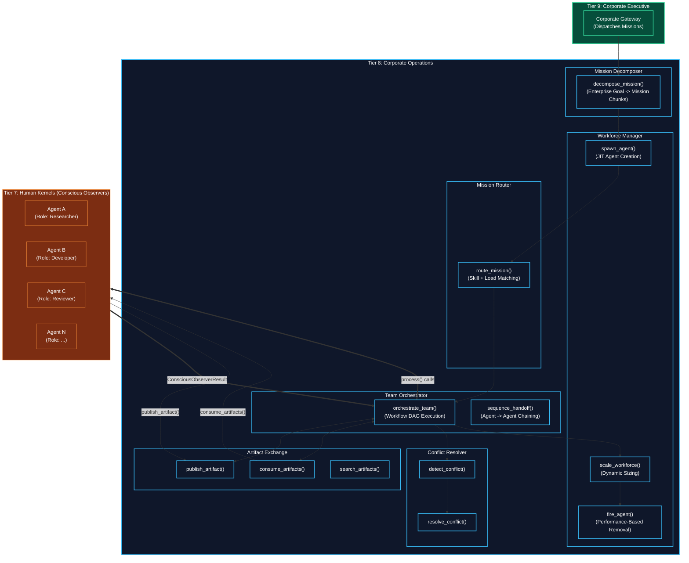
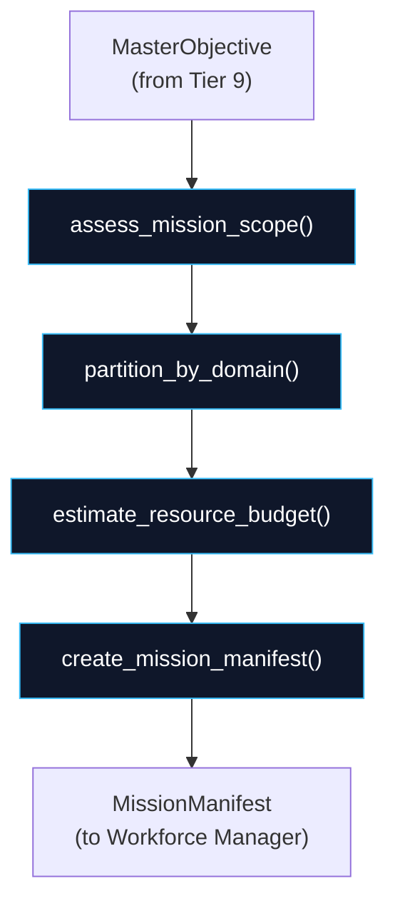
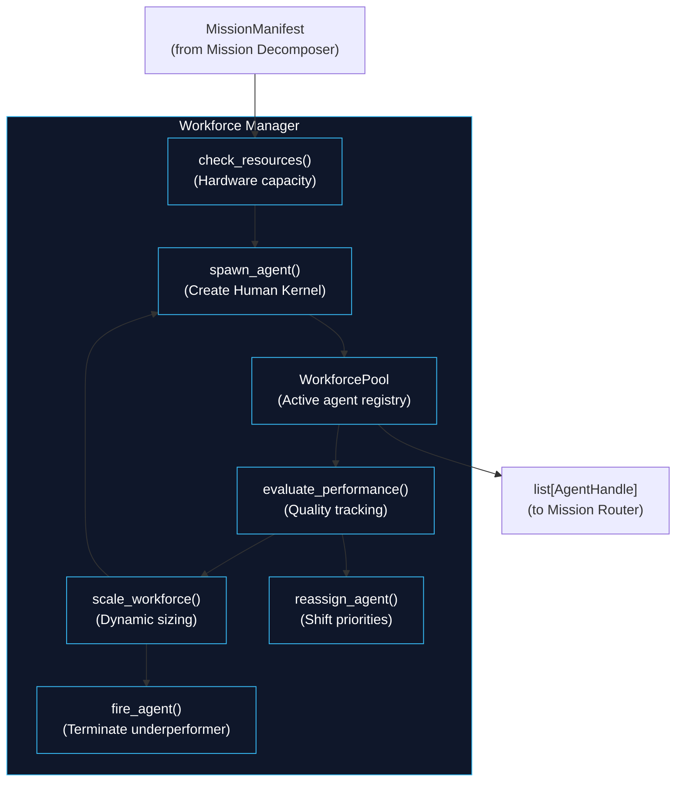
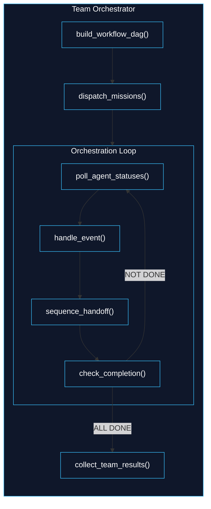
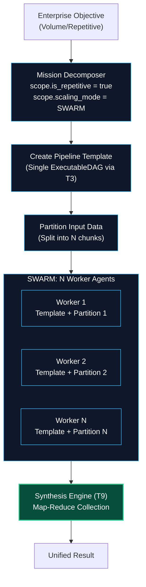
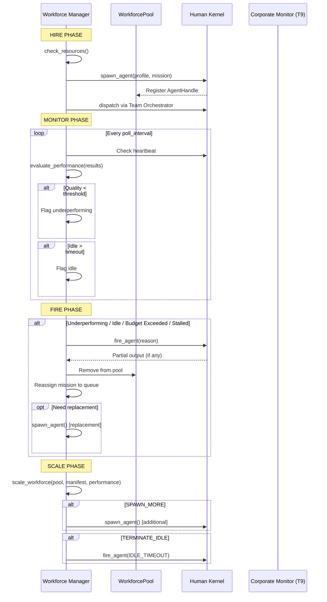

# Tier 8: Corporate Operations (Workforce & Coordination)

## Overview

**Tier 8** is the operational backbone of the Corporation Kernel. While Tier 7 (Conscious Observer) is the apex of a _single_ Human Kernel, Tier 8 is the machinery that manages _many_ Human Kernels as a coordinated workforce.

Think of Tier 8 as the **Operations Floor** of a corporation: it decomposes enterprise goals into assignable missions, spawns and manages the workforce, routes work to the right specialists, coordinates inter-agent workflows, enables communication between agents, and resolves conflicts when agents disagree.

**CRITICAL RULE**: Tier 8 never reaches into the internals of any Human Kernel. It communicates with Tier 7 exclusively through the `ConsciousObserver.process()` entry point and the `ConsciousObserverResult` output. Each Human Kernel is a black box with a standardized Gate-In / Gate-Out interface.

**Tier 8 is called by Tier 9** (Corporate Executive) and **calls into Tier 7** (Human Kernel). It also leverages Tier 0 primitives (schemas, config, logging, hardware) and selectively reuses lower-tier kernel modules (T1 classification, T2 task decomposition, T3 graph synthesizer, T5 lifecycle controller, T6 activation router, T6 self model) for corporate-level cognition.

**Location**: `kernel/` — six new modules, each following the standard `engine.py` / `types.py` / `__init__.py` pattern.

---

## Modules

| Module | Purpose | Analogy |
|--------|---------|---------|
| **mission_decomposer** | Break enterprise goals into agent-assignable missions | The Project Manager who reads the brief and writes the work breakdown structure |
| **workforce_manager** | Spawn, scale, hire/fire Human Kernels | HR Department + Resource Allocation |
| **mission_router** | Assign missions to agents by skill, load, and priority | The Dispatch Center that decides who works on what |
| **team_orchestrator** | Coordinate inter-agent workflows, sequencing, dependencies | The Operations Director who keeps the assembly line moving |
| **artifact_exchange** | Inter-agent pub/sub communication and shared workspace | The Corporate Watercooler + Shared Drive |
| **conflict_resolver** | Consensus building, voting, arbitration, escalation | The Mediator / Conflict Resolution Board |

---

## Architecture & Flow



---

## Dependency Graph

| Tier | Imports From | Role |
|------|-------------|------|
| **T9** | T0 (schemas, config), **T8** (all modules) | Corporate Executive — single entry point |
| **T8** | T0 (schemas, config, hardware, logging), T1 (classification), T2 (task_decomposition), T3 (graph_synthesizer), T5 (lifecycle_controller), T6 (self_model, activation_router), T7 (ConsciousObserver) | Corporate Operations — workforce & coordination |
| **T7** | T0, T1-T6 | Human Kernel apex — individual agent |

**Strict Rule**: T8 never imports from T9. T7 never imports from T8 or T9. Information flows downward through function calls and upward through return values.

---

## Configuration Requirements

All settings live in `shared/config.py` under a new `CorporateSettings` section:

```python
class CorporateSettings(BaseModel):
    """Tier 8-9 Corporation Kernel settings."""

    # --- Mission Decomposer ---
    max_mission_chunks: int = 50
    decomposition_max_depth: int = 3
    min_chunk_granularity: float = 0.1  # Minimum work unit (fraction of total)

    # --- Workforce Manager ---
    max_concurrent_agents: int = 100
    agent_spawn_timeout_ms: float = 5000.0
    agent_idle_timeout_ms: float = 30000.0
    agent_fire_quality_threshold: float = 0.3
    agent_fire_stall_cycles: int = 10
    spawn_batch_size: int = 10  # For SWARM mode batch spawning
    workforce_scale_check_interval_ms: float = 5000.0

    # --- Mission Router ---
    routing_strategy: str = "skill_first"  # skill_first | load_balanced | priority
    max_missions_per_agent: int = 3
    load_rebalance_threshold: float = 0.8  # Rebalance when agent load > 80%

    # --- Team Orchestrator ---
    orchestration_poll_interval_ms: float = 1000.0
    max_workflow_depth: int = 10
    handoff_timeout_ms: float = 60000.0
    max_retry_on_agent_failure: int = 2

    # --- Artifact Exchange ---
    artifact_max_size_bytes: int = 10_485_760  # 10 MB
    artifact_ttl_seconds: int = 3600
    max_subscriptions_per_agent: int = 20
    artifact_search_limit: int = 50

    # --- Conflict Resolver ---
    conflict_detection_threshold: float = 0.7  # Semantic similarity threshold
    consensus_quorum_pct: float = 0.5  # >50% for majority
    arbitration_timeout_ms: float = 30000.0
    max_escalation_attempts: int = 2
```

---

## Module 1: Mission Decomposer

**Location**: `kernel/mission_decomposer/`

### Overview

The Mission Decomposer is the entry point for Tier 8. When the Corporate Executive (Tier 9) receives a client request, the Mission Decomposer breaks the enterprise objective into **mission chunks** — discrete, agent-assignable units of work.

Each mission chunk specifies: what needs to be done, which skill domain is required, estimated resource budget, and dependencies on other chunks. The decomposition is recursive (up to `config.decomposition_max_depth`) for complex objectives.

**Reuses**: T2 `task_decomposition.decompose_goal()` for goal analysis, T1 `classification.classify()` for domain detection.

### Architecture & Flow



### Function Decomposition

#### `decompose_mission`
- **Signature**: `async decompose_mission(objective: MasterObjective, kit: InferenceKit | None = None) -> Result`
- **Returns**: `Result` containing `MissionManifest`
- **Description**: Top-level entry point. Assesses the scope of the enterprise objective, partitions it into domain-specific mission chunks, estimates resource budgets for each, and assembles the final manifest. The manifest tells the Workforce Manager exactly what agents to spawn and what each should do.
- **Calls**: `assess_mission_scope()`, `partition_by_domain()`, `estimate_resource_budget()`, `create_mission_manifest()`

#### `assess_mission_scope`
- **Signature**: `async assess_mission_scope(objective: MasterObjective, kit: InferenceKit | None = None) -> MissionScope`
- **Description**: Analyzes the enterprise objective to determine its complexity, domain breadth, estimated workforce size, and recommended scaling mode (SOLO/TEAM/SWARM). Uses T1 classification for domain detection and T2 task decomposition for complexity analysis.
- **Calls**: T1 `classify()`, T2 `decompose_goal()`, T6 `classify_signal_complexity()`

#### `partition_by_domain`
- **Signature**: `async partition_by_domain(objective: MasterObjective, scope: MissionScope, kit: InferenceKit | None = None) -> list[MissionChunk]`
- **Description**: Splits the objective into domain-specific chunks. Each chunk represents a coherent body of work for a single role (e.g., frontend development, data analysis, code review). Respects dependency ordering — if chunk B depends on chunk A's output, this is captured in the `depends_on` field.
- **Calls**: T2 `decompose_goal()` for sub-task extraction

#### `estimate_resource_budget`
- **Signature**: `estimate_resource_budget(chunks: list[MissionChunk], scope: MissionScope) -> list[MissionChunk]`
- **Description**: Enriches each mission chunk with estimated resource budgets (token budget, cost budget, time budget). Uses the scope assessment to distribute the overall budget proportionally. Returns the same chunks with budget fields populated.
- **Calls**: Config-driven budget allocation formulas

#### `create_mission_manifest`
- **Signature**: `create_mission_manifest(objective: MasterObjective, scope: MissionScope, chunks: list[MissionChunk]) -> MissionManifest`
- **Description**: Assembles the final manifest that bundles the objective, scope assessment, and all mission chunks into a single document. The manifest is the contract between Mission Decomposer and Workforce Manager.
- **Calls**: Pure assembly, no external calls

### Types

```python
class ScalingMode(StrEnum):
    """How many agents the corporation should deploy."""
    SOLO = "solo"       # 1 agent — simple tasks, conversations
    TEAM = "team"       # 2-10 agents — multi-domain projects
    SWARM = "swarm"     # 10-100K agents — volume/repetitive work

class MissionScope(BaseModel):
    """Assessment of an enterprise objective's scale and requirements."""
    objective_id: str
    complexity: ComplexityLevel         # TRIVIAL/SIMPLE/MODERATE/COMPLEX/CRITICAL (from T6)
    domain_breadth: int                 # Number of distinct skill domains needed
    estimated_agent_count: int          # Recommended workforce size
    scaling_mode: ScalingMode           # SOLO/TEAM/SWARM
    is_repetitive: bool                 # Same pipeline, different data?
    requires_sequential: bool           # Must chunks execute in order?
    estimated_total_tokens: int         # Total token budget estimate
    estimated_total_cost: float         # Total cost budget estimate
    domains_detected: list[str]         # e.g. ["backend", "frontend", "devops"]

class MissionChunk(BaseModel):
    """A discrete, agent-assignable unit of work."""
    chunk_id: str
    parent_objective_id: str
    domain: str                         # Skill domain (e.g., "backend_development")
    sub_objective: str                  # What this agent should accomplish
    required_skills: list[str]          # Skills needed (maps to CognitiveProfile)
    required_tools: list[str]           # MCP tool categories needed
    depends_on: list[str]              # chunk_ids that must complete first
    priority: int                       # 0 = highest priority
    token_budget: int                   # Allocated tokens
    cost_budget: float                  # Allocated cost
    time_budget_ms: float              # Allocated wall-clock time
    is_parallelizable: bool            # Can run concurrently with peers?
    pipeline_template_id: str | None   # For SWARM mode: shared pipeline reference
    input_data: dict[str, Any] | None  # For SWARM mode: partition-specific data

class MissionManifest(BaseModel):
    """Complete work breakdown for an enterprise objective."""
    manifest_id: str
    objective: MasterObjective
    scope: MissionScope
    chunks: list[MissionChunk]
    execution_order: list[list[str]]   # Topologically sorted chunk_ids (parallel groups)
    total_estimated_cost: float
    total_estimated_tokens: int
    created_utc: str

class MasterObjective(BaseModel):
    """Enterprise-level goal submitted by a client or Tier 9."""
    objective_id: str
    description: str                    # Natural language description of the goal
    client_id: str                      # Who requested this
    session_id: str                     # Conversation session
    constraints: list[str]             # Hard constraints (e.g., "must use Python")
    deadline_utc: str | None           # Optional deadline
    budget_limit: float | None         # Optional cost cap
    context: dict[str, Any] | None     # Additional context from Memory Cortex
```

---

## Module 2: Workforce Manager

**Location**: `kernel/workforce_manager/`

### Overview

The Workforce Manager is the HR Department of the Corporation Kernel. It handles the full lifecycle of Human Kernels: spawning new agents, monitoring their performance, scaling the workforce up or down, and terminating underperforming or idle agents.

**Key Innovation — Hire/Fire System**: Unlike static agent pools, the Workforce Manager continuously evaluates agent performance (quality scores from Gate-Out, latency, resource consumption, conflict rate) and makes dynamic staffing decisions:
- **Hire**: When workload exceeds capacity, a new skill domain is needed, or an agent fails and needs replacement
- **Fire**: When an agent is idle beyond threshold, consistently produces low-quality output, exceeds its budget, or gets stuck (CLM ABORT)
- **Reassign**: When priorities shift, agents can be reassigned to higher-priority missions

**Reuses**: T5 `lifecycle_controller.initialize_agent()` for agent genesis, T0 `shared.hardware` for resource detection.

### Architecture & Flow



### Function Decomposition

#### `spawn_agent`
- **Signature**: `async spawn_agent(chunk: MissionChunk, profile: CognitiveProfile, pool: WorkforcePool, kit: InferenceKit | None = None) -> AgentHandle`
- **Description**: Creates a new Human Kernel (Tier 7 Conscious Observer instance) with the specified cognitive profile and mission assignment. Each agent is fully isolated — its own identity context, short-term memory, and resource budget. Returns an `AgentHandle` for lifecycle management. The agent is initialized but NOT started — the Team Orchestrator dispatches it.
- **Calls**: T5 `initialize_agent()`, T5 `load_cognitive_profile()`, T5 `set_identity_constraints()`

#### `spawn_batch`
- **Signature**: `async spawn_batch(chunks: list[MissionChunk], profiles: list[CognitiveProfile], pool: WorkforcePool, kit: InferenceKit | None = None) -> list[AgentHandle]`
- **Description**: Batch spawning for SWARM mode. Creates N identical agents from the same cognitive profile but with different input data partitions. Uses hardware-aware concurrency to avoid overwhelming the system. Spawns in batches of `config.spawn_batch_size`.
- **Calls**: `spawn_agent()` in parallel batches, `check_resources()` between batches

#### `fire_agent`
- **Signature**: `async fire_agent(handle: AgentHandle, reason: TerminationReason, pool: WorkforcePool) -> TerminationReport`
- **Description**: Gracefully terminates a Human Kernel. Collects any partial output before shutdown, persists the agent's work to Vault, removes from pool, and frees resources. If the agent was mid-mission, the mission is returned to the routing queue for reassignment.
- **Calls**: T5 `control_sleep_wake()` with TERMINATE signal, Vault persistence

#### `scale_workforce`
- **Signature**: `async scale_workforce(pool: WorkforcePool, manifest: MissionManifest, performance: list[PerformanceReport]) -> list[ScaleDecision]`
- **Description**: Evaluates whether the workforce needs to grow or shrink. Considers: pending mission queue depth, agent utilization rates, quality trends, resource availability, and budget remaining. Returns a list of scale decisions (SPAWN_MORE, TERMINATE_IDLE, REASSIGN, NO_CHANGE).
- **Calls**: `check_resources()`, config-driven scaling thresholds

#### `evaluate_performance`
- **Signature**: `evaluate_performance(handle: AgentHandle, results: list[ConsciousObserverResult]) -> PerformanceReport`
- **Description**: Calculates an agent's performance score from its Gate-Out results. Tracks: average quality score (from noise gate), average confidence (from calibrator), grounding rate (from hallucination monitor), latency, resource consumption, and conflict participation rate. The report drives hire/fire decisions.
- **Calls**: Pure computation over `ConsciousObserverResult` fields

#### `check_resources`
- **Signature**: `async check_resources(required_agents: int) -> ResourceAvailability`
- **Description**: Queries T0 hardware detection to determine if the system can support spawning additional agents. Checks RAM, CPU cores, GPU availability, and config-driven limits. Returns availability status and recommended batch size.
- **Calls**: T0 `shared.hardware` detection

#### `reassign_agent`
- **Signature**: `async reassign_agent(handle: AgentHandle, new_chunk: MissionChunk, pool: WorkforcePool) -> AgentHandle`
- **Description**: Reassigns an active agent to a different mission. Preserves the agent's identity but updates its objective, budget, and mission context. Used when priorities shift or when an agent completes its mission and can be reused for another.
- **Calls**: T7 `ConsciousObserver.process()` with updated `SpawnRequest`

#### `get_pool_status`
- **Signature**: `get_pool_status(pool: WorkforcePool) -> PoolStatusReport`
- **Description**: Returns a real-time snapshot of the entire workforce: how many agents are active, idle, completed, failed; aggregate quality metrics; resource utilization; and budget consumption. Used by Corporate Monitor (Tier 9) for progress reporting.
- **Calls**: Pure aggregation over pool state

### Types

```python
class AgentHandle(BaseModel):
    """Reference to a spawned Human Kernel with lifecycle metadata."""
    agent_id: str
    profile_id: str
    role_name: str
    mission_chunk_id: str
    status: AgentStatus
    spawn_utc: str
    last_heartbeat_utc: str
    resource_usage: ResourceUsage
    quality_score: float               # Rolling average from Gate-Out
    total_cycles: int
    total_cost: float

class AgentStatus(StrEnum):
    INITIALIZING = "initializing"
    IDLE = "idle"
    ACTIVE = "active"
    BLOCKED = "blocked"
    COMPLETED = "completed"
    FAILED = "failed"
    TERMINATED = "terminated"

class WorkforcePool(BaseModel):
    """Registry of all active and recently terminated agents."""
    pool_id: str
    mission_manifest_id: str
    agents: dict[str, AgentHandle]     # agent_id -> handle
    pending_missions: list[MissionChunk]
    completed_missions: list[str]      # chunk_ids
    total_spawned: int
    total_terminated: int
    total_cost_consumed: float
    budget_remaining: float

class TerminationReason(StrEnum):
    MISSION_COMPLETE = "mission_complete"
    IDLE_TIMEOUT = "idle_timeout"
    LOW_QUALITY = "low_quality"
    BUDGET_EXCEEDED = "budget_exceeded"
    STALLED = "stalled"
    RESOURCE_PRESSURE = "resource_pressure"
    MANUAL_TERMINATION = "manual_termination"
    REPLACED = "replaced"

class TerminationReport(BaseModel):
    """Record of an agent termination for audit trail."""
    agent_id: str
    reason: TerminationReason
    partial_output: str | None
    total_cycles: int
    total_cost: float
    quality_score: float
    terminated_utc: str

class PerformanceReport(BaseModel):
    """Performance metrics for a single agent."""
    agent_id: str
    avg_quality_score: float           # From noise gate (0.0 - 1.0)
    avg_confidence: float              # From confidence calibrator
    grounding_rate: float              # From hallucination monitor (0.0 - 1.0)
    avg_cycle_latency_ms: float
    total_cost: float
    conflict_count: int
    missions_completed: int
    is_underperforming: bool           # Below config.agent_fire_quality_threshold

class ResourceAvailability(BaseModel):
    """Hardware resource check result."""
    can_spawn: bool
    max_additional_agents: int
    ram_available_mb: float
    cpu_cores_available: int
    gpu_available: bool
    recommended_batch_size: int
    reason: str | None                 # If can_spawn is False

class ResourceUsage(BaseModel):
    """Per-agent resource consumption."""
    tokens_consumed: int
    cost_consumed: float
    ram_mb: float
    cpu_time_ms: float
    wall_clock_ms: float

class ScaleDecision(BaseModel):
    """Workforce scaling decision."""
    action: ScaleAction
    target_agent_id: str | None        # For TERMINATE/REASSIGN
    target_chunk_id: str | None        # For SPAWN/REASSIGN
    reason: str

class ScaleAction(StrEnum):
    SPAWN_MORE = "spawn_more"
    TERMINATE_IDLE = "terminate_idle"
    REASSIGN = "reassign"
    NO_CHANGE = "no_change"

class PoolStatusReport(BaseModel):
    """Aggregate workforce status for monitoring."""
    pool_id: str
    total_agents: int
    active_agents: int
    idle_agents: int
    completed_agents: int
    failed_agents: int
    avg_quality_score: float
    total_cost_consumed: float
    budget_remaining: float
    missions_completed: int
    missions_pending: int
    missions_in_progress: int
    resource_utilization_pct: float
```

---

## Module 3: Mission Router

**Location**: `kernel/mission_router/`

### Overview

The Mission Router is the Dispatch Center of the corporation. Once agents are spawned and missions defined, the Router decides _which agent gets which mission_. It matches mission requirements to agent capabilities using three routing strategies:

1. **Skill-First** (default): Best skill match takes priority. A mission requiring "backend_development" goes to the agent with the strongest backend profile.
2. **Load-Balanced**: Distribute work evenly across agents to prevent bottlenecks.
3. **Priority**: High-priority missions are assigned first to the most capable available agents.

The Router also handles **rebalancing** — when an agent becomes overloaded or fails, it redistributes that agent's missions to others.

**Reuses**: T6 `self_model.assess_capability()` for capability matching.

### Function Decomposition

#### `route_mission`
- **Signature**: `async route_mission(chunk: MissionChunk, pool: WorkforcePool, strategy: RoutingStrategy | None = None) -> MissionAssignment`
- **Description**: Assigns a single mission chunk to the best available agent. Evaluates all agents in the pool against the mission's skill requirements, current load, and priority. Returns a `MissionAssignment` binding the chunk to a specific agent. If no suitable agent exists, returns an assignment with `requires_new_spawn = True`.
- **Calls**: `match_profile()`, `select_agent()`, config for default strategy

#### `route_all`
- **Signature**: `async route_all(manifest: MissionManifest, pool: WorkforcePool) -> list[MissionAssignment]`
- **Description**: Routes all mission chunks from a manifest to agents in the pool, respecting dependency ordering (chunks in the same parallel group can be assigned concurrently). For SWARM mode, uses round-robin distribution across identical workers.
- **Calls**: `route_mission()` per chunk, respecting `execution_order`

#### `match_profile`
- **Signature**: `match_profile(chunk: MissionChunk, handle: AgentHandle) -> ProfileMatch`
- **Description**: Calculates a compatibility score between a mission chunk's requirements and an agent's cognitive profile. Considers skill overlap, tool availability, domain expertise, and current workload. Returns a score (0.0-1.0) and a breakdown of matching criteria.
- **Calls**: Pure computation

#### `select_agent`
- **Signature**: `select_agent(matches: list[ProfileMatch], strategy: RoutingStrategy) -> AgentHandle | None`
- **Description**: Given a list of profile matches, selects the best agent according to the routing strategy. Skill-first picks the highest skill match. Load-balanced picks the least-loaded agent above a minimum skill threshold. Priority picks the agent that can start soonest.
- **Calls**: Pure selection logic

#### `rebalance_load`
- **Signature**: `async rebalance_load(pool: WorkforcePool, threshold: float | None = None) -> list[MissionAssignment]`
- **Description**: Checks all agents for load imbalance (any agent above `config.load_rebalance_threshold`). If imbalance detected, redistributes pending missions from overloaded agents to underloaded ones. Returns new assignment list for redistributed missions.
- **Calls**: `route_mission()` for each redistributed chunk

### Types

```python
class RoutingStrategy(StrEnum):
    SKILL_FIRST = "skill_first"
    LOAD_BALANCED = "load_balanced"
    PRIORITY = "priority"

class MissionAssignment(BaseModel):
    """Binding of a mission chunk to a specific agent."""
    assignment_id: str
    chunk_id: str
    agent_id: str
    profile_match_score: float
    assigned_utc: str
    requires_new_spawn: bool           # True if no suitable agent exists

class ProfileMatch(BaseModel):
    """Compatibility score between a mission and an agent."""
    agent_id: str
    chunk_id: str
    skill_overlap_score: float         # 0.0-1.0
    tool_availability_score: float     # 0.0-1.0
    domain_match_score: float          # 0.0-1.0
    current_load_pct: float            # Agent's current utilization
    composite_score: float             # Weighted combination
```

---

## Module 4: Team Orchestrator

**Location**: `kernel/team_orchestrator/`

### Overview

The Team Orchestrator is the Operations Director. Once missions are assigned to agents, the Orchestrator manages the _execution flow_: dispatching work, tracking progress, sequencing handoffs between agents (e.g., Developer finishes -> Reviewer starts), handling agent failures, and driving the overall mission to completion.

The Orchestrator builds a **Workflow DAG** — a directed acyclic graph where each node is an agent's mission and edges represent dependencies and handoff sequences. It then executes this DAG, monitoring each agent's progress and reacting to events (completion, failure, stall).

**Key Pattern**: The Orchestrator uses a **controlled monitoring loop** (similar to how Tier 7 uses per-cycle CLM interception). After each poll interval, it checks all agent statuses, handles events, and decides next actions.

**Reuses**: T3 `graph_synthesizer` concepts for DAG construction, T5 lifecycle signals for agent management.

### Architecture & Flow



### Function Decomposition

#### `orchestrate_team`
- **Signature**: `async orchestrate_team(assignments: list[MissionAssignment], manifest: MissionManifest, pool: WorkforcePool, exchange: ArtifactExchangeState, kit: InferenceKit | None = None) -> TeamResult`
- **Description**: Top-level team coordination loop. Builds the workflow DAG from the manifest's execution order, dispatches initial missions, then enters the monitoring loop. Handles completions, failures, handoffs, and dynamic scaling events until all missions are done or the mission is aborted. Returns the aggregated `TeamResult`.
- **Calls**: `build_workflow_dag()`, `dispatch_missions()`, `poll_agent_statuses()`, `handle_event()`, `sequence_handoff()`, `check_completion()`, `collect_team_results()`

#### `build_workflow_dag`
- **Signature**: `build_workflow_dag(manifest: MissionManifest, assignments: list[MissionAssignment]) -> WorkflowDAG`
- **Description**: Constructs the corporate workflow DAG from mission chunks and their dependencies. Each node represents an agent's mission. Edges represent data dependencies (sequential) or independence (parallel). The DAG respects the topological ordering from the manifest.
- **Calls**: T3 `graph_synthesizer` patterns (reused, not called directly)

#### `dispatch_missions`
- **Signature**: `async dispatch_missions(dag: WorkflowDAG, pool: WorkforcePool, exchange: ArtifactExchangeState) -> list[DispatchResult]`
- **Description**: Kicks off execution for all ready missions (no unmet dependencies). For each dispatched mission, creates the appropriate subscriptions on the Artifact Exchange and invokes the agent's `ConsciousObserver.process()`. Missions with unmet dependencies remain pending until their predecessors complete.
- **Calls**: T7 `ConsciousObserver.process()` per agent, `artifact_exchange.subscribe_topic()`

#### `poll_agent_statuses`
- **Signature**: `async poll_agent_statuses(pool: WorkforcePool) -> list[AgentEvent]`
- **Description**: Polls all active agents for status updates. Detects completions, failures, stalls, and progress changes. Returns a list of events to be processed by `handle_event()`. Poll interval is config-driven.
- **Calls**: Agent status inspection, heartbeat checks

#### `handle_event`
- **Signature**: `async handle_event(event: AgentEvent, dag: WorkflowDAG, pool: WorkforcePool, exchange: ArtifactExchangeState) -> EventAction`
- **Description**: Processes a single agent event and decides the appropriate action:
  - **COMPLETED**: Mark node done in DAG, publish artifacts, check for handoff triggers
  - **FAILED**: Retry if budget allows, otherwise fire agent and respawn replacement
  - **STALLED**: Signal agent with CLM recommendation, fire if persistent
  - **PROGRESS**: Update tracking metrics
- **Calls**: `sequence_handoff()`, `workforce_manager.fire_agent()`, `workforce_manager.spawn_agent()`, `artifact_exchange.publish_artifact()`

#### `sequence_handoff`
- **Signature**: `async sequence_handoff(completed_chunk_id: str, dag: WorkflowDAG, pool: WorkforcePool, exchange: ArtifactExchangeState) -> list[str]`
- **Description**: When an agent completes its mission, checks the DAG for downstream dependent chunks. If all prerequisites of a downstream chunk are now satisfied, dispatches that chunk's agent. Returns the list of newly dispatched chunk_ids. This implements the assembly-line pattern (Coder -> Reviewer -> Deployer).
- **Calls**: `dispatch_missions()` for newly-ready chunks

#### `check_completion`
- **Signature**: `check_completion(dag: WorkflowDAG) -> CompletionStatus`
- **Description**: Checks if all nodes in the workflow DAG have reached terminal states (completed or failed). Returns completion status with breakdown of completed vs. failed vs. pending.
- **Calls**: Pure DAG state inspection

#### `collect_team_results`
- **Signature**: `async collect_team_results(pool: WorkforcePool, dag: WorkflowDAG, exchange: ArtifactExchangeState) -> TeamResult`
- **Description**: Aggregates all agent outputs, artifacts, and performance metrics into a unified `TeamResult`. This is the raw material that Tier 9's Synthesis Engine will use to generate the final client response.
- **Calls**: `artifact_exchange.search_artifacts()`, pool status aggregation

### Types

```python
class WorkflowDAG(BaseModel):
    """Directed acyclic graph of agent missions."""
    dag_id: str
    nodes: list[WorkflowNode]
    edges: list[WorkflowEdge]
    entry_node_ids: list[str]          # Nodes with no dependencies (start here)
    terminal_node_ids: list[str]       # Nodes with no dependents (end here)
    parallel_groups: list[list[str]]   # Groups of concurrently executable nodes

class WorkflowNode(BaseModel):
    """A single mission in the workflow DAG."""
    node_id: str                       # Same as chunk_id
    agent_id: str
    chunk: MissionChunk
    status: WorkflowNodeStatus
    result: ConsciousObserverResult | None
    started_utc: str | None
    completed_utc: str | None
    retry_count: int

class WorkflowNodeStatus(StrEnum):
    PENDING = "pending"
    DISPATCHED = "dispatched"
    IN_PROGRESS = "in_progress"
    COMPLETED = "completed"
    FAILED = "failed"
    RETRYING = "retrying"

class WorkflowEdge(BaseModel):
    """Dependency between two workflow nodes."""
    from_node_id: str
    to_node_id: str
    edge_type: WorkflowEdgeType
    artifact_topic: str | None         # Topic to subscribe for data handoff

class WorkflowEdgeType(StrEnum):
    SEQUENTIAL = "sequential"          # B waits for A to complete
    ARTIFACT = "artifact"              # B needs A's artifact output
    REVIEW = "review"                  # B reviews A's work

class AgentEvent(BaseModel):
    """Status change event from an agent."""
    agent_id: str
    chunk_id: str
    event_type: AgentEventType
    result: ConsciousObserverResult | None
    error: str | None
    timestamp_utc: str

class AgentEventType(StrEnum):
    COMPLETED = "completed"
    FAILED = "failed"
    STALLED = "stalled"
    PROGRESS = "progress"
    HEARTBEAT = "heartbeat"

class EventAction(BaseModel):
    """Response to an agent event."""
    action_type: EventActionType
    target_agent_id: str | None
    target_chunk_id: str | None
    reason: str

class EventActionType(StrEnum):
    HANDOFF = "handoff"
    RETRY = "retry"
    FIRE_AND_REPLACE = "fire_and_replace"
    SIGNAL_AGENT = "signal_agent"
    NO_ACTION = "no_action"

class CompletionStatus(BaseModel):
    """Overall workflow DAG completion check."""
    is_complete: bool
    completed_count: int
    failed_count: int
    pending_count: int
    in_progress_count: int
    pct_complete: float

class DispatchResult(BaseModel):
    """Result of dispatching a mission to an agent."""
    chunk_id: str
    agent_id: str
    dispatched_utc: str
    subscriptions_created: list[str]   # Artifact topics subscribed

class TeamResult(BaseModel):
    """Aggregated output from all agents in a team."""
    manifest_id: str
    completion_status: CompletionStatus
    agent_results: dict[str, ConsciousObserverResult]  # agent_id -> result
    artifacts: list[Artifact]
    performance_reports: list[PerformanceReport]
    total_cost: float
    total_duration_ms: float
    workflow_dag: WorkflowDAG          # Final DAG state for audit
```

---

## Module 5: Artifact Exchange

**Location**: `kernel/artifact_exchange/`

### Overview

The Artifact Exchange is the corporation's shared communication fabric. Since Human Kernels are fully isolated (Zero-Trust boundaries — no shared memory, no direct function calls), they communicate through this pub/sub artifact system.

When an agent produces work output (code, analysis, report), it publishes an **Artifact** to a named **Topic**. Other agents subscribed to that topic receive the artifact in their next interaction cycle. The Artifact Exchange is backed by the **Vault Service** for persistence, ensuring artifacts survive agent restarts and are available for audit.

**Patterns**:
- **One-to-Many**: Developer publishes code -> all Reviewers receive it
- **One-to-One**: Directed artifact with specific recipient
- **Broadcast**: System-wide announcements (e.g., "Budget warning")
- **Search**: Semantic search across all workspace artifacts

**Reuses**: Vault Service HTTP API for persistence and semantic search (pgvector).

### Function Decomposition

#### `publish_artifact`
- **Signature**: `async publish_artifact(agent_id: str, topic: str, artifact: Artifact, exchange: ArtifactExchangeState) -> str`
- **Returns**: Artifact ID
- **Description**: Publishes an artifact to the exchange on a named topic. The artifact is stored in the Vault for persistence and indexed for semantic search. All agents subscribed to the topic are notified. Returns the artifact ID for reference.
- **Calls**: Vault Service API for persistence

#### `subscribe_topic`
- **Signature**: `async subscribe_topic(agent_id: str, topic: str, exchange: ArtifactExchangeState) -> Subscription`
- **Description**: Registers an agent as a subscriber to a topic. Returns a `Subscription` handle used for consuming artifacts. Subscriptions are cleaned up when agents terminate.
- **Calls**: Exchange state mutation

#### `consume_artifacts`
- **Signature**: `async consume_artifacts(subscription: Subscription, exchange: ArtifactExchangeState) -> list[Artifact]`
- **Description**: Pulls all pending artifacts from a subscription since the last consumption. Called during the agent's OODA Observe phase. Returns empty list if no new artifacts. Auto-acknowledges consumed artifacts.
- **Calls**: Exchange state query

#### `search_artifacts`
- **Signature**: `async search_artifacts(query: ArtifactQuery, exchange: ArtifactExchangeState) -> list[Artifact]`
- **Description**: Semantic search across all artifacts in the workspace. Uses pgvector for similarity matching. Supports filtering by topic, agent, time range, and content type. Limited by `config.artifact_search_limit`.
- **Calls**: Vault Service semantic search API

#### `get_workspace_state`
- **Signature**: `get_workspace_state(exchange: ArtifactExchangeState) -> WorkspaceSnapshot`
- **Description**: Returns a snapshot of the current workspace: all topics, subscriber counts, artifact counts, and recent activity. Used by Corporate Monitor for status reporting.
- **Calls**: Pure state aggregation

### Types

```python
class Artifact(BaseModel):
    """A unit of work output shared between agents."""
    artifact_id: str
    producer_agent_id: str
    topic: str
    content_type: ArtifactContentType
    content: str                        # The actual content (code, text, JSON)
    summary: str                        # Brief description for search indexing
    metadata: dict[str, Any]           # Flexible metadata (e.g., file paths, versions)
    created_utc: str
    size_bytes: int
    recipient_agent_id: str | None     # None = broadcast to topic

class ArtifactContentType(StrEnum):
    CODE = "code"
    TEXT = "text"
    ANALYSIS = "analysis"
    REPORT = "report"
    REVIEW = "review"
    DATA = "data"
    DECISION = "decision"

class Subscription(BaseModel):
    """An agent's subscription to an artifact topic."""
    subscription_id: str
    agent_id: str
    topic: str
    created_utc: str
    last_consumed_utc: str
    pending_count: int

class ArtifactQuery(BaseModel):
    """Query parameters for semantic artifact search."""
    query_text: str                    # Natural language search query
    topic: str | None                  # Filter by topic
    producer_agent_id: str | None      # Filter by producer
    content_type: ArtifactContentType | None
    time_range_start: str | None
    time_range_end: str | None
    limit: int

class ArtifactExchangeState(BaseModel):
    """In-memory state of the artifact exchange."""
    exchange_id: str
    mission_manifest_id: str
    topics: dict[str, list[Subscription]]  # topic -> subscribers
    artifacts: dict[str, list[Artifact]]   # topic -> published artifacts
    total_artifacts_published: int
    total_artifacts_consumed: int

class WorkspaceSnapshot(BaseModel):
    """Point-in-time snapshot of the artifact workspace."""
    exchange_id: str
    topic_count: int
    total_artifacts: int
    total_subscribers: int
    topics: list[TopicSummary]
    recent_activity: list[Artifact]    # Last N artifacts published

class TopicSummary(BaseModel):
    """Summary of a single artifact topic."""
    topic: str
    subscriber_count: int
    artifact_count: int
    last_published_utc: str | None
```

---

## Module 6: Conflict Resolver

**Location**: `kernel/conflict_resolver/`

### Overview

When multiple agents work on related tasks, their outputs may **conflict**. A frontend developer might propose a UI pattern that contradicts the backend developer's API design. Two researchers might reach opposing conclusions from different data sources.

The Conflict Resolver detects these contradictions and applies resolution strategies:

1. **Consensus**: All agents agree -> accept (ideal case)
2. **Majority Vote**: >50% agree -> accept majority view
3. **Weighted Consensus**: High-confidence agents carry more weight (using `CalibratedConfidence` from each agent's Gate-Out)
4. **Arbitration**: Spawn a dedicated Judge agent (with a reviewer cognitive profile) to evaluate the conflicting positions
5. **Escalation**: Unresolvable conflicts -> Human-in-the-Loop via the Swarm Manager service

**Key Insight**: Conflict detection uses **semantic similarity** (via Vault's pgvector) to find artifacts that address the same topic but with contradictory content. A high similarity score (same topic) combined with contradictory stance (detected via LLM analysis) flags a conflict.

### Function Decomposition

#### `detect_conflicts`
- **Signature**: `async detect_conflicts(artifacts: list[Artifact], kit: InferenceKit | None = None) -> list[Conflict]`
- **Description**: Scans a collection of artifacts for contradictions. Uses semantic similarity to find artifact pairs addressing the same topic, then uses LLM analysis to determine if their conclusions or recommendations contradict each other. Returns a list of detected conflicts with severity ratings.
- **Calls**: Vault semantic search, Knowledge-Enhanced Inference for contradiction analysis

#### `resolve_conflict`
- **Signature**: `async resolve_conflict(conflict: Conflict, pool: WorkforcePool, strategy: ResolutionStrategy | None = None, kit: InferenceKit | None = None) -> Resolution`
- **Description**: Applies the specified resolution strategy to a conflict. Auto-selects strategy based on severity if not specified: LOW -> majority vote, MEDIUM -> weighted consensus, HIGH -> arbitration, CRITICAL -> escalation. Returns the resolution decision with justification.
- **Calls**: `majority_vote()`, `weighted_consensus()`, `request_arbitration()`, `escalate_to_human()`

#### `majority_vote`
- **Signature**: `majority_vote(conflict: Conflict, agent_positions: list[AgentPosition]) -> VoteResult`
- **Description**: Simple majority voting. Each agent involved in the conflict casts a position. The position with >50% support wins. If no majority, escalates to weighted consensus.
- **Calls**: Pure computation

#### `weighted_consensus`
- **Signature**: `weighted_consensus(conflict: Conflict, agent_positions: list[AgentPosition]) -> VoteResult`
- **Description**: Weighted voting where each agent's vote weight is proportional to their `CalibratedConfidence` score from their Gate-Out result. A highly confident agent's position carries more influence than an uncertain agent's.
- **Calls**: Pure computation using `CalibratedConfidence` values

#### `request_arbitration`
- **Signature**: `async request_arbitration(conflict: Conflict, pool: WorkforcePool, kit: InferenceKit | None = None) -> ArbitrationReport`
- **Description**: Spawns a dedicated Judge agent (with a reviewer cognitive profile) to evaluate the conflicting positions. The Judge receives both sides' artifacts, analyzes the merits, and renders a binding decision. The Judge is terminated after rendering its verdict.
- **Calls**: `workforce_manager.spawn_agent()` with reviewer profile, T7 `ConsciousObserver.process()`

#### `escalate_to_human`
- **Signature**: `async escalate_to_human(conflict: Conflict) -> EscalationTicket`
- **Description**: For unresolvable conflicts, creates an escalation ticket and sends it to the Swarm Manager service for Human-in-the-Loop resolution. The corporate workflow pauses on the conflicting branches until the human responds.
- **Calls**: Swarm Manager HTTP API

#### `merge_resolutions`
- **Signature**: `merge_resolutions(resolutions: list[Resolution], artifacts: list[Artifact]) -> list[Artifact]`
- **Description**: After all conflicts are resolved, applies the resolution decisions to the artifact set. Removes rejected artifacts, annotates accepted ones with resolution metadata, and returns the conflict-free artifact set for synthesis.
- **Calls**: Pure artifact manipulation

### Types

```python
class Conflict(BaseModel):
    """A detected contradiction between agent outputs."""
    conflict_id: str
    artifact_a_id: str
    artifact_b_id: str
    agent_a_id: str
    agent_b_id: str
    topic: str                          # The subject of disagreement
    description: str                    # Natural language description of the conflict
    severity: ConflictSeverity
    semantic_similarity: float          # How related the artifacts are (0.0-1.0)
    detected_utc: str

class ConflictSeverity(StrEnum):
    LOW = "low"           # Minor style/approach differences
    MEDIUM = "medium"     # Substantive disagreement on methods
    HIGH = "high"         # Contradictory conclusions or recommendations
    CRITICAL = "critical" # Blocking contradiction that halts progress

class ResolutionStrategy(StrEnum):
    CONSENSUS = "consensus"
    MAJORITY_VOTE = "majority_vote"
    WEIGHTED_CONSENSUS = "weighted_consensus"
    ARBITRATION = "arbitration"
    ESCALATION = "escalation"

class Resolution(BaseModel):
    """Outcome of a conflict resolution."""
    conflict_id: str
    strategy_used: ResolutionStrategy
    winning_artifact_id: str
    losing_artifact_id: str
    justification: str
    confidence: float
    resolved_utc: str

class AgentPosition(BaseModel):
    """An agent's stance in a conflict."""
    agent_id: str
    artifact_id: str
    position_summary: str
    confidence: float                   # From CalibratedConfidence
    supporting_evidence: list[str]

class VoteResult(BaseModel):
    """Result of a voting-based resolution."""
    winner_artifact_id: str
    vote_counts: dict[str, int]        # artifact_id -> vote count
    total_votes: int
    margin: float
    is_decisive: bool                   # Clear majority? Or tie?

class ArbitrationReport(BaseModel):
    """Judge agent's verdict on a conflict."""
    judge_agent_id: str
    conflict_id: str
    verdict: str                        # Natural language verdict
    winning_artifact_id: str
    reasoning: str
    judge_confidence: float
    evidence_cited: list[str]

class EscalationTicket(BaseModel):
    """HITL escalation for unresolvable conflicts."""
    ticket_id: str
    conflict: Conflict
    positions: list[AgentPosition]
    previous_attempts: list[ResolutionStrategy]
    created_utc: str
    status: EscalationStatus

class EscalationStatus(StrEnum):
    PENDING = "pending"
    ASSIGNED = "assigned"
    RESOLVED = "resolved"
```

---

## SWARM Mode: Pipeline Template & Map-Reduce

For repetitive/volume work (e.g., "analyze 10,000 customer reviews"), the Corporation creates **one pipeline template** and replicates it across N worker agents. This is the SWARM pattern.

### Flow



### How It Works

1. **Mission Decomposer** detects `is_repetitive = True` and sets `scaling_mode = SWARM`
2. A **single `ExecutableDAG`** is created via T3 Graph Synthesizer as the pipeline template
3. Input data is **partitioned** into N chunks (one per worker)
4. **Workforce Manager** spawns N identical agents (same cognitive profile, same pipeline template, different input data)
5. Each worker runs the template pipeline against its data partition independently
6. **Synthesis Engine** (Tier 9) collects all outputs and merges via map-reduce

### Key Fields

```python
# In MissionChunk:
pipeline_template_id: str | None   # Shared pipeline reference (all workers get same DAG)
input_data: dict[str, Any] | None  # Partition-specific input data
```

---

## Hire/Fire Lifecycle



---

## Critical Existing Files to Reuse

| File | What to Reuse | Used By |
|------|---------------|---------|
| `kernel/conscious_observer/engine.py` | `ConsciousObserver.process()` — THE interface to Human Kernels | Workforce Manager, Team Orchestrator |
| `kernel/conscious_observer/types.py` | `ConsciousObserverResult`, `GateInResult`, `ProcessingMode` | Workforce Manager (performance), Conflict Resolver (confidence) |
| `kernel/lifecycle_controller/engine.py` | `initialize_agent()`, `load_cognitive_profile()`, `set_identity_constraints()` | Workforce Manager (agent genesis) |
| `kernel/task_decomposition/engine.py` | `decompose_goal()`, `analyze_goal_complexity()` | Mission Decomposer |
| `kernel/classification/engine.py` | `classify()` | Mission Decomposer (domain detection) |
| `kernel/graph_synthesizer/engine.py` | `synthesize_plan()`, `compile_dag()` | Team Orchestrator (workflow DAG), SWARM (pipeline template) |
| `kernel/activation_router/engine.py` | `classify_signal_complexity()` | Mission Decomposer (complexity assessment) |
| `kernel/self_model/engine.py` | `assess_capability()` | Mission Router (capability matching) |
| `kernel/energy_and_interrupts/engine.py` | `handle_interrupt()` | Team Orchestrator (agent signaling) |
| `shared/config.py` | `get_settings()` | All modules (config-first mandate) |
| `shared/logging/main.py` | `get_logger(__name__)` | All modules (structured logging) |
| `shared/standard_io.py` | `Result`, `ok()`, `fail()`, `Signal`, `Metrics` | All modules (standard I/O) |
| `shared/id_and_hash.py` | `generate_id()` | All modules (ID generation) |
| `shared/hardware.py` | Hardware detection, resource limits | Workforce Manager (resource checks) |

---

## Human Corporate Analogy

| Corporate Reality | Tier 8 Implementation |
|-------------------|----------------------|
| "Read the brief and write the WBS" | `mission_decomposer.decompose_mission()` |
| "How many people do we need?" | `mission_decomposer.assess_mission_scope()` |
| "HR, hire 5 developers" | `workforce_manager.spawn_agent()` |
| "This person is underperforming, let them go" | `workforce_manager.fire_agent()` |
| "Do we need more people?" | `workforce_manager.scale_workforce()` |
| "Assign this task to the best available person" | `mission_router.route_mission()` |
| "Rebalance workload, Alice is overloaded" | `mission_router.rebalance_load()` |
| "Make sure the handoff from Dev to QA is smooth" | `team_orchestrator.sequence_handoff()` |
| "Share your work on the shared drive" | `artifact_exchange.publish_artifact()` |
| "Check if anyone posted updates" | `artifact_exchange.consume_artifacts()` |
| "These two reports contradict each other" | `conflict_resolver.detect_conflicts()` |
| "Let's vote on which approach is better" | `conflict_resolver.majority_vote()` |
| "Get a senior reviewer to arbitrate" | `conflict_resolver.request_arbitration()` |
| "We can't resolve this, escalate to the client" | `conflict_resolver.escalate_to_human()` |

---

## Implementation Sequence

1. **Types first**: Define all types in each module's `types.py`
2. **Mission Decomposer**: Foundation — everything starts with decomposition
3. **Workforce Manager**: Agent lifecycle — needs to exist before routing
4. **Mission Router**: Requires pool of agents to route to
5. **Artifact Exchange**: Communication fabric — needed before orchestration
6. **Team Orchestrator**: The main loop — requires all above
7. **Conflict Resolver**: Quality layer — runs during and after orchestration
8. **Config**: Add `CorporateSettings` to `shared/config.py`
9. **Kernel exports**: Update `kernel/__init__.py` with Tier 8 exports
