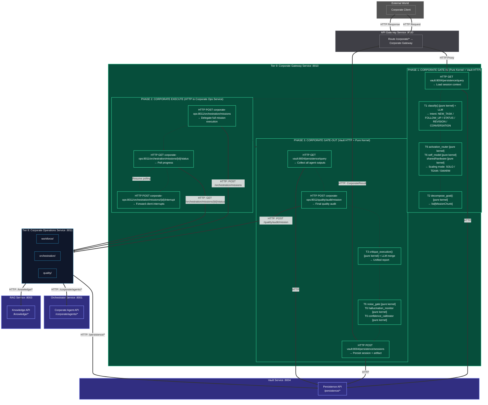
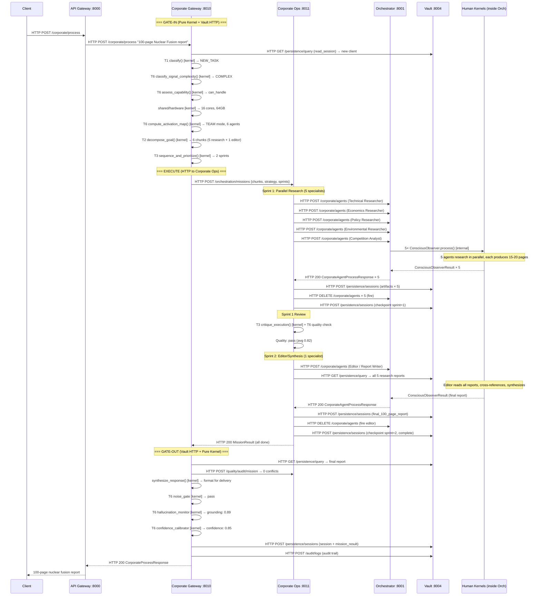
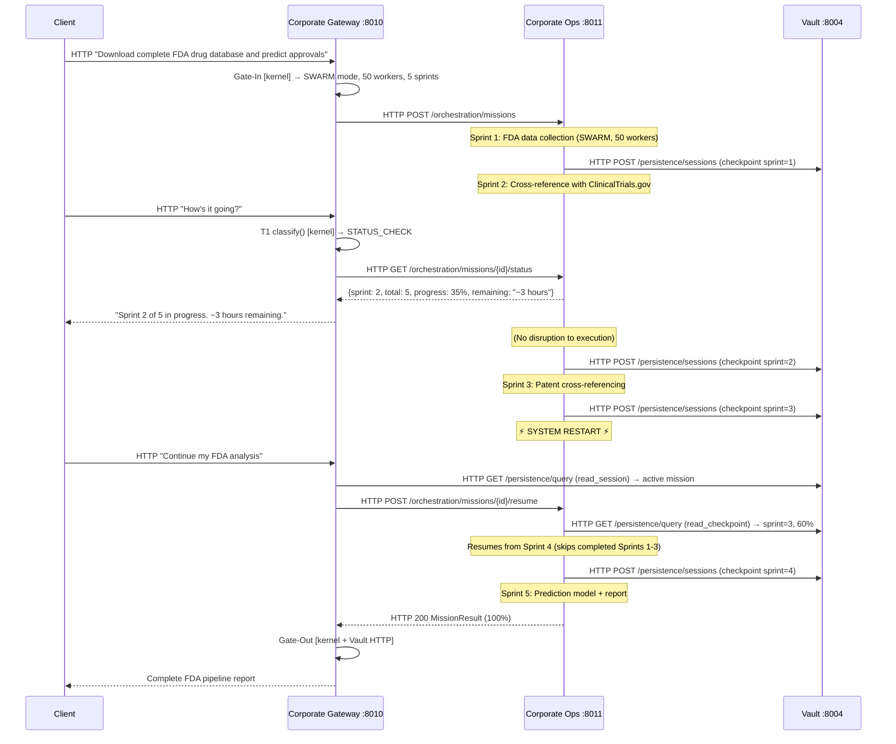

# Tier 9: Corporate Executive — v3 (Microservices Architecture)
 
## Overview
 
**Tier 9** is the apex of the entire Kea system — **one service**, **one entry point**, **one API**: `POST /corporate/process`.
 
The v2 consolidation absorbed all 5 v1 modules into internal phases of the Corporate Gateway. The v3 evolution takes this further: the Corporate Gateway is now a **standalone FastAPI microservice** (`corporate-gateway:8010`) that communicates with all other services exclusively via HTTP APIs.
 
| v1 Module | v2 Status | v3 Location |
|-----------|-----------|-------------|
| Corporate Gateway | **KEPT** | `services/corporate_gateway/main.py` — FastAPI service |
| Strategic Planner | **ABSORBED** | Gate-In phase → T6 `activation_router` + T6 `self_model` + `shared/hardware` (kernel imports) |
| Memory Cortex | **ABSORBED** | Gate-In/Out phases → Vault HTTP client |
| Synthesis Engine | **ABSORBED** | Gate-Out phase → T6 `noise_gate` + T3 `critique_execution()` (kernel imports) |
| Corporate Monitor | **ABSORBED** | Execute phase → delegated to Corporate Ops Service via HTTP |
 
---
 
## v2 → v3 Architecture Change: Monolithic → Microservices
 
The v2 architecture placed the Corporate Gateway in `kernel/corporate_gateway/` as an in-process module, with the final step being "Wire into Orchestrator service FastAPI endpoints." This created a **monolith**:
- The Orchestrator would contain both Human Kernel logic AND Corporation Kernel logic
- No independent deployment, no independent scaling
- Direct function calls to Tier 8 modules (also in-process)
 
The v3 architecture enforces **strict microservices boundaries**:
 
| Aspect | v2 (Monolithic) | v3 (Microservices) |
|--------|-----------------|-------------------|
| **Location** | `kernel/corporate_gateway/engine.py` embedded in Orchestrator | `services/corporate_gateway/` — independent service |
| **Entry Point** | `CorporateGateway.process()` (Python function call) | `POST corporate-gateway:8010/corporate/process` (HTTP API) |
| **Tier 8 access** | Direct `import kernel.workforce_manager` | `HTTP POST corporate-ops:8011/orchestration/missions` |
| **Vault access** | Direct `import kernel.shared_ledger` | `HTTP POST vault:8004/persistence/sessions` |
| **Deployment** | Baked into Orchestrator container | Independent container: `corporate-gateway:8010` |
| **Scaling** | Scales only with Orchestrator | Scales independently (stateless Gate-In/Out) |
| **Port** | N/A (shared with Orchestrator `:8001`) | `:8010` (own port, own process) |
 
**Separation Principle**: `kernel/corporate_gateway/` contains **pure logic** (intent classification, strategy assessment, response synthesis — no HTTP, no I/O). `services/corporate_gateway/` contains the **FastAPI service wrapper** that imports kernel logic and communicates with peer services via HTTP.
 
**Fractal Pattern**: The Corporate Gateway mirrors the Human Kernel's Conscious Observer:
 
| Phase | Conscious Observer (T7) | Corporate Gateway (T9) |
|-------|------------------------|----------------------|
| **Gate-In** | T5 genesis → T1 perception → T6 assessment → mode selection | Vault HTTP session → T1 classify intent → T6 assess scope → scaling mode |
| **Execute** | OODA loop with per-cycle CLM | HTTP delegation to Corporate Ops Service |
| **Gate-Out** | T6 hallucination → T6 confidence → T6 noise gate | Collect artifacts via Vault HTTP → resolve conflicts via Corporate Ops HTTP → T6 quality chain → Vault HTTP persist |
 
---
 
## Architecture & Flow
 

 
---
 
## Inter-Service Communication Map
 
The Corporate Gateway Service communicates with **3 peer services** via HTTP:
 
| Target Service | Purpose | HTTP Methods |
|---------------|---------|-------------|
| **Corporate Ops** `:8011` | Mission execution, quality audits | `POST /orchestration/missions`, `GET /orchestration/missions/{id}/status`, `POST /orchestration/missions/{id}/interrupt`, `POST /quality/audit/mission` |
| **Vault** `:8004` | Session management, artifact storage | `POST /persistence/sessions`, `GET /persistence/query`, `POST /audit/logs` |
| **RAG Service** `:8003` | Knowledge retrieval for intent/strategy | `POST /knowledge/search` |
 
**Key architectural difference from v2**: The Corporate Gateway **never calls the Orchestrator directly**. All Human Kernel management is delegated to the Corporate Operations Service. The Gateway is purely a strategic layer.
 
```
Client → API Gateway :8000 → Corporate Gateway :8010 → Corporate Ops :8011 → Orchestrator :8001 → Human Kernels
                                     ↕                       ↕                     ↕
                                Vault :8004             Vault :8004           MCP Host :8002
                                RAG :8003               RAG :8003             RAG :8003
```
 
---
 
## Corporate Gateway Service Definition
 
### FastAPI Application
 
**Location**: `services/corporate_gateway/main.py`
 
```python
# Service identity
SERVICE_NAME = "corporate_gateway"
SERVICE_PORT = 8010
 
# Routers
app.include_router(corporate_router, prefix="/corporate", tags=["Corporate"])
 
# Health
@app.get("/health")
async def health_check() -> dict: ...
```
 
### HTTP API Endpoints
 
| Method | Path | Description | Response |
|--------|------|-------------|----------|
| `POST` | `/corporate/process` | THE entry point — process a client request | `CorporateResult` |
| `GET`  | `/corporate/sessions/{session_id}` | Get session state | `SessionState` |
| `GET`  | `/corporate/missions/{mission_id}/status` | Get active mission status | `MissionStatusResponse` |
| `POST` | `/corporate/missions/{mission_id}/interrupt` | Send interrupt to active mission | `InterruptResponse` |
| `GET`  | `/corporate/history/{client_id}` | Search client history | `list[VaultArtifact]` |
| `GET`  | `/health` | Health check | `HealthResponse` |
 
### Request/Response Contracts
 
All models in `shared/schemas.py`:
 
```python
class CorporateProcessRequest(BaseModel):
    """THE entry point request for the Corporation Kernel."""
    request_id: str
    client_id: str
    session_id: str | None              # None = new session
    content: str                        # Natural language request
    attachments: list[Attachment] | None
    constraints: list[str] | None
    deadline_utc: str | None
    budget_limit: float | None
    trace_id: str
 
class Attachment(BaseModel):
    filename: str
    content_type: str
    content: str
    size_bytes: int
 
class CorporateProcessResponse(BaseModel):
    """THE entry point response — final output of the Corporation Kernel."""
    result_id: str
    trace_id: str
    request_id: str
    session_id: str
    intent: str                         # ClientIntent value
    response: SynthesizedResponse
    quality: CorporateQuality
    mission_summary: MissionSummary | None
    total_agents_hired: int
    total_agents_fired: int
    total_cost: float
    total_duration_ms: float
    gate_in_ms: float
    execute_ms: float
    gate_out_ms: float
```
 
---
 
## Lower-Tier Composition Map
 
Every function in the Corporate Gateway delegates to existing lower-tier modules (as kernel imports) or peer services (via HTTP). **Zero new kernel logic is invented.**
 
### Gate-In Phase Composition
 
| Gate-In Step | Delegates To | Access Method |
|-------------|-------------|---------------|
| Load session | Vault Service | **HTTP** `GET vault:8004/persistence/query` |
| Classify intent | T1 `classification.classify()` + LLM | **Kernel import** (pure logic) |
| Assess complexity | T6 `activation_router.classify_signal_complexity()` | **Kernel import** (pure logic) |
| Assess capability | T6 `self_model.assess_capability()` | **Kernel import** (pure logic) |
| Check hardware | `shared/hardware.get_hardware_profile()` | **Kernel import** (pure logic) |
| Select scaling mode | T6 `activation_router.compute_activation_map()` | **Kernel import** (pure logic) |
| Decompose objective | T2 `task_decomposition.decompose_goal()` | **Kernel import** (pure logic) |
| Estimate timeline | T3 `advanced_planning.sequence_and_prioritize()` | **Kernel import** (pure logic) |
| Resume checkpoint | Vault Service | **HTTP** `GET vault:8004/persistence/query` |
 
### Execute Phase Composition
 
| Execute Step | Delegates To | Access Method |
|-------------|-------------|---------------|
| Full mission execution | Corporate Ops Service | **HTTP** `POST corporate-ops:8011/orchestration/missions` |
| Poll progress | Corporate Ops Service | **HTTP** `GET corporate-ops:8011/orchestration/missions/{id}/status` |
| Handle interrupts | Corporate Ops Service | **HTTP** `POST corporate-ops:8011/orchestration/missions/{id}/interrupt` |
| Abort mission | Corporate Ops Service | **HTTP** `POST corporate-ops:8011/orchestration/missions/{id}/abort` |
 
### Gate-Out Phase Composition
 
| Gate-Out Step | Delegates To | Access Method |
|--------------|-------------|---------------|
| Collect artifacts | Vault Service | **HTTP** `GET vault:8004/persistence/query` |
| Final quality audit | Corporate Ops Service | **HTTP** `POST corporate-ops:8011/quality/audit/mission` |
| Synthesize report | T3 `reflection_and_guardrails.critique_execution()` + LLM | **Kernel import** (pure logic) |
| Quality gate | T6 `noise_gate.filter_output()` | **Kernel import** (pure logic) |
| Verify grounding | T6 `hallucination_monitor.verify_grounding()` | **Kernel import** (pure logic) |
| Calibrate confidence | T6 `confidence_calibrator.run_confidence_calibration()` | **Kernel import** (pure logic) |
| Persist session | Vault Service | **HTTP** `POST vault:8004/persistence/sessions` |
| Persist results | Vault Service | **HTTP** `POST vault:8004/persistence/sessions` |
| Audit log | Vault Service | **HTTP** `POST vault:8004/audit/logs` |
 
---
 
## Function Decomposition
 
### Pure Logic (kernel/corporate_gateway/)
 
Contains functions that perform **computation only** — no HTTP, no I/O, no service calls.
 
#### `classify_intent`
- **Signature**: `async classify_intent(request_content: str, session: SessionState | None, kit: InferenceKit | None = None) -> ClientIntent`
- **Description**: Determines client intent using T1 `classify()` for linguistic signals and Knowledge-Enhanced Inference for semantic understanding. Context-aware: active mission → likely STATUS_CHECK or INTERRUPT; no session → likely NEW_TASK; references prior work → FOLLOW_UP or REVISION.
- **Composes**: T1 `classification.classify()`
 
#### `assess_strategy`
- **Signature**: `async assess_strategy(request_content: str, session: SessionState | None, kit: InferenceKit | None = None) -> StrategyAssessment`
- **Description**: Evaluates objective complexity and selects approach:
  - T6 `classify_signal_complexity()` → complexity level
  - T6 `assess_capability()` → can we handle it? gaps?
  - `shared/hardware.get_hardware_profile()` → resource limits
  - Config thresholds → SOLO / TEAM / SWARM selection
- **Composes**: T6 `activation_router`, T6 `self_model`, `shared/hardware`
 
#### `synthesize_response`
- **Signature**: `async synthesize_response(artifacts: list[VaultArtifact], strategy: StrategyAssessment, quality_report: FinalQualityReport, kit: InferenceKit | None = None) -> SynthesizedResponse`
- **Description**: Merges all agent artifacts into a unified response. Approach varies by scaling mode:
  - **SOLO**: Direct pass-through with corporate formatting
  - **TEAM**: LLM-powered multi-source merge into cohesive narrative
  - **SWARM**: Map-reduce aggregation (statistical summary, combined dataset)
  Handles partial results gracefully — delivers what's available with gap annotations.
- **Composes**: Knowledge-Enhanced Inference, T3 `critique_execution()`
 
#### `handle_interrupt_logic`
- **Signature**: `handle_interrupt_logic(request_content: str, active_state: MissionState) -> InterruptClassification`
- **Description**: Classifies a client interrupt: STATUS_CHECK, SCOPE_CHANGE, or ABORT. Pure logic — does not execute the interrupt, just classifies it.
- **Composes**: T1 `classify()`
 
### Service Layer (services/corporate_gateway/routers/corporate.py)
 
Contains the HTTP orchestration that calls external services.
 
#### `process` — THE Entry Point (endpoint handler: `POST /corporate/process`)
- **Signature**: `async process(request: CorporateProcessRequest) -> CorporateProcessResponse`
- **Description**: The ONE and ONLY entry point for the Corporation Kernel. All client interactions flow through this HTTP endpoint. Orchestrates the three phases: Gate-In, Execute, Gate-Out. Handles all 6 interaction patterns. Returns the final response, metadata, and session state.
- **Flow**: `_corporate_gate_in()` → `_corporate_execute()` → `_corporate_gate_out()`
 
#### `_corporate_gate_in` — Phase 1 (internal)
- **Flow**:
  1. `HTTP GET vault:8004/persistence/query` — Load session context
  2. `classify_intent()` — **pure kernel call**
  3. Fast-path: If STATUS_CHECK → poll Corporate Ops for status, skip to Gate-Out
  4. Fast-path: If FOLLOW_UP → `HTTP GET vault:8004/persistence/query` (recall memory), skip to Gate-Out
  5. `assess_strategy()` — **pure kernel call**
  6. T2 `decompose_goal()` — **pure kernel call** (skip for CONVERSATION)
  7. T3 `sequence_and_prioritize()` — **pure kernel call**
  8. `HTTP GET vault:8004/persistence/query` — Check for resumable checkpoint
- **HTTP Calls**: Vault Service
- **Pure Kernel Calls**: T1 classify, T2 decompose, T3 plan, T6 activation_router, T6 self_model, shared/hardware
 
#### `_corporate_execute` — Phase 2 (internal)
- **Flow**:
  1. `HTTP POST corporate-ops:8011/orchestration/missions` — Delegate full execution
  2. Poll: `HTTP GET corporate-ops:8011/orchestration/missions/{id}/status`
  3. If client sends interrupt: `HTTP POST corporate-ops:8011/orchestration/missions/{id}/interrupt`
  4. Wait for completion or timeout
- **HTTP Calls**: Corporate Operations Service
- **Pure Kernel Calls**: None (fully delegated to T8 service)
 
#### `_corporate_gate_out` — Phase 3 (internal)
- **Flow**:
  1. `HTTP GET vault:8004/persistence/query` — Collect all artifacts
  2. `HTTP POST corporate-ops:8011/quality/audit/mission` — Final quality audit
  3. `synthesize_response()` — **pure kernel call** (LLM merge)
  4. T6 `noise_gate.filter_output()` — **pure kernel call**
  5. T6 `hallucination_monitor.verify_grounding()` — **pure kernel call**
  6. T6 `confidence_calibrator.run_confidence_calibration()` — **pure kernel call**
  7. `HTTP POST vault:8004/persistence/sessions` — Persist session
  8. `HTTP POST vault:8004/persistence/sessions` — Persist result artifact
  9. `HTTP POST vault:8004/audit/logs` — Audit trail
- **HTTP Calls**: Vault Service, Corporate Operations Service
- **Pure Kernel Calls**: T3 critique_execution, T6 noise_gate, T6 hallucination_monitor, T6 confidence_calibrator
 
---
 
## Client Interaction Patterns
 
The Corporate Gateway classifies every incoming request into one of six intent patterns. Each triggers a **different execution path**, avoiding unnecessary work.
 
### Pattern 1: NEW_TASK (Full Pipeline)
 
```
Client: HTTP POST /corporate/process
        "Analyze all FDA drug submissions since 2000"
 
Gate-In:
  1. HTTP GET vault:8004 → None (new client)
  2. T1 classify() [kernel] → NEW_TASK
  3. T6 classify_signal_complexity() [kernel] → COMPLEX
  4. T6 assess_capability() [kernel] → can_handle=true
  5. shared/hardware [kernel] → 8 cores, 32GB RAM
  6. T6 compute_activation_map() [kernel] → TEAM mode, 5 agents
  7. T2 decompose_goal() [kernel] → 5 MissionChunks across 3 sprints
  8. T3 sequence_and_prioritize() [kernel] → Sprint plan with timeline
 
Execute:
  1. HTTP POST corporate-ops:8011/orchestration/missions
     {chunks, strategy, sprint_plan}
  2. Corporate Ops internally:
     Sprint 1: Data Collection (2 specialists, parallel)
     Sprint 2: Analysis (2 specialists, parallel)
     Sprint 3: Synthesis + Report (1 specialist)
  3. HTTP GET corporate-ops:8011/orchestration/missions/{id}/status (polling)
  4. Wait for completion
 
Gate-Out:
  1. HTTP GET vault:8004 → all artifacts
  2. HTTP POST corporate-ops:8011/quality/audit/mission → 0 conflicts
  3. synthesize_response() [kernel] + LLM → unified 50-page report
  4. T6 quality chain [kernel] → pass
  5. HTTP POST vault:8004 → persist session + artifact + audit log
```
 
### Pattern 2: FOLLOW_UP (Memory Recall — No Execute Phase)
 
```
Client: HTTP POST /corporate/process
        "What was the database schema from the inventory app?"
 
Gate-In:
  1. HTTP GET vault:8004 → conversation history
  2. T1 classify() [kernel] → FOLLOW_UP
  3. HTTP GET vault:8004 → semantic search("database schema inventory app")
     → VaultArtifact (the database design from prior mission)
 
Gate-Out (skip Execute):
  1. Format recalled artifact as response
  2. HTTP POST vault:8004 → append to session
  3. Return → no agents spawned, no Corporate Ops call
```
 
### Pattern 3: STATUS_CHECK (Instant Report — No Execute Phase)
 
```
Client: HTTP POST /corporate/process
        "What's the progress on my FDA analysis?"
 
Gate-In:
  1. HTTP GET vault:8004 → active mission detected
  2. T1 classify() [kernel] → STATUS_CHECK
 
Execute (lightweight — single HTTP call):
  1. HTTP GET corporate-ops:8011/orchestration/missions/{id}/status
     → sprint 2 of 3, 67% complete, 2 agents active, ~45 min remaining
 
Gate-Out:
  1. Format status report (natural language)
  2. Return → zero agents spawned, zero Vault writes
```
 
### Pattern 4: REVISION (Delta Merge)
 
```
Client: HTTP POST /corporate/process
        "Change the database to PostgreSQL instead of MySQL"
 
Gate-In:
  1. HTTP GET vault:8004 → prior work
  2. T1 classify() [kernel] → REVISION
  3. HTTP GET vault:8004 → recall("database design") → original artifact
  4. T6 classify_signal_complexity() [kernel] → SIMPLE
  5. SOLO mode → 1 specialist
 
Execute:
  1. HTTP POST corporate-ops:8011/orchestration/missions
     {1 chunk, SOLO mode, revision context}
  2. Corporate Ops hires 1 Database Developer specialist
  3. Specialist produces revised artifact
  4. Corporate Ops fires specialist
 
Gate-Out:
  1. HTTP GET vault:8004 → revised artifact
  2. synthesize_response() [kernel] → delta merge with original
  3. T6 quality chain [kernel] → pass
  4. HTTP POST vault:8004 → persist revised artifact, update session
```
 
### Pattern 5: CONVERSATION (SOLO Dialogue)
 
```
Client: HTTP POST /corporate/process
        "What do you think about using microservices vs monolith?"
 
Gate-In:
  1. HTTP GET vault:8004 → context
  2. T1 classify() [kernel] → CONVERSATION
  3. SOLO mode → 1 domain expert
 
Execute:
  1. HTTP POST corporate-ops:8011/orchestration/missions
     {1 conversational chunk, SOLO mode}
  2. Corporate Ops hires Software Architect specialist
  3. Conversational exchange
  4. Corporate Ops fires after response
 
Gate-Out:
  1. Format conversational response
  2. HTTP POST vault:8004 → append turn
```
 
### Pattern 6: INTERRUPT (Mid-Execution)
 
```
Client sends HTTP POST /corporate/process while mission is running:
 
Gate-In:
  1. HTTP GET vault:8004 → active mission detected
  2. T1 classify() [kernel] → determine interrupt type:
     a. STATUS_CHECK → Pattern 3 (instant report, no disruption)
     b. SCOPE_CHANGE → Forward to Corporate Ops
     c. ABORT → Forward to Corporate Ops
 
Execute (for SCOPE_CHANGE):
  1. HTTP POST corporate-ops:8011/orchestration/missions/{id}/interrupt
     {type: "scope_change", new_objective: "..."}
  2. Corporate Ops internally: pause workforce, re-decompose, adjust sprints
  3. Corporate Ops resumes execution
 
Execute (for ABORT):
  1. HTTP POST corporate-ops:8011/orchestration/missions/{id}/abort
  2. Corporate Ops internally: graceful termination, collect partial results
  3. Return partial results
 
Gate-Out:
  1. Acknowledge interrupt + current state
  2. Continue mission (or return partial results if ABORT)
```
 
---
 
## End-to-End Walkthrough: Research Synthesis Swarm (Stress Test #20)
 
**"Research Synthesis Swarm"** — 5 parallel research agents + 1 editor, producing a 100-page nuclear fusion report. All interactions are HTTP.
 

 
---
 
## End-to-End: Long-Running with Interrupts (Query #14)
 

 
---
 
## Types
 
```python
class ClientIntent(StrEnum):
    NEW_TASK = "new_task"
    FOLLOW_UP = "follow_up"
    STATUS_CHECK = "status_check"
    REVISION = "revision"
    CONVERSATION = "conversation"
    INTERRUPT = "interrupt"
 
class ScalingMode(StrEnum):
    SOLO = "solo"                       # 1 agent
    TEAM = "team"                       # 2-10 agents
    SWARM = "swarm"                     # 10-100K agents
 
class StrategyAssessment(BaseModel):
    complexity: str                     # From T6 activation_router
    scaling_mode: ScalingMode
    estimated_agents: int
    estimated_sprints: int
    estimated_duration_ms: float
    hardware_max_parallel: int          # From shared/hardware
    capability_gaps: list[str]          # Domains without profiles
    risk_level: str                     # "low" / "medium" / "high"
 
class CorporateGateInResult(BaseModel):
    request: CorporateProcessRequest
    session: SessionState | None
    intent: ClientIntent
    strategy: StrategyAssessment | None
    chunks: list[MissionChunk] | None
    sprints: list[Sprint] | None
    checkpoint: CheckpointState | None  # For resumable missions
    gate_in_duration_ms: float
 
class CorporateExecuteResult(BaseModel):
    mission_result: MissionResult | None
    status_report: str | None           # For STATUS_CHECK
    interrupts_handled: int
    execute_duration_ms: float
 
class SynthesizedResponse(BaseModel):
    title: str
    executive_summary: str
    full_content: str
    sections: list[ResponseSection]
    source_agents: list[str]
    confidence_map: dict[str, float]
    gaps: list[str]
    is_partial: bool
 
class ResponseSection(BaseModel):
    section_id: str
    title: str
    content: str
    domain: str
    source_agent_id: str
    confidence: float
 
class CorporateQuality(BaseModel):
    overall_confidence: float
    completeness_pct: float
    conflict_free: bool
    grounding_score: float
    quality_score: float
    flags: list[str]
 
class MissionSummary(BaseModel):
    total_sprints: int
    completed_sprints: int
    total_agents: int
    total_artifacts: int
    scaling_mode: ScalingMode
    duration_ms: float
    was_resumed: bool                   # Resumed from checkpoint?
 
class InterruptResponse(BaseModel):
    interrupt_type: str
    response_content: str
    mission_impact: str                 # "none" / "paused" / "adjusted" / "aborted"
 
class InterruptClassification(BaseModel):
    interrupt_type: str                 # "status_check" / "scope_change" / "abort"
    confidence: float
    reasoning: str
```
 
---
 
## HTTP Client Pattern
 
The Corporate Gateway uses HTTP clients following the established project pattern (`services/api_gateway/clients/orchestrator.py`):
 
```python
class CorporateOpsClient:
    """HTTP client for Corporate Operations Service."""
 
    def __init__(self) -> None:
        self._base_url = ServiceRegistry.get_url(ServiceName.CORPORATE_OPS)
        self._settings = get_settings()
        self._timeout = self._settings.corporate.orchestrator_timeout_ms / 1000.0
        self._max_retries = self._settings.corporate.http_max_retries
        self._retry_base = self._settings.corporate.http_retry_base_delay
        self._log = get_logger(__name__)
 
    async def start_mission(
        self, chunks: list[MissionChunk], strategy: StrategyAssessment, sprints: list[Sprint]
    ) -> MissionResult:
        """HTTP POST /orchestration/missions — delegate full mission execution."""
        response = await self._request("POST", "/orchestration/missions", json={
            "chunks": [c.model_dump() for c in chunks],
            "strategy": strategy.model_dump(),
            "sprints": [s.model_dump() for s in sprints],
        })
        return MissionResult.model_validate(response.json())
 
    async def get_mission_status(self, mission_id: str) -> dict:
        """HTTP GET /orchestration/missions/{id}/status"""
        response = await self._request("GET", f"/orchestration/missions/{mission_id}/status")
        return response.json()
 
    async def send_interrupt(self, mission_id: str, interrupt: InterruptClassification) -> InterruptResponse:
        """HTTP POST /orchestration/missions/{id}/interrupt"""
        response = await self._request("POST", f"/orchestration/missions/{mission_id}/interrupt",
            json=interrupt.model_dump())
        return InterruptResponse.model_validate(response.json())
 
    async def audit_mission(self, mission_id: str) -> FinalQualityReport:
        """HTTP POST /quality/audit/mission"""
        response = await self._request("POST", "/quality/audit/mission",
            json={"mission_id": mission_id})
        return FinalQualityReport.model_validate(response.json())
 
    async def _request(self, method: str, path: str, **kwargs) -> httpx.Response:
        """HTTP request with retry + exponential backoff (tenacity pattern)."""
        last_error: Exception | None = None
        for attempt in range(self._max_retries + 1):
            try:
                async with httpx.AsyncClient(timeout=self._timeout) as client:
                    response = await client.request(
                        method, f"{self._base_url}{path}", **kwargs
                    )
                    response.raise_for_status()
                    return response
            except (httpx.TimeoutException, httpx.ConnectError) as exc:
                last_error = exc
                if attempt < self._max_retries:
                    delay = self._retry_base * (2 ** attempt)
                    self._log.warning(
                        "corporate_ops_retry",
                        attempt=attempt + 1,
                        delay=delay,
                        path=path,
                        error=str(exc),
                    )
                    await asyncio.sleep(delay)
        raise last_error  # type: ignore[misc]
```
 
---
 
## Configuration
 
Extends `CorporateSettings` in `shared/config.py` (shared with Tier 8):
 
```python
class CorporateSettings(BaseModel):
    # ... (Tier 8 settings from tier_8_architecture.md) ...
 
    # --- Corporate Gateway ---
    gateway_max_concurrent_missions: int = 10
    gateway_session_timeout_ms: float = 3_600_000.0   # 1 hour
    gateway_interrupt_poll_ms: float = 2000.0
 
    # --- Strategic Assessment (Gate-In) ---
    solo_max_domains: int = 1
    team_max_agents: int = 10
    swarm_min_agents: int = 10
    timeline_buffer_pct: float = 1.2                  # 20% buffer
 
    # --- Synthesis (Gate-Out) ---
    synthesis_max_tokens: int = 8192
    partial_result_threshold: float = 0.5              # Accept if >= 50% complete
    quality_gate_min_score: float = 0.6
 
    # --- HTTP Client Settings ---
    corporate_ops_timeout_ms: float = 300000.0         # 5 min (missions can be long)
    vault_timeout_ms: float = 10000.0
    rag_timeout_ms: float = 10000.0
    http_max_retries: int = 3
    http_retry_base_delay: float = 2.0
    mission_poll_interval_ms: float = 5000.0           # Poll Corporate Ops every 5s
```
 
Service URL registered in `ServiceSettings`:
 
```python
class ServiceSettings(BaseModel):
    # ... existing services ...
    corporate_gateway: str = "http://localhost:8010"
    corporate_ops: str = "http://localhost:8011"
```
 
---
 
## Full Tier Hierarchy (Tiers 0-9) — Microservices View
 
```
Tier 9: Corporate Executive (1 service + 1 kernel module)
├── services/corporate_gateway/                    ← FastAPI SERVICE :8010
│   ├── main.py                                    ← FastAPI app (THE entry point)
│   ├── routers/corporate.py                       ← POST /corporate/process
│   └── clients/                                   ← HTTP clients for peers
│       ├── corporate_ops_client.py                ← Calls Corporate Ops :8011
│       └── vault_ledger.py                        ← Calls Vault :8004
└── kernel/corporate_gateway/                      ← PURE LOGIC (no HTTP)
    ├── engine.py                                  ← classify_intent(), assess_strategy(), synthesize_response()
    └── types.py                                   ← ClientIntent, StrategyAssessment, etc.
 
Tier 8: Corporate Operations (1 service + 3 kernel modules)
├── services/corporate_ops/                        ← FastAPI SERVICE :8011
│   ├── main.py                                    ← FastAPI app
│   ├── routers/
│   │   ├── workforce.py                           ← /workforce/* (calls Orchestrator HTTP)
│   │   ├── orchestration.py                       ← /orchestration/* (calls Orchestrator HTTP)
│   │   └── quality.py                             ← /quality/* (calls Vault HTTP)
│   └── clients/
│       ├── orchestrator_client.py                 ← Calls Orchestrator :8001
│       └── vault_ledger.py                        ← Calls Vault :8004
├── kernel/workforce_manager/                      ← PURE LOGIC
├── kernel/team_orchestrator/                      ← PURE LOGIC
└── kernel/quality_resolver/                       ← PURE LOGIC
 
Tier 7: Conscious Observer (Inside Orchestrator Service :8001)
├── kernel/conscious_observer/                     ← Human Kernel Apex
│   ├── Gate-In: T5 genesis → T1 perception → T6 assessment
│   ├── Execute: OODA loop + CLM interception
│   └── Gate-Out: T6 hallucination → T6 confidence → T6 noise gate
└── services/orchestrator/main.py                  ← Exposes /corporate/agents/* API
 
Tier 6: Metacognitive Oversight (kernel/ — importable by any service)
├── self_model, activation_router, cognitive_load_monitor
├── hallucination_monitor, confidence_calibrator, noise_gate
 
Tier 5: Autonomous Ego (kernel/ — importable by any service)
├── lifecycle_controller, energy_and_interrupts
 
Tier 4: Execution Engine (kernel/ — importable by any service)
├── ooda_loop, short_term_memory, async_multitasking
 
Tier 3: Complex Orchestration (kernel/ — importable by any service)
├── graph_synthesizer, node_assembler, advanced_planning, reflection_and_guardrails
 
Tier 2: Cognitive Engines (kernel/ — importable by any service)
├── task_decomposition, curiosity_engine, what_if_scenario, attention_and_plausibility
 
Tier 1: Core Processing (kernel/ — importable by any service)
├── modality, classification, intent_sentiment_urgency, entity_recognition
├── validation, scoring, location_and_time
 
Tier 0: Foundation (shared/ — importable by any service)
├── schemas, config, logging, hardware, standard_io, inference_kit
├── service_registry, corporate_ledger
```
 
**Service count**: 2 new services (Corporate Gateway `:8010`, Corporate Ops `:8011`) joining the existing 8 services. Total: **10 microservices**.
 
---
 
## Deployment & Containerization
 
### Docker Compose Addition
 
```yaml
corporate-gateway:
    build:
      context: .
      target: corporate-gateway
    ports:
      - "8010:8010"
    environment:
      - SERVICE_URL_CORPORATE_OPS=http://corporate-ops:8011
      - SERVICE_URL_VAULT=http://vault:8004
      - SERVICE_URL_RAG_SERVICE=http://rag-service:8003
    depends_on:
      - corporate-ops
      - vault
      - rag-service
    networks:
      - kea-network
 
corporate-ops:
    build:
      context: .
      target: corporate-ops
    ports:
      - "8011:8011"
    environment:
      - SERVICE_URL_ORCHESTRATOR=http://orchestrator:8001
      - SERVICE_URL_VAULT=http://vault:8004
      - SERVICE_URL_RAG_SERVICE=http://rag-service:8003
      - SERVICE_URL_SWARM_MANAGER=http://swarm-manager:8005
    depends_on:
      - orchestrator
      - vault
      - rag-service
      - swarm-manager
    networks:
      - kea-network
```
 
### API Gateway Routing Update
 
The existing API Gateway (`services/api_gateway/`) should proxy corporate routes:
 
```python
# services/api_gateway/routes/corporate.py
@router.post("/corporate/process")
async def corporate_process(request: CorporateProcessRequest):
    """Proxy to Corporate Gateway Service."""
    corporate_url = ServiceRegistry.get_url(ServiceName.CORPORATE_GATEWAY)
    async with httpx.AsyncClient(timeout=settings.corporate.corporate_ops_timeout_ms / 1000.0) as client:
        response = await client.post(f"{corporate_url}/corporate/process", json=request.model_dump())
        return response.json()
```
 
### Kubernetes Deployment
 
```yaml
apiVersion: apps/v1
kind: Deployment
metadata:
  name: corporate-gateway
spec:
  replicas: 3                          # Stateless — scale freely
  selector:
    matchLabels:
      app: corporate-gateway
  template:
    spec:
      containers:
      - name: corporate-gateway
        image: kea/corporate-gateway:latest
        ports:
        - containerPort: 8010
        env:
        - name: SERVICE_URL_CORPORATE_OPS
          value: "http://corporate-ops-svc:8011"
        - name: SERVICE_URL_VAULT
          value: "http://vault-svc:8004"
        resources:
          requests:
            cpu: "500m"
            memory: "1Gi"
          limits:
            cpu: "2"
            memory: "4Gi"
```
 
---
 
## Implementation Sequence
 
### Phase 1: Tier 8 (see tier_8_architecture.md)
1. Kernel pure logic: workforce_manager, team_orchestrator, quality_resolver (types + engine)
2. Shared infrastructure: CorporateSettings, ServiceName extensions, schemas
3. Corporate Operations Service: clients, routers, main.py
 
### Phase 2: Tier 9
4. `kernel/corporate_gateway/types.py` — ClientIntent, StrategyAssessment, SynthesizedResponse, etc.
5. `kernel/corporate_gateway/engine.py` — Pure logic:
   - `classify_intent()` — T1 composition
   - `assess_strategy()` — T6 + hardware composition
   - `synthesize_response()` — LLM merge
   - `handle_interrupt_logic()` — T1 composition
6. `services/corporate_gateway/clients/corporate_ops_client.py` — HTTP client
7. `services/corporate_gateway/clients/vault_ledger.py` — HTTP client
8. `services/corporate_gateway/routers/corporate.py` — HTTP endpoints:
   - `POST /corporate/process` — THE entry point (gate_in → execute → gate_out)
   - `GET /corporate/sessions/{id}` — session state
   - `GET /corporate/missions/{id}/status` — mission status proxy
   - `POST /corporate/missions/{id}/interrupt` — interrupt proxy
9. `services/corporate_gateway/main.py` — FastAPI app assembly
 
### Phase 3: Orchestrator Enhancement
10. Add `POST /corporate/agents` endpoint to Orchestrator
11. Add `POST /corporate/agents/{id}/process` endpoint
12. Add `DELETE /corporate/agents/{id}` endpoint
13. Add `GET /corporate/agents/{id}/status` endpoint
14. Add `POST /corporate/agents/batch` endpoint
 
### Phase 4: Integration
15. Update API Gateway with `/corporate/*` proxy routes
16. Update `kernel/__init__.py` with T8 + T9 exports
17. Add Docker Compose entries for both new services
18. Add Kubernetes manifests for both new services
19. Update docker-compose.yml service dependency graph