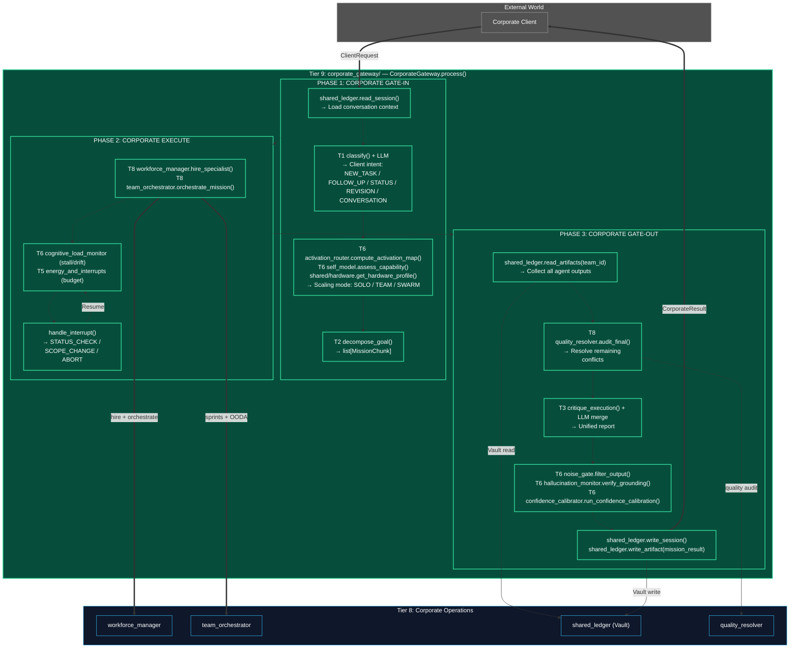
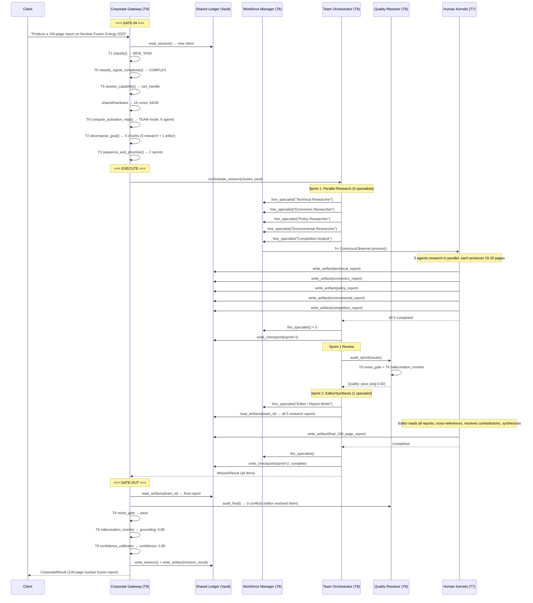
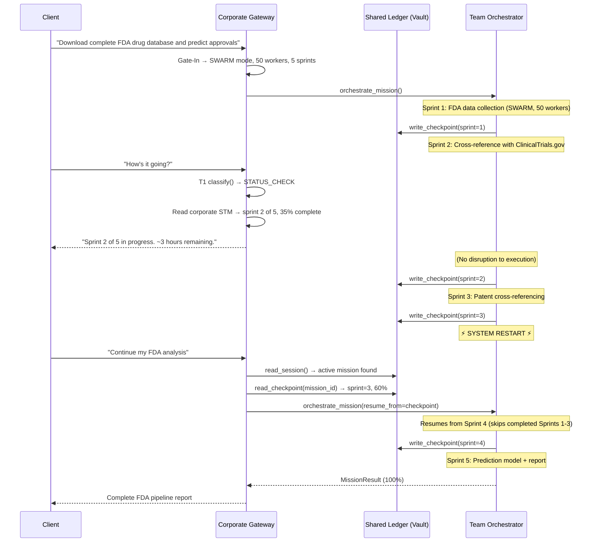

# Tier 9: Corporate Executive — v2 (Single Module, Maximum Composition)

## Overview

**Tier 9** is the apex of the entire Kea system — **one module**, **one entry point**, **one function**: `CorporateGateway.process()`.

The v1 architecture split Tier 9 into 5 separate modules (Corporate Gateway, Strategic Planner, Memory Cortex, Synthesis Engine, Corporate Monitor). The v2 consolidation absorbs all of them into **internal phases** of the Corporate Gateway, because each "module" was just a thin wrapper over existing lower-tier functions.

| v1 Module | v2 Status | Now Lives In |
|-----------|-----------|-------------|
| Corporate Gateway | **KEPT** | `corporate_gateway/engine.py` — THE entry point |
| Strategic Planner | **ABSORBED** | Gate-In phase → T6 `activation_router` + T6 `self_model` + `shared/hardware` |
| Memory Cortex | **ABSORBED** | Gate-In/Out phases → `shared_ledger` (Vault bridge) |
| Synthesis Engine | **ABSORBED** | Gate-Out phase → T6 `noise_gate` + T3 `critique_execution()` |
| Corporate Monitor | **ABSORBED** | Execute phase → T6 `cognitive_load_monitor` + T5 `energy_and_interrupts` |

**Fractal Pattern**: The Corporate Gateway mirrors the Human Kernel's Conscious Observer:

| Phase | Conscious Observer (T7) | Corporate Gateway (T9) |
|-------|------------------------|----------------------|
| **Gate-In** | T5 genesis → T1 perception → T6 assessment → mode selection | Vault session → T1 classify intent → T6 assess scope → scaling mode |
| **Execute** | OODA loop with per-cycle CLM | Sprint-based orchestration via T8 with corporate OODA monitoring |
| **Gate-Out** | T6 hallucination → T6 confidence → T6 noise gate | Collect artifacts → resolve conflicts → synthesize → T6 quality chain → Vault persist |

**Location**: `kernel/corporate_gateway/` — single module, `engine.py` / `types.py` / `__init__.py`.

---

## Architecture & Flow



---

## Lower-Tier Composition Map

Every function in the Corporate Gateway delegates to existing lower-tier modules. **Zero new kernel logic is invented.**

### Gate-In Phase Composition

| Gate-In Step | Delegates To | Purpose |
|-------------|-------------|---------|
| Load session | `shared_ledger.read_session()` → Vault | Resume conversation context |
| Classify intent | T1 `classification.classify()` + LLM | NEW_TASK / FOLLOW_UP / STATUS_CHECK / REVISION / CONVERSATION |
| Assess complexity | T6 `activation_router.classify_signal_complexity()` | TRIVIAL → SOLO, COMPLEX → TEAM, etc. |
| Assess capability | T6 `self_model.assess_capability()` | Can we handle this? Capability gaps? |
| Check hardware | `shared/hardware.get_hardware_profile()` | How many agents can we spawn? |
| Select scaling mode | T6 `activation_router.compute_activation_map()` | SOLO / TEAM / SWARM |
| Decompose objective | T2 `task_decomposition.decompose_goal()` | Break into MissionChunks |
| Estimate timeline | T3 `advanced_planning.sequence_and_prioritize()` | Sprint count × estimated sprint time |
| Resume checkpoint | `shared_ledger.read_checkpoint()` | For long-running resumable missions |

### Execute Phase Composition

| Execute Step | Delegates To | Purpose |
|-------------|-------------|---------|
| Hire specialists | T8 `workforce_manager.hire_specialist()` | JIT agent spawning |
| Orchestrate sprints | T8 `team_orchestrator.orchestrate_mission()` | Sprint-based execution |
| Monitor progress | T6 `cognitive_load_monitor.monitor_cognitive_load()` | Stall/drift detection |
| Track budget | T5 `energy_and_interrupts.track_budget()` | Cost monitoring |
| Handle interrupts | T5 `energy_and_interrupts.handle_interrupt()` | Client interrupts |
| Status reports | T8 `team_orchestrator` state inspection | Progress % from corporate STM |

### Gate-Out Phase Composition

| Gate-Out Step | Delegates To | Purpose |
|--------------|-------------|---------|
| Collect artifacts | `shared_ledger.read_artifacts(team_id)` | Gather all agent outputs from Vault |
| Resolve conflicts | T8 `quality_resolver.audit_final()` | Final conflict resolution pass |
| Synthesize report | T3 `reflection_and_guardrails.critique_execution()` + LLM | Merge multi-source into unified report |
| Quality gate | T6 `noise_gate.filter_output()` | Output quality threshold |
| Verify grounding | T6 `hallucination_monitor.verify_grounding()` | Fact-check the synthesis |
| Calibrate confidence | T6 `confidence_calibrator.run_confidence_calibration()` | Corporate confidence score |
| Persist session | `shared_ledger.write_session()` | Conversation continuity |
| Persist results | `shared_ledger.write_artifact(mission_result)` | Episodic memory for future recall |

---

## Configuration

Extends `CorporateSettings` in `shared/config.py`:

```python
class CorporateSettings(BaseModel):
    # ... (Tier 8 settings) ...

    # --- Corporate Gateway ---
    gateway_max_concurrent_missions: int = 10
    gateway_session_timeout_ms: float = 3_600_000.0   # 1 hour
    gateway_interrupt_poll_ms: float = 2000.0

    # --- Strategic Assessment (Gate-In) ---
    solo_max_domains: int = 1
    team_max_agents: int = 10
    swarm_min_agents: int = 10
    timeline_buffer_pct: float = 1.2                  # 20% buffer

    # --- Synthesis (Gate-Out) ---
    synthesis_max_tokens: int = 8192
    partial_result_threshold: float = 0.5              # Accept if >= 50% complete
    quality_gate_min_score: float = 0.6
```

---

## Client Interaction Patterns

The Corporate Gateway classifies every incoming request into one of six intent patterns. Each triggers a **different execution path**, avoiding unnecessary work.

### Pattern 1: NEW_TASK (Full Pipeline)

```
Client: "Analyze all FDA drug submissions since 2000"

Gate-In:
  1. shared_ledger.read_session() → None (new client)
  2. T1 classify() → NEW_TASK
  3. T6 classify_signal_complexity() → COMPLEX
  4. T6 assess_capability() → can_handle=true
  5. shared/hardware → 8 cores, 32GB RAM
  6. T6 compute_activation_map() → TEAM mode, 5 agents
  7. T2 decompose_goal() → 5 MissionChunks across 3 sprints
  8. T3 sequence_and_prioritize() → Sprint plan with timeline

Execute:
  Sprint 1: Data Collection (2 specialists, parallel)
  Sprint 2: Analysis (2 specialists, parallel)
  Sprint 3: Synthesis + Report (1 specialist)
  [Corporate OODA monitors throughout]
  [Checkpoints after each sprint]

Gate-Out:
  1. shared_ledger.read_artifacts(team_id) → all outputs
  2. quality_resolver.audit_final() → resolve conflicts
  3. LLM merge → unified 50-page report
  4. T6 quality chain → pass
  5. shared_ledger.write_session() + write_artifact(result)
```

### Pattern 2: FOLLOW_UP (Memory Recall)

```
Client: "What was the database schema from the inventory app?"

Gate-In:
  1. shared_ledger.read_session(session_id) → conversation history
  2. T1 classify() → FOLLOW_UP
  3. shared_ledger.recall_memory(client_id, "database schema inventory app")
     → VaultArtifact (the database design from prior mission)

Gate-Out (skip Execute):
  1. Format recalled artifact as response
  2. shared_ledger.write_session() → append this turn
  3. Return → no agents spawned
```

### Pattern 3: STATUS_CHECK (Instant Report, No Agents)

```
Client: "What's the progress on my FDA analysis?"

Gate-In:
  1. shared_ledger.read_session(session_id) → active mission
  2. T1 classify() → STATUS_CHECK

Execute (lightweight):
  1. Read active mission state from team_orchestrator's corporate STM
  2. Compute: sprint 2 of 3, 67% complete, 2 agents active
  3. T3 advanced_planning time estimate → ~45 minutes remaining

Gate-Out:
  1. Format status report (natural language)
  2. Return → zero agents spawned, zero Vault writes
```

### Pattern 4: REVISION (Delta Merge)

```
Client: "Change the database to PostgreSQL instead of MySQL"

Gate-In:
  1. shared_ledger.read_session(session_id) → prior work
  2. T1 classify() → REVISION
  3. shared_ledger.recall_memory("database design") → original artifact
  4. T6 classify_signal_complexity() → SIMPLE (single change)
  5. SOLO mode → 1 specialist

Execute:
  1. Hire Database Developer specialist
  2. Feed: original artifact + revision instruction
  3. Specialist produces revised artifact
  4. Fire specialist

Gate-Out:
  1. Merge revised artifact with original (delta merge)
  2. T6 quality chain → pass
  3. shared_ledger: persist revised artifact, update session
```

### Pattern 5: CONVERSATION (SOLO Dialogue)

```
Client: "What do you think about using microservices vs monolith?"

Gate-In:
  1. shared_ledger.read_session(session_id) → context
  2. T1 classify() → CONVERSATION
  3. SOLO mode → 1 domain expert

Execute:
  1. Hire Software Architect specialist
  2. Conversational exchange (multi-turn within single process() call)
  3. Fire after response

Gate-Out:
  1. Format conversational response
  2. shared_ledger.write_session() → append turn
```

### Pattern 6: INTERRUPT (Mid-Execution)

```
Client sends message while mission is running:

Gate-In:
  1. shared_ledger.read_session(session_id) → active mission detected
  2. T1 classify() → determine interrupt type:
     a. STATUS_CHECK → Pattern 3 (instant report, no disruption)
     b. SCOPE_CHANGE → Pause workforce, re-decompose, adjust sprints
     c. ABORT → Gracefully terminate all agents, collect partial results

Execute (for SCOPE_CHANGE):
  1. T5 handle_interrupt() → pause signal to workforce
  2. T2 decompose_goal() with revised objective
  3. Adjust remaining sprints
  4. Resume execution

Gate-Out:
  1. Acknowledge interrupt + current state
  2. Continue mission (or return partial results if ABORT)
```

---

## Function Decomposition

### `process` — THE Entry Point

- **Signature**: `async process(request: ClientRequest, kit: InferenceKit | None = None) -> Result`
- **Returns**: `Result` containing `CorporateResult`
- **Description**: The ONE and ONLY entry point for the Corporation Kernel. All client interactions flow through this function. Orchestrates the three phases: Gate-In, Execute, Gate-Out. Handles all 6 interaction patterns. Returns the final response, metadata, and session state.
- **Calls**: `_corporate_gate_in()`, `_corporate_execute()`, `_corporate_gate_out()`

### `_corporate_gate_in` — Phase 1

- **Signature**: `async _corporate_gate_in(request: ClientRequest, kit: InferenceKit | None = None) -> CorporateGateInResult`
- **Description**: Phase 1 pipeline:
  1. `shared_ledger.read_session()` — Load conversation context
  2. `_classify_intent()` — Determine what client wants
  3. Fast-path: If STATUS_CHECK, generate instant report and skip to Gate-Out
  4. `_assess_strategy()` — Complexity, capability, hardware, scaling mode
  5. T2 `decompose_goal()` — Break into MissionChunks (skip for CONVERSATION/FOLLOW_UP)
  6. T3 `sequence_and_prioritize()` — Sprint planning
  7. `shared_ledger.read_checkpoint()` — Check for resumable long-running mission
- **Composes**: `shared_ledger`, T1 `classify()`, T6 `activation_router`, T6 `self_model`, `shared/hardware`, T2 `decompose_goal()`, T3 `advanced_planning`

### `_classify_intent` — Intent Detection

- **Signature**: `async _classify_intent(request: ClientRequest, session: SessionState | None, kit: InferenceKit | None = None) -> ClientIntent`
- **Description**: Determines client intent using T1 `classify()` for linguistic signals and Knowledge-Enhanced Inference for semantic understanding. Context-aware: active mission → likely STATUS_CHECK or INTERRUPT; no session → likely NEW_TASK; references prior work → FOLLOW_UP or REVISION.
- **Composes**: T1 `classification.classify()`

### `_assess_strategy` — Strategic Assessment

- **Signature**: `async _assess_strategy(request: ClientRequest, session: SessionState | None, kit: InferenceKit | None = None) -> StrategyAssessment`
- **Description**: Evaluates objective complexity and selects approach. This is what the v1 Strategic Planner module did, but now it's a single function composing existing modules:
  - T6 `classify_signal_complexity()` → complexity level
  - T6 `assess_capability()` → can we handle it? gaps?
  - `shared/hardware.get_hardware_profile()` → resource limits
  - Config thresholds → SOLO / TEAM / SWARM selection
- **Composes**: T6 `activation_router`, T6 `self_model`, `shared/hardware`

### `_corporate_execute` — Phase 2

- **Signature**: `async _corporate_execute(gate_in: CorporateGateInResult, kit: InferenceKit | None = None) -> CorporateExecuteResult`
- **Description**: Phase 2 — delegates to Tier 8:
  1. T8 `workforce_manager.hire_specialist()` or `hire_batch()` — JIT specialist creation
  2. T8 `team_orchestrator.orchestrate_mission()` — Sprint-based execution with corporate OODA
  3. During execution: handle client interrupts via T5 `handle_interrupt()`
  4. Budget monitoring via T5 `track_budget()`
- **Composes**: T8 `workforce_manager`, T8 `team_orchestrator`, T5 `energy_and_interrupts`

### `_corporate_gate_out` — Phase 3

- **Signature**: `async _corporate_gate_out(gate_in: CorporateGateInResult, execute: CorporateExecuteResult, kit: InferenceKit | None = None) -> CorporateResult`
- **Description**: Phase 3 — collect, resolve, synthesize, verify, persist:
  1. `shared_ledger.read_artifacts(team_id)` — Collect all agent outputs from Vault
  2. T8 `quality_resolver.audit_final()` — Final conflict resolution + quality check
  3. `_synthesize_response()` — Merge into unified deliverable
  4. T6 `noise_gate.filter_output()` — Corporate quality gate
  5. T6 `hallucination_monitor.verify_grounding()` — Fact-check
  6. T6 `confidence_calibrator.run_confidence_calibration()` — Confidence score
  7. `shared_ledger.write_session()` — Persist conversation
  8. `shared_ledger.write_artifact(result)` — Persist to episodic memory
- **Composes**: `shared_ledger`, T8 `quality_resolver`, T6 `noise_gate`, T6 `hallucination_monitor`, T6 `confidence_calibrator`, T3 `critique_execution()`

### `_synthesize_response` — Result Merging

- **Signature**: `async _synthesize_response(artifacts: list[VaultArtifact], strategy: StrategyAssessment, quality_report: FinalQualityReport, kit: InferenceKit | None = None) -> SynthesizedResponse`
- **Description**: Merges all agent artifacts into a unified response. Approach varies by scaling mode:
  - **SOLO**: Direct pass-through with corporate formatting
  - **TEAM**: LLM-powered multi-source merge into cohesive narrative
  - **SWARM**: Map-reduce aggregation (statistical summary, combined dataset)
  Handles partial results gracefully — delivers what's available with gap annotations.
- **Composes**: Knowledge-Enhanced Inference, T3 `critique_execution()`

### `_handle_interrupt` — Mid-Execution Client Interrupts

- **Signature**: `async _handle_interrupt(request: ClientRequest, active_state: MissionState) -> InterruptResponse`
- **Description**: Handles client requests during active execution. Sub-classifies the interrupt and responds:
  - STATUS_CHECK: Instant progress report from corporate STM (no workforce disruption)
  - SCOPE_CHANGE: Pause → re-decompose → adjust sprints → resume
  - ABORT: Graceful termination, collect partial results, return what's available
- **Composes**: T5 `handle_interrupt()`, T2 `decompose_goal()` (for scope change)

---

## Types

```python
class ClientRequest(BaseModel):
    """A request from a corporate client to Kea."""
    request_id: str
    client_id: str
    session_id: str | None              # None = new session
    content: str                        # Natural language request
    attachments: list[Attachment] | None
    constraints: list[str] | None
    deadline_utc: str | None
    budget_limit: float | None
    trace_id: str

class Attachment(BaseModel):
    filename: str
    content_type: str
    content: str
    size_bytes: int

class ClientIntent(StrEnum):
    NEW_TASK = "new_task"
    FOLLOW_UP = "follow_up"
    STATUS_CHECK = "status_check"
    REVISION = "revision"
    CONVERSATION = "conversation"
    INTERRUPT = "interrupt"

class ScalingMode(StrEnum):
    SOLO = "solo"                       # 1 agent
    TEAM = "team"                       # 2-10 agents
    SWARM = "swarm"                     # 10-100K agents

class StrategyAssessment(BaseModel):
    complexity: str                     # From T6 activation_router
    scaling_mode: ScalingMode
    estimated_agents: int
    estimated_sprints: int
    estimated_duration_ms: float
    hardware_max_parallel: int          # From shared/hardware
    capability_gaps: list[str]          # Domains without profiles
    risk_level: str                     # "low" / "medium" / "high"

class CorporateGateInResult(BaseModel):
    request: ClientRequest
    session: SessionState | None
    intent: ClientIntent
    strategy: StrategyAssessment | None
    chunks: list[MissionChunk] | None
    sprints: list[Sprint] | None
    checkpoint: CheckpointState | None  # For resumable missions
    gate_in_duration_ms: float

class CorporateExecuteResult(BaseModel):
    mission_result: MissionResult | None
    status_report: str | None           # For STATUS_CHECK
    interrupts_handled: int
    execute_duration_ms: float

class SynthesizedResponse(BaseModel):
    title: str
    executive_summary: str
    full_content: str
    sections: list[ResponseSection]
    source_agents: list[str]
    confidence_map: dict[str, float]
    gaps: list[str]
    is_partial: bool

class ResponseSection(BaseModel):
    section_id: str
    title: str
    content: str
    domain: str
    source_agent_id: str
    confidence: float

class CorporateResult(BaseModel):
    """Final output of the Corporation Kernel."""
    result_id: str
    trace_id: str
    request_id: str
    session_id: str
    intent: ClientIntent
    response: SynthesizedResponse
    quality: CorporateQuality
    mission_summary: MissionSummary | None
    total_agents_hired: int
    total_agents_fired: int
    total_cost: float
    total_duration_ms: float
    gate_in_ms: float
    execute_ms: float
    gate_out_ms: float

class CorporateQuality(BaseModel):
    overall_confidence: float
    completeness_pct: float
    conflict_free: bool
    grounding_score: float
    quality_score: float
    flags: list[str]

class MissionSummary(BaseModel):
    total_sprints: int
    completed_sprints: int
    total_agents: int
    total_artifacts: int
    scaling_mode: ScalingMode
    duration_ms: float
    was_resumed: bool                   # Resumed from checkpoint?

class InterruptResponse(BaseModel):
    interrupt_type: str
    response_content: str
    mission_impact: str                 # "none" / "paused" / "adjusted" / "aborted"
```

---

## End-to-End Walkthrough: Stress Test Query #20

**"Research Synthesis Swarm"** — 5 parallel research agents + 1 editor, producing a 100-page nuclear fusion report.



---

## End-to-End: Long-Running with Interrupts (Query #14)



---

## Full Tier Hierarchy (Tiers 0-9)

```
Tier 9: Corporate Executive (1 module)
└── corporate_gateway/                          ← THE ENTRY POINT
    ├── Gate-In: T1 + T2 + T6 + shared/hardware + Vault
    ├── Execute: T8 workforce + T8 orchestrator
    └── Gate-Out: T6 quality chain + T8 quality_resolver + Vault

Tier 8: Corporate Operations (4 modules)
├── workforce_manager/ (T5 lifecycle + T5 energy + shared/hardware)
├── team_orchestrator/ (T3 graph + T3 planning + T4 OODA + T6 CLM)
├── shared_ledger/     (Vault Service bridge)
└── quality_resolver/  (T3 reflection + T1 scoring + T6 noise_gate)

Tier 7: Conscious Observer (Human Kernel Apex)
├── Gate-In: T5 genesis → T1 perception → T6 assessment
├── Execute: OODA loop + CLM interception
└── Gate-Out: T6 hallucination → T6 confidence → T6 noise gate

Tier 6: Metacognitive Oversight
├── self_model, activation_router, cognitive_load_monitor
├── hallucination_monitor, confidence_calibrator, noise_gate

Tier 5: Autonomous Ego
├── lifecycle_controller, energy_and_interrupts

Tier 4: Execution Engine
├── ooda_loop, short_term_memory, async_multitasking

Tier 3: Complex Orchestration
├── graph_synthesizer, node_assembler, advanced_planning, reflection_and_guardrails

Tier 2: Cognitive Engines
├── task_decomposition, curiosity_engine, what_if_scenario, attention_and_plausibility

Tier 1: Core Processing
├── modality, classification, intent_sentiment_urgency, entity_recognition
├── validation, scoring, location_and_time

Tier 0: Foundation (shared/)
├── schemas, config, logging, hardware, standard_io, inference_kit
```

**Module count**: 5 new modules (4 in T8 + 1 in T9) composing **33 existing functions** from 17 lower-tier modules. Zero kernel logic reimplemented.

---

## Implementation Sequence

### Phase 1: Tier 8 (see tier_8_architecture.md)
1. shared_ledger types + engine (Vault bridge)
2. workforce_manager types + engine (T5 composition)
3. quality_resolver types + engine (T3/T6 composition)
4. team_orchestrator types + engine (T3/T4/T6 composition)

### Phase 2: Tier 9
5. corporate_gateway types
6. corporate_gateway engine — internal phases:
   - `_classify_intent()` — T1 composition
   - `_assess_strategy()` — T6 + hardware composition
   - `_corporate_gate_in()` — T2 + above
   - `_corporate_execute()` — T8 delegation
   - `_synthesize_response()` — LLM merge
   - `_corporate_gate_out()` — T6 quality chain + Vault
   - `_handle_interrupt()` — T5 composition
   - `process()` — top-level assembler

### Phase 3: Integration
7. Add `CorporateSettings` to `shared/config.py`
8. Update `kernel/__init__.py` with T8 + T9 exports
9. Wire `CorporateGateway` into Orchestrator service FastAPI endpoints
