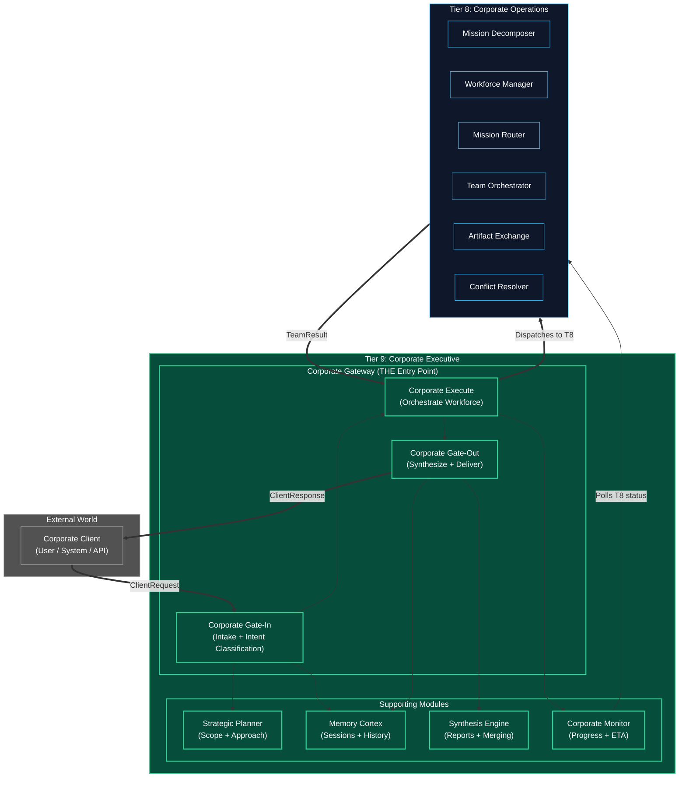
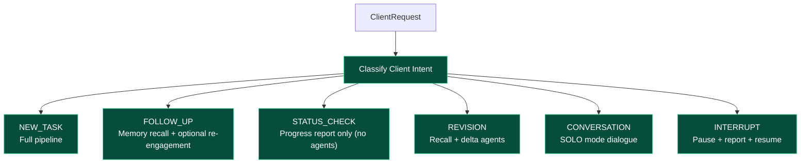
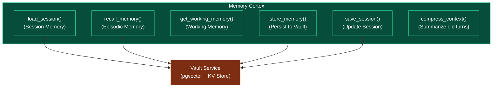
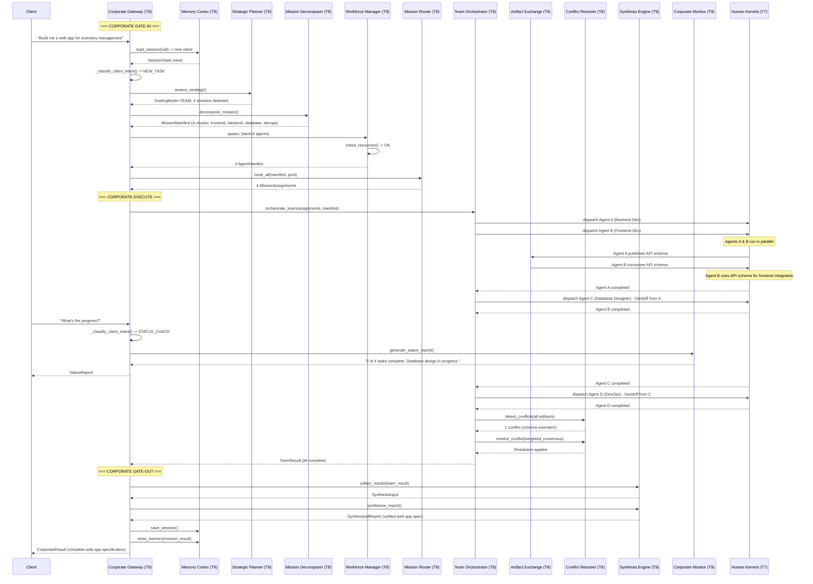
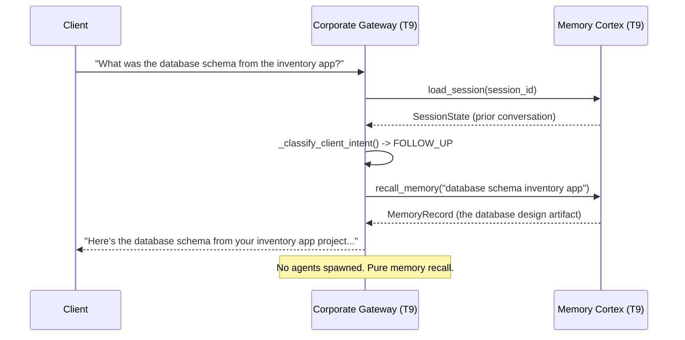
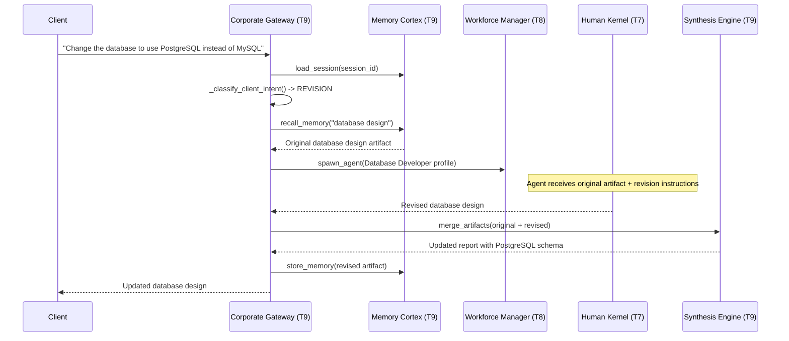

# Tier 9: Corporate Executive (The Corporation's Conscious Observer)

## Overview

**Tier 9** is the apex of the entire Kea system — the **single entry point** for all client interactions. It mirrors the fractal pattern of Tier 7 (Conscious Observer) but at the corporate scale:

| Human Kernel (Tier 7) | Corporation Kernel (Tier 9) |
|------------------------|----------------------------|
| Gate-In: Perceive input, assess capability, select mode | Corporate Gate-In: Intake client request, assess scope, select scaling mode |
| Execute: OODA loop with per-cycle monitoring | Corporate Execute: Orchestrate workforce with continuous monitoring |
| Gate-Out: Verify quality, calibrate confidence, filter output | Corporate Gate-Out: Synthesize results, resolve conflicts, deliver response |

Think of Tier 9 as the **C-Suite** of the corporation: the CEO who receives client inquiries, decides the corporate strategy, delegates to the operations floor (Tier 8), monitors progress, and presents the final deliverable. The C-Suite never does the work itself — it orchestrates and synthesizes.

**CRITICAL RULE**: The Corporate Gateway is the ONE and ONLY entry point. All client requests flow through `CorporateGateway.process()`. There is no other way to interact with the Corporation Kernel. This mirrors how `ConsciousObserver.process()` is the only entry point for the Human Kernel.

**Location**: `kernel/` — five new modules, each following the standard `engine.py` / `types.py` / `__init__.py` pattern.

---

## Modules

| Module | Purpose | Analogy |
|--------|---------|---------|
| **corporate_gateway** | THE entry point — Corporate Gate-In / Execute / Gate-Out | The CEO's office — all inquiries go through here |
| **strategic_planner** | Scope assessment, approach selection, timeline estimation | The Chief Strategy Officer |
| **memory_cortex** | Long-term memory, session management, conversation history | The Corporate Secretary / Institutional Memory |
| **synthesis_engine** | Result collection, report generation, artifact merging | The Executive Report Writer |
| **corporate_monitor** | Progress tracking, ETA estimation, status reporting, quality audit | The COO's Dashboard |

---

## Architecture & Flow



---

## Dependency Graph

| Tier | Imports From | Role |
|------|-------------|------|
| **T9** | T0 (schemas, config, logging), T1 (classification — for intent detection), T8 (all modules) | Corporate Executive — single entry point, strategy, memory, synthesis |
| **T8** | T0, T1, T2, T3, T5, T6, T7 | Corporate Operations — workforce & coordination |
| **T7** | T0, T1-T6 | Human Kernel apex — individual agent |

**Strict Rule**: T9 is the top of the hierarchy. Nothing imports from T9. T9 orchestrates T8 through function calls and receives results through return values.

---

## Configuration Requirements

Extends the `CorporateSettings` in `shared/config.py`:

```python
class CorporateSettings(BaseModel):
    # ... (Tier 8 settings from tier_8_architecture.md) ...

    # --- Corporate Gateway ---
    gateway_max_concurrent_missions: int = 10
    gateway_interrupt_check_interval_ms: float = 2000.0
    gateway_session_timeout_ms: float = 3_600_000.0  # 1 hour

    # --- Strategic Planner ---
    planner_solo_threshold: int = 1        # <= this many domains -> SOLO
    planner_team_threshold: int = 10       # <= this many agents -> TEAM, else SWARM
    planner_timeline_buffer_pct: float = 1.2  # 20% buffer on ETA estimates
    planner_risk_escalation_threshold: float = 0.8

    # --- Memory Cortex ---
    memory_session_ttl_seconds: int = 86400    # 24 hours
    memory_episodic_search_limit: int = 20
    memory_context_compression_threshold: int = 50  # Compress after N interactions
    memory_working_memory_max_items: int = 100

    # --- Synthesis Engine ---
    synthesis_max_merge_artifacts: int = 200
    synthesis_summary_max_tokens: int = 4096
    synthesis_partial_result_threshold: float = 0.5  # Accept if >= 50% complete

    # --- Corporate Monitor ---
    monitor_poll_interval_ms: float = 2000.0
    monitor_stall_detection_cycles: int = 5
    monitor_eta_smoothing_factor: float = 0.3  # Exponential moving average
```

---

## Client Interaction Patterns

The Corporate Gateway classifies every incoming request into one of six patterns. Each pattern triggers a different pipeline branch, avoiding unnecessary work:



### Pattern Details

| Pattern | Intent Signals | Pipeline | Agents Spawned? |
|---------|---------------|----------|-----------------|
| **NEW_TASK** | No session context, action verbs, clear deliverable | Full: Planner → Decomposer → Workforce → Orchestrator → Synthesis | Yes |
| **FOLLOW_UP** | Active session, references previous work, asks question | Memory recall → single agent re-engagement if needed | Maybe (reuse existing) |
| **STATUS_CHECK** | "What's the progress?", "How long?", "Update me" | Corporate Monitor → instant report | No |
| **REVISION** | "Improve this", "Change X to Y", "Fix the report" | Memory recall → spawn revision agents → delta merge with original | Yes (minimal) |
| **CONVERSATION** | Discussion, brainstorming, "What do you think about..." | SOLO mode → single domain expert agent | Yes (1 agent) |
| **INTERRUPT** | Arrives while mission is in progress, changes scope | Pause workforce → assess → resume/adjust/abort | No (uses existing) |

---

## Module 1: Corporate Gateway

**Location**: `kernel/corporate_gateway/`

### Overview

The Corporate Gateway is the Corporation's Conscious Observer. It is the ONE entry point for all interactions with Kea-as-Corporation. Every client request — whether a new task, a follow-up question, or a status check — flows through `CorporateGateway.process()`.

The Gateway implements the three-phase pipeline:
- **Corporate Gate-In**: Intake, intent classification, session loading, strategic assessment
- **Corporate Execute**: Dispatch to Tier 8, monitor progress, handle interrupts
- **Corporate Gate-Out**: Collect results, synthesize response, persist to memory

**Reuses**: T1 `classify()` for intent classification.

### Architecture & Flow (Three Phases)

```
ClientRequest (any interaction)
    |
    v
+--------------------------------------------------------+
|  PHASE 1: CORPORATE GATE-IN                            |
|  Memory Cortex: load_session() -> session context      |
|  T1 classify: client intent classification             |
|  Strategic Planner: assess_strategy() -> approach      |
|  Mission Decomposer (T8): decompose_mission()          |
|  Workforce Manager (T8): spawn agents                  |
|  Mission Router (T8): assign missions                  |
|  +--> If STATUS_CHECK: skip to Gate-Out immediately    |
|  +--> If CONVERSATION: single agent, skip decomposer   |
+---------------------------+----------------------------+
                            |
                            v
+--------------------------------------------------------+
|  PHASE 2: CORPORATE EXECUTE                            |
|  Team Orchestrator (T8): orchestrate_team()            |
|  Artifact Exchange (T8): inter-agent communication     |
|  Corporate Monitor: track progress, handle interrupts  |
|  Conflict Resolver (T8): resolve contradictions        |
|  Workforce Manager (T8): dynamic hire/fire             |
|                                                        |
|  Interrupt handling:                                   |
|   Client sends STATUS_CHECK mid-execution              |
|   -> Corporate Monitor generates instant report        |
|   -> Resume execution without disruption               |
+---------------------------+----------------------------+
                            |
                            v
+--------------------------------------------------------+
|  PHASE 3: CORPORATE GATE-OUT                           |
|  Synthesis Engine: collect_results() + synthesize()    |
|  Conflict Resolver (T8): final resolution pass         |
|  Corporate-level quality verification                  |
|  Memory Cortex: persist session, artifacts, history    |
|  Package ClientResponse for delivery                   |
+--------------------------------------------------------+
```

### Function Decomposition

#### `process` (THE entry point)
- **Signature**: `async process(request: ClientRequest, kit: InferenceKit | None = None) -> Result`
- **Returns**: `Result` containing `CorporateResult`
- **Description**: The one and only entry point for the Corporation Kernel. Orchestrates all three phases: Corporate Gate-In, Corporate Execute, and Corporate Gate-Out. Handles all client interaction patterns (new task, follow-up, status check, revision, conversation, interrupt). Returns a `CorporateResult` containing the final response, metadata, and session state.
- **Calls**: `_corporate_gate_in()`, `_corporate_execute()`, `_corporate_gate_out()`

#### `_corporate_gate_in`
- **Signature**: `async _corporate_gate_in(request: ClientRequest, kit: InferenceKit | None = None) -> CorporateGateInResult`
- **Description**: Phase 1. Performs the following sequence:
  1. **Memory Cortex**: Load session context (if `session_id` exists, retrieve conversation history and previous work artifacts)
  2. **Intent Classification**: Use T1 `classify()` + LLM analysis to determine client intent (NEW_TASK / FOLLOW_UP / STATUS_CHECK / REVISION / CONVERSATION / INTERRUPT)
  3. **Fast Path Detection**: If STATUS_CHECK, skip directly to Gate-Out with Corporate Monitor report
  4. **Strategic Planner**: Assess scope and select scaling mode (SOLO / TEAM / SWARM)
  5. **Mission Decomposer** (T8): Break objective into mission chunks (skip for CONVERSATION/FOLLOW_UP)
  6. **Workforce Manager** (T8): Spawn required agents
  7. **Mission Router** (T8): Assign missions to agents
- **Calls**: `memory_cortex.load_session()`, T1 `classify()`, `strategic_planner.assess_strategy()`, T8 `mission_decomposer.decompose_mission()`, T8 `workforce_manager.spawn_agent()`, T8 `mission_router.route_all()`

#### `_corporate_execute`
- **Signature**: `async _corporate_execute(gate_in: CorporateGateInResult, kit: InferenceKit | None = None) -> CorporateExecuteResult`
- **Description**: Phase 2. The main execution loop. Dispatches missions to the workforce via Team Orchestrator and monitors progress:
  1. **Team Orchestrator** (T8): Build workflow DAG and dispatch missions
  2. **Monitoring Loop**: Poll agent statuses, handle events, sequence handoffs
  3. **Interrupt Handling**: If client sends a new request during execution (e.g., STATUS_CHECK), Corporate Monitor generates an instant report without disrupting the workforce
  4. **Dynamic Scaling**: Workforce Manager evaluates performance and adjusts staffing
  5. **Conflict Resolution**: Detect and resolve contradictions as they arise
  Returns once all agents complete or abort.
- **Calls**: T8 `team_orchestrator.orchestrate_team()`, `corporate_monitor.track_mission()`, T8 `conflict_resolver.detect_conflicts()`

#### `_corporate_gate_out`
- **Signature**: `async _corporate_gate_out(gate_in: CorporateGateInResult, execute: CorporateExecuteResult, kit: InferenceKit | None = None) -> CorporateResult`
- **Description**: Phase 3. Collects all results, synthesizes the final response, and persists state:
  1. **Synthesis Engine**: Collect all agent results and artifacts
  2. **Conflict Resolver** (T8): Final resolution pass on remaining conflicts
  3. **Synthesis Engine**: Generate unified response (report, answer, deliverable)
  4. **Quality Verification**: Corporate-level quality check (are there gaps? is confidence sufficient?)
  5. **Memory Cortex**: Persist session, conversation turn, artifacts, and working memory
  6. **Package**: Assemble `CorporateResult` with response, metadata, and session info
- **Calls**: `synthesis_engine.collect_results()`, `synthesis_engine.synthesize_report()`, T8 `conflict_resolver.merge_resolutions()`, `memory_cortex.save_session()`, `memory_cortex.store_memory()`

#### `_classify_client_intent`
- **Signature**: `async _classify_client_intent(request: ClientRequest, session: SessionState | None, kit: InferenceKit | None = None) -> ClientIntent`
- **Description**: Determines the client's intent from their request. Uses T1 classification for linguistic signals and LLM analysis for semantic understanding. Context-aware: a request with an active session and in-progress mission is likely a STATUS_CHECK or INTERRUPT, while a request with no session is likely a NEW_TASK.
- **Calls**: T1 `classify()`, Knowledge-Enhanced Inference

#### `_handle_interrupt`
- **Signature**: `async _handle_interrupt(request: ClientRequest, active_mission: MissionState, kit: InferenceKit | None = None) -> InterruptResponse`
- **Description**: Handles a client request that arrives while a mission is already in progress. Classifies the interrupt type:
  - **STATUS_CHECK**: Generate progress report, no disruption
  - **SCOPE_CHANGE**: Pause workforce, re-plan, resume with adjustments
  - **ABORT**: Gracefully terminate all agents, collect partial results
  - **REVISION**: Queue revision for after current mission completes
- **Calls**: `corporate_monitor.generate_status_report()`, T8 `workforce_manager.scale_workforce()`

### Types

```python
class ClientRequest(BaseModel):
    """A request from a corporate client to Kea."""
    request_id: str
    client_id: str
    session_id: str | None              # None = new session
    content: str                        # Natural language request
    attachments: list[Attachment] | None  # Files, images, data
    constraints: list[str] | None      # Hard constraints
    deadline_utc: str | None           # Optional deadline
    budget_limit: float | None         # Optional cost cap
    trace_id: str

class Attachment(BaseModel):
    """File or data attached to a client request."""
    filename: str
    content_type: str
    content: str                        # Base64 or text content
    size_bytes: int

class ClientIntent(StrEnum):
    """Classified intent of a client request."""
    NEW_TASK = "new_task"
    FOLLOW_UP = "follow_up"
    STATUS_CHECK = "status_check"
    REVISION = "revision"
    CONVERSATION = "conversation"
    INTERRUPT = "interrupt"

class CorporateGateInResult(BaseModel):
    """Output of Phase 1: Corporate Gate-In."""
    request: ClientRequest
    session: SessionState | None
    intent: ClientIntent
    strategy: StrategyAssessment | None   # None for STATUS_CHECK
    manifest: MissionManifest | None      # None for CONVERSATION/STATUS_CHECK
    pool: WorkforcePool | None            # None for STATUS_CHECK
    assignments: list[MissionAssignment] | None
    gate_in_duration_ms: float

class CorporateExecuteResult(BaseModel):
    """Output of Phase 2: Corporate Execute."""
    team_result: TeamResult | None        # None for STATUS_CHECK
    status_report: StatusReport | None    # For STATUS_CHECK / INTERRUPT
    interrupts_handled: list[InterruptResponse]
    conflicts_detected: int
    conflicts_resolved: int
    execute_duration_ms: float

class CorporateResult(BaseModel):
    """Final output of the Corporation Kernel."""
    result_id: str
    trace_id: str
    request_id: str
    session_id: str
    intent: ClientIntent
    response: SynthesizedReport          # The actual deliverable
    quality_assessment: CorporateQualityAssessment
    mission_summary: MissionSummary | None
    conversation_context: str | None     # For follow-up awareness
    total_agents_used: int
    total_cost: float
    total_duration_ms: float
    gate_in_ms: float
    execute_ms: float
    gate_out_ms: float

class CorporateQualityAssessment(BaseModel):
    """Corporate-level quality check on the final output."""
    overall_confidence: float
    completeness_pct: float              # What % of the objective was addressed?
    conflict_free: bool                  # Were all conflicts resolved?
    has_partial_results: bool            # Some agents failed?
    quality_flags: list[str]            # Warnings (e.g., "low confidence on section 3")

class MissionSummary(BaseModel):
    """Summary of the mission for the client."""
    total_missions: int
    completed: int
    failed: int
    total_agents: int
    total_artifacts: int
    scaling_mode: ScalingMode
    duration_ms: float

class InterruptResponse(BaseModel):
    """Response to a client interrupt during execution."""
    interrupt_type: InterruptType
    response_content: str               # Answer to the interrupt
    mission_impact: str                 # "none" / "paused" / "adjusted" / "aborted"
    timestamp_utc: str

class InterruptType(StrEnum):
    STATUS_CHECK = "status_check"
    SCOPE_CHANGE = "scope_change"
    ABORT = "abort"
    REVISION_QUEUED = "revision_queued"

class MissionState(BaseModel):
    """Current state of an active mission for interrupt handling."""
    manifest_id: str
    pool_id: str
    dag_id: str
    pct_complete: float
    active_agent_count: int
    started_utc: str
```

---

## Module 2: Strategic Planner

**Location**: `kernel/strategic_planner/`

### Overview

The Strategic Planner is the Chief Strategy Officer. Before any work begins, it assesses the incoming objective and makes critical strategic decisions:

1. **How complex is this?** — Single domain or multi-domain? Routine or novel?
2. **What approach?** — SOLO (1 agent), TEAM (2-10 agents), or SWARM (10-100K agents)?
3. **How long will it take?** — Timeline estimation for the client
4. **What are the risks?** — Budget overrun? Capability gaps? Tight deadlines?

The Planner's output drives Mission Decomposer's strategy. A SOLO assessment means the decomposer creates a single mission chunk. A SWARM assessment means it creates N identical chunks with partitioned data.

**Reuses**: T6 `activation_router.classify_signal_complexity()` for complexity assessment, T6 `self_model.assess_capability()` for corporate self-assessment.

### Function Decomposition

#### `assess_strategy`
- **Signature**: `async assess_strategy(request: ClientRequest, session: SessionState | None, kit: InferenceKit | None = None) -> StrategyAssessment`
- **Description**: Top-level strategic assessment. Evaluates the client request's complexity, domain breadth, resource requirements, and risk factors. Selects the optimal scaling mode and approach. Returns a comprehensive strategy that drives downstream planning.
- **Calls**: `evaluate_complexity()`, `select_scaling_mode()`, `estimate_timeline()`, `assess_risk()`

#### `evaluate_complexity`
- **Signature**: `async evaluate_complexity(request: ClientRequest, kit: InferenceKit | None = None) -> ComplexityAssessment`
- **Description**: Analyzes the client request to determine its cognitive complexity and domain breadth. Uses T6 Activation Router's complexity classification adapted for corporate-level objectives. Detects: number of distinct skill domains, presence of cross-domain dependencies, novelty (is this like anything we've done before?), and estimated output volume.
- **Calls**: T6 `classify_signal_complexity()`, T1 `classify()`, Knowledge-Enhanced Inference

#### `select_scaling_mode`
- **Signature**: `select_scaling_mode(complexity: ComplexityAssessment) -> ScalingMode`
- **Description**: Based on the complexity assessment, selects the appropriate scaling mode:
  - **SOLO**: Single domain, low complexity, or conversation mode
  - **TEAM**: Multi-domain, moderate-high complexity, cross-functional collaboration needed
  - **SWARM**: Repetitive/volume work, high parallelism, map-reduce pattern
  Uses config thresholds for boundary decisions.
- **Calls**: Config-driven threshold comparison

#### `estimate_timeline`
- **Signature**: `async estimate_timeline(complexity: ComplexityAssessment, scaling_mode: ScalingMode, session: SessionState | None, kit: InferenceKit | None = None) -> TimelineEstimate`
- **Description**: Estimates how long the mission will take based on complexity, scaling mode, and historical data from Memory Cortex (similar past missions). Applies a config-driven buffer (default 20%) for uncertainty. Returns optimistic, expected, and pessimistic estimates.
- **Calls**: `memory_cortex.recall_memory()` for historical benchmarks

#### `assess_risk`
- **Signature**: `assess_risk(complexity: ComplexityAssessment, scaling_mode: ScalingMode) -> RiskProfile`
- **Description**: Identifies risk factors that could derail the mission: budget overrun probability, capability gaps (no profile for a required domain), tight deadlines, high conflict potential (multiple agents in overlapping domains). Returns a risk profile with mitigation suggestions.
- **Calls**: Pure analysis

### Types

```python
class StrategyAssessment(BaseModel):
    """Complete strategic assessment for an enterprise objective."""
    assessment_id: str
    complexity: ComplexityAssessment
    scaling_mode: ScalingMode
    timeline: TimelineEstimate
    risk: RiskProfile
    recommended_approach: str           # Natural language strategy summary
    assessed_utc: str

class ComplexityAssessment(BaseModel):
    """Complexity analysis of an enterprise objective."""
    complexity_level: ComplexityLevel   # TRIVIAL/SIMPLE/MODERATE/COMPLEX/CRITICAL
    domain_count: int                   # Number of distinct skill domains
    domains: list[str]                  # Detected domains
    is_repetitive: bool                 # Same pipeline, different data?
    is_novel: bool                      # Never seen similar objective?
    estimated_agent_count: int          # Recommended workforce size
    cross_domain_dependencies: int     # How tangled are the domains?
    estimated_output_volume: str       # "low" / "medium" / "high" / "massive"

class ComplexityLevel(StrEnum):
    TRIVIAL = "trivial"
    SIMPLE = "simple"
    MODERATE = "moderate"
    COMPLEX = "complex"
    CRITICAL = "critical"

class TimelineEstimate(BaseModel):
    """Time estimation for mission completion."""
    optimistic_ms: float               # Best case
    expected_ms: float                 # Most likely
    pessimistic_ms: float              # Worst case
    confidence: float                  # How confident are we? (0.0-1.0)
    based_on_history: bool             # Estimated from similar past missions?
    historical_mission_ids: list[str]  # Past missions used for estimation

class RiskProfile(BaseModel):
    """Risk assessment for a mission."""
    overall_risk_level: str            # "low" / "medium" / "high" / "critical"
    budget_overrun_probability: float
    capability_gap_domains: list[str]  # Domains without matching profiles
    deadline_pressure: float           # 0.0 (relaxed) to 1.0 (impossible)
    conflict_potential: float          # 0.0 (unlikely) to 1.0 (certain)
    mitigations: list[str]            # Suggested risk mitigations
```

---

## Module 3: Memory Cortex

**Location**: `kernel/memory_cortex/`

### Overview

The Memory Cortex is the Corporation's institutional memory. It ensures that Kea doesn't forget — across conversations, sessions, and missions. When a client returns and asks "what was the analysis you did last week?", the Memory Cortex retrieves the relevant context without reloading the entire history.

**Three Memory Layers**:

| Layer | What It Stores | Lifetime | Backend |
|-------|---------------|----------|---------|
| **Session Memory** | Active conversation state, current mission context | Session duration (configurable TTL) | Vault Service (key-value) |
| **Episodic Memory** | Past interactions indexed by semantic similarity | Permanent | Vault Service (pgvector) |
| **Working Memory** | Current mission state (agent statuses, live artifacts, progress) | Mission duration | In-memory (Tier 8 state) |

**Key Innovation**: The Memory Cortex uses **semantic search** (via Vault's pgvector) for recall, NOT full context reload. This means:
- Client asks "what was the report?" → Search episodic memory for "report" → Return relevant slice
- Client starts new session → Load only the session metadata, not full history
- Context grows large → Compress older interactions into summaries

**Reuses**: Vault Service for persistence and semantic search.

### Architecture & Flow



### Function Decomposition

#### `load_session`
- **Signature**: `async load_session(session_id: str) -> SessionState | None`
- **Description**: Loads an existing session from the Vault. Returns the session state including conversation history, active mission context, and client preferences. Returns `None` if session doesn't exist or has expired (beyond `config.memory_session_ttl_seconds`).
- **Calls**: Vault Service KV API

#### `save_session`
- **Signature**: `async save_session(session: SessionState) -> None`
- **Description**: Persists the current session state to the Vault. Called at the end of every interaction (Corporate Gate-Out) to ensure continuity. Updates the session's `last_interaction_utc` and increments `turn_count`.
- **Calls**: Vault Service KV API

#### `create_session`
- **Signature**: `async create_session(client_id: str, request: ClientRequest) -> SessionState`
- **Description**: Creates a new session for a first-time or returning client. Initializes conversation history, sets TTL, and generates session ID. For returning clients, searches episodic memory for relevant prior context.
- **Calls**: Vault Service KV API, `recall_memory()` for prior context

#### `store_memory`
- **Signature**: `async store_memory(record: MemoryRecord) -> str`
- **Returns**: Memory record ID
- **Description**: Persists a memory record to the Vault's episodic memory store. Each record is vector-indexed (via pgvector) for semantic retrieval. Records can be: conversation turns, mission results, artifacts, decisions, or client preferences. Returns the record ID.
- **Calls**: Vault Service vector store API

#### `recall_memory`
- **Signature**: `async recall_memory(query: MemoryQuery) -> list[MemoryRecord]`
- **Description**: Semantic search across episodic memory. Given a natural language query, finds the most relevant past memory records using vector similarity (pgvector). Supports filtering by client, session, time range, and content type. Returns up to `config.memory_episodic_search_limit` results.
- **Calls**: Vault Service semantic search API

#### `get_working_memory`
- **Signature**: `get_working_memory(mission_state: MissionState, pool: WorkforcePool, exchange: ArtifactExchangeState) -> WorkingMemory`
- **Description**: Assembles a real-time snapshot of the current mission's state. Includes: active agent statuses, recent artifacts, progress percentages, and pending missions. This is NOT persisted — it's computed on-demand from Tier 8's live state.
- **Calls**: T8 `workforce_manager.get_pool_status()`, T8 `artifact_exchange.get_workspace_state()`

#### `compress_context`
- **Signature**: `async compress_context(session: SessionState, kit: InferenceKit | None = None) -> SessionState`
- **Description**: When a session's conversation history exceeds `config.memory_context_compression_threshold` turns, older turns are compressed into summaries. The summaries replace the raw turns, reducing memory footprint while preserving essential context. Recent turns (last 5-10) are kept verbatim.
- **Calls**: Knowledge-Enhanced Inference for summarization

### Types

```python
class SessionState(BaseModel):
    """Active conversation session with a client."""
    session_id: str
    client_id: str
    created_utc: str
    last_interaction_utc: str
    turn_count: int
    conversation_history: list[ConversationTurn]
    active_mission_id: str | None      # Currently executing mission
    active_mission_state: MissionState | None
    client_preferences: dict[str, Any]  # Learned preferences
    compressed_summary: str | None     # Summary of old turns (post-compression)

class ConversationTurn(BaseModel):
    """A single interaction in a conversation."""
    turn_id: str
    role: TurnRole                     # CLIENT or CORPORATION
    content: str
    intent: ClientIntent | None        # Classification of client turn
    mission_result_id: str | None      # If this turn produced a mission result
    timestamp_utc: str
    is_compressed: bool                # True if this is a summary of multiple turns

class TurnRole(StrEnum):
    CLIENT = "client"
    CORPORATION = "corporation"

class MemoryRecord(BaseModel):
    """A persistent record in episodic memory."""
    record_id: str
    client_id: str
    session_id: str
    record_type: MemoryRecordType
    content: str                        # The memory content
    summary: str                        # Brief summary for search
    embedding_text: str                 # Text used for vector embedding
    metadata: dict[str, Any]
    created_utc: str

class MemoryRecordType(StrEnum):
    CONVERSATION = "conversation"       # A conversation turn or summary
    MISSION_RESULT = "mission_result"   # Completed mission output
    ARTIFACT = "artifact"               # Significant work artifact
    DECISION = "decision"               # Strategic or conflict resolution decision
    CLIENT_PREFERENCE = "client_preference"  # Learned client preference

class MemoryQuery(BaseModel):
    """Query parameters for episodic memory search."""
    query_text: str                    # Natural language search
    client_id: str | None              # Filter by client
    session_id: str | None             # Filter by session
    record_type: MemoryRecordType | None
    time_range_start: str | None
    time_range_end: str | None
    limit: int

class WorkingMemory(BaseModel):
    """Real-time snapshot of current mission state."""
    mission_id: str
    pool_status: PoolStatusReport
    workspace_state: WorkspaceSnapshot
    recent_artifacts: list[Artifact]
    active_conflicts: list[Conflict]
    pct_complete: float
    elapsed_ms: float
```

---

## Module 4: Synthesis Engine

**Location**: `kernel/synthesis_engine/`

### Overview

The Synthesis Engine is the Executive Report Writer. After all agents complete their work, the Synthesis Engine collects their outputs, merges non-conflicting artifacts, resolves gaps, and produces a unified deliverable for the client.

**Synthesis Modes**:
- **Single Result** (SOLO mode): Direct pass-through of the single agent's output, wrapped in corporate formatting
- **Multi-Source Merge** (TEAM mode): Intelligent merging of outputs from different domain experts into a cohesive report
- **Map-Reduce** (SWARM mode): Aggregation of high-volume identical outputs into statistical summaries or combined datasets

**Key Innovation**: The Synthesis Engine handles **partial results** gracefully. If some agents failed but the majority succeeded, it delivers what's available with clear annotations about what's missing, rather than failing entirely.

### Function Decomposition

#### `collect_results`
- **Signature**: `async collect_results(team_result: TeamResult, exchange: ArtifactExchangeState) -> SynthesisInput`
- **Description**: Gathers all agent outputs and artifacts into a structured `SynthesisInput`. Separates successful results from failed/partial ones. Organizes artifacts by topic and domain. Identifies gaps where expected output is missing.
- **Calls**: T8 `artifact_exchange.search_artifacts()`

#### `synthesize_report`
- **Signature**: `async synthesize_report(input: SynthesisInput, strategy: StrategyAssessment, kit: InferenceKit | None = None) -> SynthesizedReport`
- **Description**: The main synthesis function. Takes all collected results and produces a unified report. The synthesis approach depends on the scaling mode:
  - **SOLO**: Format single agent's output with corporate wrapper
  - **TEAM**: Use LLM to merge multi-domain outputs into cohesive narrative, resolving terminology conflicts and ensuring cross-references
  - **SWARM**: Apply map-reduce aggregation (count, summarize, statistical analysis)
  Annotates the report with confidence levels, source agents, and any gaps.
- **Calls**: Knowledge-Enhanced Inference for multi-source merging

#### `merge_artifacts`
- **Signature**: `merge_artifacts(artifacts: list[Artifact], resolutions: list[Resolution] | None = None) -> list[MergedArtifact]`
- **Description**: Combines non-conflicting artifacts into merged units. Applies conflict resolution decisions to select winning artifacts. Groups related artifacts by topic and domain. Returns a clean, conflict-free set of merged artifacts.
- **Calls**: Pure artifact manipulation

#### `handle_partial_results`
- **Signature**: `async handle_partial_results(input: SynthesisInput, kit: InferenceKit | None = None) -> PartialResultReport`
- **Description**: When some agents failed, determines what was completed, what's missing, and whether the partial output meets the `config.synthesis_partial_result_threshold` (default 50%). Generates a gap analysis explaining what's missing and why.
- **Calls**: Knowledge-Enhanced Inference for gap analysis

#### `generate_summary`
- **Signature**: `async generate_summary(report: SynthesizedReport, kit: InferenceKit | None = None) -> str`
- **Description**: Generates a concise executive summary of the full report. Limited to `config.synthesis_summary_max_tokens`. Highlights key findings, decisions, and action items. This is what the client sees first before diving into the full report.
- **Calls**: Knowledge-Enhanced Inference

### Types

```python
class SynthesisInput(BaseModel):
    """Collected results ready for synthesis."""
    manifest_id: str
    scaling_mode: ScalingMode
    successful_results: list[AgentOutput]
    failed_results: list[FailedAgentOutput]
    all_artifacts: list[Artifact]
    resolutions: list[Resolution]       # From Conflict Resolver
    gaps: list[str]                    # Missing expected outputs
    pct_complete: float

class AgentOutput(BaseModel):
    """Successful agent's output for synthesis."""
    agent_id: str
    role_name: str
    domain: str
    chunk_id: str
    result: ConsciousObserverResult
    artifacts: list[Artifact]
    quality_score: float
    confidence: float

class FailedAgentOutput(BaseModel):
    """Failed agent's partial output."""
    agent_id: str
    role_name: str
    domain: str
    chunk_id: str
    partial_output: str | None
    failure_reason: str
    cycles_completed: int

class SynthesizedReport(BaseModel):
    """The final deliverable produced by the Synthesis Engine."""
    report_id: str
    title: str
    executive_summary: str
    full_content: str                   # The complete synthesized output
    sections: list[ReportSection]
    source_agents: list[str]           # agent_ids that contributed
    confidence_map: dict[str, float]   # section_id -> confidence
    gaps: list[str]                    # What's missing (if partial)
    is_partial: bool
    created_utc: str

class ReportSection(BaseModel):
    """A section within the synthesized report."""
    section_id: str
    title: str
    content: str
    domain: str
    source_agent_id: str
    confidence: float
    artifact_ids: list[str]            # Supporting artifacts

class MergedArtifact(BaseModel):
    """Result of merging related artifacts."""
    merged_id: str
    source_artifact_ids: list[str]
    content: str
    content_type: ArtifactContentType
    domain: str
    resolution_applied: str | None     # If conflict was resolved

class PartialResultReport(BaseModel):
    """Analysis of incomplete mission results."""
    pct_complete: float
    completed_domains: list[str]
    missing_domains: list[str]
    gap_analysis: str                  # Natural language explanation
    is_usable: bool                    # Meets partial_result_threshold?
    recommendation: str                # "deliver as-is" / "retry missing" / "abort"
```

---

## Module 5: Corporate Monitor

**Location**: `kernel/corporate_monitor/`

### Overview

The Corporate Monitor is the COO's Dashboard. It provides real-time visibility into mission progress, agent performance, resource utilization, and estimated time to completion. Critically, it enables the **interrupt handling pattern**: when a client asks "what's the progress?", the Corporate Gateway routes to the Corporate Monitor for an instant report without disrupting the active workforce.

**Key Features**:
- **Real-time progress tracking**: Aggregates Tier 8 state into a client-readable dashboard
- **ETA estimation**: Uses exponential moving average over observed task completion rates
- **Stall detection**: Identifies when agents are stuck and triggers workforce intervention
- **Quality audit**: Aggregates Gate-Out quality scores across the team for corporate-level quality assessment

**Pattern**: The Corporate Monitor is **passive** — it reads state from Tier 8 modules, it doesn't modify anything. It's a pure observation and reporting layer.

### Function Decomposition

#### `track_mission`
- **Signature**: `async track_mission(pool: WorkforcePool, dag: WorkflowDAG, exchange: ArtifactExchangeState) -> MissionProgress`
- **Description**: Computes the current progress of the active mission. Aggregates agent statuses from the WorkforcePool, node completion from the WorkflowDAG, and artifact production from the ArtifactExchange. Returns a comprehensive progress report.
- **Calls**: T8 `workforce_manager.get_pool_status()`, T8 `artifact_exchange.get_workspace_state()`

#### `estimate_completion`
- **Signature**: `estimate_completion(progress_history: list[MissionProgress]) -> CompletionEstimate`
- **Description**: Estimates remaining time to mission completion. Uses exponential moving average (EMA) over observed completion velocity (% complete per ms). The smoothing factor is config-driven. Returns optimistic, expected, and pessimistic ETAs with confidence.
- **Calls**: Pure computation over progress history

#### `generate_status_report`
- **Signature**: `async generate_status_report(progress: MissionProgress, estimate: CompletionEstimate, kit: InferenceKit | None = None) -> StatusReport`
- **Description**: Generates a client-friendly status report. Translates internal metrics into natural language: "3 of 5 agents have completed their work. The frontend development is done and code review is in progress. Estimated completion in ~15 minutes." This is what the client sees when they ask "what's the progress?".
- **Calls**: Knowledge-Enhanced Inference for natural language generation

#### `audit_quality`
- **Signature**: `audit_quality(pool: WorkforcePool) -> QualityAudit`
- **Description**: Aggregates quality metrics across all agents. Computes: average quality score, confidence distribution, grounding rate, and identifies outliers (agents significantly below the corporate quality threshold). Flags concerns for the Corporate Gateway.
- **Calls**: T8 `workforce_manager.evaluate_performance()` per agent

#### `detect_stalls`
- **Signature**: `detect_stalls(progress_history: list[MissionProgress]) -> list[StallDetection]`
- **Description**: Analyzes progress history to detect stalled missions. A stall is detected when progress percentage doesn't change for `config.monitor_stall_detection_cycles` consecutive checks. Identifies which specific agents or workflow nodes are causing the stall.
- **Calls**: Pure analysis over progress history

### Types

```python
class MissionProgress(BaseModel):
    """Point-in-time progress snapshot."""
    snapshot_id: str
    manifest_id: str
    pct_complete: float
    agents_active: int
    agents_completed: int
    agents_failed: int
    missions_completed: int
    missions_pending: int
    missions_in_progress: int
    artifacts_produced: int
    total_cost_so_far: float
    elapsed_ms: float
    timestamp_utc: str

class CompletionEstimate(BaseModel):
    """ETA estimation for mission completion."""
    optimistic_ms: float
    expected_ms: float
    pessimistic_ms: float
    confidence: float
    velocity_pct_per_ms: float         # Current completion velocity
    is_stalled: bool
    estimated_completion_utc: str

class StatusReport(BaseModel):
    """Client-friendly progress report."""
    report_id: str
    mission_id: str
    summary: str                        # Natural language summary
    pct_complete: float
    estimated_remaining: str           # Human-readable (e.g., "~15 minutes")
    active_work: list[str]            # What agents are currently doing
    completed_work: list[str]         # What's been done
    blockers: list[str]               # If any
    timestamp_utc: str

class QualityAudit(BaseModel):
    """Corporate-level quality assessment."""
    avg_quality_score: float
    avg_confidence: float
    avg_grounding_rate: float
    quality_distribution: dict[str, int]  # "high"/"medium"/"low" -> count
    outlier_agent_ids: list[str]       # Significantly below threshold
    overall_assessment: str            # "excellent" / "acceptable" / "concerning" / "failing"

class StallDetection(BaseModel):
    """Detection of a stalled mission or agent."""
    stall_type: StallType
    agent_id: str | None               # Specific agent if applicable
    chunk_id: str | None
    stalled_since_utc: str
    consecutive_no_progress: int
    recommendation: str                # "signal_agent" / "fire_and_replace" / "abort"

class StallType(StrEnum):
    AGENT_STALL = "agent_stall"        # Single agent not progressing
    WORKFLOW_STALL = "workflow_stall"   # DAG blocked on a dependency
    MISSION_STALL = "mission_stall"    # Overall progress halted
```

---

## Complete Corporate Pipeline: End-to-End Walkthrough

### Scenario: "Build me a web app for inventory management"



### Scenario: Follow-Up (2 days later)



### Scenario: Revision



---

## Critical Existing Files to Reuse

| File | What to Reuse | Used By |
|------|---------------|---------|
| `kernel/classification/engine.py` | `classify()` — client intent classification | Corporate Gateway |
| `kernel/activation_router/engine.py` | `classify_signal_complexity()` — complexity assessment | Strategic Planner |
| `kernel/self_model/engine.py` | `assess_capability()` — corporate self-assessment | Strategic Planner |
| `kernel/conscious_observer/engine.py` | `ConsciousObserver.process()` — Human Kernel interface | Referenced via Tier 8 |
| `kernel/conscious_observer/types.py` | `ConsciousObserverResult` — Human Kernel output | Synthesis Engine, Corporate Monitor |
| `shared/config.py` | `get_settings()` — all configuration | All modules |
| `shared/logging/main.py` | `get_logger(__name__)` — structured logging | All modules |
| `shared/standard_io.py` | `Result`, `ok()`, `fail()` — standard I/O | All modules |
| `shared/id_and_hash.py` | `generate_id()` — ID generation | All modules |
| Vault Service (HTTP API) | Session persistence, episodic memory, vector search | Memory Cortex |
| Swarm Manager (HTTP API) | HITL escalation | Conflict Resolver (T8) |
| Chronos (HTTP API) | Scheduling, timeout enforcement | Corporate Monitor |
| RAG Service (HTTP API) | Knowledge retrieval for strategic planning | Strategic Planner |

---

## Human Corporate Analogy

| Corporate Reality | Tier 9 Implementation |
|-------------------|----------------------|
| "The CEO receives a client brief" | `corporate_gateway.process(ClientRequest)` |
| "What does the client actually want?" | `_classify_client_intent()` → NEW_TASK / FOLLOW_UP / ... |
| "The CSO evaluates the scope" | `strategic_planner.assess_strategy()` |
| "How many people do we need? Which departments?" | `strategic_planner.select_scaling_mode()` → SOLO/TEAM/SWARM |
| "How long will this take?" | `strategic_planner.estimate_timeline()` |
| "The secretary pulls the client's file" | `memory_cortex.load_session()` |
| "Remember what we did for this client last month?" | `memory_cortex.recall_memory()` |
| "Didn't we do something similar before?" | `memory_cortex.recall_memory()` for timeline estimation |
| "Compile the final report from all departments" | `synthesis_engine.synthesize_report()` |
| "Some departments didn't finish — what do we have?" | `synthesis_engine.handle_partial_results()` |
| "Give me a one-page executive summary" | `synthesis_engine.generate_summary()` |
| "The COO checks the dashboard" | `corporate_monitor.track_mission()` |
| "Client is calling — give me a status update" | `corporate_monitor.generate_status_report()` |
| "Something is stuck — who's blocking?" | `corporate_monitor.detect_stalls()` |
| "Is the quality of our work up to standard?" | `corporate_monitor.audit_quality()` |

---

## Full Tier Hierarchy (Tiers 0-9)

```
Tier 9: Corporate Executive                         ← THE ENTRY POINT
├── Corporate Gateway (Gate-In / Execute / Gate-Out)
├── Strategic Planner
├── Memory Cortex
├── Synthesis Engine
└── Corporate Monitor

Tier 8: Corporate Operations
├── Mission Decomposer
├── Workforce Manager
├── Mission Router
├── Team Orchestrator
├── Artifact Exchange
└── Conflict Resolver

Tier 7: Conscious Observer (Human Kernel Apex)       ← Individual Agent
├── Gate-In (T5 Genesis + T1 Perception + T6 Assessment)
├── Execute (OODA Loop + CLM Interception)
└── Gate-Out (T6 Quality Chain)

Tier 6: Metacognitive Oversight
├── Self Model
├── Activation Router
├── Cognitive Load Monitor
├── Hallucination Monitor
├── Confidence Calibrator
└── Noise Gate

Tier 5: Autonomous Ego
├── Lifecycle Controller
└── Energy & Interrupts

Tier 4: Execution Engine
├── OODA Loop
├── Short-Term Memory
└── Async Multitasking

Tier 3: Complex Orchestration
├── Graph Synthesizer
├── Node Assembler
├── Advanced Planning
└── Reflection & Guardrails

Tier 2: Cognitive Engines
├── Task Decomposition
├── Curiosity Engine
├── What-If Scenario
└── Attention & Plausibility

Tier 1: Core Processing Primitives
├── Modality
├── Classification
├── Intent / Sentiment / Urgency
├── Entity Recognition
├── Validation
├── Scoring
└── Location & Time

Tier 0: Base Foundation (shared/)
├── Schemas (Pydantic)
├── Config (get_settings())
├── Logging (structured)
├── Hardware Detection
├── Standard I/O (Signal → Result)
└── InferenceKit (LLM/Embedding)
```

---

## Directory Structure (New Modules)

```
kernel/
├── (existing Tiers 1-7 modules — unchanged)
│
├── mission_decomposer/              # Tier 8
│   ├── __init__.py
│   ├── engine.py
│   └── types.py
│
├── workforce_manager/                # Tier 8
│   ├── __init__.py
│   ├── engine.py
│   └── types.py
│
├── mission_router/                   # Tier 8
│   ├── __init__.py
│   ├── engine.py
│   └── types.py
│
├── team_orchestrator/                # Tier 8
│   ├── __init__.py
│   ├── engine.py
│   └── types.py
│
├── artifact_exchange/                # Tier 8
│   ├── __init__.py
│   ├── engine.py
│   └── types.py
│
├── conflict_resolver/                # Tier 8
│   ├── __init__.py
│   ├── engine.py
│   └── types.py
│
├── corporate_gateway/                # Tier 9 (THE ENTRY POINT)
│   ├── __init__.py
│   ├── engine.py
│   └── types.py
│
├── strategic_planner/                # Tier 9
│   ├── __init__.py
│   ├── engine.py
│   └── types.py
│
├── memory_cortex/                    # Tier 9
│   ├── __init__.py
│   ├── engine.py
│   └── types.py
│
├── synthesis_engine/                 # Tier 9
│   ├── __init__.py
│   ├── engine.py
│   └── types.py
│
└── corporate_monitor/                # Tier 9
    ├── __init__.py
    ├── engine.py
    └── types.py
```

---

## Implementation Sequence

### Phase 1: Tier 8 (Corporate Operations)
1. Types first: Define all types in each module's `types.py`
2. Mission Decomposer: Foundation — everything starts with decomposition
3. Workforce Manager: Agent lifecycle — needs to exist before routing
4. Mission Router: Requires pool of agents to route to
5. Artifact Exchange: Communication fabric — needed before orchestration
6. Team Orchestrator: The main loop — requires all above
7. Conflict Resolver: Quality layer — runs during and after orchestration

### Phase 2: Tier 9 (Corporate Executive)
8. Memory Cortex: Foundation — sessions needed before Gateway
9. Strategic Planner: Assessment — needed by Gateway's Gate-In
10. Corporate Monitor: Observation — needed for status checks
11. Synthesis Engine: Output — needed by Gateway's Gate-Out
12. Corporate Gateway: THE entry point — requires everything above

### Phase 3: Integration
13. Config: Add `CorporateSettings` to `shared/config.py`
14. Kernel exports: Update `kernel/__init__.py` with Tier 8 and Tier 9 exports
15. Service integration: Wire Corporate Gateway into the Orchestrator service's FastAPI endpoints

---

## Design Recommendations & Trade-offs

### 1. Why Two Tiers (Not One)?

The Corporation Kernel is split into Tier 8 (Operations) and Tier 9 (Executive) for the same reason corporations separate the operations floor from the C-suite:

- **Separation of concerns**: T8 handles _how_ to execute (spawn agents, route work, coordinate). T9 handles _what_ to execute (strategy, client interface, memory, synthesis).
- **Reusability**: T8 modules can be used independently (e.g., a future internal system that spawns agents without client interaction). T9 is specifically for external-facing operation.
- **Fractal consistency**: T7 (single observer) manages T1-T6 (cognitive modules). T9 (single gateway) manages T8 (operational modules) which manage T7 (workforce). The pattern repeats.

### 2. Why Vault-Backed Memory (Not In-Memory)?

- **Persistence**: Sessions survive service restarts. A client can return days later and resume.
- **Scalability**: Vault uses pgvector for semantic search across potentially millions of memory records.
- **Audit trail**: Every interaction is recorded for compliance and debugging.
- **Shared state**: Multiple Orchestrator instances can share session state in a horizontally-scaled deployment.

### 3. Why Semantic Search (Not Full Context)?

Loading full conversation history into context windows is wasteful and eventually impossible (context limits). Semantic search enables:
- **Precision**: Only relevant memories are retrieved, reducing noise
- **Scale**: Works with years of conversation history
- **Cost**: Fewer tokens consumed per interaction
- **Speed**: Vector search is faster than loading and processing full history

### 4. Why Not Use a Message Queue for Artifact Exchange?

The Artifact Exchange is intentionally **Vault-backed** rather than using a traditional message queue (Kafka, RabbitMQ) because:
- **Searchability**: Artifacts need semantic search, not just FIFO consumption
- **Persistence**: Artifacts are part of the audit trail
- **Simplicity**: Avoids adding another infrastructure dependency
- **Batch access**: Agents may need to search across all artifacts, not just consume from a topic

If performance becomes a bottleneck at scale (>1000 agents), the Artifact Exchange can be fronted by an in-memory cache with Vault as the backing store. This is a config-driven decision, not a code change.

### 5. Graceful Degradation Philosophy

The Corporation Kernel follows the same graceful degradation philosophy as the Human Kernel:
- **Partial results over no results**: If 3 of 4 agents succeed, deliver what we have
- **Memory failure is non-fatal**: If Vault is unreachable, Gateway processes the request without session context
- **Conflict resolution has fallbacks**: Consensus → Majority → Weighted → Arbitration → Escalation
- **Every stage has timeouts**: No infinite waits. Stalled agents are detected and replaced.
