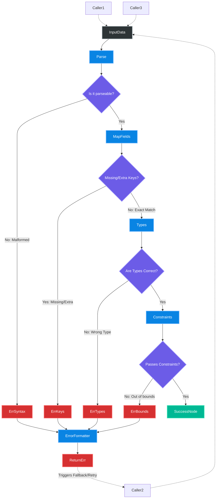

```mermaid
graph TD
    %% Styling
    classDef external fill:#2d3436,stroke:#b2bec3,stroke-width:2px,color:#fff;
    classDef process fill:#0984e3,stroke:#74b9ff,stroke-width:2px,color:#fff;
    classDef decision fill:#6c5ce7,stroke:#a29bfe,stroke-width:2px,color:#fff;
    classDef error fill:#d63031,stroke:#ff7675,stroke-width:2px,color:#fff;
    classDef success fill:#00b894,stroke:#55efc4,stroke-width:2px,color:#fff;

    %% Entry Points (Callers from Higher Tiers)
    Caller1 -.-> InputData
    Caller2 -.-> InputData
    Caller3 -.-> InputData

    %% Core Inputs
    InputData:::external --> Parse:::process

    %% Step 1: Syntax Check
    Parse --> CheckSyntax{Is it parseable?}:::decision
    CheckSyntax -->|No: Malformed| ErrSyntax:::error
    CheckSyntax -->|Yes| MapFields:::process

    %% Step 2: Structure Check
    MapFields --> CheckKeys{Missing/Extra Keys?}:::decision
    CheckKeys -->|Yes: Missing/Extra| ErrKeys:::error
    CheckKeys -->|No: Exact Match| Types:::process

    %% Step 3: Type Check
    Types --> CheckTypes{Are Types Correct?}:::decision
    CheckTypes -->|No: Wrong Type| ErrTypes:::error
    CheckTypes -->|Yes| Constraints:::process

    %% Step 4: Logic/Bounds Check (e.g., urgency must be 1-10)
    Constraints --> CheckBounds{Passes Constraints?}:::decision
    CheckBounds -->|No: Out of bounds| ErrBounds:::error
    CheckBounds -->|Yes| SuccessNode:::success

    %% Error Handling Routing
    ErrSyntax --> ErrorFormatter:::process
    ErrKeys --> ErrorFormatter
    ErrTypes --> ErrorFormatter
    ErrBounds --> ErrorFormatter

    ErrorFormatter --> ReturnErr:::error

    %% Feedback loop note
    ReturnErr -.->|Triggers Fallback/Retry| Caller2
```
