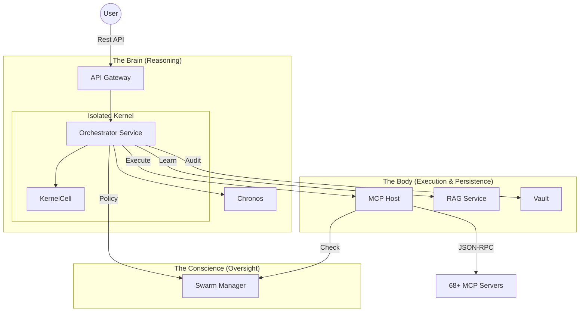

# 🏙️ Fractal Corp Services ("The Architecture")

The `services/` directory is the engine room of the Kea system. It follows a **Fractal Microservices Architecture**, where complex cognition is divided into 7 specialized, independent services. Each service embodies a specific "Corporate Persona" (e.g., The Brain, The Mouth, The Conscience) and communicates via an asynchronous, resilient service mesh.

## ✨ Features

- **Split-Brain Design**: Logic is decoupled into Reasoning (Orchestrator) vs. Execution (MCP Host), ensuring that LLM hallucinations cannot bypass system guardrails.
- **Asynchronous Resilience**: Services use the LangGraph state machine and persistent job queues to handle long-running research tasks without blocking.
- **Unified Identity**: The API Gateway manages a single security perimeter, while downstream services trust authenticated session headers.
- **Centralized Substrate**: All services inherit core utilities, data schemas, and hardware-awareness from the `shared/` library.

---

## 🏗️ The 7-Service "Fractal Corp"

Project cognition is built on a **"Brain vs Body"** topology, where core reasoning is isolated from microservice execution.

---

## 🔄 Lifecycle of a Research Request

1.  **Ingress**: The **API Gateway** receives a natural language query (e.g., "Analyze the tech sector for SOC2 compliance").
2.  **Dispatch**: A job is created in the **Vault** and dispatched to the **Orchestrator**.
3.  **Planning**: The Orchestrator's **Kernel** (Planner Node) uses the **RAG Service** (Library) to discover relevant tools and corporate knowledge.
4.  **Governance**: The proposed plan is checked by the **Swarm Manager** (Conscience) for compliance with organizational standards.
5.  **Execution**: The **MCP Host** (Hands) spawns JIT tool servers to fetch real-world data, streaming results back to the Vault.
6.  **Consensus**: The Orchestrator runs the **Generator-Critic-Judge** triad to verify the findings.
7.  **Synthesis**: The final report is formatted and served back to the user via the Gateway.

---

## 📁 Service Catalog

| Service | Persona | Role | Documentation |
|:--------|:--------|:-----|:--------------|
| **[kernel](../kernel/README.md)** | **The Logic** | Isolated Reasoning Engine (Pure Brain) | [🧠 View Doc](../kernel/README.md) |
| **[api_gateway](api_gateway/README.md)** | **The Mouth** | Perimeter Security, Auth, & Public API | [📖 View Doc](api_gateway/README.md) |
| **[orchestrator](orchestrator/README.md)** | **The Nervous System** | Graph Orchestration & Kernel Wrapper | [📖 View Doc](orchestrator/README.md) |
| **[mcp_host](mcp_host/README.md)** | **The Hands** | JIT Tool Execution & Process Supervision | [📖 View Doc](mcp_host/README.md) |
| **[rag_service](rag_service/README.md)** | **The Library** | Multi-Source Knowledge & Dataset Ingestion | [📖 View Doc](rag_service/README.md) |
| **[vault](vault/README.md)** | **The Memory** | Immutable Audit Trail & State Checkpointing | [📖 View Doc](vault/README.md) |
| **[swarm_manager](swarm_manager/README.md)** | **The Conscience** | Governance, Compliance & HITL Oversight | [📖 View Doc](swarm_manager/README.md) |
| **[chronos](chronos/README.md)** | **The Clock** | Job Scheduling & Temporal Management | [📖 View Doc](chronos/README.md) |

---

## 🧠 Deep Dive

### 1. The "Split-Brain" Protocol
Project separates **Reasoning** (LLM-based logic in the Orchestrator) from **Execution** (Python/Tool logic in the MCP Host) at the process level. The Orchestrator can *propose* a tool call, but the **MCP Host** validates the call against the **Swarm Manager's** policies before spawning the ephemeral JIT environment. This prevents "Prompt Injection" from escaping into the host operating system.

### 2. Service-to-Service Security
Services do not hardcode each other's credentials. The **API Gateway** acts as the single source of truth for identity. Internal services trust requests that carry verified identity headers (X-User-ID) injected by the Gateway, ensuring a zero-trust architecture inside the pod/cluster.

### 3. Hardware-Aware Scaling
Every service in the "Body" is aware of the substrate it runs on. Through the `shared.hardware` library, services like the **MCP Host** and **RAG Service** automatically throttle their concurrency and memory usage based on real-time system pressure (CPU/RAM/VRAM).

---

## 📚 Reference

### Local Development Ports

| service | port | internal path | nickname |
|:--------|:-----|:--------------|:---------|
| gateway | 8000 | `/api/v1` | The Mouth |
| brain | 8001 | `/research` | The Nervous System |
| hands | 8002 | `/tools` | The Hands |
| library | 8003 | `/data` | The Library |
| memory | 8004 | `/vault` | The Memory |
| manager | 8005 | `/swarm` | The Conscience |
| clock | 8006 | `/jobs` | The Clock |

---
*The Kea Services architecture ensures that corporate intelligence is distributed, governed, and resilient.*
