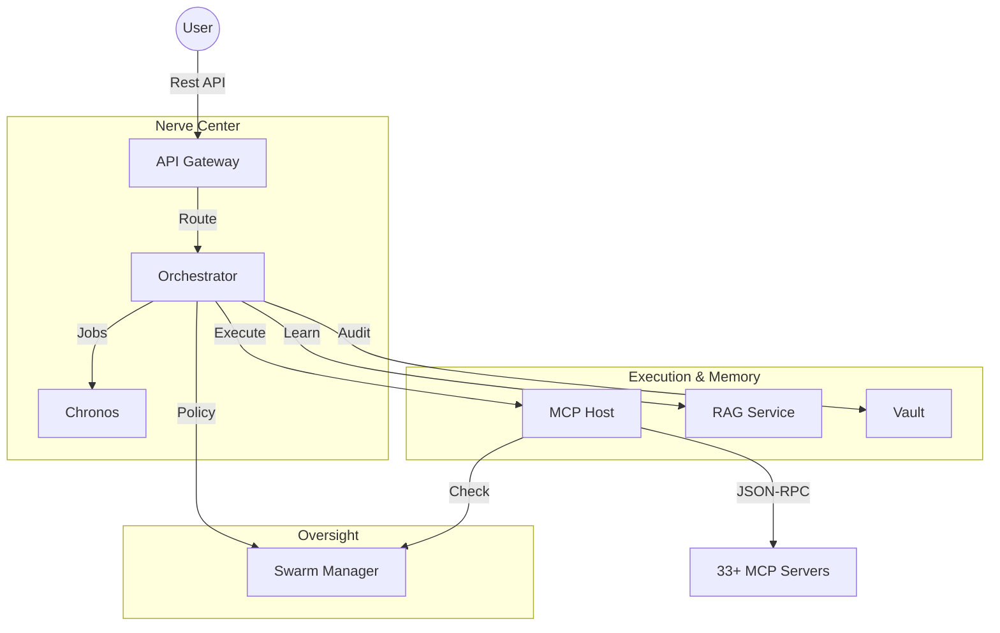

# 🏙️ Fractal Corp Services ("The Architecture")

The `services/` directory is the engine room of the Kea system. It follows a **Fractal Microservices Architecture**, where complex cognition is divided into 7 specialized, independent services. Each service embodies a specific "Corporate Persona" (e.g., The Brain, The Mouth, The Conscience) and communicates via an asynchronous, resilient service mesh.

## ✨ Features

- **Split-Brain Design**: Logic is decoupled into Reasoning (Orchestrator) vs. Execution (MCP Host), ensuring that LLM hallucinations cannot bypass system guardrails.
- **Asynchronous Resilience**: Services use the LangGraph state machine and persistent job queues to handle long-running research tasks without blocking.
- **Unified Identity**: The API Gateway manages a single security perimeter, while downstream services trust authenticated session headers.
- **Centralized Substrate**: All services inherit core utilities, data schemas, and hardware-awareness from the `shared/` library.

---

## 🏗️ The 7-Service "Fractal Corp"

---

## 📁 Service Catalog

| Service | Persona | Role | Documentation |
|:--------|:--------|:-----|:--------------|
| **[api_gateway](api_gateway/README.md)** | **The Mouth** | Entry point, Auth, & Routing | [📖 View Doc](api_gateway/README.md) |
| **[orchestrator](orchestrator/README.md)** | **The Brain** | Reasoning & Graph State | [📖 View Doc](orchestrator/README.md) |
| **[mcp_host](mcp_host/README.md)** | **The Hands** | Tool execution & JIT Spawning| [📖 View Doc](mcp_host/README.md) |
| **[rag_service](rag_service/README.md)** | **The Library**| Semantic search & HF Datasets | [📖 View Doc](rag_service/README.md) |
| **[vault](vault/README.md)** | **The Memory** | Audit logs & Checkpoints | [📖 View Doc](vault/README.md) |
| **[swarm_manager](swarm_manager/README.md)** | **The Conscience**| Compliance & Oversight | [📖 View Doc](swarm_manager/README.md) |
| **[chronos](chronos/README.md)** | **The Clock** | Scheduling & Time | [📖 View Doc](chronos/README.md) |

---

## 🧠 Deep Dive

### 1. The "Split-Brain" Protocol
Kea separates **Reasoning** (LLM) from **Execution** (Python/Tool) at the process level. The Orchestrator can *propose* a tool call, but the **MCP Host** validates the call against the **Swarm Manager's** policies before spawning the ephemeral JIT environment. This prevents "Prompt Injection" from escaping into the host OS.

### 2. Service Discovery
Services do not hardcode each other's URLs. Instead, they use the `shared.service_registry` which dynamically resolves service locations based on the `ENVIRONMENT` (Dev/Prod) and allows for zero-downtime service rotation.

---

## 📚 Reference

### Local Development Ports

| service | port | internal path |
|:--------|:-----|:--------------|
| gateway | 8000 | `/api/v1` |
| brain | 8001 | `/research` |
| hands | 8002 | `/tools` |
| library | 8003 | `/data` |
| memory | 8004 | `/vault` |
| manager | 8005 | `/swarm` |
| clock | 8006 | `/jobs` |
