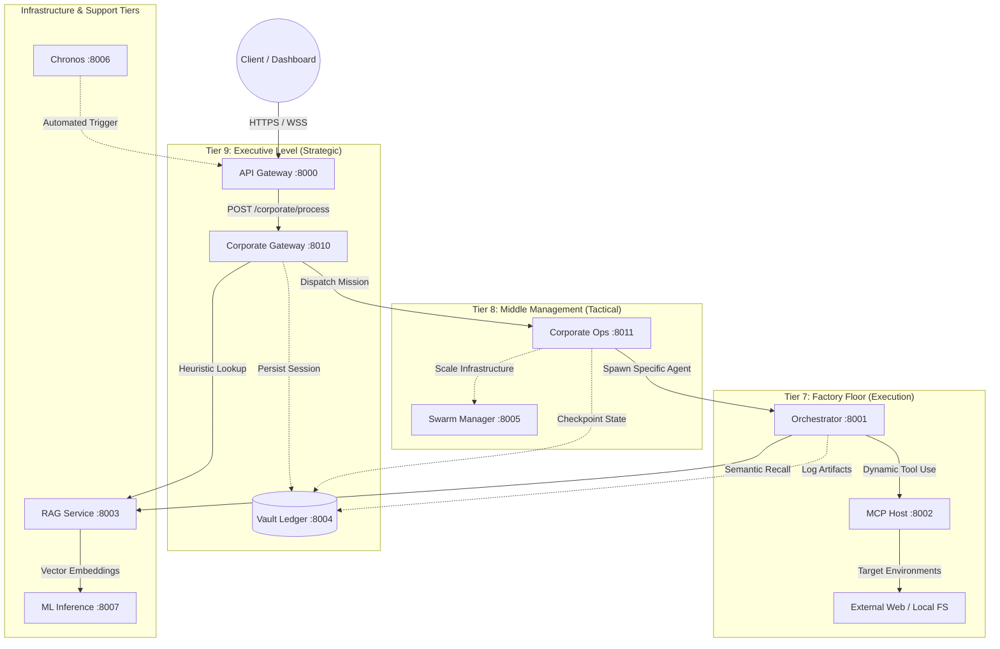

# 🏙️ Fractal Corp Services ("The Architecture")

The `services/` directory is the engine room of the Kea system. It represents the physical realization of the **Fractal Microservices Architecture**, translating the pure, decoupled logic of the `kernel/` into a robust, scalable, and highly available distributed system.

Unlike traditional LLM wrappers that combine parsing, execution, and memory into a single monolithic loop, Kea operates as a simulated multi-tiered corporation. Each service embodies a specific "Corporate Persona" (e.g., The CEO, The Operations Manager, The Factory Worker) with strict boundaries, isolated memories, and dedicated resource pools. They communicate exclusively via bounded HTTP APIs.

---

## ✨ Core Design Philosophy

### 1. Strict Separation of Concerns (The "Split-Brain" Protocol)
The most critical rule in Kea is the absolute decoupling of **Cognition** from **Execution** and **Orchestration**:
*   **Cognitive Logic (`kernel/`)**: Pure Python functions. They take data in, perform mathematical scoring, LLM inference, and graph resolution, and emit data out. They have zero awareness of web frames, HTTP, WebSockets, or databases.
*   **Service Wrappers (`services/`)**: FastAPI applications that handle networking, load balancing, security perimeters (API Gateway), and connection pooling (Vault/PostgreSQL). They use the `kernel` as an inner brain but manage the real-world state.

### 2. Fractal Scaling (Swarm Mechanics)
Work is always solved at the lowest possible layer of complexity:
*   **SOLO (Tier 7)**: A simple query runs on a single Orchestrator node.
*   **TEAM (Tier 8)**: A moderate task causes Corporate Ops to spawn 3-5 concurrent Orchestrator agents, synthesizing their outputs.
*   **SWARM (Tier 9/8 + Infrastructure)**: A massive, unstructured objective triggers the Swarm Manager to physically provision new Kubernetes pods/Docker containers, distributing hundreds of agents to tackle a dynamically chunked DAG.

### 3. Thermodynamic Computing (Asynchronous Resilience)
Long-running agentic loops are unpredictable. A task might take 50 milliseconds or 5 hours. Therefore, the system is fundamentally asynchronous:
*   **Tier 9 (Gateway)** is perfectly stateless and highly parallel, responding to user polls (`GET /status`) instantly.
*   **Tier 8 (Ops)** is stateful via Vault Checkpoints, maintaining long-polling loops without blocking web threads.
*   If an Orchestrator gets stuck in a hallucination loop, it is terminated by the Swarm Manager without affecting the Corporate Gateway or the user's dashboard.

### 4. Zero-Trust Interaction
Internal service-to-service communication relies on strict REST schemas. The **API Gateway** handles user authentication and JWT injection. Downstream services (Orchestrator, RAG, Vault) trust the `X-User-ID` headers but still cryptographically isolate tenant data. No service has direct access to another service's internal memory space.

---

## 🏗️ The 10-Service Network Topology

The architecture mimics a real-world enterprise structure, divided into distinct tiers of oversight, management, and execution.

```mermaid
graph TD
    User((Client / Dashboard)) -->|HTTPS / WSS| ApiGateway[API Gateway :8000]
    
    subgraph "Tier 9: Executive Level (Strategic)"
        ApiGateway -->|POST /corporate/process| CorpGateway[Corporate Gateway :8010]
        CorpGateway -.->|Persist Session| Vault
    end
    
    subgraph "Tier 8: Middle Management (Tactical)"
        CorpGateway -->|Dispatch Mission| CorpOps[Corporate Ops :8011]
        CorpOps -.->|Checkpoint State| Vault
        CorpOps -.->|Scale Infrastructure| Swarm[Swarm Manager :8005]
    end
    
    subgraph "Tier 7: Factory Floor (Execution)"
        CorpOps -->|Spawn Specific Agent| Orchestrator[Orchestrator :8001]
        Orchestrator -.->|Log Artifacts| Vault
        Orchestrator -->|Dynamic Tool Use| Host[MCP Host :8002]
        Host -->|Target Environments| ExternalApi[External Web / Local FS]
    end
    
    subgraph "Infrastructure & Support Tiers"
        Orchestrator -->|Semantic Recall| RAG[RAG Service :8003]
        CorpGateway -->|Heuristic Lookup| RAG
        Vault[(Vault Ledger :8004)] 
        RAG -->|Vector Embeddings| ML[ML Inference :8007]
        Chronos[Chronos :8006] -.->|Automated Trigger| ApiGateway
    end
```

### FAQ: Architecture & Common Concerns

**1. Is this an overlapping process between Corporate Gateway and Ops?**
**No. There is zero overlap.** Every tier does exactly one specialized job.
- **Tier 9 (Corporate Gateway)**: The "CEO/Client Liaison". Its only job is to talk to the client via `/corporate/process`, classify what they want (`ClientIntent`), decide on a high-level strategy (`ScalingMode`: SOLO, TEAM, or SWARM), chunk the goal, and dispatch it. It does **not** manage agents, run loops, or execute tasks.
- **Tier 8 (Corporate Ops)**: The "Operations Manager". It receives the high-level chunks from the Gateway, builds a topological execution graph (DAG), hires the agents (`Workforce Manager`), runs the sprints (`Team Orchestrator`), checks for contradictions between agents (`Quality Resolver`), and returns the final artifacts to the Gateway. It does **not** talk to the client.

**2. The most important thing is the kernel version, why should we need 2 engines in services?**
The `kernel/` directory is our **Domain Logic (Pure Mathematics & AI)**. It does not know what a web server is. The `services/` directory is our **Application Layer (FastAPI & HTTP)**, allowing the pure logic to interact with the real world.
We need separate service engines because they have completely different **Lifespans and Traffic Profiles**:
- A user hits the **Corporate Gateway** via `GET /status` to check their dashboard. This must return in **sub-50 milliseconds**. It must remain stateless and hyper-responsive.
- The **Corporate Ops** service runs stateful `SWARM` missions that might take **5 hours** to complete, polling thousands of agent states.
- *If we put them in the same service engine, the 5-hour mission would consume all the Python async worker threads, and the user's dashboard would freeze and crash when they tried to check their status.*

**3. Does this mean 2 more servers for microservices?**
**Yes.** In a production Kubernetes environment (or your local Docker Compose), `corporate-gateway` and `corporate-ops` run in completely separate pods/containers, mapped to ports `:8010` and `:8011` respectively.
This enables independent scaling. If you have 10,000 users logging in to browse but not running many tasks, you scale up the Gateway servers. If you have 5 users running massive 200-agent data processing jobs, you scale up the Corporate Ops and Orchestrator servers. Independent scaling saves massive amounts of cloud compute costs.

**4. Why don't we use or integrate it with Swarm Managers or Chronos?**
We *do* integrate with them, but via **Strict HTTP Boundaries**, not by merging their codebases.
- **Swarm Manager (Infrastructure):** When Corporate Ops realizes a mission is "Critical" and needs 100 agents, it makes an HTTP call to the Swarm Manager (`:8005`) to say, *"Hey Kubernetes, spin up 100 more Orchestrator pods."* The Swarm Manager handles the physical Docker/K8s scaling. Corporate Ops just dictates the cognitive policy.
- **Chronos (Time):** Chronos (`:8006`) acts as an automated user. When a scheduled job triggers (e.g., *"Generate a weekly report"*), Chronos makes an HTTP POST request to the **Corporate Gateway** identical to how a human would. The Gateway processes it normally.
By keeping the code strictly isolated, you can update, redeploy, or completely rewrite the `Swarm Manager` without accidentally breaking the `Corporate Gateway`'s logic.

---

## 🔄 The 3-Phase Execution Pipeline

Every request flowing into the system via `POST /corporate/process` undergoes a strict 3-phase lifecycle.

### Phase 1: Gate-In (Strategic Assessment) - *Tier 9*
The Gateway acts as the CEO, deciding *if* and *how* to process the request before committing expensive compute.
1. **Context Hydration**: Fetches the user's `SessionState` and recent history from the `Vault`.
2. **Intent Classification**: Evaluates the `ClientIntent` using linguistic heuristics or fast LLM passes:
   - `STATUS_CHECK` (Fast-path returns immediately)
   - `FOLLOW_UP` (Fast-path triggers RAG recall and returns)
   - `INTERRUPT` (Forwards abort/scope-change signal to T8)
   - `NEW_TASK` / `REVISION` (Proceeds to full planning)
3. **Strategy Assessment**: Analyzes objective complexity, capability gaps, and token budgets to establish a `ScalingMode` (SOLO, TEAM, SWARM).
4. **Decomposition**: Breaks the high-level objective into atomic `MissionChunks` (e.g., *Phase 1: Research, Phase 2: Draft, Phase 3: Review*).

### Phase 2: Execute (Tactical Orchestration) - *Tier 8*
The Gateway dispatches the authorized chunks via HTTP to Corporate Ops and awaits a result (or polls asynchronously).
1. **DAG Construction**: Ops converts the `MissionChunks` into a Direct Acyclic Graph (DAG) for topological execution.
2. **Sprint Planning**: Chunks are grouped into Sprints (parallelizable batches).
3. **Workforce Matching**: For each chunk, Ops queries the `RAG Service` to find the optimal Cognitive Profile (e.g., *Match chunk "Code Review" to persona "QA Engineer"*).
4. **Agent Spawning**: Ops makes an HTTP call to the `Orchestrator` to instantiate a sandboxed, persona-specific Tier 7 agent.
5. **Execution & Checkpointing**: As the Orchestrator agents complete chunks, Ops writes `CheckpointState` aggregates to the Vault. If a sprint fails, Ops triggers isolated retries.

### Phase 3: Gate-Out (Synthesis & Quality) - *Tier 9*
Once Corporate Ops completes the mission graph, control returns to the Gateway.
1. **Artifact Collection**: The Gateway pulls all generated outputs from the mission sprint via the Vault.
2. **Quality Audit & Conflict Resolution**: Runs a final `QualityResolver` pass. If the "Backend Developer" agent and the "QA Engineer" agent produced contradicting artifacts, the Gateway synthesizes a resolution or flags the discrepancy.
3. **Executive Synthesis**: The dispersed outputs are merged into a cohesive `SynthesizedResponse` (formatted with Executive Summaries, Confidence Scores, and direct answers).
4. **Ledger Persistence**: The final response, quality metadata, and updated session anchors are irrevocably saved to the Vault.

---

## 📁 Comprehensive Service Catalog

| Tier | Service Name | Nickname (Persona) | Internal Port | Target Role & Architecture Responsibility | State |
|:-----|:-------------|:-------------------|:--------------|:------------------------------------------|:------|
| **9** | **`corporate_gateway`** | **The CEO** | `:8010` | **Apex Entry Point.** Handles intent routing, strategic budget planning, fast-path resolution, and final response synthesis. | Stateless |
| **8** | **`corporate_ops`** | **The Manager** | `:8011` | **Mission Lifecycle.** Handles topological DAG generation, sprint planning, workforce matching, agent spawning, and quality audits. | Stateful (Checkpoints) |
| **7** | **`orchestrator`** | **The Worker** | `:8001` | **LangGraph State Engine.** Runs *one* specific persona doing *one* task at a time. Generates tool call requests, reflects on outputs. | Ephemeral State |
| **Infra**| **`api_gateway`** | **Security Guard** | `:8000` | **Perimeter Router.** Rate limiting, JWT authentication, CORS, and unified proxying to `/api/v1/*`. | Stateless |
| **Infra**| **`vault`** | **The Memory** | `:8004` | **Immutable Ledger.** Powered by PostgreSQL. Stores artifact blobs, agent logs, session states, and mission checkpoints. | Persistent State |
| **Infra**| **`rag_service`** | **The Library** | `:8003` | **Semantic Search.** Powered by `pgvector` / `ml_inference`. Provides cognitive profiles, behavioral rules, procedure documentation. | Persistent State |
| **Infra**| **`mcp_host`** | **The Hands** | `:8002` | **Tool Execution.** Model Context Protocol environment. Fully sandboxed. Communicates with external APIs or executes local code snippets. | Secure/Ephemeral |
| **Infra**| **`swarm_manager`** | **The Conscience**| `:8005` | **Hardware Governance.** Manages physical infrastructure (K8s/Docker). Spawns/terminates actual compute nodes based on Tier 8 demand. | Stateless |
| **Infra**| **`chronos`** | **The Clock** | `:8006` | **Temporal Triggers.** Monitors CRON schedules. Acts as a simulated user, posting automated tasks directly to the Corporate Gateway. | Stateful (Timers) |
| **Infra**| **`ml_inference`** | **The Cortex** | `:8007` | **Model Serving.** High-performance hosting for Embeddings and Rerankers (e.g., BGE-m3). Multi-GPU scalable. | Compute Heavy |

---

## 🔒 Cross-Service Data Flow (Example)

Consider a user request: *"Analyze our competitor's new product announcement and draft a counter-marketing campaign."*

1. **User → API Gateway**: Authenticates the user token. Routes to Corporate Gateway.
2. **Corporate Gateway**: 
   - Queries **Vault** for past competitor analysis context.
   - Evaluates: *Complex multi-domain task*. Sets Strategy: `TEAM`. Decomposes into: [1] Web Research, [2] Marketing Draft.
   - Forwards DAG to Corporate Ops.
3. **Corporate Ops**:
   - Queries **RAG Service** for "Researcher" and "Marketer" profiles.
   - Spawns Agent A on **Orchestrator Node 1** (Researcher profile).
   - Spawns Agent B on **Orchestrator Node 2** (Marketer profile).
4. **Orchestrator A**: Uses **MCP Host** to trigger web-scraping sub-tools. Saves findings as `Artifact_A` in **Vault**.
5. **Orchestrator B**: Reads `Artifact_A` from **Vault**. Uses internal LLM loops to write draft. Saves as `Artifact_B` in **Vault**.
6. **Corporate Ops**: Detects sprint completion. Audits `Artifact_A` and `Artifact_B`. Sends success signal back to Corporate Gateway.
7. **Corporate Gateway**: Pulls both artifacts, synthesizes an executive summary outlining "Key competitive threats and our proposed campaign", checks tone, and returns the final JSON to the API Gateway.
8. **API Gateway → User**: Receives the fully compiled payload.

*This perfectly decoupled fractal design ensures that business logic is highly organized, securely governed, and infinitely scalable.*
