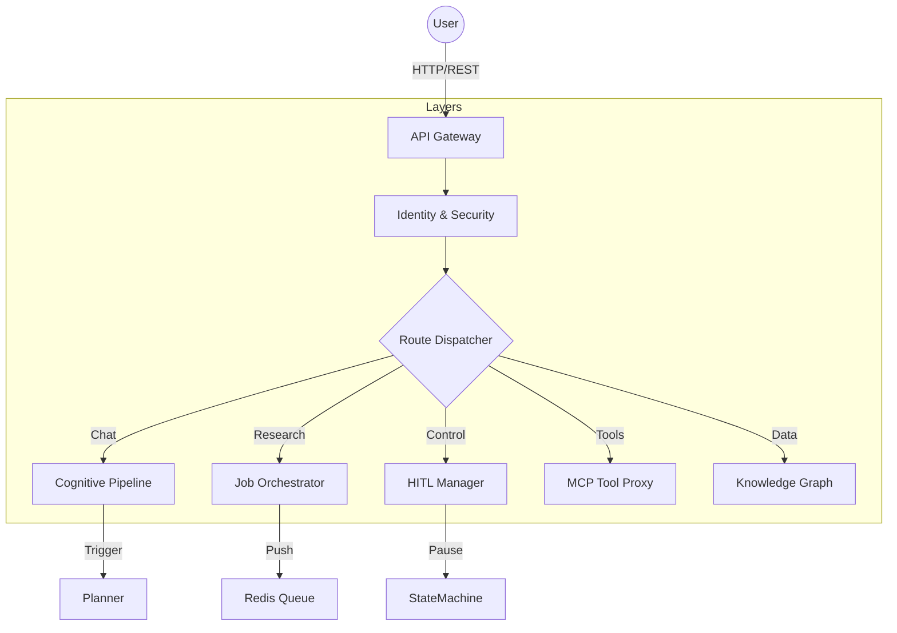

# 🚪 API Gateway Service ("The Front Door")

The **API Gateway** is the centralized nerve center of the Kea system. It is responsible for routing user intentions, managing the security perimeter, orchestrating asynchronous research jobs, and handling the entire cognitive pipeline lifecycle.

---

## 🏗️ Architecture Overview

The Gateway implements a **4-Layer Architecture** to ensure security and scalability:

1.  **Security Layer**: Token Bucket Rate Limiting, CORS, and Security Headers.
2.  **Identity Layer**: Hybrid Authentication (JWT for APIs + HttpOnly Cookies for Web).
3.  **Application Layer**: 9 specialized route modules handling diverse domains.
4.  **Integration Layer**: Redis Queue for background jobs and Event Bus for inter-service comms.

---

## 📁 Codebase Structure & Reference

| File / Directory | Component | Description | Key Functions/Classes |
|:-----------------|:----------|:------------|:----------------------|
| **`main.py`** | **Entry Point** | App configuration, middleware assembly, and router verification. | `create_app()`, `mount_routes()` |
| **`routes/`** | **Route Modules** | Domain-specific request handlers. | |
| ├── `jobs.py` | Orchestration | Manages long-running research tasks via Redis/BackgroundTasks. | `create_job()`, `get_job_status()` |
| ├── `conversations.py` | Cognitive Logic | **The Core Brain.** Handles chat messages, context, and triggers the Research Pipeline. | `send_message()`, `search_conversations()` |
| ├── `interventions.py` | HITL | "Stop-and-Wait" logic for human approval of agent actions. | `respond_to_intervention()`, `list_pending()` |
| ├── `mcp.py` | Tooling | Direct interface to the 17 MCP Servers for testing/bypassing agents. | `invoke_tool()`, `list_servers()` |
| ├── `llm.py` | AI Proxy | Internal gateway for LLM switching, usage tracking, and cost calculation. | `generate()`, `enable_provider()` |
| ├── `auth.py` | Identity | User registration, login, and JWT token issuance. | `login()`, `register()`, `refresh_token()` |
| ├── `graph.py` | Memory | API for exploring the Knowledge Graph and Provenance chains. | `get_entity_provenance()`, `find_contradictions()` |
| └── `artifacts.py` | Storage | Blob storage for large research outputs (PDFs, Parquet). | `upload_artifact()`, `download_artifact()` |
| **`middleware/`** | **Middleware** | Cross-cutting concerns. | `RateLimitMiddleware`, `AuthMiddleware` |

---

## � API Endpoint Structure

### 1. Job Dispatcher (The Core)
Handles Research, Synthesis, and Shadow Lab execution.

| Endpoint | Method | Description |
|:---------|:-------|:------------|
| `/api/v1/jobs` | `POST` | Submit a new polymorphic job (Research, Synthesis, Calc). |
| `/api/v1/jobs` | `GET` | List all recent jobs with filtering/pagination. |
| `/api/v1/jobs/{id}` | `GET` | Get real-time status, logs, and progress of a job. |
| `/api/v1/jobs/{id}` | `DELETE` | Cancel/Terminate a running job immediately. |
| `/api/v1/jobs/{id}/result` | `GET` | Get final job report and artifacts (Completed jobs only). |

### 2. Memory & Knowledge Brain
Interacts with the Vector DB, Atomic Facts, and Graphs.

| Endpoint | Method | Description |
|:---------|:-------|:------------|
| `/api/v1/memory/search` | `POST` | Perform semantic search against Atomic Facts DB. |
| `/api/v1/graph/entities/{id}/provenance` | `GET` | Retrieve the Provenance Graph (Nodes/Edges) for UI. |
| `/api/v1/graph/contradictions` | `GET` | Find conflicting facts in memory. |
| `/api/v1/memory/sessions/{id}` | `GET` | Get the full session detail. |

### 3. Artifacts & Storage
Accessing heavy files generated by the system (Parquet, PDF, Charts).

| Endpoint | Method | Description |
|:---------|:-------|:------------|
| `/api/v1/artifacts/{id}` | `GET` | Get artifact metadata. |
| `/api/v1/artifacts/{id}/download` | `GET` | Download a raw artifact file (binary stream). |
| `/api/v1/artifacts` | `POST` | Step 1: Create artifact metadata container. |
| `/api/v1/artifacts/{id}/upload` | `POST` | Step 2: Upload binary content (Multipart). |

### 4. Human-in-the-Loop (Interventions)
Managing pauses, confirmations, and feedback.

| Endpoint | Method | Description |
|:---------|:-------|:------------|
| `/api/v1/interventions` | `GET` | List all jobs currently paused waiting for human input. |
| `/api/v1/interventions/{id}` | `GET` | Get details of the decision needed (e.g., choices). |
| `/api/v1/interventions/{id}/respond` | `POST` | Submit human decision to resume the job. |

### 5. System & Connectors
Configuration, Capabilities, and Health.

| Endpoint | Method | Description |
|:---------|:-------|:------------|
| `/api/v1/system/capabilities` | `GET` | List active Agents/Tools (e.g., Scraper, Analyst, Vision). |
| `/api/v1/system/health` | `GET` | Check status of Microservices (Redis, DB, Scraper). |
| `/api/v1/system/config` | `GET` | View global settings (Read-only). |
| `/api/v1/system/metrics/summary` | `GET` | Get high-level system stats. |

### 6. LLM Provider Management
Managing the AI models used by the Orchestrator.

| Endpoint | Method | Description |
|:---------|:-------|:------------|
| `/api/v1/llm/providers` | `GET` | List available providers (OpenAI, Gemini, Anthropic). |
| `/api/v1/llm/models` | `GET` | List available models for a specific provider. |
| `/api/v1/llm/providers/{name}/enable` | `POST` | Hot-swap: Enable a specific provider. |
| `/api/v1/llm/usage` | `GET` | Get token usage statistics and cost estimation. |

### 7. Conversations
Multi-turn conversation management with memory.

| Endpoint | Method | Description |
|:---------|:-------|:------------|
| `/api/v1/conversations` | `POST` | Start new conversation session. |
| `/api/v1/conversations/{id}` | `GET` | Get conversation history and context. |
| `/api/v1/conversations/{id}/message` | `POST` | Send message with intent detection. |

### 8. MCP Tools
Managing MCP servers and tool execution.

| Endpoint | Method | Description |
|:---------|:-------|:------------|
| **Jobs** | `POST` | `/jobs` | Spawn async background worker. |
| **HITL** | `POST` | `/interventions/{id}/respond` | Submit user decision to blocked agent. |
| **Tools** | `POST` | `/mcp/invoke` | Raw tool execution (No LLM). |
| **LLM** | `POST` | `/llm/providers/openrouter/enable`| Hot-swap LLM provider. |
| **Graph**| `GET` | `/graph/entities/{id}/provenance`| Visualize fact derivation. |
| **Auth** | `POST` | `/auth/login` | Returns JWT + Sets Session Cookie. |
|:---------|:-------|:------------|
| `/api/v1/mcp/servers` | `GET` | List active MCP servers. |
| `/api/v1/mcp/tools` | `GET` | List all available tools across servers. |
| `/api/v1/mcp/invoke` | `POST` | Execute a specific tool (Body: `{"tool_name": ...}`). |

### 9. Authentication & Users
User management and authentication.

| Endpoint | Method | Description |
|:---------|:-------|:------------|
| `/api/v1/auth/login` | `POST` | Returns JWT + Sets Session Cookie. |
| `/api/v1/auth/register` | `POST` | Register a new user. |
| `/api/v1/users/me` | `GET/PUT` | Get or Update current user profile. |
| `/api/v1/users/me/keys` | `GET/POST` | Manage personal API keys. |

---

## �️ Middleware Stack

Every request passes through a rigid security filter:

1.  **RateLimitMiddleware`: 100 req/min (Burst protection).
2.  **RequestLoggingMiddleware**: Structural JSON logging with `trace_id`.
3.  **SecurityHeadersMiddleware**: HSTS, X-Frame-Options, X-Content-Type-Options.
4.  **AuthMiddleware**: Decodes JWT/Cookie and injects `current_user` into request context.
