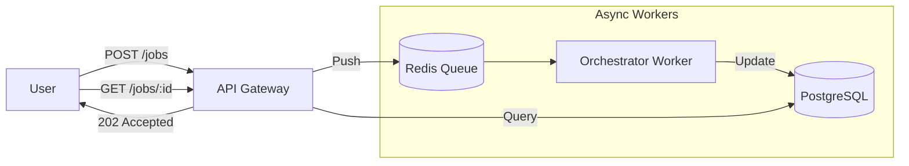

# API Gateway Service ("The Front Door")

The API Gateway is the entry point for all interactions with Kea. It manages authentication, rate limiting, and the asynchronous job queue.

## 🏗️ Architecture

Kea uses a **Polymorphic Asynchronous Pattern**. Long-running research jobs are handled via a "Fire-and-Forget" mechanism backed by Redis and PostgreSQL.



## 🧩 Codebase Reference

### 1. Service Entry
| File | Description | Key Classes/Functions |
|:-----|:------------|:----------------------|
| `main.py` | FastAPI application factory. Registers all routers (Jobs, Memory, Auth) and middleware. | `app`, `include_router()` |

### 2. Routes (`/routes`)
Each file corresponds to a domain of the API.

| File | Endpoint Base | Description | Key Operations |
|:-----|:--------------|:------------|:---------------|
| `jobs.py` | `/api/v1/jobs` | **Job Dispatcher**. Handles submission and status polling of long-running tasks. | `create_job()` (Polymorphic), `get_job_status()` |
| `memory.py` | `/api/v1/memory` | **Brain Access**. Semantic search against the vector store and provenance graph retrieval. | `search_memory()`, `get_provenance_graph()` |
| `auth.py` | `/api/v1/auth` | **Security**. JWT token generation and validation. | `login()`, `refresh_token()` |
| `system.py` | `/api/v1/system` | **Health & Config**. System capabilities, tool listing, and health checks. | `get_capabilities()`, `health_check()` |

### 3. Middleware (`/middleware`)
Cross-cutting concerns applied to every request.

| File | Description | Responsibility |
|:-----|:------------|:---------------|
| `auth.py` | **JWT Validator**. Decodes Bearer tokens and injects `current_user` into request scope. | Blocks unauthorized access. |
| `rate_limit.py` | **Throttler**. Implements Token Bucket algorithm per user/IP. | Prevents API abuse. |
| `correlation.py`| **Tracer**. Generates unique `request_id` for every call, propagated to logs. | Enables request tracing across microservices. |

## 🔌 API Endpoints Detail

### Job Management
*   `POST /api/v1/jobs`: Submit a polymorphic job (Research, Synthesis, Shadow Lab).
*   `GET /api/v1/jobs/{id}`: Poll for status and logs.
*   `GET /api/v1/jobs`: List recent history.

### Memory & Context
*   `POST /api/v1/memory/search`: Semantic search against facts.
*   `GET /api/v1/memory/graph/{job_id}`: Retrieve provenance graph.

### System
*   `GET /api/v1/system/capabilities`: List active agents and tools.
*   `GET /api/v1/system/health`: Service health check.

## 🚀 Usage

```bash
# Start the API Gateway
python -m services.api_gateway.main
```
