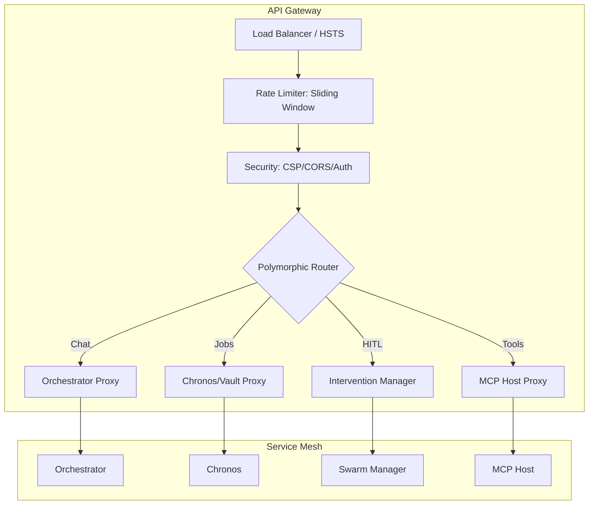

# 🚪 API Gateway Service ("The Front Door")

The **API Gateway** is the centralized nerve center of the Kea v0.4.0 system. It manages the security perimeter, orchestrates asynchronous research jobs, and serves as the primary interface for human interaction with the "Fractal Corp" hive mind.

## 📐 Architecture

The Gateway implements a **4-Layer Defense-in-Depth Architecture**, ensuring that only valid, authorized, and safe requests reach the internal reasoning services.

### Component Overview

| Component | Responsibility | Key Files |
| :--- | :--- | :--- |
| **Identity & Security**| JWT/Cookie Auth, CSP enforcement, and XSS protection. | `middleware/auth.py`, `middleware/security.py` |
| **Rate Limiter** | Postgres-backed sliding window protection (100 req/min). | `middleware/rate_limit.py` |
| **Intervention Mgr** | Manages "Pause & Escalate" states for HITL decision-making. | `routes/interventions.py` |
| **Job Orchestrator** | High-level job state transitions (PENDING -> RUNNING). | `routes/jobs.py` |
| **MCP Proxy** | Direct bridge for tool discovery and execution. | `routes/mcp.py` |

---

## ✨ Key Features

### 1. Hybrid Authentication (JWT + Cookies)
Supports both programmatic access (via JWT tokens in Header) and browser-based sessions (via HttpOnly cookies). The Gateway is the **Source of Truth for Identity**; downstream services trust the injected `X-User-ID` header.

### 2. High-Fidelity Job Lifecycle
The `/jobs` endpoint handles the asynchronous nature of research. It creates persistent job records in PostgreSQL and delegates the cognitive workflow to the **Orchestrator**, allowing users to monitor progress via SSE (Server-Sent Events) or WebSockets.

### 3. Human-in-the-Loop (HITL) Protocol
When a `KernelCell` encounters a high-risk action or an information gap, it sends an **Escalation**. The Gateway's `interventions` route exposes these as actionable notifications, allowing humans to "Approve," "Reject," or "Provide Clarification" without stopping the entire thread.

### 4. Zero-Trust Security Middleware
Every request passes through a rigid middleware stack:
- **RateLimitMiddleware**: Blocks brute-force and scraping attempts early.
- **SecurityHeadersMiddleware**: Sets CSP, HSTS, and Frame-Options to harden the browser client.
- **AuthMiddleware**: Populates the request state with a verified `User` object.

---

## 📁 Codebase Structure

- **`main.py`**: FastAPI entrypoint. Mounts all routers and configures the global middleware stack.
- **`routes/`**: Polymorphic API modules.
    - `conversations.py`: High-level chat interface for "Kea Conversations."
    - `jobs.py`: Submits and tracks long-running autonomous missions.
    - `interventions.py`: The interface for human governance and decision points.
    - `mcp.py`: Management of MCP tools and Direct Execution endpoints.
- **`middleware/`**: Cross-cutting concerns for security and performance.
- **`clients/`**: Typed HTTP/RPC clients for communicating with Peer services (Orchestrator, Vault, RAG).

---

## 🧠 Deep Dive

### 1. The Async Job "Handshake"
When a user submits a job, the Gateway doesn't wait for results. It:
1.  Validates the query and complexity.
2.  Creates a job in the **Vault**.
3.  Returns a `202 Accepted` with a `job_id`.
4.  Wires the job to an background worker that triggers the Orchestrator.

### 2. Contextual Continuity
The Gateway supports "Contextual Seeding." A user can provide `seed_facts` or `existing_artifacts` in a request, which the Gateway injects into the Orchestrator's **Inference Context**, allowing new research to build upon previous work seamlessly.

---
*The API Gateway is the interface through which human intent is translated into autonomous corporate action.*
