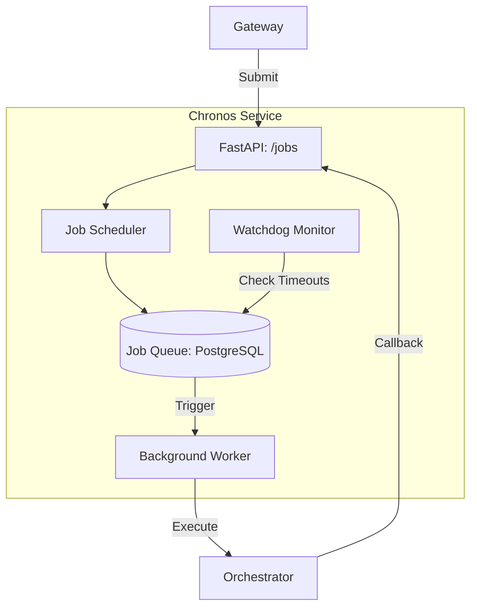

# ⏳ Chronos Service ("The Clock")

**Chronos** is the temporal orchestration and job scheduling layer of Kea. It acts as the system's **Timekeeper**, managing the execution of recurring tasks, long-running system jobs, and system-wide timeouts.

## 📐 Architecture

Chronos provides a **Postgres-backed Task Scheduler** that ensures exactly-once execution and resilience across service restarts.

### Component Overview

| Component | Responsibility | Cognitive Role |
| :--- | :--- | :--- |
| **Job Scheduler** | Manages `PENDING` -> `RUNNING` transitions. | Cerebrospinal Fluid |
| **Watchdog** | Audits "Zombie Jobs" and enforces timeouts. | Circadian Rhythm |
| **Temporal DB** | Reliable persistence for job state. | Long-term Memory |

---

## ✨ Key Features

### 1. Atomic State Transitions
Chronos ensures that no system job is "lost" in deep recursion. By utilizing PostgreSQL's ACID properties, it wraps every state change (`STARTING`, `COMPLETED`, `FAILED`) in a transaction, providing a 100% reliable audit trail for job execution.

### 2. Temporal Governance (Watchdogs)
If a node in the **Orchestrator** hangs or a tool call in the **MCP Host** never returns, the **Watchdog** detects the discrepancy. It automatically terminates the zombie process and signals the **Vault** to mark the job as `TIMED_OUT`, preventing resource leaks.

### 3. Progressive Monitoring
Chronos provides a real-time progress scalar (0.0 to 1.0) for every active job. This reflects the completion of DAG nodes in the **Researcher** node, allowing the **API Gateway** to show accurate progress bars to the end-user.

---

## 📁 Codebase Structure

- **`main.py`**: FastAPI entrypoint hosting the temporal and scheduling API.
- **`core/`**: Placeholder for future scheduling logic.
    - `__init__.py`: Package marker.
    - `scheduler.py`: (Pending) The core engine for managing task recurrence and priority.
    - `watchdog.py`: (Pending) Background monitor for enforcing timeouts.

---

## 🧠 Deep Dive

### 1. The "Deferred Execution" Pattern
When a user requests an "Autonomous" task, the Gateway doesn't block. It hands the intent to Chronos. Chronos enqueues the job and immediately returns. The user can then "Follow" the job's progress asynchronously, while Chronos takes over the responsibility of ensuring the **Orchestrator** finishes the mission.

### 2. Distributed Backpressure
Chronos acts as a traffic controller. By monitoring the total number of `RUNNING` jobs across all **Workers**, it can implement backpressure—delaying the start of new missions until the system has cooled down, ensuring that no request "fails" due to transient system load.

---
*Chronos ensures that Kea remains synchronized and every mission reaches its conclusion.*

