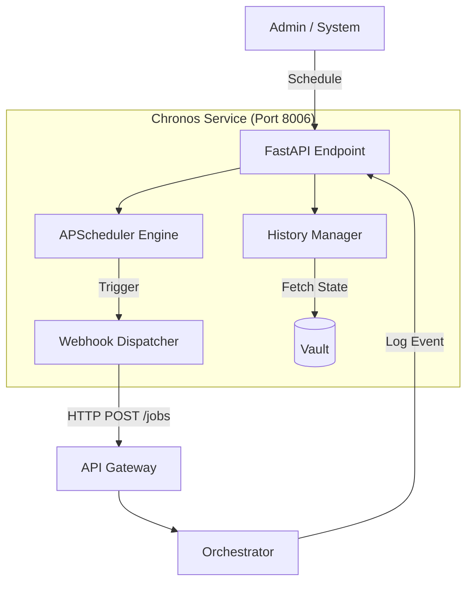

# ⏳ Chronos Service ("The Timekeeper")

**Chronos** is the temporal orchestration layer of Kea. It manages scheduled research jobs, recurring monitoring tasks, and the "Time-Travel" debugging system which allows developers to replay cognitive state transitions by re-injecting historical snapshots.

---

## 🏗️ Architecture Overview

Chronos combines a **Task Scheduler** with a **State Historian**. It ensures that long-running research tasks are executed reliably and that the system's cognitive evolution is fully traceable.

1.  **Job Scheduler**: Uses `apscheduler` with a Redis backend to trigger Orchestrator jobs via the API Gateway.
2.  **Time-Travel Debugger**: Pulls state snapshots from the **Vault** and provides a replay interface for the UI.
3.  **Event Watcher**: Listens for system events (e.g., `FACT_DISCOVERED`) to trigger reactive research loops.

---

## 📁 Codebase Structure

| File / Directory | Component | Description | Key Functions/Classes |
|:-----------------|:----------|:------------|:----------------------|
| **`main.py`** | **Entry Point** | FastAPI application assembly and lifecycle management. | `create_app()`, `lifespan` |
| **`core/`** | **Logic** | Core temporal and replay logic. | |
| ├── `scheduler.py` | Engine | Handles cron-based and interval-based scheduling. | `init_scheduler()`, `add_job()` |
| ├── `replay.py` | Debugger | Re-injects historical states into the Orchestrator. | `replay_thread()`, `seek_state()` |
| ├── `webhooks.py` | Dispatcher | Robust HTTP client for inter-service triggers. | `dispatch_webhook()`, `RetryPolicy` |
| └── `models.py` | Persistence | SQL schemas for scheduled tasks and audit logs. | `ScheduledJob`, `TriggerLog` |

---

## 🏗️ Technical Deep Dive

### 1. State Time-Travel Replay (`core/replay.py`)
Chronos enables "Post-Mortem Cognition Analysis" by replaying LangGraph threads.
- **Snapshot Selection**: Users can select a specific `trace_id` and `sequence_number` from the Vault.
- **State Injection**: Chronos sends a special "Replay Request" to the Orchestrator, which initializes the graph with the historical state instead of a new query.
- **Branching**: Allows developers to "Fork" a past state and test how a different LLM or Tool would have changed the research outcome.

### 2. Reliable Webhook Dispatch (`core/webhooks.py`)
Since Chronos triggers external research jobs, it must handle network instability.
- **At-Least-Once Delivery**: Uses an exponential backoff strategy for failed webhook calls.
- **Circuit Breaking**: If the API Gateway is down, Chronos pauses the scheduler to prevent job backlog.
- **Idempotency**: Every trigger includes a `request_id` to prevent the Orchestrator from starting the same research job twice.

---

## 🔌 API Reference

### 1. Job Orchestration
| Endpoint | Method | Description |
|:---------|:-------|:------------|
| `/jobs/schedule` | `POST` | Schedule a new recurring or one-time research job. |
| `/jobs/active` | `GET` | List all currently scheduled tasks. |
| `/jobs/{id}/cancel` | `POST` | Remove a job from the scheduler. |

### 2. Time-Travel & Debugging
| Endpoint | Method | Description |
|:---------|:-------|:------------|
| `/replay/{thread_id}/steps` | `GET` | List all available state snapshots for a thread. |
| `/replay/{thread_id}/trigger` | `POST` | Re-inject a specific state snapshot into the Orchestrator. |
| `/events/log` | `POST` | Register a new system event for reactive triggers. |
