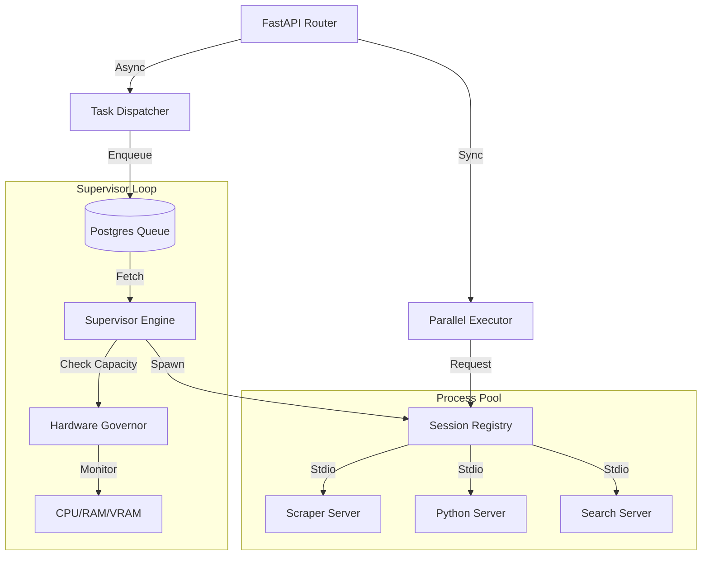

# 🔌 MCP Host Service ("The Hands")

The **MCP Host Service** is the multi-process execution engine of Kea. It is responsible for managing the lifecycle of ephemeral tool processes, handling JSON-RPC communication, and providing a governed high-throughput interface for tool execution. It implements the "Pure MCP" architecture, ensuring the core system remains decoupled from tool-specific dependencies.

## ✨ Features

- **JIT (Just-In-Time) Spawning**: Automatically discovers and spawns MCP servers only when their tools are requested, optimizing resource usage.
- **Hardware-Aware Governance**: Real-time monitoring of CPU, RAM, and VRAM with automatic task throttling to prevent system OOMs.
- **Static Tool Discovery**: Uses AST (Abstract Syntax Tree) analysis to discover tool signatures without needing to execute the server code first.
- **Parallel Dispatch Engine**: Handles concurrent tool execution with fan-out support and fire-and-forget background tasks.
- **Persistent Tool Registry**: Automatically indexes discovered tools into a PostgreSQL (pgvector) database for semantic search at scale.
- **Sandboxed Execution**: Leverages `uv` for isolated, high-performance environment management with automatic dependency resolution.

---

## 📐 Architecture

The MCP Host operates as a **Process Supervisor** and **JSON-RPC Proxy**. It bridges the gap between the high-level Orchestrator and low-level Stdio-based MCP Servers.

### 🗼 Topology: Supervisor-Worker Model

---

## 📁 Codebase Structure

The service is divided into a lightweight API layer and a robust core orchestration engine.

- **`main.py`**: FastAPI entrypoint hosting the execution and dispatching endpoints.
- **`core/`**: The implementation of the MCP hosting logic.
    - `session_registry.py`: Manages JIT spawning, process termination, and AST-based tool discovery.
    - `supervisor_engine.py`: Implements the governance loop, hardware health checks, and priority-based dispatching.
    - `parallel_executor.py`: Provides utilities for concurrent execution of multiple tools.
    - `postgres_registry.py`: persistence layer for tool metadata and semantic search indexing.
    - `background.py`: background workers for processing dispatched batch tasks.
    - `models.py`: Pydantic data models for the internal and external API.

---

## 🧠 Deep Dive

### 1. JIT Discovery & Spawning Logic
The `SessionRegistry` performs a two-stage discovery process:
1.  **Static Analysis (AST)**: On startup, it scans the `mcp_servers/` directory and parses the Python source code of each server to extract tool names and docstrings using the `ast` module. This allows the system to know about 1,000+ tools without starting a single process.
2.  **JIT Spawning**: When a tool is called, the registry checks for an active session. If none exists, it uses `uv run` to spawn the server in a pristine environment, waiting until the JSON-RPC handshake is complete before routing the call.

### 2. Hardware-Aware Governance
The `SupervisorEngine` implements a "Corporate Budget" for system resources:
- **Resource Costing**: Each task is assigned a `resource_cost`. The supervisor ensures the total cost of active tasks never exceeds the `max_concurrent_cost` setting.
- **Automatic Throttling**: If CPU > 90%, RAM > 95%, or VRAM is critical, the supervisor pauses dispatching new tasks until the system cools down.
- **Skip-Locked Concurrency**: Uses Postgres `FOR UPDATE SKIP LOCKED` to allow multiple MCP Host instances to pull from the same task queue without collisions.

### 3. Isolation & Dependency Management
Kea utilizes `uv` to manage the complexity of tool dependencies. If an MCP server directory contains a `pyproject.toml`, the host runs it in "Project Mode", ensuring it has its own isolated environment. Otherwise, it runs in "Global Mode" using the Kea environment.

---

## 📚 Reference

### API Interface

| Endpoint | Method | Description |
|:---------|:-------|:------------|
| `/tools` | `GET` | List all discovered tools across all servers. |
| `/tools/execute` | `POST` | Synchronous execution of a single tool. |
| `/tools/batch` | `POST` | Parallel synchronous execution of multiple tools. |
| `/tools/dispatch` | `POST` | Asynchronous (Fire-and-Forget) execution. Returns `batch_id`. |
| `/tools/batch/{id}` | `GET` | Retrieve the status and results of an asynchronous batch. |

### Governance Defaults
- **Poll Interval**: 1s (configurable).
- **Max RAM**: 90% (configurable).
- **Grace Period**: 120s for `uv` dependency installation during first spawn.
- **Concurrency**: Governed by `max_concurrent_cost` in `settings.yaml`.
