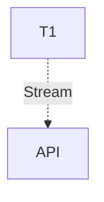

# 🔌 MCP Host Service ("The Hands")

The **MCP Host Service** is the execution engine of Kea. It is responsible for managing the lifecycle of ephemeral tool processes, handling JSON-RPC communication, and providing a unified HTTP interface for the Orchestrator to execute actions.

---

## 🏗️ Architecture Overview

The MCP Host operates as a **Process Manager** and **RPC Proxy**. It implements the "Pure MCP" architecture where no tool logic resides in the main process.

The Host operates using a **Supervisor-Worker Topology**:

1.  **Supervisor Engine**: The central factory manager. It monitors system resources and dynamically scales individual MCP server instances.
2.  **Session Registry**: Manages the lifecycle of active `MCPServerSession` objects. It handles "JIT (Just-In-Time) Spawning"—starting a server only when a tool in its domain is requested.
3.  **Hardware-Aware Governor**: Enforces strict `max_ram_percent` and `max_cpu_percent` limits (configurable in `settings.yaml`). If limits are breached, the Governor initiates a "Graceful Degradation" protocol, prioritizing critical tools over luxury ones.



---

## 📁 Codebase Structure

| File / Directory | Component | Description |
|:-----------------|:----------|:------------|
| **`main.py`** | **Entry Point** | FastAPI app (Port 8002). Exposes `/tools/call`. |
| **`core/`** | **Logic** | Core tool management. |
| ├── `session_registry.py` | Controller | Manages active sessions with MCP servers. |
| ├── `supervisor_engine.py` | **Governor** | **NEW**: Manages hardware limits (CPU/RAM) and task priority. |
| ├── `parallel_executor.py` | Fan-Out | Implements concurrent tool execution logic. |
| ├── `postgres_registry.py` | Persistence | Stores server configurations and metrics in DB. |
| └── `background.py` | Dispatcher | Handles Fire-and-Forget batch tool execution. |

---

## 🔌 API Reference

### Tool Execution
**POST** `/tools/execute`

Executes a single tool.

**Request:**
```json
{
  "tool_name": "fetch_url",
  "arguments": {
    "url": "https://example.com"
  }
}
```

### Batch Processing
**POST** `/tools/batch`
Executes multiple tools in parallel and waits for results.

**POST** `/tools/dispatch`
Fire-and-forget execution; returns a `batch_id`.

**GET** `/tools/batch/{batch_id}`
Check status of a dispatched batch.

---

## 🏗️ Technical Deep Dive

### 1. Enterprise Guardrails (`core/tool_manager.py`)
Before any tool is executed, the MCP Host initiates a synchronous compliance handshake:
- **Operation**: `tool_exec`
- **Context**: Pass-through of tool name and proposed arguments.
- **Outcome**: If the **Swarm Manager** returns `passed: false`, the tool execution is halted, and a "Compliance Blocked" error is returned to the Orchestrator.

### 2. Resilience Architecture
The Host treats tool servers as volatile processes:
- **Circuit Breaker**: Each server (e.g., `scraper`) has its own circuit breaker. If it fails 5 consecutive times, the breaker opens, and all future calls to that server are rejected for 60 seconds to allow the process to recover.
- **Graceful Lifecycle**: When the system shuts down, it attempts `SIGTERM` followed by a 5-second timeout before `SIGKILL`, ensuring file handles and network sockets are closed properly.

### 3. Monitoring & Metrics
Integrated with Prometheus:
- `active_tools`: Gauge of currently running tool processes.
- `governor_status`: Boolean (Paused/Running) based on hardware health.
- `tool_duration_seconds`: Histogram of execution latency.
- `tool_failure_total`: Counter of non-compliant or buggy tool executions.
