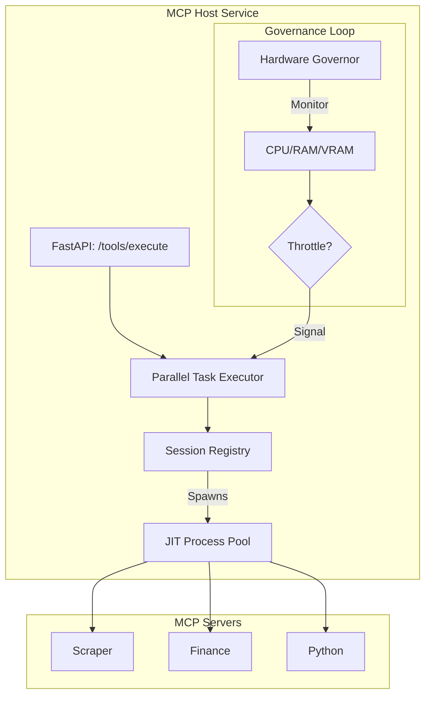

# 🔌 MCP Host Service ("The Hands")

The **MCP Host Service** is the multi-process execution engine of Kea v0.4.0. It acts as the system's **Workforce**, managing the lifecycle of ephemeral tool processes and providing a governed high-throughput interface for the **Kea Kernel**.

## 📐 Architecture

The MCP Host operates as a **Process Supervisor** and **JSON-RPC Proxy**. It bridges the gap between high-level reasoning and low-level system execution.

### Component Overview

| Component | Responsibility | Performance Impact |
| :--- | :--- | :--- |
| **Session Registry**| JIT spawning and process lifecycle management. | High (Cold Start) |
| **Hardware Governor**| CPU/RAM/VRAM monitoring and task throttling. | Medium |
| **Postgres Registry**| Static tool indexing and semantic discovery. | Low |
| **Parallel Executor**| Concurrency management and result aggregation. | High |

---

## ✨ Key Features

### 1. JIT (Just-In-Time) Spawning
MCP Servers are not kept running. Instead, they are spawned only when a tool is requested. The **Session Registry** manages the handshake and caches the session for subsequent calls, ensuring that system resources are used only when "work" is being done.

### 2. Hardware-Aware Governance
The **Governor** monitors system pressure in real-time. If VRAM is saturated or CPU load exceeds 90%, the Host automatically queues new tool calls instead of spawning new processes, effectively preventing "Agent Cascades" from crashing the host machine.

### 3. Static Tool Discovery (AST Parsing)
Kea can discover 1,000+ tools in milliseconds without executing a single file. It uses Python's `ast` module to scan the tool library and extract JSON schemas directly from the source code, which are then indexed into **pgvector** for semantic search.

---

## 📁 Codebase Structure

- **`main.py`**: FastAPI entrypoint hosting the execution and discovery endpoints.
- **`core/`**: The implementation of the worker orchestration logic.
    - `session_registry.py`: Logic for `uv run` process management and hands-free handshake.
    - `supervisor_engine.py`: The health loop and priority-based task dispatcher.
    - `postgres_registry.py`: Persistence for tool metadata and indexed vector search.
    - `tool_registry.py`: The concrete implementation of the `ToolRegistry` protocol.

---

## 🧠 Deep Dive

### 1. The "Sandbox" Philosophy
The MCP Host treats every server as a potential security risk. By running servers via `uv` in isolated environments, it ensures that one tool's dependencies do not corrupt another. Future versions will support Docker-based sandboxing for even tighter isolation.

### 2. High-Throughput Batching
For massive research tasks (e.g., "Check status for 50 URLs"), the Host supports **Batch Execution**. This allows the Researcher node to send 50 requests in a single HTTP payload; the Host then parallelizes these across the available process pool, significantly reducing the bottleneck of tool execution.

---
*The MCP Host provides the physical capabilities that allow Project's thoughts to become actions.*

