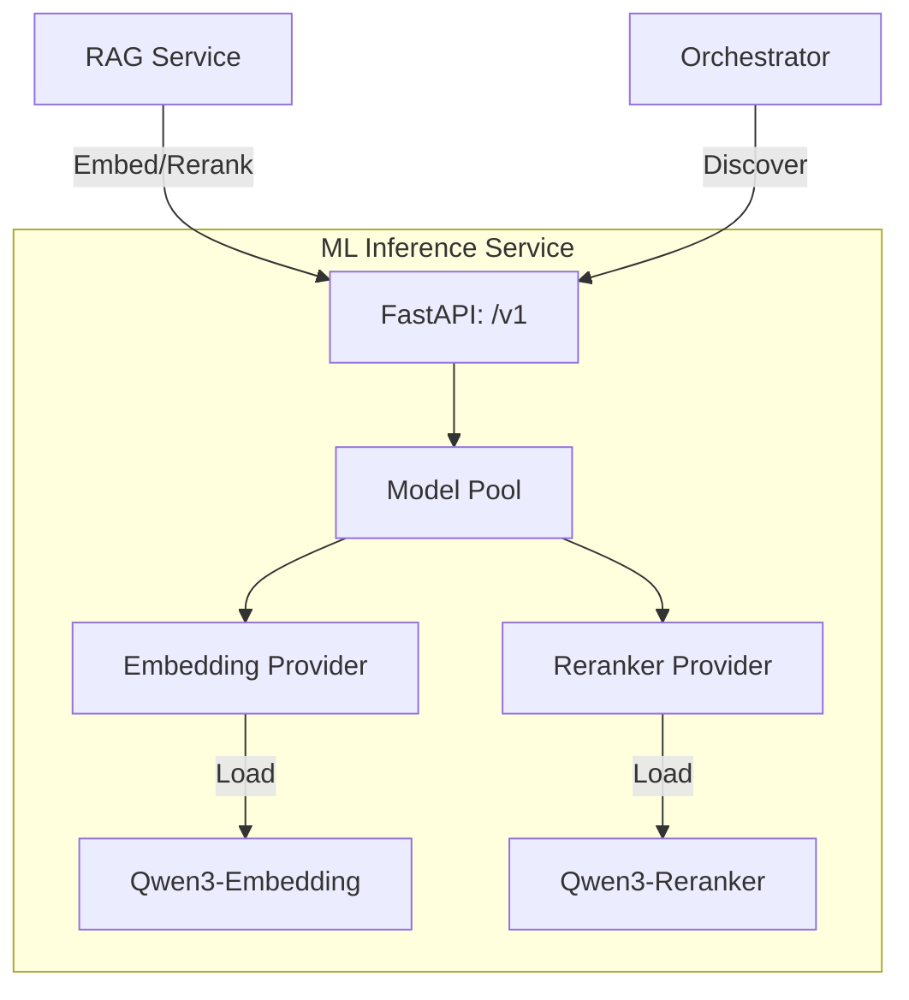

# 🧠 ML Inference Service ("The Cortex")

**ML Inference** is the dedicated model-serving engine of Kea. It acts as the system's **Cortex**, providing high-performance embedding and reranking capabilities to the rest of the fractal corporation.

## 📐 Architecture

The ML Inference service is designed as a standalone microservice that abstracts away the complexities of GPU/CPU model loading and inference.

### Component Overview

| Component | Responsibility | Cognitive Role |
| :--- | :--- | :--- |
| **Model Pool** | Centralized management of model lifecycle and resource allocation. | Neural Gateway |
| **Embedding Provider** | Handles vector generation for semantic search and RAG indexing. | Semantic Interpretation |
| **Reranker Provider** | Performs cross-attention scoring to refine search results. | Precision Focusing |

---

## ✨ Key Features

### 1. Dedicated Inference Resource
By isolating ML models into their own service, Kea ensures that heavy computation doesn't block the logic of the **Orchestrator** or the I/O of the **API Gateway**. It allows for independent scaling of GPU resources.

### 2. Role-Based Loading
The service can be configured via `ML_ROLE` to load only the necessary models (e.g., just the embedding model for indexing nodes, or both for full search capability), optimizing VRAM usage.

### 3. Adaptive Hardware Awareness
Inheriting from `shared.hardware`, the service automatically detects and utilizes the best available backend (CUDA with optional Flash Attention, or CPU) and adjusts batch sizes based on real-time system pressure.

---

## 📁 Codebase Structure

- **`main.py`**: FastAPI entrypoint hosting the inference API (`/v1/embed`, `/v1/rerank`).
- **`core/`**: Core logic for model management.
    - `model_pool.py`: Manages the loading, unloading, and selection of model providers.
    - `schemas.py`: Pydantic models for request/response validation.

---

## 🧠 Deep Dive

### 1. Cross-Encoder Reranking
Unlike simple cosine similarity, the Reranker uses a cross-attentional model to look at the query and the retrieved documents simultaneously. This significantly increases retrieval precision, ensuring the **Orchestrator** receives only the most relevant context.

### 2. Standardized Inference Schema
All models, regardless of their underlying provider (HuggingFace Transformers or API-based fallbacks), expose a unified schema to the system, enabling zero-code swaps of model backends.

---
*The ML Inference service ensures that Kea's decisions are grounded in precise semantic understanding.*
