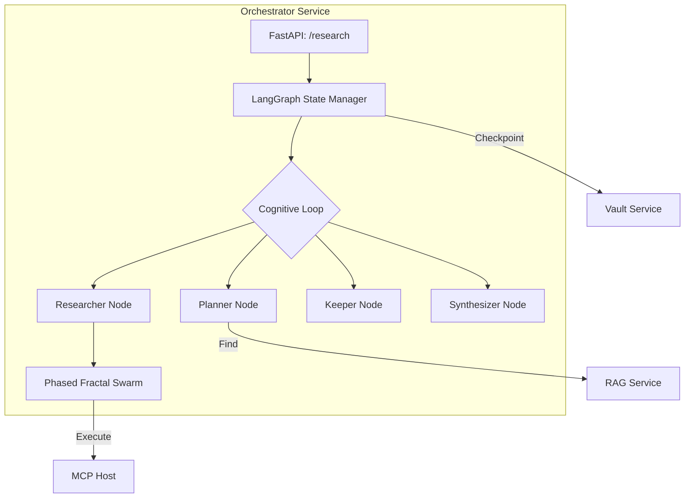

# 🧠 Orchestrator Service ("The Nervous System")

The **Orchestrator Service** is the cognitive core of the Kea system. It acts as the **General Manager**, wrapping the isolated Kea Kernel in a resilient, stateful service layer. It is responsible for high-level reasoning, planning, and the execution of complex research missions.

## 📐 Architecture

The Orchestrator follows a **Graph-Based Reasoning Architecture**. It uses **LangGraph** to manage global state transitions and **DAGs** for local tool execution.

### Component Overview

| Component | Responsibility | Cognitive Role |
| :--- | :--- | :--- |
| **Planner Node** | Decomposes queries into blueprints. | Frontal Lobe |
| **Researcher Node**| Orchestrates parallel tool swarms. | Motor Control |
| **Keeper Node** | Perceptual filter; prunes noise/bias. | Amygdala |
| **Synthesizer** | Assembles final cited reports. | Broca's Area |
| **State Manager** | Manages job persistence and recovery. | Cerebellum |

---

## ✨ Key Features

### 1. LangGraph State Machine
Unlike linear pipelines, the Orchestrator can loop, backtrack, and iterate. If the **Synthesizer** detects a gap in the report, it can signal the **Planner** to generate a new sub-query, effectively enabling "Self-Correction" at the architectural level.

### 2. Phased Fractal Swarming
The Researcher node implements **DAG-based micro-orchestration**. It breaks a plan into phases where:
- **Phase 1**: Independent data gathering (Parallel).
- **Phase 2**: Calculative analysis based on Phase 1 (Sequential).
This maximizes throughput while ensuring strict data dependency integrity.

### 3. Asynchronous Resilience (Checkpoints)
The Orchestrator utilizes the **Vault**'s checkpointer. Every state transition is saved to PostgreSQL. If the service crashes, it can reload the exact state from the checkpoint and resume research without repeating expensive LLM or tool calls.

---

## 📁 Codebase Structure

- **`main.py`**: Entrypoint for the service. Currently in **REDESIGN** mode.
- **Redesign Status**: The previously used `kernel/` and `workers/` packages have been removed as part of a system-wide simplification. The service currently serves as a skeleton for the new orchestration logic.

---

## 🧠 Deep Dive

### 1. The "Re-planning" Loop
When the **Consensus Engine** (shared via the Judge Agent) determines a finding is "Incomplete," the Orchestrator doesn't just fail. It updates the `ResearchState` with specific gap metadata and loops back to the **Planner Node**. This creates an autonomous "Search-and-Verify" loop until the Quality Bar is met.

### 2. Shadow Lab Pivot
If a task requires logical derivation that no tool supports (e.g., "Calculate the projected CAGR based on these 10 PDFs"), the Orchestrator pivots to the **Shadow Lab**. It spawns a specialized `CodeGeneratorAgent` to write custom analysis scripts, which are executed in a governed sandbox.

---
*The Orchestrator is the conductor of the corporate symphony, ensuring that every agent and tool plays its part in unison.*
