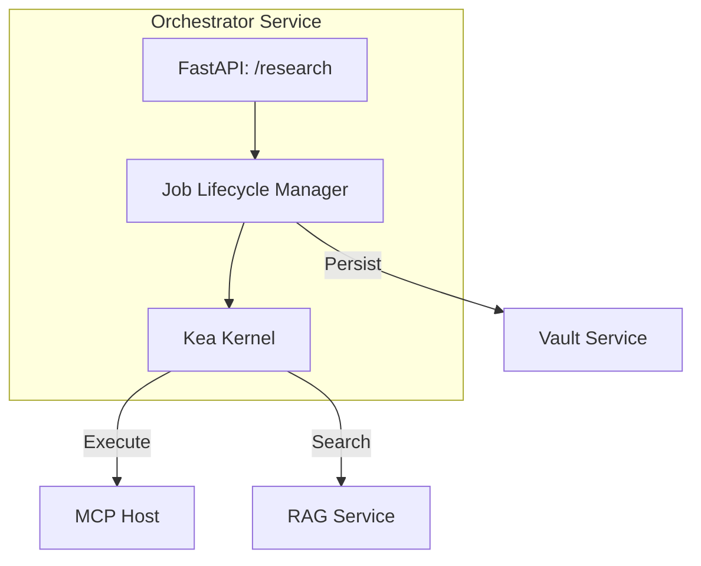

# 🧠 Orchestrator Service ("The Nervous System")

The **Orchestrator Service** is the cognitive core of the Kea system. It acts as the **General Manager**, wrapping the isolated Kea Kernel in a resilient, stateful service layer.

> 🛠️ **Status: UNDER REDESIGN**  
> The Orchestrator is currently undergoing a structural simplification to move towards a more robust, "Logic-First" architecture centered around the universal `KernelCell`.

## 📐 Architecture

The Orchestrator manages the lifecycle of research jobs, coordinating between the **Gateway**, **Vault**, and **MCP Host**.

---

## ✨ Features (Core Roadmap)

### 1. Unified Cognitive Cycle
The Orchestrator will implement the universal **Perceive → Frame → Plan → Execute → Monitor → Package** cycle across all hierarchical levels.

### 2. High-Fidelity Persistence
The service coordinates with the **Vault** to ensure that every step of the reasoning process is auditable and recoverable, utilizing the new session-based persistence model.

### 3. JIT Workflow Generation
Workflows are no longer static DAGs; they are generated Just-In-Time by the Kernel based on the specific domain and depth of the user's request.

---

## 📁 Codebase Structure

- **`main.py`**: Entrypoint for the service. Currently serving as a stub in **REDESIGN** mode.
- **`core/`**: (Future) House for the new reasoning and orchestration logic.

---
*The Orchestrator is the conductor of the corporate symphony, currently being tuned for enterprise-scale performance.*
