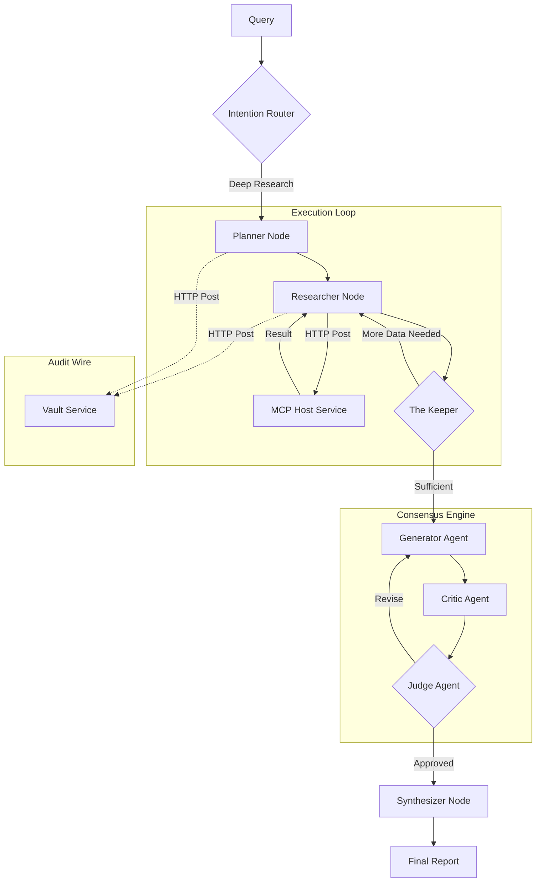

# Orchestrator Service ("The Brain")

The **Orchestrator** is the central cognitive engine of Kea. It implements the **Agentic OODA Loop** (Observe, Orient, Decide, Act) using **LangGraph** to manage state, recursion, and decision-making. 

It is responsible for breaking down user queries, coordinating MCP tools, and synthesizing final yields.

---

## 🏗️ Architecture Overview

The Orchestrator operates as a **Cyclic State Machine**, allowing it to "Think Fast" (Router) and "Think Slow" (Deep Research Loop). It delegates execution logic to specialized microservices.

1.  **Planning Layer**: Decomposes complex queries into atomic micro-tasks.
2.  **Delegation Layer** (NEW): Dispatches tool execution to **MCP Host** (Port 8002).
3.  **Auditing Layer** (NEW): Asynchronously logs all state changes to **Vault** (Port 8004).
4.  **Consensus Layer**: Adversarial Agents (Generator vs Critic) verify the final output.



---

## 📁 Codebase Structure & Reference

| File / Directory | Component | Description | Key Classes/Functions |
|:-----------------|:----------|:------------|:----------------------|
| **`main.py`** | **Entry Point** | FastAPI app (Port 8001). Exposes `/chat/message` pipeline. | `create_app()`, `process_chat_message()` |
| **`core/`** | **Nervous System** | Core pipeline logic and state definitions. | |
| ├── `graph.py` | State Machine | Defines the LangGraph nodes (Planner, Researcher) and edges. | `compile_research_graph()` |
| ├── `router.py` | Classifier | Determines if a query needs Research or simple Chat. | `IntentionRouter.route()` |
| ├── `pipeline.py` | Runner | Manages execution. Calls **Vault** for Audit. | `process_message()` |
| **`nodes/`** | **Graph Nodes** | Deterministic steps in the state machine. | |
| ├── `planner.py` | Strategy | Breaks query into micro-tasks (Plan JSON). | `planner_node()` |
| ├── `researcher.py` | Muscle | Iterates plan. Calls **MCP Host** for tools. | `researcher_node()` |
| ├── `keeper.py` | Controller | Checks sufficiency and context drift. | `keeper_node()` |
| ├── `synthesizer.py`| Output | Formats final markdown report. | `synthesizer_node()` |
| **`agents/`** | **Personas** | LLM Agents for the Consensus Engine. | |
| ├── `generator.py` | Optimist | Drafts initial answer. | `GeneratorAgent` |
| ├── `critic.py` | Pessimist | Audits draft for fallacies. | `CriticAgent` |
| ├── `judge.py` | Arbiter | Decides to Approve or Revise. | `JudgeAgent` |

---

## 🔬 Deep Dive: Key Subsystems

### 1. The Cyclic State Graph (`core/graph.py`)
Unlike linear chains (LangChain), Kea uses a **Graph**. This allows the system to:
*   **Loop**: Go back to the Researcher if the data is insufficient.
*   **Fork**: Spawn parallel research paths if the hypothesis splits.
*   **Correct**: The Critic node can reject a draft and force a rewrite.

### 2. The Keeper Protocol (`nodes/keeper.py`)
The Keeper is the "Traffic Cop" of the brain. It prevents the infinite loop problem common in autonomous agents.
*   **Drift Detection**: Scores current facts against the original User Intent vector.
*   **Sufficiency Check**: Determines if we have enough facts to answer the question without hallucination.
*   **Yield Control**: Decides when to stop researching and start writing.

### 3. Adversarial Collaboration (`agents/`)
To maximize accuracy, we use a multi-persona boardroom simulation:
*   **Generator**: "I have found these facts, here is the conclusion."
*   **Critic**: "You missed the date on the second fact. Source B is unreliable."
*   **Judge**: "Objection sustained. Generator, re-write section 2."

---

## 🔌 API Node Reference (Internal)

While the Orchestrator is usually called via `main.py`, the core Logic Units (Nodes) are distinct inputs/outputs.

### 1. Planning Layer
| Node | Input | Output | Description |
|:-----|:------|:-------|:------------|
| `router` | `Query` (str) | `Path` (str) | Classifies intent (RESEARCH vs CHAT). |
| `planner` | `Query` (str) | `ExecutionPlan` (JSON) | Generates step-by-step checklist. |

### 2. Execution Layer
| Node | Input | Output | Description |
|:-----|:------|:-------|:------------|
| `researcher` | `Plan` | `Facts` (List[str]) | Executes tools and gathers data. |
| `keeper` | `Facts` | `Decision` (Continue/Stop) | Validates data sufficiency. |

### 3. Consensus Layer
| Node | Input | Output | Description |
|:-----|:------|:-------|:------------|
| `generator` | `Facts` | `Draft` (Markdown) | Writes the first draft. |
| `critic` | `Draft` | `Feedback` (List[str]) | Finds errors in the draft. |
| `judge` | `Feedback` | `Verdict` (Approve/Revise) | Final decision maker. |

### 4. Output Layer
| Node | Input | Output | Description |
|:-----|:------|:-------|:------------|
| `synthesizer` | `Draft` | `Report` (Markdown) | Final polish and formatting. |

---

## 🚀 Usage

To run the Orchestrator service in isolation (for development):

```bash
# Start the service
python -m services.orchestrator.main
```

---

## � Service Dependencies

The Orchestrator relies on the following internal microservices (wired via `shared.service_registry`):

| Dependency | Purpose | Integration Point |
|:-----------|:--------|:------------------|
| **MCP Host** (Port 8002) | **Tool Execution**. The Orchestrator plans tasks, but sends JSON-RPC payloads to MCP Host for actual execution. | `nodes.researcher.call_tool` |
| **Vault** (Port 8004) | **Memory & Audit**. Logs every state transition and tool result for compliance and long-term recall. | `core.pipeline.process_message` |
| **Swarm Manager** (Port 8005) | **Compliance**. While MCP Host performs the check, the Orchestrator adheres to policies set by Swarm. | Implicit via MCP Host |
| **Chronos** (Port 8006) | **Scheduling**. Triggers orchestrated jobs based on time events. | `main.trigger_job` |
