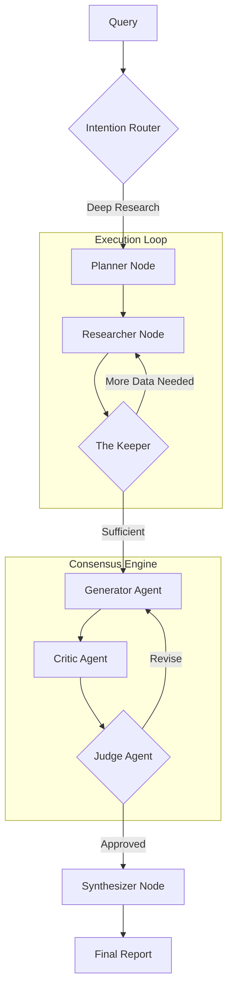

# Orchestrator Service ("The Brain")

The Orchestrator is the central cognitive engine of Kea. It implements the "Agentic OODA Loop" using **LangGraph** to manage state, recursion, and decision-making. It is responsible for breaking down user queries, coordinating MCP tools, and synthesizing final yields.

## 🏗️ Architecture

The Orchestrator operates as a cyclic state machine:



## 🧩 Codebase Reference

### 1. Service Entry & Configuration
| File | Description | Key Classes/Functions |
|:-----|:------------|:----------------------|
| `main.py` | FastAPI entry point for the service. Handles lifecycle events (startup/shutdown) and global exception handlers. | `create_app()`, `startup_event()` |
| `__init__.py` | Package initializer. | - |

### 2. Core Logic (`/core`)
The nervous system of the orchestrator.

| File | Description | Key Classes/Functions |
|:-----|:------------|:----------------------|
| `graph.py` | **The Main Loop**. Defines the LangGraph state machine, wiring nodes (Planner, Researcher, etc.) and edges (conditions). | `GraphState`, `build_research_graph()`, `compile_research_graph()` |
| `pipeline.py` | High-level execution manager. It instantiates the graph and runs the async event loop for a single research job. | `ConversationResearchPipeline.run()` |
| `router.py` | The "Intention Classifier". Decides if a user query is a simple question, a deep research task, or a shadow lab calculation. | `IntentionRouter.route()` |
| `query_classifier.py`| Helper for `router.py`, handling the specific prompt engineering for intent detection. | `classify_query()` |
| `consensus.py` | Implements the **Adversarial Collaboration** logic (Generator vs. Critic). | `ConsensusEngine` |
| `context_cache.py` | Manages L1/L2 caching to prevent re-researching known facts. | `ContextCache` |

### 3. Graph Nodes (`/nodes`)
Deterministic steps in the LangGraph state machine.

| File | Description | Key Responsibility |
|:-----|:------------|:-------------------|
| `planner.py` | **Strategy Layer**. Decomposes a vague user request (e.g., "Analyze mining") into a structured list of 10-50 micro-tasks. | Output: `ExecutionPlan` (JSON) |
| `researcher.py` | **Execution Layer**. The "Muscle". Iterates through the plan, calls MCP tools (Scraper, Search), and collects raw facts. | Action: `client.call_tool()` |
| `keeper.py` | **Control Layer**. The "Traffic Cop". Checks for context drift, verifies if enough data is collected, and triggers the `should_continue` loop. | Decision: `researcher` vs `generator` |
| `synthesizer.py` | **Output Layer**. Takes the Judge's approved draft and formats it into the final Markdown report with citations. | Output: `Final Report` |
| `divergence.py` | **Abductive Reasoner**. Analyzes conflicting data (e.g., source A says X, source B says Y) to find the truth. | Action: Spawns specific verification tasks |

### 4. Agents (`/agents`)
LLM Personas used within the Consensus Engine.

| File | Description | Persona Traits |
|:-----|:------------|:---------------|
| `generator.py` | **The Optimist**. Drafts the initial answer based on available facts. Tries to answer even with partial data. | "Helpful Assistant" |
| `critic.py` | **The Pessimist**. Audits the draft. Looks for logical fallacies, missing dates, and weak sources. Returns a list of flaws. | "Forensic Auditor" |
| `judge.py` | **The Arbiter**. Reviews both Draft and Critique. Decides to either "Approve" (move to Synthesis) or "Revise" (loop back to Generator). | "Impartial Judge" |
| `supervisor.py`| **The Manager**. Monitors agent health and task distribution (used in advanced multi-agent scenarios). | "Project Manager" |

### 5. MCP Integration (`/mcp`)
The interface to the Tool Servers.

| File | Description | Key Classes/Functions |
|:-----|:------------|:----------------------|
| `client.py` | **The Singleton Client**. connects to all 17 MCP servers via stdio. Handles connection pooling and retry logic. | `MCPOrchestrator`, `get_mcp_orchestrator()` |
| `registry.py` | **Service Discovery**. Maintains the dynamic list of available tools and their schemas. | `ToolRegistry` |
| `parallel_executor.py`| **Batch Processor**. Enables running multiple tool calls (e.g., 5 searches) in parallel asyncio tasks. | `execute_batch()` |

## 🚀 Usage

The orchestrator is typically invoked via the API Gateway, but can be run standalone for testing:

```bash
# Run the main service
python -m services.orchestrator.main
```
