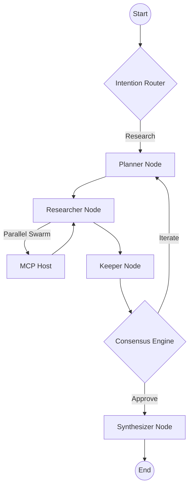

# 🧠 Orchestrator Service ("The Brain")

The **Orchestrator Service** is the cognitive core of the Kea system, acting as the **Project Manager** in the Autonomous Enterprise Operating System. It manages the high-level reasoning, planning, and execution of complex research queries using a sophisticated **LangGraph-powered state machine** and **Directed Acyclic Graph (DAG)** execution.

It coordinates between the API Gateway (Input), MCP Host (Tool Execution), and RAG Service (Memory) to deliver deep, evidence-based insights by simulating a team of specialized agents.

## ✨ Features

- **LangGraph State Machine**: Implements a cyclic research flow with checkpointing, enabling backtracking, iterative refinement, and human-in-the-loop interactions.
- **Phased Fractal Spawning**: Dynamically groups research tasks into topological phases, executing independent tasks in parallel "swarms" while respecting strict dependencies (DAG Execution).
- **The "Bucket Pattern"**: Automatically expands massive tasks (e.g., "Analyze 10k files") into parallel shards to maximize throughput.
- **Cognitive Agent Personas**: Utilizes specialized agents (Planner, Researcher, Critic, Judge) with distinct prompts and reasoning styles defined in `templates/`.
- **Multi-Agent Consensus**: Implements a Generator-Critic-Judge (GCJ) pattern to verify facts and ensure high-confidence outputs.
- **Neural Fact Reranking**: Automatically reranks collected facts using cross-encoders to ensure only the most relevant context reaches the synthesizer (The "Keeper" Node).
- **Enterprise "Fractal Corp" Logic**: Integrates with the Swarm Manager to enforce organizational domains (Research, Finance, Legal) and compliance guardrails.

## 📐 Architecture

The Orchestrator follows a **Graph-Based Reasoning Architecture**. Unlike linear pipelines, the Orchestrator can loop back to earlier nodes if the research quality is insufficient.

### 🗼 The Research Graph
The research process flows through several distinct cognitive stages:

1.  **Router**: Determines the "Intention" (Memory Fork, Shadow Lab, Deep Research).
2.  **Planner**: Decomposes the query into sub-queries and a topological execution plan (The Blueprint).
3.  **Researcher**: Executes the plan via Phased Fractal Spawning.
4.  **Keeper**: Performs "Context Hygiene" to discard noise and contradictions.
5.  **GCJ Loop**: Generator creates a draft, Critic finds weaknesses, and Judge provides the final verdict.
6.  **Synthesizer**: Compiles the final report with citations and confidence scores.

## 📁 Codebase Structure

- **`main.py`**: FastAPI entrypoint hosting the `/research` and `/chat` pipelines.
- **`core/`**: The engine room of the orchestrator.
    - `graph.py`: Defines the LangGraph nodes, edges, and state transitions.
    - `pipeline.py`: Top-level integration layer handling classification and caching.
    - `assembler.py`: **The Node Assembler**. Wires dependency graphs, resolves artifact inputs/outputs, and implements **Self-Healing** logic for failed nodes.
    - `agent_spawner.py`: Handles parallel agent spawning for high-throughput phases.
    - `modality.py`: Manages multi-modal inputs/outputs within the research graph.
    - `organization.py`: Implements "Fractal Corp" departments and domain rules.
    - `prompt_factory.py`: Generates context-aware prompts for agents.
- **`nodes/`**: Individual LangGraph node implementations.
    - `planner.py`: Reasoning logic for sub-query decomposition.
    - `keeper.py`: Context filtering and contradiction detection.
- **`agents/`**: Core agent logic and specialized code generators.
    - `code_generator.py`: "Shadow Lab" logic for autonomous Python script generation.
- **`templates/`**: Version-controlled prompt templates for all agent personas.

## 🧠 Deep Dive

### 1. Phased Fractal Spawning & DAG Execution
The Researcher node doesn't just run tools; it builds a mini-graph of dependencies. Tasks that can run in parallel (e.g., "Search for Company A" and "Search for Company B") are batched into a **Swarm Phase**. Tasks that depend on previous outputs (e.g., "Calculate Ratio" from previously fetched Data) are held until the preceding phase completes. This ensures data integrity while maximizing throughput.

### 2. Autonomic "Shadow Lab" Execution
For technical research (coding, data analysis), the Orchestrator can pivot to the **Shadow Lab** path. It utilizes a `code_generator.py` agent to write custom Python scripts on the fly, which are then executed by the MCP Host. This allows Kea to solve problems it doesn't have a pre-built tool for, effectively acting as an **Autonomous Data Scientist**.

### 3. Context Hygiene (The Keeper)
To prevent "Context Poisoning", the Keeper node audits all incoming facts from the Researcher. It uses neural reranking and semantic contradiction detection to ensure that hallucinations or low-quality data are pruned before reaching the synthesis stage.

## 📚 Reference

### Key Node Types

| Node | Responsibility | Failure Mode |
|:-----|:---------------|:-------------|
| **Planner** | Strategic Decomposition (The Blueprint) | Hallucinated Tool Usage |
| **Researcher** | Data Acquisition | Tool Execution Timeout |
| **Keeper** | Data Integrity | False Contradiction Pruning |
| **Synthesizer** | Narrative Construction | Lost Citations |

### API Reference (Internal)

| Endpoint | Method | Description |
|:---------|:-------|:------------|
| `/research` | `POST` | Start a synchronous research job. |
| `/research/stream` | `GET` | Stream research progress via SSE. |
| `/chat/message` | `POST` | Process a chat message through the research pipeline. |
| `/tools` | `GET` | List all available MCP tools (via Host). |
| `/tools/{name}` | `POST` | Execute a specific tool directly. |
| `/health` | `GET` | Service status and active session count. |
