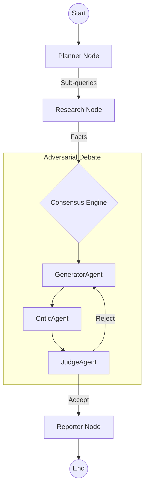

# Orchestrator Service ("The Brain")

The **Orchestrator** is the central cognitive engine of Kea. It implements the **Agentic OODA Loop** (Observe, Orient, Decide, Act) using **LangGraph** to manage state, recursion, and decision-making. 

It is responsible for breaking down user queries, coordinating MCP tools, and synthesizing final yields.

---

## 🏗️ Architecture Overview

The Orchestrator is built on a **Stateful Multi-Agent Graph (LangGraph)**. It manages the research lifecycle through a series of specialized nodes and a central `GraphState`:

1.  **Topology Optimization**: The graph dynamically reconfigures its path based on the "Depth" parameter (managed by the **Chronos** coordination logic).
2.  **State Persistence**: Every node transition is checkpointed. If a tool call fails, the graph can roll back to the last "Stable Thought" without losing the entire context.
3.  **Adversarial Loop**: Implements the `ConsensusEngine`, which forces a debate between the **Generator**, **Critic**, and **Judge** agents to ensure factual accuracy and objective reasoning.



---

## ✨ Features & Adversarial Logic

### 🧠 The Consensus Engine (`core/consensus.py`)
- **Generator/Critic/Judge Loop**: A 3-player game where the AI creates a draft, attempts to find its own flaws, and is arbitrated by a neutral "Judge" agent.
- **Adaptive Thresholding**: The Judge's acceptance threshold degrades gracefully from **0.95 → 0.60** over 32,768 possible rounds (default 2 in production) to balance perfection with progress.

### 🛡️ Human-in-the-Loop (HITL) Workflow
- **Category-Based Approvals**: Supports specific approval chains for `DECISION`, `DATA_ACCESS`, `COST`, and `COMPLIANCE`.
- **Role-Based Access (RBAC)**: Workflows can be assigned to specific roles (e.g., `compliance_officer` or `ciso`) for manual sign-off via the API Gateway.
- **Auto-Wait**: The `wait_for_approval` logic enables the LangGraph to pause indefinitely without holding an active network thread.

### 🧩 Domain-Specific Specialization
- **Domain Registry**: Dynamically configures agent personas via `configs/prompts.yaml` (Finance, Legal, Research, etc.).
- **Dynamic Capabilities**: Maps user keywords to the **MCP Host** registry via `tool_registry.yaml`, enabling the Planner to discover and use new servers without code changes.
    
    subgraph Audit Wire
        Researcher -.->|HTTP Post| Vault[Vault Service]
        Planner -.->|HTTP Post| Vault
    end
        
    Keeper --"Sufficient"--> Generator[Generator Agent]
    
    subgraph Consensus Engine
        Generator --> Critic[Critic Agent]
        Critic --> Judge{Judge Agent}
        Judge --"Revise"--> Generator
    end
    
    Judge --"Approved"--> Synthesizer[Synthesizer Node]
    Synthesizer --> End[Final Report]
```

---

## 📁 Codebase Structure & Reference

| File / Directory | Component | Description | Key Classes/Functions |
|:-----------------|:----------|:------------|:----------------------|
| **`main.py`** | **Entry Point** | FastAPI app (Port 8001). Exposes `/research` and `/chat` pipelines. | `process_chat_message()`, `start_research()` |
| **`core/`** | **Nervous System** | Core pipeline logic and state definitions. | |
| ├── `graph.py` | State Machine | Defines the LangGraph nodes and edges. Includes `researcher_node`. | `compile_research_graph()` |
| ├── `router.py` | Classifier | Determines if a query needs Research or simple Chat. | `IntentionRouter` |
| ├── `pipeline.py` | Runner | Manages execution. Calls **Vault** for Audit. | `process_message()` |
| ├── `tool_loader.py` | Registry | **NEW**: Dynamically loads tool capabilities from YAML. | `ToolLoader` |
| ├── `prompt_factory.py` | Templates | **NEW**: Dynamically loads personas from YAML. | `PromptFactory` |
| **`nodes/`** | **Graph Nodes** | Deterministic steps in the state machine. | |
| ├── `planner.py` | Strategy | Breaks query into micro-tasks (Plan JSON). | `planner_node()` |
| ├── `keeper.py` | Controller | Enforces loop safety and resource limits. | `keeper_node()` |
| ├── `divergence.py` | Exploration | Spawns parallel research paths. | `divergence_node()` |
| ├── `synthesizer.py`| Output | Formats final markdown report. | `synthesizer_node()` |
| **`agents/`** | **Personas** | LLM Agents for the Consensus Engine. | |
| ├── `generator.py` | Optimist | Drafts initial answer. | `GeneratorAgent` |
| ├── `critic.py` | Pessimist | Audits draft for fallacies. | `CriticAgent` |
| ├── `judge.py` | Arbiter | Decides to Approve or Revise. | `JudgeAgent` |

---

## 🔬 Deep Dive: Key Subsystems

### 1. The Cyclic State Graph (`core/graph.py`)
Unlike linear chains (LangChain), Kea uses a **Graph**. This allows the system to:
*   **Loop**: Go back to the Researcher if the data is insufficient.
*   **Fork**: Spawn parallel research paths if the hypothesis splits.
*   **Correct**: The Critic node can reject a draft and force a rewrite.

### 2. The Keeper Protocol (`nodes/keeper.py`)
The Keeper is the "Traffic Cop" of the brain. It prevents the infinite loop problem common in autonomous agents.
*   **Drift Detection**: Scores current facts against the original User Intent vector.
*   **Sufficiency Check**: Determines if we have enough facts to answer the question without hallucination.
*   **Yield Control**: Decides when to stop researching and start writing.

### 3. Adversarial Collaboration (`agents/`)
To maximize accuracy, we use a multi-persona boardroom simulation:
*   **Judge**: "Objection sustained. Generator, re-write section 2."

---

## 🏗️ Technical Deep Dive: Orchestration Logic

### 1. Autonomic Memory Interceptor (`core/interceptor.py`)
The Orchestrator doesn't just "gather" facts; it actively builds a knowledge base.
- **Shadow Logging**: Every tool result returned from the **MCP Host** is intercepted before it reaches the graph node.
- **Vault Mirroring**: Data is sent to **Vault** (Port 8004) where it is split into "Atomic Facts" and stored in Postgres.
- **Persistence**: This ensures that even if the Orchestrator crashes, the research gathered so far is permanently searchable.

### 2. JIT Tool Invention (The Code Generator)
When the **Planner** schedules a task like "Perform a regression analysis on these 5 URLs," and no static tool exists:
- **Fallback Agent**: The `agents/code_generator.py` is invoked.
- **Script Generation**: It writes a precision Python script using `pandas` and `scikit-learn` based on the facts collected so far.
- **Dynamic Execution**: This script is sent as a `code` argument to the **MCP Host**.

### 3. Intent-Aware Routing (`core/router.py`)
The Orchestrator maintains state across messages by analyzing **Intent**:
- **FOLLOW_UP**: Injects facts from the **Vault** into the current context (Memory Augmentation).
- **REVISE**: Instructs the Planner to modify a specific branch of the previously executed Graph.
- **DEEPER**: Triggers a higher `max_depth` for the next state machine iteration.

---

## 🔌 API Node Reference (Internal)

While the Orchestrator is usually called via `main.py`, the core Logic Units (Nodes) are distinct inputs/outputs.

### 1. Research & Chat
| Endpoint | Method | Description |
|:---------|:-------|:------------|
| `/research` | `POST` | Start a synchronous research job. |
| `/research/stream` | `GET` | Stream research progress via SSE. |
| `/chat/message` | `POST` | Process a chat message through the research pipeline. |

### 2. Tool Integration
| Endpoint | Method | Description |
|:---------|:-------|:------------|
| `/tools` | `GET` | List all available MCP tools (via Host). |
| `/tools/{name}` | `POST` | Execute a specific tool directly. |

---

## 🚀 Usage

To run the Orchestrator service in isolation (for development):

```bash
# Start the service
python -m services.orchestrator.main
```

---

## � Service Dependencies

The Orchestrator relies on the following internal microservices (wired via `shared.service_registry`):

| Dependency | Purpose | Integration Point |
|:-----------|:--------|:------------------|
| **MCP Host** (Port 8002) | **Tool Execution**. The Orchestrator plans tasks, but sends JSON-RPC payloads to MCP Host for actual execution. | `nodes.researcher.call_tool` |
| **Vault** (Port 8004) | **Memory & Audit**. Logs every state transition and tool result for compliance and long-term recall. | `core.pipeline.process_message` |
| **Swarm Manager** (Port 8005) | **Compliance**. While MCP Host performs the check, the Orchestrator adheres to policies set by Swarm. | Implicit via MCP Host |
| **Chronos** (Port 8006) | **Scheduling**. Triggers orchestrated jobs based on time events. | `main.trigger_job` |
## ⛓️ Lifecycle of a Research Job

The Orchestrator manages the job lifecycle through 4 distinct "Cognitive Phases":

### Phase 1: Ambition Analysis (The Router)
- **Input**: Raw user string (e.g., "Find the latest nickel prices in Indonesia").
- **Action**: Detects if this is a **CASUAL** hello or a **DEEP** research query.
- **Output**: Routing decision.

### Phase 2: Strategic Decomposition (The Planner)
- **Input**: The research goal.
- **Action**: Breaks the goal into **Micro-Tasks** (e.g., "1. Scrape ESDM site", "2. Search for news on Nickel export bans").
- **Audit**: Logs the initial plan to **Vault**.

### Phase 3: Recursive Extraction (The Researcher & Keeper)
- **Input**: The Micro-Tasks.
- **Action**: Calls **MCP Host** (Port 8002) for tools.
- **Loop**: The **Keeper** evaluates the results. If facts are contradictory or insufficient, it sends the Researcher back with a narrowed query.

### Phase 4: Adversarial Synthesis (Consensus Engine)
- **Input**: The collected raw facts.
- **Action**: Generator drafts the report. Critic tears it down. Judge decides.
- **Final Result**: A citation-backed Markdown report derived only from verified evidence.
